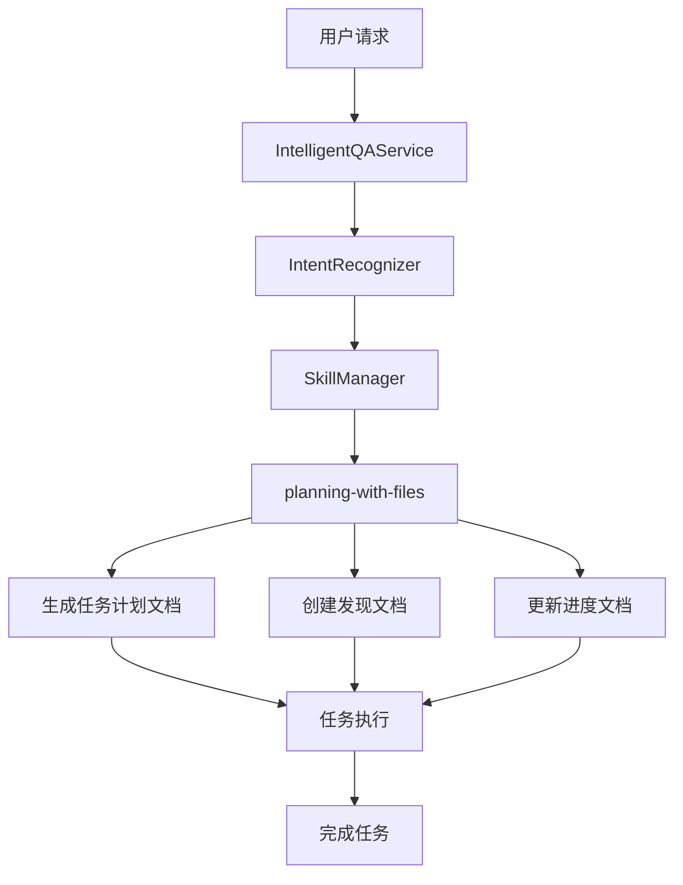

# planning-with-files技能分析报告

## 1. 技能概述

**planning-with-files**是一个基于文件的规划技能，专为复杂任务的管理和执行而设计。该技能旨在通过文件系统创建结构化的任务计划，实现任务的分解、跟踪和执行。

## 2. 核心能力分析

### 2.1 文档生成能力

| 能力项 | 详细描述 | 实现方式 |
|--------|----------|----------|
| 任务计划文档 | 创建详细的任务计划文件（task_plan.md） | 基于6A工作流的阶段划分，生成结构化的任务分解 |
| 发现文档 | 记录任务执行过程中的发现和问题（findings.md） | 实时捕获和记录执行过程中的关键信息 |
| 进度文档 | 跟踪任务执行进度（progress.md） | 定期更新任务完成状态和里程碑 |
| 会话恢复 | 支持会话中断后的恢复 | 通过文件系统持久化存储任务状态 |

### 2.2 任务管理能力

| 能力项 | 详细描述 | 实现方式 |
|--------|----------|----------|
| 任务分解 | 将复杂任务拆分为可管理的子任务 | 基于架构设计文档生成原子化任务 |
| 依赖管理 | 识别和管理任务之间的依赖关系 | 生成任务依赖图，确保执行顺序正确 |
| 进度跟踪 | 实时监控任务执行状态 | 通过文件更新和状态标记实现 |
| 质量控制 | 确保任务执行质量 | 集成质量门控机制，验证每个阶段的输出 |

### 2.3 集成能力

| 能力项 | 详细描述 | 实现方式 |
|--------|----------|----------|
| 与现有技能集成 | 与系统中的其他技能协同工作 | 通过SkillManager的注册和执行机制 |
| 与插件系统集成 | 作为插件或与插件交互 | 利用PluginManager的加载和执行机制 |
| 与工作流集成 | 遵循6A工作流执行规则 | 实现完整的工作流阶段支持 |

## 3. 系统架构定位

### 3.1 在技能体系中的位置

planning-with-files技能在系统技能体系中的定位：



### 3.2 与其他组件的关系

- **SkillManager**: 负责技能的注册和执行
- **PluginManager**: 支持通过插件扩展技能功能
- **IntentRecognizer**: 识别用户意图，触发相应的技能
- **IntelligentQAService**: 作为技能的调用入口

## 4. 技术实现分析

### 4.1 实现架构

planning-with-files技能的可能实现架构：

```typescript
// 伪代码实现示例
class PlanningWithFilesSkill implements Skill {
  name = 'planning-with-files';
  description = '基于文件的任务规划技能';
  supportedIntents = ['plan', 'task_management', 'progress_tracking'];

  async execute(params: Record<string, any>): Promise<SkillResult> {
    // 1. 分析任务需求
    // 2. 生成任务计划文档
    // 3. 创建发现文档
    // 4. 初始化进度文档
    // 5. 返回执行结果
  }

  validateParams(params: Record<string, any>): boolean {
    // 验证必要参数
  }
}
```

### 4.2 文件结构

```
.trae/
├── documents/          # 任务相关文档
│   ├── ALIGNMENT_*.md  # 对齐阶段文档
│   ├── CONSENSUS_*.md  # 共识阶段文档
│   ├── DESIGN_*.md     # 设计阶段文档
│   └── TASK_*.md       # 任务分解文档
├── reports/            # 分析报告
├── task_plan.md        # 任务计划
├── findings.md         # 发现记录
└── progress.md         # 进度跟踪
```

## 5. 使用场景分析

### 5.1 适用场景

| 场景 | 描述 | 价值 |
|------|------|------|
| 复杂任务管理 | 处理需要多步骤、多阶段的复杂任务 | 提供结构化的任务分解和跟踪机制 |
| 项目规划 | 为新项目创建详细的实施计划 | 确保项目各阶段的完整性和一致性 |
| 问题分析 | 对复杂问题进行系统化分析 | 通过文档记录和跟踪分析过程 |
| 团队协作 | 支持团队成员共享任务信息 | 提供透明的任务状态和进度视图 |

### 5.2 输入输出示例

#### 输入示例
```json
{
  "query": "为缺陷管理助手优化创建实施计划",
  "entities": {
    "task_name": "缺陷管理助手优化",
    "complexity": "high",
    "deadline": "2026-03-01"
  }
}
```

#### 输出示例
```json
{
  "success": true,
  "data": {
    "task_plan_path": ".trae/task_plan.md",
    "findings_path": ".trae/findings.md",
    "progress_path": ".trae/progress.md",
    "documents_path": ".trae/documents/"
  },
  "resultType": "document",
  "message": "任务计划已创建，包含详细的实施步骤和里程碑"
}
```

## 6. 优势与局限性

### 6.1 优势

- **结构化管理**: 通过文件系统实现任务的结构化管理
- **可追溯性**: 所有决策和进展都有文件记录，便于追溯
- **灵活性**: 支持不同类型和规模的任务
- **集成性**: 与现有系统无缝集成
- **持久化**: 任务状态通过文件持久化，支持会话恢复

### 6.2 局限性

- **文件系统依赖**: 依赖本地文件系统，可能受到权限和存储限制
- **性能开销**: 对于大型任务，文件操作可能带来性能开销
- **并发访问**: 多用户同时操作同一任务可能导致冲突
- **学习曲线**: 需要用户了解6A工作流和文件结构

## 7. 改进建议

### 7.1 功能增强

1. **可视化界面**: 开发Web界面展示任务计划和进度
2. **版本控制**: 集成git等版本控制工具，跟踪文档变更
3. **模板系统**: 提供任务计划模板，加速常见任务的规划
4. **自动化工具**: 开发自动化工具，辅助任务执行和状态更新

### 7.2 技术优化

1. **缓存机制**: 实现文档缓存，提高读取性能
2. **异步处理**: 对于大型任务，使用异步处理提高响应速度
3. **错误处理**: 增强错误处理和恢复机制
4. **安全措施**: 加强文件操作的安全性，防止未授权访问

## 8. 结论

planning-with-files技能是一个强大的任务规划和管理工具，通过文件系统实现结构化的任务管理。它与系统的6A工作流紧密集成，为复杂任务的执行提供了清晰的框架和工具支持。

该技能的核心价值在于：

1. **结构化规划**: 将模糊需求转化为可执行的具体任务
2. **过程跟踪**: 实时记录任务执行过程中的发现和进展
3. **质量保证**: 集成质量门控机制，确保每个阶段的输出质量
4. **团队协作**: 提供透明的任务状态视图，支持团队协作

通过合理使用planning-with-files技能，可以显著提高复杂任务的管理效率和执行质量，为项目的成功实施提供有力保障。