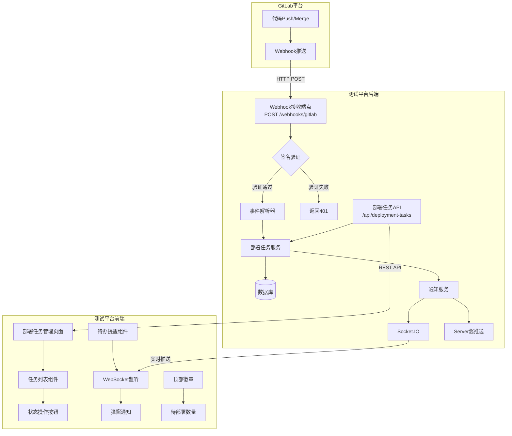
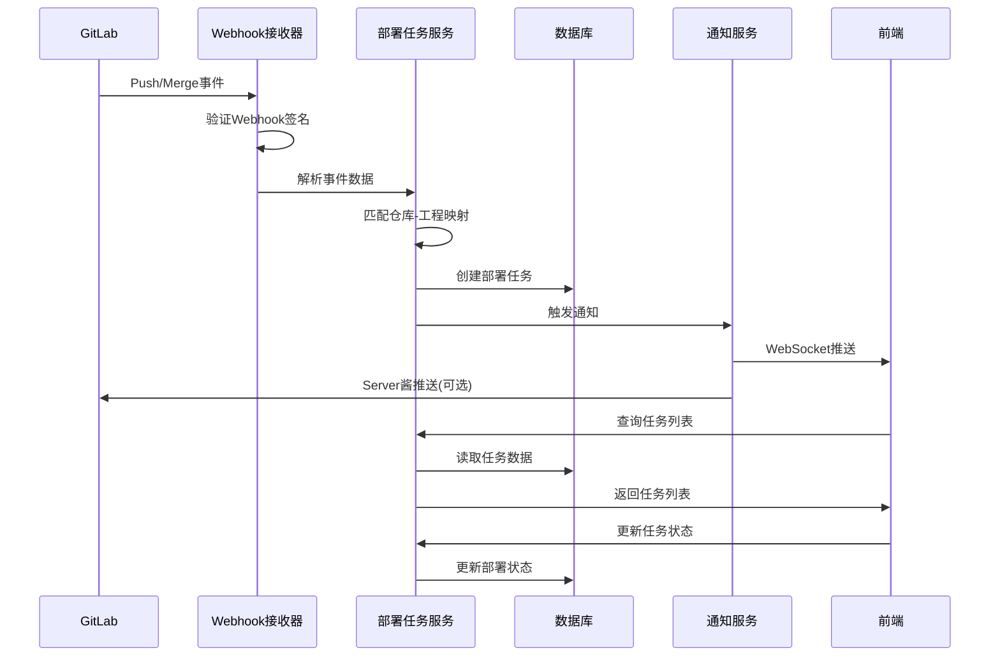

# Git部署任务管理 - 系统设计文档

## 1. 系统概述

### 1.1 目标
实现GitLab代码合并到指定分支时的自动通知和部署任务管理功能，确保测试工程师能够及时获取代码更新并进行测试环境部署。

### 1.2 核心功能
1. **GitLab Webhook接收**：监听Push/Merge Request事件
2. **部署任务管理**：自动创建、查询、更新部署任务
3. **实时通知**：WebSocket弹窗 + Server酱推送
4. **应用管理菜单**：
   - **待部署应用**：展示当前有更新待部署的应用列表
   - **部署应用历史**：展示应用部署的历史记录
   - **应用配置**：灵活配置应用名称、Git地址、监测分支等信息

### 1.3 技术栈
- **后端**：Express.js + TypeScript + Prisma + Socket.IO
- **前端**：React + TypeScript + Ant Design + Socket.IO Client
- **数据库**：MySQL 8.0
- **Git平台**：GitLab Webhook

---

## 2. 系统架构

### 2.1 整体架构图



### 2.2 数据流图



---

## 3. 数据库设计

### 3.1 部署任务表 (deployment_tasks)

```prisma
model DeploymentTask {
  id            Int               @id @default(autoincrement())
  appId         Int               @map("app_id") // 关联的应用ID
  appName       String            @map("app_name") // 应用名称（冗余存储，方便查询）
  repository    String            // Git仓库名称
  branch        String            // 分支名称
  commitId      String            @map("commit_id") // Git提交ID
  commitMessage String            @map("commit_message") // 提交信息
  commitAuthor  String            @map("commit_author") // 提交作者
  status        DeploymentStatus  @default(PENDING) // 部署状态
  createdAt     DateTime          @default(now()) @map("created_at")
  deployedAt    DateTime?         @map("deployed_at") // 部署完成时间
  deployedBy    String?           @map("deployed_by") // 部署人
  
  // 关联的应用配置
  appConfig     AppConfig         @relation(fields: [appId], references: [id])
  
  @@index([status, createdAt])
  @@index([appId, createdAt])
  @@index([repository, branch])
  @@map("deployment_tasks")
}

enum DeploymentStatus {
  PENDING    // 待部署
  DEPLOYING  // 部署中
  COMPLETED  // 部署完成
  FAILED     // 部署失败
  IGNORED    // 已忽略
}
```

### 3.2 应用配置表 (app_configs)

```prisma
model AppConfig {
  id            Int      @id @default(autoincrement())
  appName       String   @unique @map("app_name") // 应用名称，如：jwsiot-frontend
  appCode       String   @unique @map("app_code") // 应用编码，用于系统标识
  description   String?  // 应用描述
  gitUrl        String   @map("git_url") // Git仓库地址
  repositoryName String  @map("repository_name") // GitLab仓库名称
  projectPath   String   @map("project_path") // 工程在仓库中的路径
  branches      String   // 监听分支，JSON数组：["main", "develop"]
  webhookSecret String   @map("webhook_secret") // Webhook密钥
  isActive      Boolean  @default(true) @map("is_active") // 是否启用监测
  createdAt     DateTime @default(now()) @map("created_at")
  updatedAt     DateTime @updatedAt @map("updated_at")
  
  // 关联的部署任务
  deploymentTasks DeploymentTask[]
  
  @@map("app_configs")
}
```

**说明**：
- 每个应用独立配置，不再使用仓库-工程映射的方式
- 支持灵活配置应用名称、Git地址、监测分支
- 每个应用有独立的Webhook密钥
- 通过`repositoryName`和`projectPath`匹配GitLab Webhook事件

---

## 4. API接口设计

### 4.1 Webhook接收接口

#### POST /webhooks/gitlab
接收GitLab Webhook推送的事件

**请求头：**
```http
X-Gitlab-Event: Push Hook
X-Gitlab-Token: {webhook_secret}
Content-Type: application/json
```

**请求体：**
```json
{
  "object_kind": "push",
  "project": {
    "name": "JWSIOT",
    "web_url": "https://gitlab.com/group/JWSIOT"
  },
  "ref": "refs/heads/main",
  "checkout_sha": "abc123def456",
  "commits": [
    {
      "id": "abc123def456",
      "message": "修复登录bug",
      "author": {
        "name": "张三"
      }
    }
  ]
}
```

**响应：**
```json
{
  "success": true,
  "data": {
    "tasksCreated": 2,
    "tasks": [
      {
        "id": 1,
        "appName": "jwsiot-frontend",
        "status": "PENDING"
      }
    ]
  }
}
```

### 4.2 部署任务管理接口

#### GET /api/deployment-tasks
获取部署任务列表

**查询参数：**
```
?status=PENDING&repository=JWSIOT&page=1&pageSize=20
```

**响应：**
```json
{
  "success": true,
  "data": {
    "items": [
      {
        "id": 1,
        "appName": "jwsiot-frontend",
        "repository": "JWSIOT",
        "branch": "main",
        "commitId": "abc123def456",
        "commitMessage": "修复登录bug",
        "commitAuthor": "张三",
        "status": "PENDING",
        "createdAt": "2024-01-15T10:30:00Z"
      }
    ],
    "total": 10,
    "page": 1,
    "pageSize": 20
  }
}
```

#### PUT /api/deployment-tasks/:id/status
更新部署任务状态

**请求体：**
```json
{
  "status": "COMPLETED",
  "deployedBy": "李四"
}
```

**响应：**
```json
{
  "success": true,
  "data": {
    "id": 1,
    "status": "COMPLETED",
    "deployedAt": "2024-01-15T11:00:00Z",
    "deployedBy": "李四"
  }
}
```

#### GET /api/deployment-tasks/stats
获取部署任务统计

**响应：**
```json
{
  "success": true,
  "data": {
    "pending": 5,
    "deploying": 1,
    "completed": 20,
    "failed": 0
  }
}
```

### 4.3 应用配置接口

#### GET /api/app-configs
获取应用配置列表

**响应：**
```json
{
  "success": true,
  "data": {
    "items": [
      {
        "id": 1,
        "appName": "jwsiot-frontend",
        "appCode": "jwsiot-fe",
        "description": "物联平台前端",
        "gitUrl": "https://gitlab.com/group/JWSIOT.git",
        "repositoryName": "JWSIOT",
        "projectPath": "jwsiot-frontend/",
        "branches": ["main", "develop"],
        "isActive": true,
        "createdAt": "2024-01-15T10:00:00Z"
      }
    ],
    "total": 5
  }
}
```

#### POST /api/app-configs
创建应用配置

**请求体：**
```json
{
  "appName": "jwsiot-frontend",
  "appCode": "jwsiot-fe",
  "description": "物联平台前端",
  "gitUrl": "https://gitlab.com/group/JWSIOT.git",
  "repositoryName": "JWSIOT",
  "projectPath": "jwsiot-frontend/",
  "branches": ["main", "develop"],
  "webhookSecret": "auto-generated-or-manual",
  "isActive": true
}
```

#### PUT /api/app-configs/:id
更新应用配置

#### DELETE /api/app-configs/:id
删除应用配置

#### POST /api/app-configs/:id/regenerate-secret
重新生成Webhook密钥
  "projects": [
    {
      "projectName": "jwsiot-frontend",
      "projectPath": "jwsiot-frontend/",
      "description": "物联平台前端"
    },
    {
      "projectName": "jwsiot-backend",
      "projectPath": "jwsiot-backend/",
      "description": "物联平台后端"
    }
  ]
}
```

---

## 5. 前端组件设计

### 5.1 组件结构

```
src/
├── components/
│   └── deployment/
│       ├── DeploymentTaskList.tsx      # 任务列表组件
│       ├── DeploymentTaskCard.tsx      # 任务卡片组件
│       ├── DeploymentStatusBadge.tsx   # 状态徽章组件
│       └── DeploymentNotification.tsx  # 部署通知弹窗
├── pages/
│   └── app-management/                 # 应用管理页面
│       ├── PendingDeploymentsPage.tsx  # 待部署应用页面
│       ├── DeploymentHistoryPage.tsx   # 部署历史页面
│       └── AppConfigPage.tsx           # 应用配置页面
├── services/
│   └── deployment/
│       ├── deploymentApi.ts            # 部署任务API
│       └── appConfigApi.ts             # 应用配置API
└── hooks/
    └── useDeploymentTasks.ts           # 任务管理Hook
```

### 5.2 菜单结构

"应用管理"作为独立的一级菜单，放置在"缺陷管理"和"系统管理"之间：

```typescript
// 菜单顺序：首页 → 用例管理 → 缺陷管理 → 应用管理 → 系统管理
const menuItems = [
  {
    key: '/',
    icon: <HomeOutlined />,
    label: '首页',
  },
  {
    key: '/test-management',
    icon: <UnorderedListOutlined />,
    label: '用例管理',
    children: [...]
  },
  {
    key: '/defects',
    icon: <BugOutlined />,
    label: '缺陷管理',
    children: [...]
  },
  // 应用管理 - 独立一级菜单
  {
    key: '/app-management',
    icon: <AppstoreOutlined />,
    label: '应用管理',
    children: [
      {
        key: '/app-management/pending',
        label: '待部署应用',
        icon: <ClockCircleOutlined />,
        onClick: () => navigate('/app-management/pending'),
      },
      {
        key: '/app-management/history',
        label: '部署应用历史',
        icon: <HistoryOutlined />,
        onClick: () => navigate('/app-management/history'),
      },
      {
        key: '/app-management/config',
        label: '应用配置',
        icon: <SettingOutlined />,
        onClick: () => navigate('/app-management/config'),
      },
    ],
  },
  {
    key: '/admin',
    icon: <SettingOutlined />,
    label: '系统管理',
    children: [...]
  },
];
```
```

### 5.2 部署管理页面布局

```
┌─────────────────────────────────────────────────────────────┐
│  部署任务管理                                    [刷新] [设置] │
├─────────────────────────────────────────────────────────────┤
│  ┌─────────────────────────────────────────────────────┐   │
│  │  待部署: 5  |  部署中: 1  |  今日完成: 3            │   │
│  └─────────────────────────────────────────────────────┘   │
├─────────────────────────────────────────────────────────────┤
│  [全部] [待部署] [部署中] [已完成]        [筛选 ▼] [搜索]   │
├─────────────────────────────────────────────────────────────┤
│  ┌─────────────────────────────────────────────────────┐   │
│  │ 📦 jwsiot-frontend                          [部署]  │   │
│  │    仓库: JWSIOT  |  分支: main  |  提交: abc1234    │   │
│  │    信息: 修复登录bug                               │   │
│  │    作者: 张三  |  时间: 10分钟前                   │   │
│  └─────────────────────────────────────────────────────┘   │
│  ┌─────────────────────────────────────────────────────┐   │
│  │ 📦 jwsiot-backend                           [部署]  │   │
│  │    仓库: JWSIOT  |  分支: main  |  提交: abc1234    │   │
│  │    信息: 修复登录bug                               │   │
│  │    作者: 张三  |  时间: 10分钟前                   │   │
│  └─────────────────────────────────────────────────────┘   │
└─────────────────────────────────────────────────────────────┘
```

### 5.3 待部署应用页面 (PendingDeploymentsPage)

展示当前状态为"待部署"和"部署中"的应用列表。

```
┌─────────────────────────────────────────────────────────────┐
│  待部署应用                                    [刷新]        │
├─────────────────────────────────────────────────────────────┤
│  ┌─────────────────────────────────────────────────────┐   │
│  │  待部署: 5  |  部署中: 1                            │   │
│  └─────────────────────────────────────────────────────┘   │
├─────────────────────────────────────────────────────────────┤
│  ┌─────────────────────────────────────────────────────┐   │
│  │ 📦 jwsiot-frontend                          [部署]  │   │
│  │    仓库: JWSIOT  |  分支: main  |  提交: abc1234    │   │
│  │    信息: 修复登录bug                               │   │
│  │    作者: 张三  |  时间: 10分钟前                   │   │
│  └─────────────────────────────────────────────────────┘   │
└─────────────────────────────────────────────────────────────┘
```

### 5.4 部署应用历史页面 (DeploymentHistoryPage)

展示所有部署任务的历史记录，支持按时间、应用、状态筛选。

```
┌─────────────────────────────────────────────────────────────┐
│  部署应用历史                                  [刷新]        │
├─────────────────────────────────────────────────────────────┤
│  [全部] [已完成] [失败] [已忽略]    [应用筛选 ▼] [日期范围]  │
├─────────────────────────────────────────────────────────────┤
│  ┌─────────────────────────────────────────────────────┐   │
│  │ 📦 jwsiot-frontend                          [已完成]│   │
│  │    仓库: JWSIOT  |  分支: main  |  提交: abc1234    │   │
│  │    信息: 修复登录bug                               │   │
│  │    部署人: 李四  |  部署时间: 2024-01-15 11:00     │   │
│  └─────────────────────────────────────────────────────┘   │
└─────────────────────────────────────────────────────────────┘
```

### 5.5 应用配置页面 (AppConfigPage)

管理应用配置信息，支持增删改查。

```
┌─────────────────────────────────────────────────────────────┐
│  应用配置                                    [新增应用]      │
├─────────────────────────────────────────────────────────────┤
│  ┌─────────────────────────────────────────────────────┐   │
│  │ 应用名称    │ 应用编码   │ Git仓库    │ 监测分支   │ 状态 │ 操作 │
│  ├─────────────────────────────────────────────────────┤   │
│  │ jwsiot-frontend │ jwsiot-fe │ JWSIOT     │ main,dev   │ 启用 │ [编辑][删除] │
│  │ jwsiot-backend  │ jwsiot-be │ JWSIOT     │ main       │ 启用 │ [编辑][删除] │
│  └─────────────────────────────────────────────────────┘   │
└─────────────────────────────────────────────────────────────┘
```

**新增/编辑应用配置表单：**
- 应用名称：显示名称
- 应用编码：系统唯一标识
- 应用描述：可选
- Git仓库地址：完整URL
- GitLab仓库名称：用于Webhook匹配
- 工程路径：在仓库中的路径（如：jwsiot-frontend/）
- 监测分支：多选，如main、develop
- Webhook密钥：自动生成或手动输入
- 是否启用：开关

### 5.6 待办提醒弹窗

当收到新的部署任务时，在页面右下角显示通知弹窗：

```
┌──────────────────────────────────────┐
│  🔔 新的部署任务                      │
├──────────────────────────────────────┤
│  JWSIOT仓库有2个应用需要部署          │
│                                      │
│  • jwsiot-frontend                   │
│  • jwsiot-backend                    │
│                                      │
│  [查看详情]              [忽略]      │
└──────────────────────────────────────┘
```

---

## 6. 通知机制

### 6.1 WebSocket事件

```typescript
// 新部署任务通知
interface NewDeploymentTaskEvent {
  type: 'new-deployment-task';
  data: {
    taskId: number;
    appName: string;
    repository: string;
    branch: string;
    commitMessage: string;
  };
}

// 任务状态更新通知
interface TaskStatusUpdateEvent {
  type: 'task-status-update';
  data: {
    taskId: number;
    status: DeploymentStatus;
    deployedBy?: string;
  };
}
```

### 6.2 Server酱推送内容模板

```
【部署提醒】JWSIOT仓库代码已更新

分支：main
提交：abc1234
作者：张三

待部署应用：
1. jwsiot-frontend - 修复登录bug
2. jwsiot-backend - 修复登录bug

请及时部署到测试环境。
```

---

## 7. 安全设计

### 7.1 Webhook签名验证

GitLab Webhook使用Secret Token进行验证：

```typescript
function verifyGitlabWebhook(
  payload: string,
  signature: string,
  secret: string
): boolean {
  const expectedSignature = crypto
    .createHmac('sha256', secret)
    .update(payload)
    .digest('hex');
  return crypto.timingSafeEqual(
    Buffer.from(signature),
    Buffer.from(expectedSignature)
  );
}
```

### 7.2 权限控制

- Webhook接收端点：无需登录（但需签名验证）
- 任务管理API：需要管理员权限
- 仓库配置API：需要超级管理员权限

---

## 8. 部署配置

### 8.1 GitLab Webhook配置

在GitLab仓库设置中配置Webhook：

```
URL: https://your-domain.com/webhooks/gitlab
Secret Token: {在仓库配置中生成的密钥}
触发事件：
  ☑ Push events
  ☑ Merge request events
```

### 8.2 环境变量

```bash
# .env
# Webhook配置
WEBHOOK_SECRET_DEFAULT=your-default-secret

# 通知配置（复用现有配置）
SERVERCHAN_SEND_KEY=your-send-key
```

---

## 9. 错误处理

### 9.1 Webhook处理错误

| 错误场景 | 响应码 | 处理方式 |
|---------|-------|---------|
| 签名验证失败 | 401 | 记录日志，丢弃请求 |
| 仓库未配置 | 404 | 记录日志，返回错误 |
| 分支不匹配 | 200 | 正常返回，不创建任务 |
| 数据库错误 | 500 | 记录日志，返回错误 |

### 9.2 重试机制

对于数据库写入失败的情况，实现最多3次重试：

```typescript
async function createTaskWithRetry(
  taskData: CreateTaskInput,
  maxRetries = 3
): Promise<DeploymentTask> {
  for (let i = 0; i < maxRetries; i++) {
    try {
      return await prisma.deploymentTask.create({ data: taskData });
    } catch (error) {
      if (i === maxRetries - 1) throw error;
      await sleep(1000 * (i + 1));
    }
  }
}
```

---

## 10. 性能考虑

### 10.1 数据库优化

- 为 `status` 和 `createdAt` 字段创建复合索引
- 为 `repository` 和 `branch` 字段创建索引
- 定期归档已完成的任务（可选）

### 10.2 缓存策略

- 仓库配置缓存：使用内存缓存，5分钟过期
- 任务统计缓存：实时计算，不缓存

---

## 11. 测试策略

### 11.1 单元测试

- Webhook签名验证
- 事件解析器
- 任务状态流转

### 11.2 集成测试

- Webhook端到端流程
- 数据库操作
- 通知发送

### 11.3 手动测试清单

- [ ] GitLab Push事件触发
- [ ] GitLab Merge Request事件触发
- [ ] Webhook签名验证失败处理
- [ ] 多工程仓库任务创建
- [ ] 任务状态更新
- [ ] WebSocket通知接收
- [ ] Server酱推送

---

## 12. 后续扩展

### 12.1 可能的扩展功能

1. **自动部署集成**：与Jenkins/GitLab CI集成，实现一键部署
2. **部署日志**：记录每次部署的详细日志
3. **回滚功能**：支持回滚到上一版本
4. **审批流程**：重要应用部署前需要审批
5. **部署计划**：支持定时部署、批量部署

---

## 13. 文档清单

- [x] 系统设计文档 (本文档)
- [ ] 任务拆分文档 (TASK_Git部署任务管理.md)
- [ ] API接口文档 (自动生成)
- [ ] 部署配置指南
- [ ] 用户使用手册
