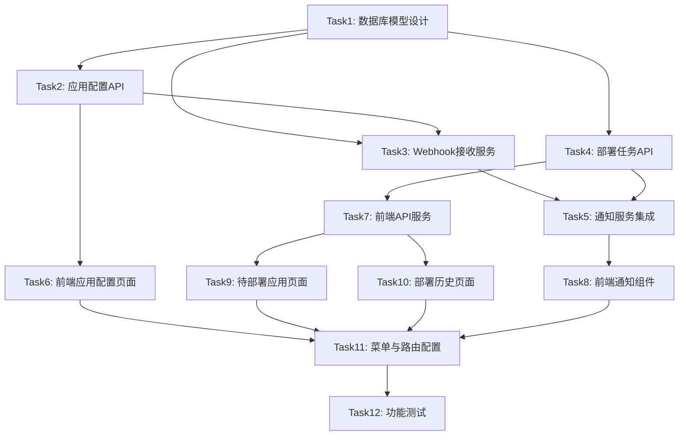

# Git部署任务管理 - 任务拆分文档

## 任务依赖图



---

## Task 1: 数据库模型设计与迁移

### 任务信息
- **任务ID**: TASK-001
- **优先级**: 🔴 高
- **预估工时**: 2小时
- **依赖任务**: 无

### 输入契约
- 数据库访问权限
- Prisma ORM环境已配置
- 设计文档中的数据模型定义

### 输出契约
- 更新的schema.prisma文件
- 数据库迁移文件
- 生成的TypeScript类型

### 实现步骤

#### 1.1 更新Prisma Schema
**文件**: `backend/prisma/schema.prisma`

添加以下内容到schema文件：

```prisma
// 部署任务状态枚举
enum DeploymentStatus {
  PENDING
  DEPLOYING
  COMPLETED
  FAILED
  IGNORED
}

// 部署任务表
model DeploymentTask {
  id            Int               @id @default(autoincrement())
  appId         Int               @map("app_id")
  appName       String            @map("app_name")
  repository    String
  branch        String
  commitId      String            @map("commit_id")
  commitMessage String            @map("commit_message")
  commitAuthor  String            @map("commit_author")
  status        DeploymentStatus  @default(PENDING)
  createdAt     DateTime          @default(now()) @map("created_at")
  deployedAt    DateTime?         @map("deployed_at")
  deployedBy    String?           @map("deployed_by")
  
  appConfig     AppConfig         @relation(fields: [appId], references: [id])
  
  @@index([status, createdAt])
  @@index([appId, createdAt])
  @@index([repository, branch])
  @@map("deployment_tasks")
}

// 应用配置表
model AppConfig {
  id              Int      @id @default(autoincrement())
  appName         String   @unique @map("app_name")
  appCode         String   @unique @map("app_code")
  description     String?
  gitUrl          String   @map("git_url")
  repositoryName  String   @map("repository_name")
  projectPath     String   @map("project_path")
  branches        String   // JSON数组存储
  webhookSecret   String   @map("webhook_secret")
  isActive        Boolean  @default(true) @map("is_active")
  createdAt       DateTime @default(now()) @map("created_at")
  updatedAt       DateTime @updatedAt @map("updated_at")
  
  deploymentTasks DeploymentTask[]
  
  @@map("app_configs")
}
```

#### 1.2 创建数据库迁移
```bash
cd backend
npx prisma migrate dev --name add_deployment_management
```

#### 1.3 生成Prisma Client
```bash
npx prisma generate
```

### 验收标准
- [ ] 迁移文件成功创建
- [ ] 数据库表结构正确
- [ ] TypeScript类型正确生成
- [ ] 索引创建成功

---

## Task 2: 应用配置管理API

### 任务信息
- **任务ID**: TASK-002
- **优先级**: 🔴 高
- **预估工时**: 3小时
- **依赖任务**: TASK-001

### 输入契约
- 数据库模型已完成
- Express路由系统已配置

### 输出契约
- 应用配置CRUD API
- Webhook密钥生成服务

### 实现步骤

#### 2.1 创建应用配置服务
**文件**: `backend/src/services/appConfigService.ts`

```typescript
import { PrismaClient } from '@prisma/client';
import crypto from 'crypto';

const prisma = new PrismaClient();

export interface CreateAppConfigInput {
  appName: string;
  appCode: string;
  description?: string;
  gitUrl: string;
  repositoryName: string;
  projectPath: string;
  branches: string[];
  webhookSecret?: string;
  isActive?: boolean;
}

/**
 * 生成Webhook密钥
 */
export function generateWebhookSecret(): string {
  return crypto.randomBytes(32).toString('hex');
}

/**
 * 获取应用配置列表
 */
export async function getAppConfigs(params: { page?: number; pageSize?: number; isActive?: boolean }) {
  const { page = 1, pageSize = 20, isActive } = params;
  
  const where: any = {};
  if (isActive !== undefined) where.isActive = isActive;
  
  const [items, total] = await Promise.all([
    prisma.appConfig.findMany({
      where,
      orderBy: { createdAt: 'desc' },
      skip: (page - 1) * pageSize,
      take: pageSize
    }),
    prisma.appConfig.count({ where })
  ]);
  
  return { 
    items: items.map(item => ({
      ...item,
      branches: JSON.parse(item.branches)
    })), 
    total, 
    page, 
    pageSize 
  };
}

/**
 * 根据仓库名称和路径获取应用配置
 */
export async function getAppConfigByRepository(repositoryName: string, projectPath: string) {
  return await prisma.appConfig.findFirst({
    where: {
      repositoryName,
      projectPath,
      isActive: true
    }
  });
}

/**
 * 创建应用配置
 */
export async function createAppConfig(data: CreateAppConfigInput) {
  const secret = data.webhookSecret || generateWebhookSecret();
  
  return await prisma.appConfig.create({
    data: {
      ...data,
      branches: JSON.stringify(data.branches),
      webhookSecret: secret
    }
  });
}

/**
 * 更新应用配置
 */
export async function updateAppConfig(id: number, data: Partial<CreateAppConfigInput>) {
  const updateData: any = { ...data };
  if (data.branches) {
    updateData.branches = JSON.stringify(data.branches);
  }
  
  return await prisma.appConfig.update({
    where: { id },
    data: updateData
  });
}

/**
 * 删除应用配置
 */
export async function deleteAppConfig(id: number) {
  return await prisma.appConfig.delete({
    where: { id }
  });
}

/**
 * 重新生成Webhook密钥
 */
export async function regenerateWebhookSecret(id: number) {
  const newSecret = generateWebhookSecret();
  
  return await prisma.appConfig.update({
    where: { id },
    data: { webhookSecret: newSecret }
  });
}
```

#### 2.2 创建应用配置控制器
**文件**: `backend/src/controllers/appConfigController.ts`

```typescript
import { Request, Response } from 'express';
import * as appConfigService from '../services/appConfigService';
import logger from '../utils/logger';

/**
 * 获取应用配置列表
 */
export async function getAppConfigs(req: Request, res: Response) {
  try {
    const params = {
      page: parseInt(req.query.page as string) || 1,
      pageSize: parseInt(req.query.pageSize as string) || 20,
      isActive: req.query.isActive === 'true' ? true : 
                req.query.isActive === 'false' ? false : undefined
    };
    
    const result = await appConfigService.getAppConfigs(params);
    
    res.json({
      success: true,
      data: result
    });
  } catch (error) {
    logger.error('获取应用配置列表失败:', error);
    res.status(500).json({ success: false, message: '获取配置列表失败' });
  }
}

/**
 * 创建应用配置
 */
export async function createAppConfig(req: Request, res: Response) {
  try {
    const config = await appConfigService.createAppConfig(req.body);
    
    res.json({
      success: true,
      data: config
    });
  } catch (error) {
    logger.error('创建应用配置失败:', error);
    res.status(500).json({ success: false, message: '创建配置失败' });
  }
}

/**
 * 更新应用配置
 */
export async function updateAppConfig(req: Request, res: Response) {
  try {
    const id = parseInt(req.params.id);
    const config = await appConfigService.updateAppConfig(id, req.body);
    
    res.json({
      success: true,
      data: config
    });
  } catch (error) {
    logger.error('更新应用配置失败:', error);
    res.status(500).json({ success: false, message: '更新配置失败' });
  }
}

/**
 * 删除应用配置
 */
export async function deleteAppConfig(req: Request, res: Response) {
  try {
    const id = parseInt(req.params.id);
    await appConfigService.deleteAppConfig(id);
    
    res.json({
      success: true,
      message: '删除成功'
    });
  } catch (error) {
    logger.error('删除应用配置失败:', error);
    res.status(500).json({ success: false, message: '删除配置失败' });
  }
}

/**
 * 重新生成Webhook密钥
 */
export async function regenerateSecret(req: Request, res: Response) {
  try {
    const id = parseInt(req.params.id);
    const config = await appConfigService.regenerateWebhookSecret(id);
    
    res.json({
      success: true,
      data: { webhookSecret: config.webhookSecret }
    });
  } catch (error) {
    logger.error('重新生成Webhook密钥失败:', error);
    res.status(500).json({ success: false, message: '重新生成密钥失败' });
  }
}
```

#### 2.3 创建路由
**文件**: `backend/src/routes/appConfigRoutes.ts`

```typescript
import { Router } from 'express';
import * as controller from '../controllers/appConfigController';

const router = Router();

// 获取应用配置列表
router.get('/', controller.getAppConfigs);

// 创建应用配置
router.post('/', controller.createAppConfig);

// 更新应用配置
router.put('/:id', controller.updateAppConfig);

// 删除应用配置
router.delete('/:id', controller.deleteAppConfig);

// 重新生成Webhook密钥
router.post('/:id/regenerate-secret', controller.regenerateSecret);

export default router;
```

### 验收标准
- [ ] 应用配置CRUD功能完整
- [ ] Webhook密钥自动生成
- [ ] 参数验证完善
- [ ] 错误处理完善

---

## Task 3: GitLab Webhook接收服务

### 任务信息
- **任务ID**: TASK-003
- **优先级**: 🔴 高
- **预估工时**: 3小时
- **依赖任务**: TASK-001, TASK-002

### 输入契约
- 数据库模型已完成
- Express服务器运行正常
- GitLab Webhook格式文档

### 输出契约
- Webhook路由处理器
- 签名验证服务
- 事件解析服务
- 部署任务创建服务

### 实现步骤

#### 2.1 创建类型定义
**文件**: `backend/src/types/deployment.ts`

```typescript
// GitLab Webhook事件类型
export interface GitlabPushEvent {
  object_kind: 'push';
  project: {
    name: string;
    web_url: string;
  };
  ref: string;
  checkout_sha: string;
  commits: Array<{
    id: string;
    message: string;
    author: {
      name: string;
    };
  }>;
}

export interface GitlabMergeEvent {
  object_kind: 'merge_request';
  project: {
    name: string;
  };
  object_attributes: {
    target_branch: string;
    merge_commit_sha: string;
    last_commit: {
      id: string;
      message: string;
      author: {
        name: string;
      };
    };
  };
}

// 部署任务类型
export interface CreateDeploymentTaskInput {
  appName: string;
  repository: string;
  branch: string;
  commitId: string;
  commitMessage: string;
  commitAuthor: string;
}

export type DeploymentTaskStatus = 'PENDING' | 'DEPLOYING' | 'COMPLETED' | 'FAILED' | 'IGNORED';
```

#### 2.2 创建Webhook服务
**文件**: `backend/src/services/webhookService.ts`

```typescript
import crypto from 'crypto';
import { PrismaClient } from '@prisma/client';
import { GitlabPushEvent, GitlabMergeEvent, CreateDeploymentTaskInput } from '../types/deployment';

const prisma = new PrismaClient();

/**
 * 验证GitLab Webhook签名
 */
export function verifyGitlabWebhook(
  payload: string,
  signature: string,
  secret: string
): boolean {
  try {
    const expectedSignature = crypto
      .createHmac('sha256', secret)
      .update(payload)
      .digest('hex');
    
    return crypto.timingSafeEqual(
      Buffer.from(signature),
      Buffer.from(expectedSignature)
    );
  } catch (error) {
    return false;
  }
}

/**
 * 解析GitLab事件
 */
export function parseGitlabEvent(body: any): { repository: string; branch: string; commit: any } | null {
  // Push事件
  if (body.object_kind === 'push') {
    const event = body as GitlabPushEvent;
    const branch = event.ref.replace('refs/heads/', '');
    const latestCommit = event.commits[0];
    
    if (!latestCommit) return null;
    
    return {
      repository: event.project.name,
      branch,
      commit: {
        id: event.checkout_sha || latestCommit.id,
        message: latestCommit.message,
        author: latestCommit.author.name
      }
    };
  }
  
  // Merge Request事件
  if (body.object_kind === 'merge_request') {
    const event = body as GitlabMergeEvent;
    const attrs = event.object_attributes;
    
    return {
      repository: event.project.name,
      branch: attrs.target_branch,
      commit: {
        id: attrs.merge_commit_sha || attrs.last_commit.id,
        message: attrs.last_commit.message,
        author: attrs.last_commit.author.name
      }
    };
  }
  
  return null;
}

/**
 * 获取仓库配置
 */
export async function getRepositoryConfig(repositoryName: string) {
  return await prisma.repositoryConfig.findUnique({
    where: { repositoryName },
    include: { projects: true }
  });
}

/**
 * 检查分支是否应该被监听
 */
export function shouldListenBranch(config: any, branch: string): boolean {
  try {
    const branches = JSON.parse(config.branches);
    return branches.includes(branch);
  } catch {
    return false;
  }
}

/**
 * 创建部署任务
 */
export async function createDeploymentTasks(
  repository: string,
  branch: string,
  commit: any,
  projects: any[]
) {
  const tasks = [];
  
  for (const project of projects) {
    const task = await prisma.deploymentTask.create({
      data: {
        appName: project.projectName,
        repository,
        branch,
        commitId: commit.id.substring(0, 8),
        commitMessage: commit.message.substring(0, 200),
        commitAuthor: commit.author,
        status: 'PENDING'
      }
    });
    tasks.push(task);
  }
  
  return tasks;
}
```

#### 2.3 创建Webhook路由
**文件**: `backend/src/routes/webhookRoutes.ts`

```typescript
import { Router, Request, Response } from 'express';
import logger from '../utils/logger';
import {
  verifyGitlabWebhook,
  parseGitlabEvent,
  getRepositoryConfig,
  shouldListenBranch,
  createDeploymentTasks
} from '../services/webhookService';
import { notifyNewDeploymentTasks } from '../services/deploymentNotificationService';

const router = Router();

/**
 * POST /webhooks/gitlab
 * 接收GitLab Webhook推送
 */
router.post('/gitlab', async (req: Request, res: Response) => {
  try {
    const signature = req.headers['x-gitlab-token'] as string;
    const eventType = req.headers['x-gitlab-event'] as string;
    
    if (!signature) {
      logger.warn('GitLab Webhook: 缺少签名');
      return res.status(401).json({ success: false, message: '缺少签名' });
    }
    
    // 解析事件
    const eventData = parseGitlabEvent(req.body);
    if (!eventData) {
      logger.warn('GitLab Webhook: 无法解析事件');
      return res.status(400).json({ success: false, message: '无法解析事件' });
    }
    
    const { repository, branch, commit } = eventData;
    
    // 获取仓库配置
    const config = await getRepositoryConfig(repository);
    if (!config) {
      logger.warn(`GitLab Webhook: 仓库 ${repository} 未配置`);
      return res.status(404).json({ success: false, message: '仓库未配置' });
    }
    
    // 验证签名
    const payload = JSON.stringify(req.body);
    if (!verifyGitlabWebhook(payload, signature, config.webhookSecret)) {
      logger.warn(`GitLab Webhook: 签名验证失败 - ${repository}`);
      return res.status(401).json({ success: false, message: '签名验证失败' });
    }
    
    // 检查分支是否应该被监听
    if (!shouldListenBranch(config, branch)) {
      logger.info(`GitLab Webhook: 分支 ${branch} 不在监听列表中`);
      return res.status(200).json({ success: true, message: '分支不在监听列表' });
    }
    
    // 创建部署任务
    const tasks = await createDeploymentTasks(
      repository,
      branch,
      commit,
      config.projects
    );
    
    logger.info(`GitLab Webhook: 为 ${repository} 创建了 ${tasks.length} 个部署任务`);
    
    // 发送通知
    await notifyNewDeploymentTasks(repository, branch, tasks);
    
    return res.status(200).json({
      success: true,
      data: {
        tasksCreated: tasks.length,
        tasks: tasks.map(t => ({ id: t.id, appName: t.appName, status: t.status }))
      }
    });
    
  } catch (error) {
    logger.error('GitLab Webhook处理错误:', error);
    return res.status(500).json({ success: false, message: '服务器错误' });
  }
});

export default router;
```

### 验收标准
- [ ] Webhook端点能正确接收GitLab推送
- [ ] 签名验证功能正常
- [ ] 能正确解析Push和Merge Request事件
- [ ] 能根据配置创建部署任务
- [ ] 错误处理完善

---

## Task 4: 部署任务管理API

### 任务信息
- **任务ID**: TASK-004
- **优先级**: 🔴 高
- **预估工时**: 3小时
- **依赖任务**: TASK-001

### 输入契约
- 数据库模型已完成
- Express路由系统已配置

### 输出契约
- 部署任务CRUD API
- 任务统计API
- 仓库配置管理API

### 实现步骤

#### 3.1 创建部署任务服务
**文件**: `backend/src/services/deploymentTaskService.ts`

```typescript
import { PrismaClient, DeploymentStatus } from '@prisma/client';

const prisma = new PrismaClient();

export interface TaskQueryParams {
  status?: DeploymentStatus;
  repository?: string;
  branch?: string;
  page?: number;
  pageSize?: number;
}

/**
 * 获取部署任务列表
 */
export async function getDeploymentTasks(params: TaskQueryParams) {
  const { status, repository, branch, page = 1, pageSize = 20 } = params;
  
  const where: any = {};
  if (status) where.status = status;
  if (repository) where.repository = repository;
  if (branch) where.branch = branch;
  
  const [items, total] = await Promise.all([
    prisma.deploymentTask.findMany({
      where,
      orderBy: { createdAt: 'desc' },
      skip: (page - 1) * pageSize,
      take: pageSize
    }),
    prisma.deploymentTask.count({ where })
  ]);
  
  return { items, total, page, pageSize };
}

/**
 * 获取任务统计
 */
export async function getTaskStats() {
  const stats = await prisma.deploymentTask.groupBy({
    by: ['status'],
    _count: { status: true }
  });
  
  const result = {
    pending: 0,
    deploying: 0,
    completed: 0,
    failed: 0,
    ignored: 0
  };
  
  stats.forEach(s => {
    const key = s.status.toLowerCase() as keyof typeof result;
    result[key] = s._count.status;
  });
  
  return result;
}

/**
 * 更新任务状态
 */
export async function updateTaskStatus(
  taskId: number,
  status: DeploymentStatus,
  deployedBy?: string
) {
  const updateData: any = { status };
  
  if (status === 'COMPLETED' || status === 'FAILED') {
    updateData.deployedAt = new Date();
    if (deployedBy) updateData.deployedBy = deployedBy;
  }
  
  return await prisma.deploymentTask.update({
    where: { id: taskId },
    data: updateData
  });
}

/**
 * 批量更新任务状态
 */
export async function batchUpdateTaskStatus(
  taskIds: number[],
  status: DeploymentStatus,
  deployedBy?: string
) {
  const updateData: any = { status };
  
  if (status === 'COMPLETED' || status === 'FAILED') {
    updateData.deployedAt = new Date();
    if (deployedBy) updateData.deployedBy = deployedBy;
  }
  
  return await prisma.deploymentTask.updateMany({
    where: { id: { in: taskIds } },
    data: updateData
  });
}
```

#### 3.2 创建部署任务控制器
**文件**: `backend/src/controllers/deploymentTaskController.ts`

```typescript
import { Request, Response } from 'express';
import { DeploymentStatus } from '@prisma/client';
import * as taskService from '../services/deploymentTaskService';
import logger from '../utils/logger';

/**
 * 获取部署任务列表
 */
export async function getTasks(req: Request, res: Response) {
  try {
    const params = {
      status: req.query.status as DeploymentStatus,
      repository: req.query.repository as string,
      branch: req.query.branch as string,
      page: parseInt(req.query.page as string) || 1,
      pageSize: parseInt(req.query.pageSize as string) || 20
    };
    
    const result = await taskService.getDeploymentTasks(params);
    
    res.json({
      success: true,
      data: result
    });
  } catch (error) {
    logger.error('获取部署任务列表失败:', error);
    res.status(500).json({ success: false, message: '获取任务列表失败' });
  }
}

/**
 * 获取任务统计
 */
export async function getStats(req: Request, res: Response) {
  try {
    const stats = await taskService.getTaskStats();
    
    res.json({
      success: true,
      data: stats
    });
  } catch (error) {
    logger.error('获取任务统计失败:', error);
    res.status(500).json({ success: false, message: '获取统计失败' });
  }
}

/**
 * 更新任务状态
 */
export async function updateStatus(req: Request, res: Response) {
  try {
    const taskId = parseInt(req.params.id);
    const { status, deployedBy } = req.body;
    
    if (!status || !['PENDING', 'DEPLOYING', 'COMPLETED', 'FAILED', 'IGNORED'].includes(status)) {
      return res.status(400).json({ success: false, message: '无效的状态' });
    }
    
    const task = await taskService.updateTaskStatus(
      taskId,
      status as DeploymentStatus,
      deployedBy
    );
    
    res.json({
      success: true,
      data: task
    });
  } catch (error) {
    logger.error('更新任务状态失败:', error);
    res.status(500).json({ success: false, message: '更新状态失败' });
  }
}

/**
 * 批量更新任务状态
 */
export async function batchUpdateStatus(req: Request, res: Response) {
  try {
    const { taskIds, status, deployedBy } = req.body;
    
    if (!Array.isArray(taskIds) || taskIds.length === 0) {
      return res.status(400).json({ success: false, message: '无效的任务ID列表' });
    }
    
    const result = await taskService.batchUpdateTaskStatus(
      taskIds,
      status as DeploymentStatus,
      deployedBy
    );
    
    res.json({
      success: true,
      data: { updatedCount: result.count }
    });
  } catch (error) {
    logger.error('批量更新任务状态失败:', error);
    res.status(500).json({ success: false, message: '批量更新失败' });
  }
}
```

#### 3.3 创建路由
**文件**: `backend/src/routes/deploymentTaskRoutes.ts`

```typescript
import { Router } from 'express';
import * as controller from '../controllers/deploymentTaskController';

const router = Router();

// 获取任务列表
router.get('/', controller.getTasks);

// 获取任务统计
router.get('/stats', controller.getStats);

// 更新任务状态
router.put('/:id/status', controller.updateStatus);

// 批量更新任务状态
router.put('/batch/status', controller.batchUpdateStatus);

export default router;
```

### 验收标准
- [ ] 任务列表查询支持分页和筛选
- [ ] 任务统计API返回正确数据
- [ ] 单条和批量状态更新功能正常
- [ ] 参数验证完善

---

## Task 5: 通知服务集成

### 任务信息
- **任务ID**: TASK-005
- **优先级**: 🟡 中
- **预估工时**: 2小时
- **依赖任务**: TASK-003, TASK-004

### 输入契约
- Webhook服务已完成
- 现有通知服务（Socket.IO、Server酱）

### 输出契约
- 部署任务通知服务
- WebSocket事件发送
- Server酱推送集成

### 实现步骤

#### 4.1 创建部署通知服务
**文件**: `backend/src/services/deploymentNotificationService.ts`

```typescript
import { DeploymentTask } from '@prisma/client';
import { getIO } from './socketService';
import * as serverChanService from './serverChanService';
import logger from '../utils/logger';

/**
 * 通知新的部署任务
 */
export async function notifyNewDeploymentTasks(
  repository: string,
  branch: string,
  tasks: DeploymentTask[]
) {
  try {
    // WebSocket通知
    const io = getIO();
    if (io) {
      io.emit('new-deployment-tasks', {
        repository,
        branch,
        tasks: tasks.map(t => ({
          id: t.id,
          appName: t.appName,
          commitMessage: t.commitMessage,
          commitAuthor: t.commitAuthor
        })),
        timestamp: new Date().toISOString()
      });
      logger.info(`WebSocket通知已发送: ${repository} 有 ${tasks.length} 个新任务`);
    }
    
    // Server酱推送
    const message = buildServerChanMessage(repository, branch, tasks);
    await serverChanService.sendNotification(message);
    
  } catch (error) {
    logger.error('发送部署任务通知失败:', error);
  }
}

/**
 * 通知任务状态更新
 */
export async function notifyTaskStatusUpdate(task: DeploymentTask) {
  try {
    const io = getIO();
    if (io) {
      io.emit('deployment-task-update', {
        taskId: task.id,
        appName: task.appName,
        status: task.status,
        deployedBy: task.deployedBy,
        deployedAt: task.deployedAt,
        timestamp: new Date().toISOString()
      });
    }
  } catch (error) {
    logger.error('发送任务状态更新通知失败:', error);
  }
}

/**
 * 构建Server酱消息
 */
function buildServerChanMessage(
  repository: string,
  branch: string,
  tasks: DeploymentTask[]
): string {
  const taskList = tasks.map((t, i) => 
    `${i + 1}. ${t.appName} - ${t.commitMessage.substring(0, 30)}...`
  ).join('\n');
  
  return `【部署提醒】${repository}仓库代码已更新

分支：${branch}
提交：${tasks[0]?.commitId || 'unknown'}
作者：${tasks[0]?.commitAuthor || 'unknown'}

待部署应用（${tasks.length}个）：
${taskList}

请及时部署到测试环境。
`;
}
```

#### 4.2 更新Socket服务（如需要）
确保Socket服务提供`getIO()`方法获取IO实例。

### 验收标准
- [ ] WebSocket通知正常发送
- [ ] Server酱推送正常发送
- [ ] 通知内容格式正确
- [ ] 错误处理完善

---

## Task 6: 前端API服务

### 任务信息
- **任务ID**: TASK-006
- **优先级**: 🔴 高
- **预估工时**: 2小时
- **依赖任务**: TASK-004

### 输入契约
- 后端API已完成
- 前端项目结构已了解

### 输出契约
- 部署任务API封装
- TypeScript类型定义

### 实现步骤

#### 5.1 创建API服务
**文件**: `frontend/src/services/deployment/deploymentApi.ts`

```typescript
import api from '../api';

export interface DeploymentTask {
  id: number;
  appName: string;
  repository: string;
  branch: string;
  commitId: string;
  commitMessage: string;
  commitAuthor: string;
  status: 'PENDING' | 'DEPLOYING' | 'COMPLETED' | 'FAILED' | 'IGNORED';
  createdAt: string;
  deployedAt?: string;
  deployedBy?: string;
}

export interface TaskListParams {
  status?: string;
  repository?: string;
  branch?: string;
  page?: number;
  pageSize?: number;
}

export interface TaskListResponse {
  items: DeploymentTask[];
  total: number;
  page: number;
  pageSize: number;
}

export interface TaskStats {
  pending: number;
  deploying: number;
  completed: number;
  failed: number;
  ignored: number;
}

/**
 * 获取部署任务列表
 */
export async function getDeploymentTasks(params: TaskListParams = {}): Promise<TaskListResponse> {
  const response = await api.get('/deployment-tasks', { params });
  return response.data.data;
}

/**
 * 获取任务统计
 */
export async function getTaskStats(): Promise<TaskStats> {
  const response = await api.get('/deployment-tasks/stats');
  return response.data.data;
}

/**
 * 更新任务状态
 */
export async function updateTaskStatus(
  taskId: number,
  status: string,
  deployedBy?: string
): Promise<DeploymentTask> {
  const response = await api.put(`/deployment-tasks/${taskId}/status`, {
    status,
    deployedBy
  });
  return response.data.data;
}

/**
 * 批量更新任务状态
 */
export async function batchUpdateTaskStatus(
  taskIds: number[],
  status: string,
  deployedBy?: string
): Promise<{ updatedCount: number }> {
  const response = await api.put('/deployment-tasks/batch/status', {
    taskIds,
    status,
    deployedBy
  });
  return response.data.data;
}
```

### 验收标准
- [ ] API封装完整
- [ ] TypeScript类型定义准确
- [ ] 错误处理完善

---

## Task 7: 前端通知组件

### 任务信息
- **任务ID**: TASK-007
- **优先级**: 🟡 中
- **预估工时**: 3小时
- **依赖任务**: TASK-005, TASK-006

### 输入契约
- WebSocket连接已建立
- API服务已完成

### 输出契约
- 部署任务通知Hook
- 待办提醒弹窗组件
- 顶部徽章组件

### 实现步骤

#### 6.1 创建Hook
**文件**: `frontend/src/hooks/useDeploymentNotifications.ts`

```typescript
import { useEffect, useCallback, useState } from 'react';
import { useNavigate } from 'react-router-dom';
import { socket } from '../services/socket';
import { DeploymentTask } from '../services/deployment/deploymentApi';

interface NewTasksEvent {
  repository: string;
  branch: string;
  tasks: Array<{
    id: number;
    appName: string;
    commitMessage: string;
    commitAuthor: string;
  }>;
  timestamp: string;
}

export interface DeploymentNotification {
  id: string;
  repository: string;
  branch: string;
  tasks: NewTasksEvent['tasks'];
  timestamp: string;
}

export function useDeploymentNotifications() {
  const navigate = useNavigate();
  const [notifications, setNotifications] = useState<DeploymentNotification[]>([]);
  const [pendingCount, setPendingCount] = useState(0);

  useEffect(() => {
    // 监听新部署任务
    const handleNewTasks = (data: NewTasksEvent) => {
      const notification: DeploymentNotification = {
        id: `${Date.now()}-${data.repository}`,
        repository: data.repository,
        branch: data.branch,
        tasks: data.tasks,
        timestamp: data.timestamp
      };
      
      setNotifications(prev => [...prev, notification]);
      setPendingCount(prev => prev + data.tasks.length);
    };

    // 监听任务状态更新
    const handleTaskUpdate = (data: { taskId: number; status: string }) => {
      if (data.status === 'COMPLETED' || data.status === 'IGNORED') {
        setPendingCount(prev => Math.max(0, prev - 1));
      }
    };

    socket.on('new-deployment-tasks', handleNewTasks);
    socket.on('deployment-task-update', handleTaskUpdate);

    return () => {
      socket.off('new-deployment-tasks', handleNewTasks);
      socket.off('deployment-task-update', handleTaskUpdate);
    };
  }, []);

  const removeNotification = useCallback((id: string) => {
    setNotifications(prev => prev.filter(n => n.id !== id));
  }, []);

  const handleViewDetails = useCallback((notification: DeploymentNotification) => {
    navigate('/deployment-management');
    removeNotification(notification.id);
  }, [navigate, removeNotification]);

  const refreshPendingCount = useCallback(async () => {
    try {
      const { getTaskStats } = await import('../services/deployment/deploymentApi');
      const stats = await getTaskStats();
      setPendingCount(stats.pending + stats.deploying);
    } catch (error) {
      console.error('获取待部署数量失败:', error);
    }
  }, []);

  return {
    notifications,
    pendingCount,
    removeNotification,
    handleViewDetails,
    refreshPendingCount
  };
}
```

#### 6.2 创建通知弹窗组件
**文件**: `frontend/src/components/deployment/DeploymentNotification.tsx`

```typescript
import React from 'react';
import { Card, Button, Space, Typography, List } from 'antd';
import { BellOutlined, CloseOutlined } from '@ant-design/icons';
import { DeploymentNotification as NotificationType } from '../../hooks/useDeploymentNotifications';

const { Text, Title } = Typography;

interface Props {
  notification: NotificationType;
  onViewDetails: (notification: NotificationType) => void;
  onDismiss: (id: string) => void;
}

export const DeploymentNotification: React.FC<Props> = ({
  notification,
  onViewDetails,
  onDismiss
}) => {
  return (
    <Card
      size="small"
      style={{
        width: 320,
        marginBottom: 16,
        boxShadow: '0 4px 12px rgba(0,0,0,0.15)'
      }}
      title={
        <Space>
          <BellOutlined style={{ color: '#faad14' }} />
          <Text strong>新的部署任务</Text>
        </Space>
      }
      extra={
        <Button
          type="text"
          size="small"
          icon={<CloseOutlined />}
          onClick={() => onDismiss(notification.id)}
        />
      }
    >
      <div style={{ marginBottom: 12 }}>
        <Text strong>{notification.repository}</Text>
        <Text type="secondary"> 仓库有 {notification.tasks.length} 个应用需要部署</Text>
      </div>
      
      <List
        size="small"
        dataSource={notification.tasks.slice(0, 3)}
        renderItem={task => (
          <List.Item style={{ padding: '4px 0' }}>
            <Text ellipsis style={{ maxWidth: 200 }}>
              • {task.appName}
            </Text>
          </List.Item>
        )}
      />
      
      {notification.tasks.length > 3 && (
        <Text type="secondary" style={{ fontSize: 12 }}>
          还有 {notification.tasks.length - 3} 个应用...
        </Text>
      )}
      
      <div style={{ marginTop: 12, textAlign: 'right' }}>
        <Space>
          <Button size="small" onClick={() => onDismiss(notification.id)}>
            忽略
          </Button>
          <Button
            type="primary"
            size="small"
            onClick={() => onViewDetails(notification)}
          >
            查看详情
          </Button>
        </Space>
      </div>
    </Card>
  );
};
```

#### 6.3 创建徽章组件
**文件**: `frontend/src/components/deployment/DeploymentBadge.tsx`

```typescript
import React, { useEffect } from 'react';
import { Badge, Tooltip } from 'antd';
import { DeploymentUnitOutlined } from '@ant-design/icons';
import { useDeploymentNotifications } from '../../hooks/useDeploymentNotifications';

export const DeploymentBadge: React.FC = () => {
  const { pendingCount, refreshPendingCount } = useDeploymentNotifications();

  useEffect(() => {
    refreshPendingCount();
    // 每30秒刷新一次
    const interval = setInterval(refreshPendingCount, 30000);
    return () => clearInterval(interval);
  }, [refreshPendingCount]);

  return (
    <Tooltip title={`${pendingCount} 个应用待部署`}>
      <Badge count={pendingCount} size="small" offset={[0, 2]}>
        <DeploymentUnitOutlined style={{ fontSize: 18 }} />
      </Badge>
    </Tooltip>
  );
};
```

### 验收标准
- [ ] WebSocket事件监听正常
- [ ] 通知弹窗显示正确
- [ ] 徽章数量实时更新
- [ ] 点击查看详情跳转正确

---

## Task 8: 应用配置页面

### 任务信息
- **任务ID**: TASK-008
- **优先级**: 🔴 高
- **预估工时**: 4小时
- **依赖任务**: TASK-002, TASK-006

### 输入契约
- 应用配置API已完成
- 前端API服务已完成

### 输出契约
- 应用配置管理页面
- 应用列表展示
- 新增/编辑应用配置表单

### 实现步骤

#### 8.1 创建应用配置API服务
**文件**: `frontend/src/services/deployment/appConfigApi.ts`

```typescript
import api from '../api';

export interface AppConfig {
  id: number;
  appName: string;
  appCode: string;
  description?: string;
  gitUrl: string;
  repositoryName: string;
  projectPath: string;
  branches: string[];
  isActive: boolean;
  createdAt: string;
  updatedAt: string;
}

export interface CreateAppConfigInput {
  appName: string;
  appCode: string;
  description?: string;
  gitUrl: string;
  repositoryName: string;
  projectPath: string;
  branches: string[];
  webhookSecret?: string;
  isActive?: boolean;
}

export async function getAppConfigs(params?: { page?: number; pageSize?: number; isActive?: boolean }) {
  const response = await api.get('/app-configs', { params });
  return response.data.data;
}

export async function createAppConfig(data: CreateAppConfigInput) {
  const response = await api.post('/app-configs', data);
  return response.data.data;
}

export async function updateAppConfig(id: number, data: Partial<CreateAppConfigInput>) {
  const response = await api.put(`/app-configs/${id}`, data);
  return response.data.data;
}

export async function deleteAppConfig(id: number) {
  const response = await api.delete(`/app-configs/${id}`);
  return response.data.data;
}

export async function regenerateWebhookSecret(id: number) {
  const response = await api.post(`/app-configs/${id}/regenerate-secret`);
  return response.data.data;
}
```

#### 8.2 创建应用配置页面
**文件**: `frontend/src/pages/app-management/AppConfigPage.tsx`

```typescript
import React, { useState, useEffect } from 'react';
import {
  PageHeader,
  Card,
  Table,
  Button,
  Tag,
  Space,
  Modal,
  Form,
  Input,
  Select,
  Switch,
  message,
  Popconfirm
} from 'antd';
import {
  PlusOutlined,
  EditOutlined,
  DeleteOutlined,
  KeyOutlined
} from '@ant-design/icons';
import {
  getAppConfigs,
  createAppConfig,
  updateAppConfig,
  deleteAppConfig,
  regenerateWebhookSecret,
  AppConfig
} from '../../services/deployment/appConfigApi';

const { Option } = Select;
const { TextArea } = Input;

const AppConfigPage: React.FC = () => {
  const [configs, setConfigs] = useState<AppConfig[]>([]);
  const [loading, setLoading] = useState(false);
  const [modalVisible, setModalVisible] = useState(false);
  const [editingConfig, setEditingConfig] = useState<AppConfig | null>(null);
  const [form] = Form.useForm();

  const fetchConfigs = async () => {
    setLoading(true);
    try {
      const result = await getAppConfigs();
      setConfigs(result.items);
    } catch (error) {
      message.error('获取应用配置失败');
    } finally {
      setLoading(false);
    }
  };

  useEffect(() => {
    fetchConfigs();
  }, []);

  const handleAdd = () => {
    setEditingConfig(null);
    form.resetFields();
    setModalVisible(true);
  };

  const handleEdit = (config: AppConfig) => {
    setEditingConfig(config);
    form.setFieldsValue({
      ...config,
      branches: config.branches
    });
    setModalVisible(true);
  };

  const handleDelete = async (id: number) => {
    try {
      await deleteAppConfig(id);
      message.success('删除成功');
      fetchConfigs();
    } catch (error) {
      message.error('删除失败');
    }
  };

  const handleSubmit = async (values: any) => {
    try {
      if (editingConfig) {
        await updateAppConfig(editingConfig.id, values);
        message.success('更新成功');
      } else {
        await createAppConfig(values);
        message.success('创建成功');
      }
      setModalVisible(false);
      fetchConfigs();
    } catch (error) {
      message.error(editingConfig ? '更新失败' : '创建失败');
    }
  };

  const handleRegenerateSecret = async (id: number) => {
    try {
      const result = await regenerateWebhookSecret(id);
      message.success(`新的Webhook密钥: ${result.webhookSecret}`);
    } catch (error) {
      message.error('重新生成密钥失败');
    }
  };

  const columns = [
    {
      title: '应用名称',
      dataIndex: 'appName',
      key: 'appName',
    },
    {
      title: '应用编码',
      dataIndex: 'appCode',
      key: 'appCode',
    },
    {
      title: 'Git仓库',
      dataIndex: 'repositoryName',
      key: 'repositoryName',
    },
    {
      title: '监测分支',
      dataIndex: 'branches',
      key: 'branches',
      render: (branches: string[]) => (
        <Space>
          {branches.map(branch => (
            <Tag key={branch} color="blue">{branch}</Tag>
          ))}
        </Space>
      ),
    },
    {
      title: '状态',
      dataIndex: 'isActive',
      key: 'isActive',
      render: (isActive: boolean) => (
        <Tag color={isActive ? 'success' : 'default'}>
          {isActive ? '启用' : '禁用'}
        </Tag>
      ),
    },
    {
      title: '操作',
      key: 'action',
      render: (_: any, record: AppConfig) => (
        <Space>
          <Button
            type="text"
            icon={<EditOutlined />}
            onClick={() => handleEdit(record)}
          />
          <Button
            type="text"
            icon={<KeyOutlined />}
            onClick={() => handleRegenerateSecret(record.id)}
          />
          <Popconfirm
            title="确认删除"
            onConfirm={() => handleDelete(record.id)}
          >
            <Button type="text" danger icon={<DeleteOutlined />} />
          </Popconfirm>
        </Space>
      ),
    },
  ];

  return (
    <div style={{ padding: 24 }}>
      <PageHeader
        title="应用配置"
        extra={[
          <Button
            type="primary"
            icon={<PlusOutlined />}
            onClick={handleAdd}
          >
            新增应用
          </Button>,
        ]}
      />

      <Card>
        <Table
          columns={columns}
          dataSource={configs}
          loading={loading}
          rowKey="id"
        />
      </Card>

      <Modal
        title={editingConfig ? '编辑应用配置' : '新增应用配置'}
        visible={modalVisible}
        onOk={() => form.submit()}
        onCancel={() => setModalVisible(false)}
        width={600}
      >
        <Form
          form={form}
          layout="vertical"
          onFinish={handleSubmit}
        >
          <Form.Item
            name="appName"
            label="应用名称"
            rules={[{ required: true, message: '请输入应用名称' }]}
          >
            <Input placeholder="如：jwsiot-frontend" />
          </Form.Item>

          <Form.Item
            name="appCode"
            label="应用编码"
            rules={[{ required: true, message: '请输入应用编码' }]}
          >
            <Input placeholder="如：jwsiot-fe" />
          </Form.Item>

          <Form.Item
            name="description"
            label="应用描述"
          >
            <TextArea rows={2} placeholder="应用描述（可选）" />
          </Form.Item>

          <Form.Item
            name="gitUrl"
            label="Git仓库地址"
            rules={[{ required: true, message: '请输入Git仓库地址' }]}
          >
            <Input placeholder="https://gitlab.com/group/repo.git" />
          </Form.Item>

          <Form.Item
            name="repositoryName"
            label="GitLab仓库名称"
            rules={[{ required: true, message: '请输入GitLab仓库名称' }]}
          >
            <Input placeholder="如：JWSIOT" />
          </Form.Item>

          <Form.Item
            name="projectPath"
            label="工程路径"
            rules={[{ required: true, message: '请输入工程路径' }]}
          >
            <Input placeholder="如：jwsiot-frontend/" />
          </Form.Item>

          <Form.Item
            name="branches"
            label="监测分支"
            rules={[{ required: true, message: '请选择监测分支' }]}
          >
            <Select mode="tags" placeholder="输入分支名称，如：main, develop">
              <Option value="main">main</Option>
              <Option value="develop">develop</Option>
              <Option value="master">master</Option>
            </Select>
          </Form.Item>

          <Form.Item
            name="isActive"
            label="启用监测"
            valuePropName="checked"
            initialValue={true}
          >
            <Switch />
          </Form.Item>
        </Form>
      </Modal>
    </div>
  );
};

export default AppConfigPage;
```

### 验收标准
- [ ] 应用列表展示正确
- [ ] 新增/编辑功能正常
- [ ] 删除功能正常
- [ ] 重新生成密钥功能正常

---

## Task 9: 待部署应用页面

### 任务信息
- **任务ID**: TASK-009
- **优先级**: 🔴 高
- **预估工时**: 3小时
- **依赖任务**: TASK-006

### 输入契约
- 部署任务API已完成
- 前端API服务已完成

### 输出契约
- 待部署应用页面
- 实时展示待部署任务

### 实现步骤

#### 9.1 创建待部署应用页面
**文件**: `frontend/src/pages/app-management/PendingDeploymentsPage.tsx`

```typescript
import React, { useEffect, useState, useCallback } from 'react';
import {
  PageHeader,
  Card,
  List,
  Statistic,
  Row,
  Col,
  message,
  Empty,
  Spin,
  Button
} from 'antd';
import {
  ClockCircleOutlined,
  SyncOutlined,
  ReloadOutlined
} from '@ant-design/icons';
import { DeploymentTaskCard } from '../../components/deployment/DeploymentTaskCard';
import {
  getDeploymentTasks,
  getTaskStats,
  updateTaskStatus,
  DeploymentTask,
  TaskStats
} from '../../services/deployment/deploymentApi';

const PendingDeploymentsPage: React.FC = () => {
  const [tasks, setTasks] = useState<DeploymentTask[]>([]);
  const [stats, setStats] = useState<TaskStats>({
    pending: 0,
    deploying: 0,
    completed: 0,
    failed: 0,
    ignored: 0
  });
  const [loading, setLoading] = useState(false);

  const fetchPendingTasks = useCallback(async () => {
    setLoading(true);
    try {
      const result = await getDeploymentTasks({
        status: 'PENDING',
        page: 1,
        pageSize: 100
      });
      setTasks(result.items);
    } catch (error) {
      message.error('获取待部署任务失败');
    } finally {
      setLoading(false);
    }
  }, []);

  const fetchStats = useCallback(async () => {
    try {
      const data = await getTaskStats();
      setStats(data);
    } catch (error) {
      console.error('获取统计失败:', error);
    }
  }, []);

  const handleStatusChange = async (taskId: number, status: string) => {
    try {
      await updateTaskStatus(taskId, status, '当前用户');
      message.success('状态更新成功');
      fetchPendingTasks();
      fetchStats();
    } catch (error) {
      message.error('状态更新失败');
    }
  };

  useEffect(() => {
    fetchPendingTasks();
    fetchStats();
    
    // 每30秒刷新
    const interval = setInterval(() => {
      fetchPendingTasks();
      fetchStats();
    }, 30000);
    
    return () => clearInterval(interval);
  }, []);

  return (
    <div style={{ padding: 24 }}>
      <PageHeader
        title="待部署应用"
        extra={[
          <ReloadOutlined
            key="refresh"
            style={{ fontSize: 18, cursor: 'pointer' }}
            onClick={() => {
              fetchPendingTasks();
              fetchStats();
            }}
            spin={loading}
          />
        ]}
      />

      {/* 统计卡片 */}
      <Row gutter={16} style={{ marginBottom: 24 }}>
        <Col span={12}>
          <Card>
            <Statistic
              title="待部署"
              value={stats.pending}
              valueStyle={{ color: '#faad14' }}
              prefix={<ClockCircleOutlined />}
            />
          </Card>
        </Col>
        <Col span={12}>
          <Card>
            <Statistic
              title="部署中"
              value={stats.deploying}
              valueStyle={{ color: '#1890ff' }}
              prefix={<SyncOutlined spin />}
            />
          </Card>
        </Col>
      </Row>

      {/* 待部署任务列表 */}
      <Card>
        <Spin spinning={loading}>
          <List
            dataSource={tasks}
            renderItem={task => (
              <DeploymentTaskCard
                task={task}
                onStatusChange={handleStatusChange}
              />
            )}
            locale={{
              emptyText: <Empty description="暂无待部署应用" />
            }}
          />
        </Spin>
      </Card>
    </div>
  );
};

export default PendingDeploymentsPage;
```

### 验收标准
- [ ] 只显示待部署和部署中的任务
- [ ] 统计数字正确
- [ ] 标记完成功能正常
- [ ] 自动刷新功能正常

---

## Task 10: 部署应用历史页面

### 任务信息
- **任务ID**: TASK-010
- **优先级**: 🔴 高
- **预估工时**: 3小时
- **依赖任务**: TASK-006

### 输入契约
- 部署任务API已完成
- 前端API服务已完成

### 输出契约
- 部署历史页面
- 支持筛选和分页

### 实现步骤

#### 10.1 创建部署历史页面
**文件**: `frontend/src/pages/app-management/DeploymentHistoryPage.tsx`

```typescript
import React, { useEffect, useState, useCallback } from 'react';
import {
  PageHeader,
  Card,
  List,
  Tabs,
  DatePicker,
  Select,
  message,
  Empty,
  Spin
} from 'antd';
import { ReloadOutlined } from '@ant-design/icons';
import { DeploymentTaskCard } from '../../components/deployment/DeploymentTaskCard';
import {
  getDeploymentTasks,
  updateTaskStatus,
  DeploymentTask
} from '../../services/deployment/deploymentApi';
import dayjs from 'dayjs';

const { TabPane } = Tabs;
const { RangePicker } = DatePicker;
const { Option } = Select;

const DeploymentHistoryPage: React.FC = () => {
  const [tasks, setTasks] = useState<DeploymentTask[]>([]);
  const [loading, setLoading] = useState(false);
  const [activeTab, setActiveTab] = useState('all');
  const [pagination, setPagination] = useState({
    current: 1,
    pageSize: 10,
    total: 0
  });

  const fetchTasks = useCallback(async (page = 1, status?: string) => {
    setLoading(true);
    try {
      const params: any = { page, pageSize: pagination.pageSize };
      if (status && status !== 'all') {
        params.status = status.toUpperCase();
      }
      
      const result = await getDeploymentTasks(params);
      setTasks(result.items);
      setPagination(prev => ({
        ...prev,
        current: page,
        total: result.total
      }));
    } catch (error) {
      message.error('获取历史记录失败');
    } finally {
      setLoading(false);
    }
  }, [pagination.pageSize]);

  const handleTabChange = (key: string) => {
    setActiveTab(key);
    fetchTasks(1, key);
  };

  const handlePageChange = (page: number) => {
    fetchTasks(page, activeTab);
  };

  useEffect(() => {
    fetchTasks();
  }, []);

  return (
    <div style={{ padding: 24 }}>
      <PageHeader
        title="部署应用历史"
        extra={[
          <ReloadOutlined
            key="refresh"
            style={{ fontSize: 18, cursor: 'pointer' }}
            onClick={() => fetchTasks(pagination.current, activeTab)}
            spin={loading}
          />
        ]}
      />

      <Card>
        <Tabs activeKey={activeTab} onChange={handleTabChange}>
          <TabPane tab="全部" key="all" />
          <TabPane tab="已完成" key="completed" />
          <TabPane tab="失败" key="failed" />
          <TabPane tab="已忽略" key="ignored" />
        </Tabs>

        <Spin spinning={loading}>
          <List
            dataSource={tasks}
            renderItem={task => (
              <DeploymentTaskCard
                task={task}
                onStatusChange={() => {}}
              />
            )}
            pagination={{
              ...pagination,
              onChange: handlePageChange,
              showSizeChanger: false
            }}
            locale={{
              emptyText: <Empty description="暂无部署历史" />
            }}
          />
        </Spin>
      </Card>
    </div>
  );
};

export default DeploymentHistoryPage;
```

### 验收标准
- [ ] 历史记录列表展示正确
- [ ] 状态筛选功能正常
- [ ] 分页功能正常
- [ ] 日期筛选功能正常（可选）

---

## Task 11: 菜单与路由配置

### 任务信息
- **任务ID**: TASK-011
- **优先级**: 🔴 高
- **预估工时**: 2小时
- **依赖任务**: TASK-007, TASK-008, TASK-009, TASK-010

### 输入契约
- 所有页面组件已完成
- 现有菜单结构已了解

### 输出契约
- 应用管理菜单
- 路由配置
- 页面元数据配置

### 实现步骤

#### 11.1 更新菜单配置
**文件**: `frontend/src/layouts/MainLayout.tsx`

在缺陷管理和系统管理之间添加应用管理一级菜单：

```typescript
const menuItems = [
  {
    key: '/',
    icon: <HomeOutlined />,
    label: '首页',
    onClick: () => navigate('/'),
  },
  {
    key: '/test-management',
    icon: <UnorderedListOutlined />,
    label: '用例管理',
    children: [
      // ... 用例管理子菜单
    ],
  },
  {
    key: '/defects',
    icon: <BugOutlined />,
    label: '缺陷管理',
    children: [
      // ... 缺陷管理子菜单
    ],
  },
  // 应用管理 - 独立一级菜单，放置在缺陷管理和系统管理之间
  {
    key: '/app-management',
    icon: <AppstoreOutlined />,
    label: '应用管理',
    children: [
      {
        key: '/app-management/pending',
        label: '待部署应用',
        onClick: () => navigate('/app-management/pending'),
      },
      {
        key: '/app-management/history',
        label: '部署应用历史',
        onClick: () => navigate('/app-management/history'),
      },
      {
        key: '/app-management/config',
        label: '应用配置',
        onClick: () => navigate('/app-management/config'),
      },
    ],
  },
  {
    key: '/admin',
    icon: <SettingOutlined />,
    label: '系统管理',
    children: [
      // ... 系统管理子菜单
    ],
  },
];
```
```

#### 11.2 添加路由配置
**文件**: `frontend/src/routes/AppRoutes.tsx`

```typescript
import PendingDeploymentsPage from '../pages/app-management/PendingDeploymentsPage';
import DeploymentHistoryPage from '../pages/app-management/DeploymentHistoryPage';
import AppConfigPage from '../pages/app-management/AppConfigPage';

// 在路由配置中添加
<Route path="/app-management/pending" element={<PendingDeploymentsPage />} />
<Route path="/app-management/history" element={<DeploymentHistoryPage />} />
<Route path="/app-management/config" element={<AppConfigPage />} />
```

#### 11.3 更新页面元数据
**文件**: `frontend/src/config/pageMeta.ts`

```typescript
// 应用管理模块
'/app-management/pending': {
  title: '待部署应用',
  icon: 'ClockCircleOutlined',
  module: 'admin',
},
'/app-management/history': {
  title: '部署应用历史',
  icon: 'HistoryOutlined',
  module: 'admin',
},
'/app-management/config': {
  title: '应用配置',
  icon: 'SettingOutlined',
  module: 'admin',
},
```

### 验收标准
- [ ] 菜单显示正确
- [ ] 路由跳转正常
- [ ] 页面标题正确
- [ ] 权限控制正常（可选）

---

## Task 12: 功能测试

### 任务信息
- **任务ID**: TASK-012
- **优先级**: 🟡 中
- **预估工时**: 2小时
- **依赖任务**: TASK-001 ~ TASK-011

### 测试清单

#### 12.1 应用配置测试
- [ ] 创建应用配置
- [ ] 编辑应用配置
- [ ] 删除应用配置
- [ ] 重新生成Webhook密钥

#### 12.2 Webhook接收测试
- [ ] GitLab Push事件触发任务创建
- [ ] GitLab Merge Request事件触发任务创建
- [ ] 签名验证失败时拒绝请求
- [ ] 未配置应用时返回404
- [ ] 非监听分支时正常返回但不创建任务

#### 12.3 部署任务测试
- [ ] 待部署应用列表展示
- [ ] 部署历史列表展示
- [ ] 任务状态更新
- [ ] 统计数字正确

#### 12.4 通知测试
- [ ] WebSocket实时推送
- [ ] Server酱推送
- [ ] 通知弹窗显示
- [ ] 徽章数量更新

#### 12.5 集成测试
- [ ] 完整流程：Git提交 → Webhook → 任务创建 → 通知 → 部署完成

---

## 实施计划

### 阶段1：后端基础（3天）
- Day 1: TASK-001, TASK-002
- Day 2: TASK-003, TASK-004
- Day 3: TASK-005

### 阶段2：前端实现（3天）
- Day 4: TASK-006, TASK-007, TASK-008
- Day 5: TASK-009, TASK-010
- Day 6: TASK-011

### 阶段3：测试部署（1天）
- Day 7: TASK-012, 文档整理

---

## 风险与应对

| 风险 | 影响 | 应对措施 |
|-----|------|---------|
| GitLab Webhook格式差异 | 高 | 预留字段映射配置 |
| WebSocket连接不稳定 | 中 | 实现重连机制 |
| 大量任务创建性能问题 | 中 | 批量插入优化 |
| 通知过于频繁 | 低 | 增加合并通知机制 |

### 输入契约
- API服务已完成
- 通知组件已完成

### 输出契约
- 部署任务管理页面
- 任务列表组件
- 状态操作功能

### 实现步骤

#### 7.1 创建任务卡片组件
**文件**: `frontend/src/components/deployment/DeploymentTaskCard.tsx`

```typescript
import React from 'react';
import { Card, Button, Space, Tag, Typography, Tooltip } from 'antd';
import { 
  CheckCircleOutlined, 
  SyncOutlined, 
  ClockCircleOutlined,
  CloseCircleOutlined,
  PauseCircleOutlined,
  GithubOutlined,
  BranchesOutlined,
  UserOutlined,
  MessageOutlined
} from '@ant-design/icons';
import { DeploymentTask } from '../../services/deployment/deploymentApi';
import dayjs from 'dayjs';
import relativeTime from 'dayjs/plugin/relativeTime';

dayjs.extend(relativeTime);

const { Text, Paragraph } = Typography;

interface Props {
  task: DeploymentTask;
  onStatusChange: (taskId: number, status: string) => void;
}

const statusConfig = {
  PENDING: { color: 'warning', icon: <ClockCircleOutlined />, text: '待部署' },
  DEPLOYING: { color: 'processing', icon: <SyncOutlined spin />, text: '部署中' },
  COMPLETED: { color: 'success', icon: <CheckCircleOutlined />, text: '已完成' },
  FAILED: { color: 'error', icon: <CloseCircleOutlined />, text: '失败' },
  IGNORED: { color: 'default', icon: <PauseCircleOutlined />, text: '已忽略' }
};

export const DeploymentTaskCard: React.FC<Props> = ({ task, onStatusChange }) => {
  const status = statusConfig[task.status];
  const isPending = task.status === 'PENDING';

  return (
    <Card
      size="small"
      style={{ marginBottom: 12 }}
      actions={[
        isPending && (
          <Button
            type="primary"
            size="small"
            icon={<CheckCircleOutlined />}
            onClick={() => onStatusChange(task.id, 'COMPLETED')}
          >
            标记完成
          </Button>
        ),
        isPending && (
          <Button
            size="small"
            icon={<PauseCircleOutlined />}
            onClick={() => onStatusChange(task.id, 'IGNORED')}
          >
            忽略
          </Button>
        )
      ].filter(Boolean)}
    >
      <div style={{ display: 'flex', justifyContent: 'space-between', alignItems: 'flex-start' }}>
        <div style={{ flex: 1 }}>
          <Space style={{ marginBottom: 8 }}>
            <Text strong style={{ fontSize: 16 }}>
              <GithubOutlined /> {task.appName}
            </Text>
            <Tag color={status.color} icon={status.icon}>
              {status.text}
            </Tag>
          </Space>
          
          <Space style={{ marginBottom: 8 }} wrap>
            <Tag icon={<BranchesOutlined />}>{task.repository}</Tag>
            <Tag color="blue">{task.branch}</Tag>
            <Tag color="cyan">{task.commitId.substring(0, 7)}</Tag>
          </Space>
          
          <Paragraph type="secondary" ellipsis={{ rows: 2 }} style={{ marginBottom: 8 }}>
            <MessageOutlined /> {task.commitMessage}
          </Paragraph>
          
          <Space size="large">
            <Text type="secondary" style={{ fontSize: 12 }}>
              <UserOutlined /> {task.commitAuthor}
            </Text>
            <Text type="secondary" style={{ fontSize: 12 }}>
              {dayjs(task.createdAt).fromNow()}
            </Text>
          </Space>
          
          {task.deployedBy && (
            <div style={{ marginTop: 8 }}>
              <Text type="success" style={{ fontSize: 12 }}>
                由 {task.deployedBy} 于 {dayjs(task.deployedAt).format('MM-DD HH:mm')} 完成部署
              </Text>
            </div>
          )}
        </div>
      </div>
    </Card>
  );
};
```

#### 7.2 创建部署管理页面
**文件**: `frontend/src/pages/deployment/DeploymentManagementPage.tsx`

```typescript
import React, { useEffect, useState, useCallback } from 'react';
import {
  PageHeader,
  Card,
  Tabs,
  List,
  Statistic,
  Row,
  Col,
  message,
  Empty,
  Spin
} from 'antd';
import {
  DeploymentUnitOutlined,
  ClockCircleOutlined,
  SyncOutlined,
  CheckCircleOutlined,
  ReloadOutlined
} from '@ant-design/icons';
import { DeploymentTaskCard } from '../../components/deployment/DeploymentTaskCard';
import {
  getDeploymentTasks,
  getTaskStats,
  updateTaskStatus,
  DeploymentTask,
  TaskStats
} from '../../services/deployment/deploymentApi';

const { TabPane } = Tabs;

const DeploymentManagementPage: React.FC = () => {
  const [tasks, setTasks] = useState<DeploymentTask[]>([]);
  const [stats, setStats] = useState<TaskStats>({
    pending: 0,
    deploying: 0,
    completed: 0,
    failed: 0,
    ignored: 0
  });
  const [loading, setLoading] = useState(false);
  const [activeTab, setActiveTab] = useState('all');
  const [pagination, setPagination] = useState({
    current: 1,
    pageSize: 10,
    total: 0
  });

  const fetchTasks = useCallback(async (page = 1, status?: string) => {
    setLoading(true);
    try {
      const params: any = { page, pageSize: pagination.pageSize };
      if (status && status !== 'all') {
        params.status = status.toUpperCase();
      }
      
      const result = await getDeploymentTasks(params);
      setTasks(result.items);
      setPagination(prev => ({
        ...prev,
        current: page,
        total: result.total
      }));
    } catch (error) {
      message.error('获取任务列表失败');
    } finally {
      setLoading(false);
    }
  }, [pagination.pageSize]);

  const fetchStats = useCallback(async () => {
    try {
      const data = await getTaskStats();
      setStats(data);
    } catch (error) {
      console.error('获取统计失败:', error);
    }
  }, []);

  const handleStatusChange = async (taskId: number, status: string) => {
    try {
      await updateTaskStatus(taskId, status, '当前用户'); // TODO: 使用实际用户名
      message.success('状态更新成功');
      fetchTasks(pagination.current, activeTab);
      fetchStats();
    } catch (error) {
      message.error('状态更新失败');
    }
  };

  const handleTabChange = (key: string) => {
    setActiveTab(key);
    fetchTasks(1, key);
  };

  const handlePageChange = (page: number) => {
    fetchTasks(page, activeTab);
  };

  useEffect(() => {
    fetchTasks();
    fetchStats();
    
    // 每30秒刷新
    const interval = setInterval(() => {
      fetchStats();
    }, 30000);
    
    return () => clearInterval(interval);
  }, []);

  return (
    <div style={{ padding: 24 }}>
      <PageHeader
        title="部署任务管理"
        extra={[
          <ReloadOutlined
            key="refresh"
            style={{ fontSize: 18, cursor: 'pointer' }}
            onClick={() => {
              fetchTasks(pagination.current, activeTab);
              fetchStats();
            }}
            spin={loading}
          />
        ]}
      />

      {/* 统计卡片 */}
      <Row gutter={16} style={{ marginBottom: 24 }}>
        <Col span={6}>
          <Card>
            <Statistic
              title="待部署"
              value={stats.pending}
              valueStyle={{ color: '#faad14' }}
              prefix={<ClockCircleOutlined />}
            />
          </Card>
        </Col>
        <Col span={6}>
          <Card>
            <Statistic
              title="部署中"
              value={stats.deploying}
              valueStyle={{ color: '#1890ff' }}
              prefix={<SyncOutlined spin />}
            />
          </Card>
        </Col>
        <Col span={6}>
          <Card>
            <Statistic
              title="已完成"
              value={stats.completed}
              valueStyle={{ color: '#52c41a' }}
              prefix={<CheckCircleOutlined />}
            />
          </Card>
        </Col>
        <Col span={6}>
          <Card>
            <Statistic
              title="失败/忽略"
              value={stats.failed + stats.ignored}
              valueStyle={{ color: '#999' }}
              prefix={<DeploymentUnitOutlined />}
            />
          </Card>
        </Col>
      </Row>

      {/* 任务列表 */}
      <Card>
        <Tabs activeKey={activeTab} onChange={handleTabChange}>
          <TabPane tab={`全部 (${stats.pending + stats.deploying + stats.completed + stats.failed + stats.ignored})`} key="all" />
          <TabPane tab={`待部署 (${stats.pending})`} key="pending" />
          <TabPane tab={`部署中 (${stats.deploying})`} key="deploying" />
          <TabPane tab={`已完成 (${stats.completed})`} key="completed" />
        </Tabs>

        <Spin spinning={loading}>
          <List
            dataSource={tasks}
            renderItem={task => (
              <DeploymentTaskCard
                task={task}
                onStatusChange={handleStatusChange}
              />
            )}
            pagination={{
              ...pagination,
              onChange: handlePageChange,
              showSizeChanger: false
            }}
            locale={{
              emptyText: <Empty description="暂无部署任务" />
            }}
          />
        </Spin>
      </Card>
    </div>
  );
};

export default DeploymentManagementPage;
```

#### 7.3 添加路由
**文件**: `frontend/src/routes/AppRoutes.tsx`

添加路由配置：
```typescript
import DeploymentManagementPage from '../pages/deployment/DeploymentManagementPage';

// 在路由配置中添加
<Route path="/deployment-management" element={<DeploymentManagementPage />} />
```

### 验收标准
- [ ] 页面布局美观，符合现有风格
- [ ] 任务列表展示正确
- [ ] 状态筛选功能正常
- [ ] 标记完成/忽略功能正常
- [ ] 统计数字实时更新

---

## Task 8: 功能测试

### 任务信息
- **任务ID**: TASK-008
- **优先级**: 🟡 中
- **预估工时**: 2小时
- **依赖任务**: TASK-001 ~ TASK-007

### 测试清单

#### 8.1 Webhook接收测试
- [ ] GitLab Push事件触发任务创建
- [ ] GitLab Merge Request事件触发任务创建
- [ ] 签名验证失败时拒绝请求
- [ ] 未配置仓库时返回404
- [ ] 非监听分支时正常返回但不创建任务

#### 8.2 API测试
- [ ] 任务列表查询（分页、筛选）
- [ ] 任务统计API
- [ ] 单条状态更新
- [ ] 批量状态更新

#### 8.3 通知测试
- [ ] WebSocket实时推送
- [ ] Server酱推送
- [ ] 通知弹窗显示
- [ ] 徽章数量更新

#### 8.4 前端测试
- [ ] 页面加载和数据显示
- [ ] 状态筛选切换
- [ ] 标记完成/忽略操作
- [ ] 跳转和导航

---

## 实施计划

### 阶段1：后端基础（2天）
- Day 1: TASK-001, TASK-002
- Day 2: TASK-003, TASK-004

### 阶段2：前端实现（2天）
- Day 3: TASK-005, TASK-006
- Day 4: TASK-007

### 阶段3：测试部署（1天）
- Day 5: TASK-008, 文档整理

---

## 风险与应对

| 风险 | 影响 | 应对措施 |
|-----|------|---------|
| GitLab Webhook格式差异 | 高 | 预留字段映射配置 |
| WebSocket连接不稳定 | 中 | 实现重连机制 |
| 大量任务创建性能问题 | 中 | 批量插入优化 |
| 通知过于频繁 | 低 | 增加合并通知机制 |
