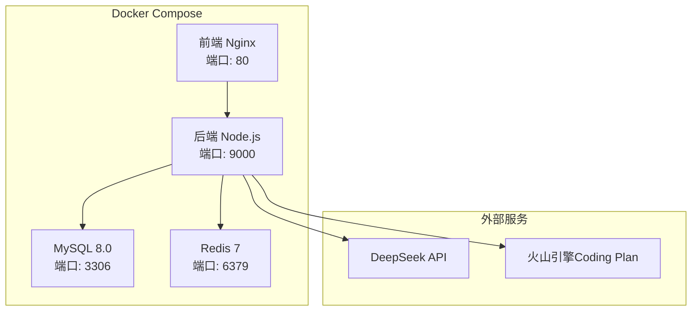

# AITestCraft AI测试用例生成助手 - 生产环境部署指南

## 版本信息
- **版本**: 2.0
- **更新日期**: 2026-04-30
- **主要特性**: 支持多LLM Provider（DeepSeek + 火山引擎Coding Plan）

## 系统架构



## 部署要求

### 硬件要求
| 组件 | 最低配置 | 推荐配置 |
|------|---------|---------|
| CPU | 2核 | 4核 |
| 内存 | 4GB | 8GB |
| 磁盘 | 20GB | 50GB SSD |
| 网络 | 10Mbps | 100Mbps |

### 软件要求
- Docker Engine >= 20.10
- Docker Compose >= 2.0
- Linux/macOS/Windows (WSL2)

## 部署步骤

### 1. 准备环境

```bash
# 克隆代码仓库
git clone <repository-url>
cd AITestCraft-Tech-style

# 确保脚本可执行
chmod +x deploy.sh
```

### 2. 配置环境变量

```bash
# 复制环境变量模板
cp .env.prod.example .env.docker

# 编辑 .env.docker 文件，配置以下必需项：
# - MySQL密码
# - 至少一个LLM Provider的API密钥
# - 前端访问地址
vi .env.docker
```

#### 关键配置项说明

**MySQL配置（必需）**
```env
MYSQL_ROOT_PASSWORD=your_secure_root_password
MYSQL_DATABASE=aitestcraft
MYSQL_USER=aitestcraft
MYSQL_PASSWORD=your_secure_password
```

**LLM Provider选择（必需）**
```env
# 可选值: deepseek | volcano-coding
LLM_PROVIDER=deepseek
```

**DeepSeek配置（使用DeepSeek时必需）**
```env
DEEPSEEK_API_KEY=sk-your-api-key
DEEPSEEK_API_URL=https://api.deepseek.com/v1
```

**火山引擎配置（使用火山引擎时必需）**
```env
VOLCANO_API_KEY=your-volcano-api-key
VOLCANO_BASE_URL=https://ark.cn-beijing.volces.com/api/coding/v3
VOLCANO_MODEL=ark-code-latest
```

**前端访问配置（必需）**
```env
# 部署后用户访问的地址
FRONTEND_URL=http://your-server-ip-or-domain

# 后端API地址（用于前端构建时注入）
VITE_API_URL=http://your-server-ip-or-domain:9000
VITE_SOCKET_URL=http://your-server-ip-or-domain:9000
```

### 3. 执行部署

```bash
# 完整部署（构建镜像 + 启动服务 + 数据库迁移）
./deploy.sh deploy

# 或分步执行
./deploy.sh start    # 仅启动服务
./deploy.sh migrate  # 执行数据库迁移
```

### 4. 验证部署

```bash
# 查看服务状态
./deploy.sh status

# 查看日志
./deploy.sh logs

# 测试健康检查端点
curl http://localhost:9000/health
```

## 服务管理

### 常用命令

```bash
# 查看服务状态
./deploy.sh status

# 查看日志
./deploy.sh logs

# 重启服务
./deploy.sh restart

# 停止服务
./deploy.sh stop

# 更新部署
./deploy.sh update
```

### Docker Compose直接操作

```bash
# 启动服务
docker-compose -f docker-compose.prod.yml --env-file .env.docker up -d

# 停止服务
docker-compose -f docker-compose.prod.yml --env-file .env.docker down

# 查看日志
docker-compose -f docker-compose.prod.yml --env-file .env.docker logs -f backend

# 重启单个服务
docker-compose -f docker-compose.prod.yml --env-file .env.docker restart backend
```

## 配置切换LLM Provider

### 方法一：通过环境变量（重启生效）

1. 编辑 `.env.docker` 文件
2. 修改 `LLM_PROVIDER` 值
3. 确保对应的API密钥已配置
4. 重启服务：`./deploy.sh restart`

### 方法二：通过管理界面（即时生效）

1. 访问前端管理页面：`http://your-server-ip/admin/llm-config`
2. 选择要使用的Provider
3. 配置对应的API密钥
4. 保存配置（无需重启服务）

## 故障排查

### 服务无法启动

```bash
# 检查容器状态
docker-compose -f docker-compose.prod.yml ps

# 查看具体错误日志
docker-compose -f docker-compose.prod.yml logs backend
```

### 数据库连接失败

1. 检查MySQL容器是否健康：`docker-compose ps`
2. 检查数据库密码是否正确
3. 检查数据库是否已初始化

### LLM API调用失败

1. 检查API密钥是否正确配置
2. 检查网络是否能访问外部API
3. 查看后端日志中的错误信息

### Redis连接失败

1. Redis会自动降级到内存存储
2. 检查Redis容器状态：`docker-compose ps`
3. 如需使用Redis，确保REDIS_URL配置正确

## 安全建议

1. **修改默认密码**: 所有默认密码必须在生产环境中修改
2. **API密钥管理**: 使用环境变量或Docker Secrets管理API密钥
3. **HTTPS配置**: 生产环境建议使用HTTPS
4. **防火墙配置**: 仅开放必要的端口（80, 9000）
5. **定期备份**: 定期备份MySQL数据和上传文件

## 升级指南

### 从v1.x升级到v2.0

1. 备份现有数据
2. 更新代码仓库
3. 更新 `.env.docker` 文件（新增LLM Provider配置）
4. 重新部署：`./deploy.sh deploy`
5. 验证服务正常运行

### 数据库迁移

```bash
# 自动迁移（部署脚本已包含）
./deploy.sh migrate

# 手动迁移
docker-compose -f docker-compose.prod.yml exec backend npx prisma migrate deploy
```

## 性能优化

### Redis配置
- 默认内存限制：256MB
- 持久化策略：AOF
- 内存淘汰策略：allkeys-lru

### 后端配置
- 批处理大小：根据Provider调整（DeepSeek: 5, 火山引擎: 10）
- 超时时间：120秒
- 重试次数：3次

## 监控与日志

### 日志位置
- 后端日志：`docker-compose logs -f backend`
- 系统日志：`./logs/` 目录（容器内）

### 健康检查端点
- 后端健康检查：`GET http://localhost:9000/health`
- 前端健康检查：`GET http://localhost/`

## 联系与支持

如有问题，请查看：
1. 项目文档：`docs/` 目录
2. 后端日志：`./deploy.sh logs`
3. 提交Issue到项目仓库
