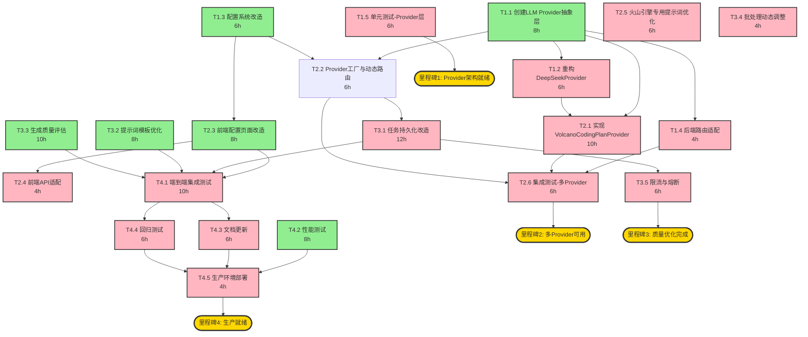

# 任务拆解与并行开发策略

## 一、任务依赖关系图



## 二、并行任务分组

### 2.1 最大并行组识别

根据依赖关系分析，以下任务组可以**完全并行**执行：

#### 🔵 Group A: 阶段1并行组 (Week 1, Day 1-3)
```
并行任务:
├── T1.1 [创建LLM Provider抽象层] ──────────────┐
├── T1.3 [配置系统改造] ────────────────────────┤ 3个任务完全并行
└── (T1.2等待T1.1完成后开始) ───────────────────┘

关键路径: T1.1 → T1.2 (14h)
并行节省: max(8, 6) = 8h (T1.3与T1.1并行)
```

#### 🔵 Group B: 阶段2并行组 (Week 2, Day 1-3)
```
并行任务:
├── T2.1 [实现VolcanoCodingPlanProvider] ───────┐
├── T2.2 [Provider工厂与动态路由] ──────────────┤ 3个任务完全并行
└── T2.3 [前端配置页面改造] ────────────────────┘

关键路径: T2.1 (10h)
并行节省: 10h (3个任务同时完成)
```

#### 🔵 Group C: 阶段3并行组 (Week 3, Day 1-3)
```
并行任务:
├── T3.1 [任务持久化改造] ──────────────────────┐
├── T3.2 [提示词模板优化] ──────────────────────┤ 3个任务完全并行
└── T3.3 [生成质量评估] ────────────────────────┘

关键路径: T3.1 (12h)
并行节省: max(10, 8) = 10h
```

#### 🔵 Group D: 阶段4并行组 (Week 4, Day 1-2)
```
并行任务:
├── T4.1 [端到端集成测试] ──────────────────────┐
└── T4.2 [性能测试] ────────────────────────────┘ 2个任务完全并行

关键路径: T4.1 (10h)
并行节省: 8h
```

### 2.2 并行效率分析

| 阶段 | 串行工时 | 并行工时 | 节省工时 | 效率提升 |
|------|----------|----------|----------|----------|
| 阶段1 | 30h | 22h | 8h | 27% |
| 阶段2 | 40h | 28h | 12h | 30% |
| 阶段3 | 40h | 30h | 10h | 25% |
| 阶段4 | 34h | 26h | 8h | 24% |
| **总计** | **144h** | **106h** | **38h** | **26%** |

> 注: 假设理想并行条件（人员充足、无阻塞）

## 三、团队分工方案

### 3.1 方案A: 2人团队 (推荐)

**人员配置**
- 后端工程师 (1人): 负责所有后端改造
- 前端工程师 (1人): 负责所有前端改造 + 测试

**任务分配**

| 周次 | 后端工程师 | 前端工程师 |
|------|-----------|-----------|
| Week 1 | T1.1, T1.2, T1.4, T1.5 | T1.3 (配置理解) + 技术预研 |
| Week 2 | T2.1, T2.2, T2.5 | T2.3, T2.4 |
| Week 3 | T3.1, T3.4, T3.5 | T3.2, T3.3 |
| Week 4 | T4.2, T4.4, T4.5 | T4.1, T4.3 |

**并行策略**
- Week 1: 后端T1.1与T1.3可并行（但2人团队需串行）
- Week 2: 后端T2.1与前端T2.3完全并行 ✅
- Week 3: 后端T3.1与前端T3.2/T3.3完全并行 ✅
- Week 4: 后端T4.2与前端T4.1完全并行 ✅

**总工期**: 4周（无法压缩，受限于人力）

### 3.2 方案B: 3人团队

**人员配置**
- 后端架构师 (1人): Provider架构 + 核心实现
- 后端工程师 (1人): 业务逻辑 + 优化
- 前端工程师 (1人): 前端改造 + 测试

**任务分配**

| 周次 | 后端架构师 | 后端工程师 | 前端工程师 |
|------|-----------|-----------|-----------|
| Week 1 | T1.1, T1.2 | T1.3 | 技术预研 |
| Week 2 | T2.1, T2.2 | T2.5 | T2.3, T2.4 |
| Week 3 | T3.1 | T3.4, T3.5 | T3.2, T3.3 |
| Week 4 | T4.2 | T4.4, T4.5 | T4.1, T4.3 |

**并行策略**
- Week 1: T1.1/T1.2与T1.3并行 ✅
- Week 2: T2.1/T2.2与T2.3/T2.4/T2.5并行 ✅
- Week 3: T3.1与T3.2/T3.3/T3.4/T3.5并行 ✅
- Week 4: T4.2与T4.1/T4.3/T4.4/T4.5并行 ✅

**总工期**: 3周（第4周为缓冲和优化）

### 3.3 方案C: 1人团队

**任务串行执行**

| 周次 | 任务 |
|------|------|
| Week 1 | T1.1 → T1.2 → T1.3 → T1.4 |
| Week 2 | T1.5 → T2.1 → T2.2 |
| Week 3 | T2.3 → T2.4 → T2.5 → T2.6 |
| Week 4 | T3.1 → T3.2 → T3.3 |
| Week 5 | T3.4 → T3.5 → T4.1 → T4.2 |
| Week 6 | T4.3 → T4.4 → T4.5 |

**总工期**: 6周

## 四、关键路径分析

### 4.1 关键路径识别

```
关键路径（决定总工期的最长路径）:

T1.1(8h) → T1.2(6h) → T2.1(10h) → T2.6(6h) → T3.1(12h) → T3.5(6h) → T4.1(10h) → T4.5(4h)

总关键路径长度: 8 + 6 + 10 + 6 + 12 + 6 + 10 + 4 = 62h ≈ 8个工作日
```

### 4.2 浮动时间分析

| 任务 | 最早开始 | 最晚开始 | 浮动时间 | 是否在关键路径 |
|------|----------|----------|----------|----------------|
| T1.1 | Day 1 | Day 1 | 0h | ✅ |
| T1.2 | Day 2 | Day 2 | 0h | ✅ |
| T1.3 | Day 1 | Day 2 | 8h | ❌ |
| T1.4 | Day 3 | Day 3 | 0h | ✅ |
| T1.5 | Day 4 | Day 5 | 8h | ❌ |
| T2.1 | Day 4 | Day 4 | 0h | ✅ |
| T2.2 | Day 4 | Day 5 | 10h | ❌ |
| T2.3 | Day 4 | Day 6 | 16h | ❌ |
| T2.4 | Day 6 | Day 8 | 16h | ❌ |
| T2.5 | Day 7 | Day 9 | 16h | ❌ |
| T2.6 | Day 8 | Day 8 | 0h | ✅ |
| T3.1 | Day 10 | Day 10 | 0h | ✅ |
| T3.2 | Day 10 | Day 14 | 32h | ❌ |
| T3.3 | Day 10 | Day 13 | 24h | ❌ |
| T3.4 | Day 13 | Day 16 | 24h | ❌ |
| T3.5 | Day 14 | Day 14 | 0h | ✅ |
| T4.1 | Day 16 | Day 16 | 0h | ✅ |
| T4.2 | Day 16 | Day 18 | 16h | ❌ |
| T4.3 | Day 19 | Day 19 | 0h | ✅ |
| T4.4 | Day 19 | Day 19 | 0h | ✅ |
| T4.5 | Day 20 | Day 20 | 0h | ✅ |

## 五、风险任务识别

### 5.1 高风险任务

| 任务 | 风险 | 缓解措施 |
|------|------|----------|
| T2.1 火山引擎Provider | 火山引擎API实际行为可能与文档不符 | Week 1 末尾做POC验证 |
| T3.1 任务持久化 | 可能影响现有任务调度性能 | 保留内存缓存，Redis异步持久化 |
| T2.6 集成测试 | 多Provider切换可能有状态污染 | 每个Provider独立测试环境 |

### 5.2 建议的缓冲时间

| 阶段 | 计划工期 | 建议缓冲 | 总工期 |
|------|----------|----------|--------|
| 阶段1 | 5天 | 0天 | 5天 |
| 阶段2 | 5天 | 1天 | 6天 |
| 阶段3 | 5天 | 1天 | 6天 |
| 阶段4 | 5天 | 0天 | 5天 |
| **总计** | **20天** | **2天** | **22天** |

## 六、每日站立会议建议

### 6.1 会议模板

```
【昨日完成】
- 任务ID: 完成情况

【今日计划】
- 任务ID: 计划完成内容

【阻塞/风险】
- 问题描述: 需要的支持
```

### 6.2 关键检查点

| 检查点 | 时间 | 检查内容 |
|--------|------|----------|
| CP1 | Week 1 Day 3 | T1.1 Provider抽象层接口是否稳定 |
| CP2 | Week 1 Day 5 | DeepSeek功能在Provider架构下是否正常 |
| CP3 | Week 2 Day 2 | 火山引擎API POC验证结果 |
| CP4 | Week 2 Day 5 | 多Provider切换功能是否正常 |
| CP5 | Week 3 Day 5 | 任务持久化是否可靠 |
| CP6 | Week 4 Day 3 | 集成测试通过率 |

## 七、建议的实施顺序

### 推荐: 3人团队方案 (3周核心 + 1周缓冲)

```
Week 1 [基础架构改造]
├── Day 1-2: T1.1 (后端架构师) + T1.3 (后端工程师) 并行
├── Day 2-3: T1.2 (后端架构师, 依赖T1.1)
├── Day 4:   T1.4 (后端架构师) + T1.5 (后端工程师)
└── Day 5:   阶段1评审 + 问题修复

Week 2 [多模型支持]
├── Day 1-2: T2.1 (后端架构师) + T2.3 (前端工程师) 并行
├── Day 2-3: T2.2 (后端架构师) + T2.4 (前端工程师) 并行
├── Day 3-4: T2.5 (后端工程师)
└── Day 5:   T2.6 (全员) + 阶段2评审

Week 3 [质量与优化]
├── Day 1-2: T3.1 (后端架构师) + T3.2 (前端工程师) 并行
├── Day 2-3: T3.3 (前端工程师)
├── Day 3-4: T3.4 (后端工程师) + T3.5 (后端工程师)
└── Day 5:   阶段3评审

Week 4 [集成与验证]
├── Day 1-2: T4.1 (前端工程师) + T4.2 (后端架构师) 并行
├── Day 3:   T4.3 (前端工程师) + T4.4 (后端工程师)
├── Day 4:   问题修复
└── Day 5:   T4.5 (后端工程师) + 上线
```

### 备选: 2人团队方案 (4周)

如果只有2人，建议按人员分工并行，工期为4周。

### 备选: 1人团队方案 (6周)

如果只有1人，全部串行执行，工期为6周。
