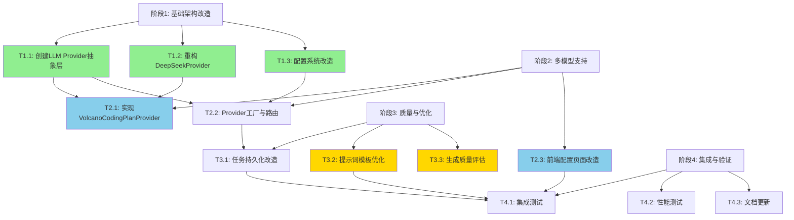

# AI测试用例生成助手重构与多模型支持 - 实施计划

## 项目信息

| 属性 | 内容 |
|------|------|
| 项目名称 | AI测试用例生成助手多模型支持改造 |
| 项目路径 | `d:\自动化测试平台\AITestCraft-Tech-style` |
| 计划版本 | v1.0 |
| 创建日期 | 2026-04-30 |
| 目标 | 1. 解决现有AI生成模块的架构缺陷 2. 支持火山引擎Coding Plan及多LLM Provider |

## 一、现状分析与问题清单

### 1.1 架构层面问题

| 编号 | 问题 | 严重程度 | 影响范围 | 当前位置 |
|------|------|----------|----------|----------|
| A1 | AI Provider硬编码，无抽象层 | 🔴 严重 | 整个AI生成模块 | `deepseekService.ts` |
| A2 | 配置管理混乱，API密钥硬编码 | 🔴 严重 | 安全+配置 | `config/index.ts:11` |
| A3 | 任务状态存储在内存Map中 | 🔴 严重 | 可靠性 | `testService.ts:10` |
| A4 | 前后端重复实现模板处理逻辑 | 🟡 中等 | 代码冗余 | `promptTemplate.ts` vs `deepseekService.ts` |
| A5 | 提示词模板散落在项目根目录 | 🟡 中等 | 可维护性 | `prompts/` 目录 |

### 1.2 功能层面问题

| 编号 | 问题 | 严重程度 | 影响范围 |
|------|------|----------|----------|
| F1 | 仅支持DeepSeek单一模型 | 🔴 严重 | 模型选择灵活性 |
| F2 | 批处理粒度固定为5条 | 🟡 中等 | 生成效率 |
| F3 | 无生成历史记录 | 🟡 中等 | 用户体验 |
| F4 | 缺乏生成质量评估机制 | 🟢 轻微 | 用例质量 |
| F5 | 无用户反馈闭环 | 🟢 轻微 | 持续优化 |

### 1.3 需要支持的新能力

| 编号 | 能力 | 说明 |
|------|------|------|
| N1 | 火山引擎Coding Plan | BaseURL: `https://ark.cn-beijing.volces.com/api/coding/v3` |
| N2 | 多Provider动态切换 | 运行时切换不同LLM服务 |
| N3 | 模型配置化管理 | 数据库驱动配置，无需重启 |
| N4 | OpenAI预留扩展 | 架构预留OpenAI Provider扩展能力 |

---

## 二、总体架构设计

### 2.1 目标架构

```
┌─────────────────────────────────────────────────────────────┐
│                        前端层 (React)                        │
│  ┌─────────────┐  ┌─────────────┐  ┌─────────────────────┐  │
│  │ 生成向导UI   │  │ LLM配置页面  │  │ 生成历史/质量评估    │  │
│  └──────┬──────┘  └──────┬──────┘  └─────────────────────┘  │
└─────────┼────────────────┼──────────────────────────────────┘
          │                │
          ▼                ▼
┌─────────────────────────────────────────────────────────────┐
│                      API 路由层 (Express)                    │
│  /api/test/generate-*  /api/admin/llm-config  /api/history  │
└─────────────────────────────────────────────────────────────┘
                              │
                              ▼
┌─────────────────────────────────────────────────────────────┐
│                     服务层 (Services)                        │
│  ┌─────────────┐  ┌─────────────┐  ┌─────────────────────┐  │
│  │ TestService │  │ PromptService│  │  TaskPersistence    │  │
│  │  (任务调度)  │  │ (提示词管理) │  │   (任务持久化)       │  │
│  └──────┬──────┘  └─────────────┘  └─────────────────────┘  │
│         │                                                    │
│         ▼                                                    │
│  ┌─────────────────────────────────────────────────────┐    │
│  │              LLM Provider 抽象层                     │    │
│  │  ┌────────────┐ ┌────────────┐ ┌────────────────┐   │    │
│  │  │  Provider  │ │  Provider  │ │    Provider    │   │    │
│  │  │  Factory   │ │  Registry  │ │    Router      │   │    │
│  │  └────────────┘ └────────────┘ └────────────────┘   │    │
│  │         │                                              │    │
│  │         ▼                                              │    │
│  │  ┌─────────────────────────────────────────────────┐  │    │
│  │  │         BaseLLMProvider (抽象基类)               │  │    │
│  │  │  - generateTestPoints()                         │  │    │
│  │  │  - generateTestCases()                          │  │    │
│  │  │  - makeRequest()                                │  │    │
│  │  │  - parseResponse()                              │  │    │
│  │  └─────────────────────────────────────────────────┘  │    │
│  │         ▲                    ▲                        │    │
│  │         │                    │                        │    │
│  │  ┌──────┴──────┐    ┌───────┴───────┐  ┌──────────┐  │    │
│  │  │ DeepSeek    │    │ VolcanoCoding │  │ OpenAI   │  │    │
│  │  │ Provider    │    │ PlanProvider  │  │ Provider │  │    │
│  │  │ (现有改造)   │    │   (新增)       │  │ (预留)   │  │    │
│  │  └─────────────┘    └───────────────┘  └──────────┘  │    │
│  └───────────────────────────────────────────────────────┘    │
└─────────────────────────────────────────────────────────────┘
                              │
              ┌───────────────┼───────────────┐
              ▼               ▼               ▼
        ┌─────────┐    ┌─────────┐    ┌─────────────┐
        │DeepSeek │    │ 火山引擎 │    │  其他模型    │
        │  API    │    │CodingPlan│    │   服务      │
        └─────────┘    └─────────┘    └─────────────┘
```

### 2.2 核心设计原则

1. **开闭原则**：新增Provider不修改现有代码
2. **配置驱动**：所有Provider参数通过数据库配置管理
3. **向后兼容**：现有DeepSeek功能不受影响
4. **渐进式改造**：分阶段实施，每阶段可独立交付

---

## 三、任务拆解与并行策略

### 3.1 任务全景图



### 3.2 详细任务清单

#### 🔷 阶段1: 基础架构改造（Week 1）

| 任务ID | 任务名称 | 描述 | 预估工时 | 依赖 | 可并行 |
|--------|----------|------|----------|------|--------|
| T1.1 | 创建LLM Provider抽象层 | 定义BaseLLMProvider抽象类、共享类型、Provider注册机制 | 8h | 无 | ✅ |
| T1.2 | 重构DeepSeekProvider | 将现有deepseekService.ts改造为符合抽象层的实现 | 6h | T1.1 | ✅ |
| T1.3 | 配置系统改造 | 扩展configService支持多Provider配置，新增配置项 | 6h | 无 | ✅ |
| T1.4 | 后端路由适配 | 修改test.ts路由，支持provider参数透传 | 4h | T1.1 | ⏳ |
| T1.5 | 单元测试-Provider层 | 为抽象层和DeepSeekProvider编写单元测试 | 6h | T1.2 | ⏳ |

**阶段1里程碑**: ✅ DeepSeek功能在Provider架构下正常运行

#### 🔷 阶段2: 多模型支持（Week 2）

| 任务ID | 任务名称 | 描述 | 预估工时 | 依赖 | 可并行 |
|--------|----------|------|----------|------|--------|
| T2.1 | 实现VolcanoCodingPlanProvider | 火山引擎Coding Plan接入实现 | 10h | T1.1, T1.2 | ✅ |
| T2.2 | Provider工厂与动态路由 | 实现ProviderFactory，运行时Provider切换 | 6h | T1.1, T1.3 | ✅ |
| T2.3 | 前端配置页面改造 | LLMConfigPage支持Provider选择、模型列表动态加载 | 8h | T1.3 | ✅ |
| T2.4 | 前端API适配 | api.ts增加provider/model参数 | 4h | T2.3 | ⏳ |
| T2.5 | 火山引擎专用提示词优化 | 针对代码模型优化提示词模板 | 6h | T2.1 | ⏳ |
| T2.6 | 集成测试-多Provider | 验证Provider切换功能 | 6h | T2.1, T2.2, T2.3 | ⏳ |

**阶段2里程碑**: ✅ 支持DeepSeek和火山引擎Coding Plan切换使用

#### 🔷 阶段3: 质量与优化（Week 3）

| 任务ID | 任务名称 | 描述 | 预估工时 | 依赖 | 可并行 |
|--------|----------|------|----------|------|--------|
| T3.1 | 任务持久化改造 | 将内存任务状态迁移到数据库/Redis | 12h | T2.2 | ✅ |
| T3.2 | 提示词模板优化 | 模板版本管理、A/B测试支持 | 8h | 无 | ✅ |
| T3.3 | 生成质量评估 | 质量评分算法、用户反馈收集 | 10h | 无 | ✅ |
| T3.4 | 批处理动态调整 | 根据Provider特性动态调整批大小 | 4h | T2.1 | ⏳ |
| T3.5 | 限流与熔断 | API调用限流、失败熔断机制 | 6h | T3.1 | ⏳ |

**阶段3里程碑**: ✅ 任务可靠持久化，生成质量可评估

#### 🔷 阶段4: 集成与验证（Week 4）

| 任务ID | 任务名称 | 描述 | 预估工时 | 依赖 | 可并行 |
|--------|----------|------|----------|------|--------|
| T4.1 | 端到端集成测试 | 完整流程测试（需求→测试点→用例→保存） | 10h | T2, T3 | ✅ |
| T4.2 | 性能测试 | 不同Provider生成速度对比、并发测试 | 8h | T2, T3 | ✅ |
| T4.3 | 文档更新 | README、API文档、部署文档更新 | 6h | T4.1 | ⏳ |
| T4.4 | 回归测试 | 确保现有功能不受影响 | 6h | T4.1 | ⏳ |
| T4.5 | 生产环境部署 | 配置迁移、监控配置 | 4h | T4.2, T4.3 | ⏳ |

**阶段4里程碑**: ✅ 生产环境稳定运行

---

## 四、并行开发策略

### 4.1 最大并行度分析

```
Week 1 (阶段1):
├── T1.1 [Provider抽象层] ───────┐
├── T1.2 [重构DeepSeek] ─────────┤  3个任务完全并行
├── T1.3 [配置系统改造] ─────────┘
│
Week 2 (阶段2):
├── T2.1 [VolcanoProvider] ──────┐
├── T2.2 [Provider工厂] ─────────┤  3个任务完全并行
├── T2.3 [前端配置页] ───────────┘
│
Week 3 (阶段3):
├── T3.1 [任务持久化] ───────────┐
├── T3.2 [提示词优化] ───────────┤  3个任务完全并行
├── T3.3 [质量评估] ─────────────┘
│
Week 4 (阶段4):
├── T4.1 [集成测试] ─────────────┐
└── T4.2 [性能测试] ─────────────┘  2个任务完全并行
```

### 4.2 推荐团队分工（假设2-3人）

**方案A: 2人团队**

| 人员 | 负责领域 | 并行任务 |
|------|----------|----------|
| 后端开发 | T1.1, T1.2, T1.3, T2.1, T2.2, T3.1, T3.4, T3.5 | Week1: T1.1+T1.3 并行，T1.2依赖T1.1 |
| 前端开发 | T2.3, T2.4, T3.2, T3.3, T4.3 | Week1: 可提前研究，Week2开始正式开发 |

**方案B: 3人团队**

| 人员 | 负责领域 | 并行任务 |
|------|----------|----------|
| 后端架构 | T1.1, T1.2, T2.1, T2.2, T3.1 | Provider核心架构 |
| 后端业务 | T1.3, T2.5, T3.2, T3.4, T3.5 | 配置+提示词+优化 |
| 前端开发 | T2.3, T2.4, T3.3, T4.1, T4.3 | 前端+测试+文档 |

### 4.3 分支策略

```
main (稳定分支)
  ├── feature/T1-provider-abstraction
  │     └── T1.1, T1.2, T1.4
  ├── feature/T1-config-refactor
  │     └── T1.3
  ├── feature/T2-volcano-provider
  │     └── T2.1, T2.5
  ├── feature/T2-provider-factory
  │     └── T2.2
  ├── feature/T2-frontend-config
  │     └── T2.3, T2.4
  ├── feature/T3-task-persistence
  │     └── T3.1
  ├── feature/T3-prompt-optimization
  │     └── T3.2
  └── feature/T3-quality-evaluation
        └── T3.3
```

---

## 五、关键决策点

### 5.1 技术决策

| 决策点 | 选项A | 选项B | 推荐 | 理由 |
|--------|-------|-------|------|------|
| 任务持久化存储 | Redis | 数据库(PostgreSQL) | **Redis** | 任务生命周期短，Redis性能更好 |
| Provider配置热更新 | 轮询数据库 | WebSocket推送 | **轮询+缓存** | 简单可靠，配置变更不频繁 |
| 提示词模板存储 | 文件系统 | 数据库 | **文件系统+缓存** | 便于版本管理，编辑方便 |
| 前端状态管理 | Context(现有) | Redux/Zustand | **保持Context** | 改造范围可控，避免过度设计 |

### 5.2 风险与应对

| 风险 | 概率 | 影响 | 应对策略 |
|------|------|------|----------|
| 火山引擎API兼容性问题 | 中 | 高 | 提前做POC验证，预留适配层 |
| 现有功能回归 | 高 | 高 | 每阶段完成必须跑通完整流程 |
| 配置迁移失败 | 低 | 中 | 保留环境变量作为fallback |
| 性能下降 | 中 | 中 | 增加Provider级别缓存 |

---

## 六、验收标准

### 6.1 功能验收

- [ ] DeepSeek生成测试点功能正常（向后兼容）
- [ ] DeepSeek生成测试用例功能正常（向后兼容）
- [ ] 火山引擎Coding Plan生成测试点功能正常
- [ ] 火山引擎Coding Plan生成测试用例功能正常
- [ ] 前端可动态切换Provider
- [ ] 配置保存后无需重启服务生效
- [ ] 任务状态可持久化，服务重启不丢失

### 6.2 性能验收

- [ ] 火山引擎Coding Plan生成速度不低于DeepSeek的80%
- [ ] 并发5个生成请求不报错
- [ ] 前端切换Provider响应时间 < 1s

### 6.3 代码质量验收

- [ ] Provider抽象层单元测试覆盖率 > 80%
- [ ] ESLint无错误
- [ ] TypeScript类型检查通过
- [ ] 新增代码符合现有代码风格

---

## 七、时间线

```
Week 1: [基础架构改造]
  Day 1-2: T1.1 (Provider抽象层)
  Day 2-3: T1.2 (重构DeepSeek) + T1.3 (配置改造)
  Day 4:   T1.4 (路由适配) + T1.5 (单元测试)
  Day 5:   阶段1评审 + 问题修复

Week 2: [多模型支持]
  Day 1-2: T2.1 (VolcanoProvider)
  Day 2-3: T2.2 (Provider工厂) + T2.3 (前端配置)
  Day 4:   T2.4 (前端API) + T2.5 (提示词优化)
  Day 5:   T2.6 (集成测试) + 阶段2评审

Week 3: [质量与优化]
  Day 1-2: T3.1 (任务持久化)
  Day 3:   T3.2 (提示词优化) + T3.3 (质量评估)
  Day 4:   T3.4 (批处理) + T3.5 (限流熔断)
  Day 5:   阶段3评审 + 问题修复

Week 4: [集成与验证]
  Day 1-2: T4.1 (集成测试) + T4.2 (性能测试)
  Day 3:   T4.3 (文档更新)
  Day 4:   T4.4 (回归测试) + 问题修复
  Day 5:   T4.5 (生产部署)
```

---

## 八、附录

### 8.1 相关文件清单

| 文件路径 | 说明 | 改造方式 |
|----------|------|----------|
| `backend/src/services/deepseekService.ts` | 现有AI服务 | 重构为DeepSeekProvider |
| `backend/src/services/testService.ts` | 任务调度 | 适配Provider抽象层 |
| `backend/src/routes/test.ts` | 测试路由 | 增加provider参数 |
| `backend/src/config/index.ts` | 配置 | 移除硬编码密钥 |
| `frontend/src/pages/admin/LLMConfigPage.tsx` | 配置页面 | 增加Provider选择 |
| `frontend/src/services/api.ts` | API封装 | 增加provider参数 |
| `prompts/*.md` | 提示词模板 | 优化+分类 |

### 8.2 新建文件清单

| 文件路径 | 说明 |
|----------|------|
| `backend/src/services/llm/baseProvider.ts` | Provider抽象基类 |
| `backend/src/services/llm/providerFactory.ts` | Provider工厂 |
| `backend/src/services/llm/types.ts` | 共享类型定义 |
| `backend/src/services/llm/deepseekProvider.ts` | DeepSeek实现 |
| `backend/src/services/llm/volcanoProvider.ts` | 火山引擎实现 |
| `backend/src/services/llm/openaiProvider.ts` | OpenAI Provider预留(阶段2后实现) |
| `backend/src/services/taskPersistenceService.ts` | 任务持久化 |
| `backend/src/services/promptService.ts` | 提示词服务 |

---

## 变更日志

| 版本 | 日期 | 变更内容 |
|------|------|----------|
| v1.0 | 2026-04-30 | 初始版本，完整实施计划 |
