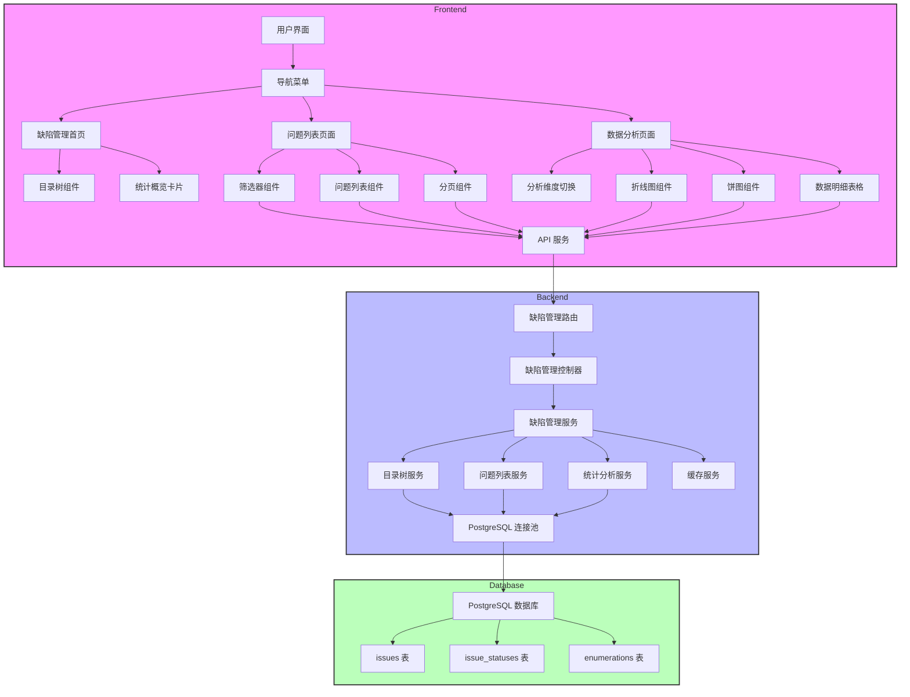
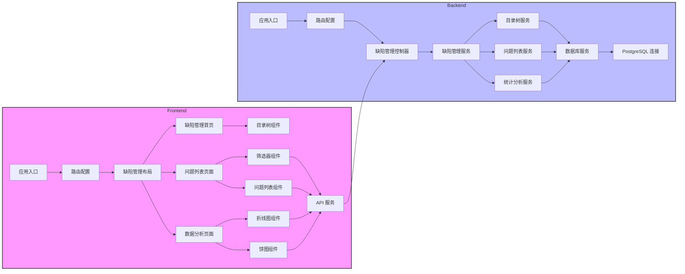
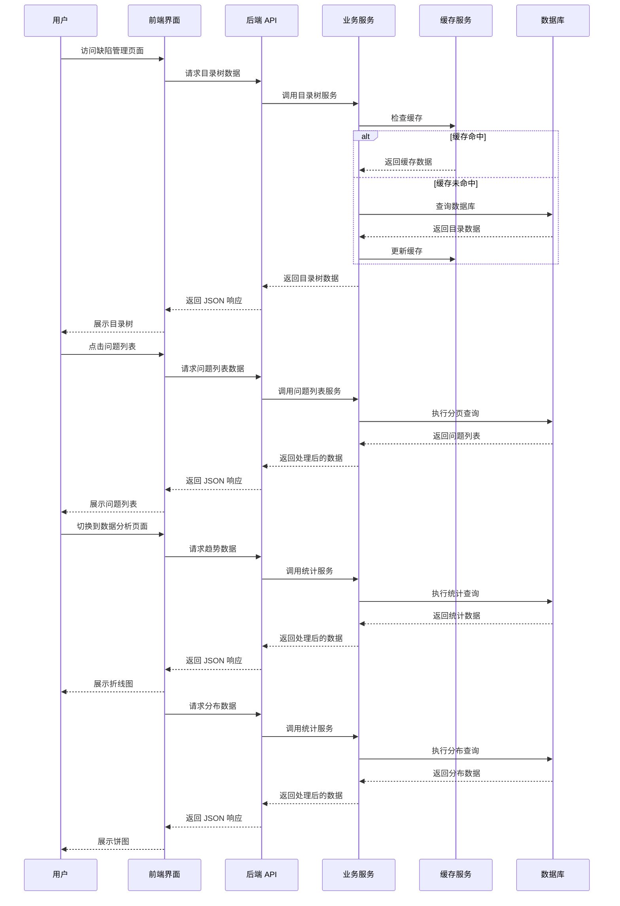

# 缺陷管理功能设计文档（更新版）

## 1. 整体架构图



## 2. 分层设计和核心组件

### 2.1 前端分层

| 层级 | 组件 | 职责 | 技术实现 |
|------|------|------|----------|
| 展示层 | 缺陷管理首页 | 展示目录树和统计概览 | React + TypeScript |
| 展示层 | 问题列表页面 | 展示问题清单，支持分页和筛选 | React + TypeScript |
| 展示层 | 数据分析页面 | 展示图表分析结果 | React + TypeScript |
| 组件层 | 目录树组件 | 展示树状目录结构，支持展开/折叠 | React 组件 + TypeScript |
| 组件层 | 问题列表组件 | 渲染问题列表，处理分页和排序 | React 组件 + TypeScript |
| 组件层 | 筛选器组件 | 提供多条件筛选功能 | React 组件 + TypeScript |
| 组件层 | 折线图组件 | 展示时间趋势分析 | Chart.js/ECharts |
| 组件层 | 饼图组件 | 展示分布分析 | Chart.js/ECharts |
| 服务层 | API 服务 | 与后端 API 通信 | Axios |
| 路由层 | 缺陷管理路由 | 处理页面导航 | React Router |

### 2.2 后端分层

| 层级 | 组件 | 职责 | 技术实现 |
|------|------|------|----------|
| 路由层 | 缺陷管理路由 | 处理 HTTP 请求 | Express 路由 |
| 控制层 | 缺陷管理控制器 | 处理业务逻辑，参数验证 | TypeScript 类 |
| 服务层 | 目录树服务 | 构建目录树结构 | TypeScript 类 |
| 服务层 | 问题列表服务 | 处理问题列表查询 | TypeScript 类 |
| 服务层 | 统计分析服务 | 处理统计数据计算 | TypeScript 类 |
| 数据访问层 | 数据库连接池 | 管理 PostgreSQL 连接 | pg 模块 |
| 缓存层 | 缓存服务 | 缓存频繁访问的数据 | 内存缓存 |

## 3. 模块依赖关系图



## 4. 接口契约定义

### 4.1 前端 API 调用

#### 4.1.1 获取目录树结构
- **URL**: `/api/defects/tree`
- **方法**: GET
- **响应**:
  ```json
  {
    "success": true,
    "data": {
      "id": 2980,
      "name": "缺陷管理",
      "children": [
        {
          "id": 2981,
          "name": "低代码&研发管理平台",
          "children": [
            { "id": 2989, "name": "低代码工具", "issueCount": 54 },
            { "id": 2990, "name": "研发管理平台", "issueCount": 0 },
            { "id": 3334, "name": "客户问题", "issueCount": 0 }
          ],
          "issueCount": 120
        },
        {
          "id": 2982,
          "name": "物联应用",
          "issueCount": 68
        },
        {
          "id": 2983,
          "name": "物联平台",
          "issueCount": 66
        },
        {
          "id": 2984,
          "name": "大数据平台",
          "issueCount": 60
        }
      ]
    }
  }
  ```

#### 4.1.2 获取缺陷列表
- **URL**: `/api/defects`
- **方法**: GET
- **参数**:
  - `page`: 页码（默认 1）
  - `pageSize`: 每页条数（默认 20）
  - `status_id`: 状态 ID（可选，多个用逗号分隔）
  - `priority_id`: 优先级 ID（可选，多个用逗号分隔）
  - `parent_id`: 父问题 ID（可选，用于筛选二级/三级目录）
  - `startDate`: 开始日期（可选，格式: YYYY-MM-DD）
  - `endDate`: 结束日期（可选，格式: YYYY-MM-DD）
- **响应**:
  ```json
  {
    "success": true,
    "data": {
      "list": [
        {
          "id": 69,
          "subject": "数据预处理",
          "description": null,
          "status_id": 1,
          "status_name": "新问题",
          "priority_id": 2,
          "priority_name": "一般问题",
          "author_id": 10,
          "created_on": "2024-10-12T09:55:00.592Z",
          "updated_on": "2024-10-24T08:28:23.447Z",
          "parent_id": null,
          "parent_subject": null,
          "project_id": 4
        }
      ],
      "total": 2800,
      "page": 1,
      "pageSize": 20
    }
  }
  ```

#### 4.1.3 项目汇总 - ALLOpen 趋势数据
- **URL**: `/api/defects/statistics/overview/trend?type=all`
- **方法**: GET
- **响应**:
  ```json
  {
    "success": true,
    "data": {
      "labels": ["2025-12-08", "2025-12-15", "2025-12-22", ...],
      "datasets": [
        {
          "label": "ALLOpen",
          "data": [15, 23, 18, 32, ...]
        },
        {
          "label": "ALLClose",
          "data": [5, 12, 20, 28, ...]
        }
      ]
    }
  }
  ```

#### 4.1.4 项目汇总 - 紧急 BUG 趋势数据
- **URL**: `/api/defects/statistics/overview/trend?type=urgent`
- **方法**: GET
- **响应**:
  ```json
  {
    "success": true,
    "data": {
      "labels": ["2025-12-08", "2025-12-15", "2025-12-22", ...],
      "datasets": [
        {
          "label": "打开",
          "data": [3, 5, 8, 12, ...]
        },
        {
          "label": "关闭",
          "data": [1, 3, 6, 10, ...]
        }
      ]
    }
  }
  ```

#### 4.1.5 项目汇总 - 系统分布饼图数据
- **URL**: `/api/defects/statistics/overview/pie/system`
- **方法**: GET
- **响应**:
  ```json
  {
    "success": true,
    "data": [
      { "name": "低代码&研发管理平台", "value": 120 },
      { "name": "物联应用", "value": 68 },
      { "name": "物联平台", "value": 66 },
      { "name": "大数据平台", "value": 60 }
    ]
  }
  ```

#### 4.1.6 项目汇总 - 紧急问题系统分布饼图数据
- **URL**: `/api/defects/statistics/overview/pie/emergency`
- **方法**: GET
- **响应**:
  ```json
  {
    "success": true,
    "data": [
      { "name": "低代码&研发管理平台", "value": 45 },
      { "name": "物联应用", "value": 23 },
      { "name": "物联平台", "value": 18 },
      { "name": "大数据平台", "value": 15 }
    ]
  }
  ```

#### 4.1.7 项目汇总 - 优先级分布饼图数据
- **URL**: `/api/defects/statistics/overview/pie/priority`
- **方法**: GET
- **响应**:
  ```json
  {
    "success": true,
    "data": [
      { "name": "紧急问题", "value": 101 },
      { "name": "一般问题", "value": 213 }
    ]
  }
  ```

#### 4.1.8 各系统统计 - 趋势数据
- **URL**: `/api/defects/statistics/system/2981/trend?type=all`
- **方法**: GET
- **参数**:
  - `systemId`: 系统 ID（二级目录 ID）
  - `type`: 趋势类型（all/urgent）
- **响应**: 同 4.1.3

#### 4.1.9 各系统统计 - 优先级分布饼图数据
- **URL**: `/api/defects/statistics/system/2981/pie/priority`
- **方法**: GET
- **响应**: 同 4.1.7

### 4.2 后端接口实现

#### 4.2.1 目录 ID 常量定义
```typescript
// 目录 ID 定义
export const DIRECTORY_IDS = {
  ROOT: 2980,
  SECONDARY: {
    LOW_CODE_RD: 2981,
    IOT_APP: 2982,
    IOT_PLATFORM: 2983,
    BIG_DATA: 2984,
  },
  TERTIARY: {
    LOW_CODE_TOOLS: 2989,
    RD_MANAGEMENT: 2990,
    CUSTOMER_ISSUES: 3334,
  }
};

// 系统名称映射
export const SYSTEM_NAMES: Record<number, string> = {
  2981: '低代码&研发管理平台',
  2982: '物联应用',
  2983: '物联平台',
  2984: '大数据平台',
};

// 排除的目录 ID 列表
export const EXCLUDED_IDS = [
  2981, 2982, 2983, 2984, // 二级目录
  2989, 2990, 3334         // 三级目录
];
```

#### 4.2.2 缺陷管理路由
- **文件**: `src/routes/defectRoutes.ts`
- **功能**: 定义缺陷管理相关的 API 路由

#### 4.2.3 缺陷管理控制器
- **文件**: `src/controllers/defectController.ts`
- **功能**: 处理缺陷管理相关的 HTTP 请求，调用缺陷管理服务

#### 4.2.4 缺陷管理服务
- **文件**: `src/services/defectService.ts`
- **功能**: 实现缺陷管理的核心业务逻辑，包括目录树构建、问题列表查询、统计分析等

## 5. 数据流向图



## 6. 异常处理策略

### 6.1 前端异常处理

| 异常类型 | 处理策略 | 展示方式 |
|----------|----------|----------|
| API 请求失败 | 重试机制 + 错误提示 | 错误消息弹窗 |
| 数据加载超时 | 超时提示 | 加载中状态 + 超时提示 |
| 图表渲染失败 | 错误边界 + 备用展示 | 错误信息 + 重试按钮 |
| 筛选条件无效 | 前端验证 + 提示 | 输入框错误提示 |
| 目录树加载失败 | 降级展示空目录 | 错误提示 + 重试按钮 |

### 6.2 后端异常处理

| 异常类型 | 处理策略 | 响应方式 |
|----------|----------|----------|
| 数据库连接失败 | 连接池重连 + 错误日志 | 503 Service Unavailable |
| SQL 查询错误 | 参数验证 + 错误日志 | 400 Bad Request |
| 缓存服务失败 | 降级到数据库查询 | 正常响应（性能可能下降） |
| 请求参数错误 | 参数验证 + 错误提示 | 400 Bad Request |
| 服务器内部错误 | 错误日志 + 友好提示 | 500 Internal Server Error |

## 7. 数据模型设计

### 7.1 前端数据模型

#### 目录树节点
```typescript
interface DefectTreeNode {
  id: number;
  name: string;
  issueCount?: number;
  children?: DefectTreeNode[];
  isExpanded?: boolean;
  isSelected?: boolean;
}
```

#### 缺陷列表项
```typescript
interface Defect {
  id: number;
  subject: string;
  description: string | null;
  status_id: number;
  status_name: string;
  priority_id: number;
  priority_name: string;
  author_id: number;
  created_on: string;
  updated_on: string;
  parent_id: number | null;
  parent_subject: string | null;
  project_id: number;
}
```

#### 趋势数据
```typescript
interface TrendData {
  labels: string[];
  datasets: TrendDataset[];
}

interface TrendDataset {
  label: string;
  data: number[];
}
```

#### 分布数据
```typescript
interface DistributionData {
  name: string;
  value: number;
}
```

### 7.2 后端数据模型

#### 数据库连接配置
```typescript
interface DatabaseConfig {
  host: string;
  port: number;
  user: string;
  password: string;
  database: string;
  max: number;
  idleTimeoutMillis: number;
}
```

#### 查询参数
```typescript
interface DefectQueryParams {
  page?: number;
  pageSize?: number;
  status_id?: string;
  priority_id?: string;
  parent_id?: number;
  startDate?: string;
  endDate?: string;
}
```

#### 统计查询参数
```typescript
interface StatisticsQueryParams {
  type?: 'all' | 'urgent';
  systemId?: number;
  days?: number;
}
```

## 8. SQL 查询设计

### 8.1 目录树查询
```sql
-- 获取目录树结构
WITH RECURSIVE tree AS (
  -- 根目录
  SELECT
    id,
    subject as name,
    NULL as parent_id,
    0 as level
  FROM issues
  WHERE id = 2980

  UNION ALL

  -- 二级目录
  SELECT
    i.id,
    i.subject as name,
    2980 as parent_id,
    1 as level
  FROM issues i
  WHERE i.project_id = 2980
  AND i.id IN (2981, 2982, 2983, 2984)

  UNION ALL

  -- 三级目录
  SELECT
    i.id,
    i.subject as name,
    2981 as parent_id,
    2 as level
  FROM issues i
  WHERE i.project_id = 2980
  AND i.id IN (2989, 2990, 3334)
)
SELECT * FROM tree;
```

### 8.2 问题列表查询（带父任务标题）
```sql
SELECT
  i.id,
  i.subject,
  i.description,
  i.status_id,
  COALESCE(ps.name, '未知') as status_name,
  i.priority_id,
  COALESCE(pp.name, '未知') as priority_name,
  i.author_id,
  i.created_on,
  i.updated_on,
  i.parent_id,
  p.subject as parent_subject,
  i.project_id
FROM issues i
LEFT JOIN issue_statuses ps ON i.status_id = ps.id
LEFT JOIN enumerations pp ON i.priority_id = pp.id
LEFT JOIN issues p ON i.parent_id = p.id
WHERE i.project_id = 2980
AND i.id NOT IN (2981, 2982, 2983, 2984, 2989, 2990, 3334)
AND i.id NOT IN (
  SELECT id FROM issues
  WHERE parent_id IN (2981, 2982, 2983, 2984, 2989, 2990, 3334)
)
AND (:status_id IS NULL OR i.status_id = ANY(:status_id))
AND (:priority_id IS NULL OR i.priority_id = ANY(:priority_id))
AND (:parent_id IS NULL OR i.parent_id = :parent_id)
AND (:startDate IS NULL OR i.created_on >= :startDate)
AND (:endDate IS NULL OR i.created_on <= :endDate)
ORDER BY i.created_on DESC
LIMIT :limit OFFSET :offset;
```

### 8.3 ALLOpen 趋势统计
```sql
SELECT
  TO_CHAR(DATE_TRUNC('week', created_on)::date, 'YYYY-MM-DD') as week_start,
  COUNT(*) as count
FROM issues
WHERE project_id = 2980
AND created_on >= '2025-12-08'
AND id NOT IN (2981, 2982, 2983, 2984, 2989, 2990, 3334)
GROUP BY DATE_TRUNC('week', created_on)::date
ORDER BY week_start;
```

### 8.4 ALLClose 趋势统计
```sql
SELECT
  TO_CHAR(DATE_TRUNC('week', updated_on)::date, 'YYYY-MM-DD') as week_start,
  COUNT(*) as count
FROM issues
WHERE project_id = 2980
AND updated_on >= '2025-12-08'
AND status_id = 5
AND id NOT IN (2981, 2982, 2983, 2984, 2989, 2990, 3334)
GROUP BY DATE_TRUNC('week', updated_on)::date
ORDER BY week_start;
```

### 8.5 紧急 BUG 趋势统计
```sql
-- 打开趋势
SELECT
  TO_CHAR(DATE_TRUNC('week', created_on)::date, 'YYYY-MM-DD') as week_start,
  COUNT(*) as count
FROM issues
WHERE project_id = 2980
AND created_on >= '2025-12-08'
AND priority_id = 4
AND id NOT IN (2981, 2982, 2983, 2984, 2989, 2990, 3334)
GROUP BY DATE_TRUNC('week', created_on)::date
ORDER BY week_start;

-- 关闭趋势
SELECT
  TO_CHAR(DATE_TRUNC('week', updated_on)::date, 'YYYY-MM-DD') as week_start,
  COUNT(*) as count
FROM issues
WHERE project_id = 2980
AND updated_on >= '2025-12-08'
AND priority_id = 4
AND status_id = 5
AND id NOT IN (2981, 2982, 2983, 2984, 2989, 2990, 3334)
GROUP BY DATE_TRUNC('week', updated_on)::date
ORDER BY week_start;
```

### 8.6 系统分布饼图数据
```sql
SELECT
  CASE
    WHEN parent_id = 2981 THEN '低代码&研发管理平台'
    WHEN parent_id = 2982 THEN '物联应用'
    WHEN parent_id = 2983 THEN '物联平台'
    WHEN parent_id = 2984 THEN '大数据平台'
    ELSE '其他'
  END as system_name,
  COUNT(*) as count
FROM issues
WHERE project_id = 2980
AND created_on >= '2025-12-08'
AND id NOT IN (2981, 2982, 2983, 2984, 2989, 2990, 3334)
GROUP BY
  CASE
    WHEN parent_id = 2981 THEN '低代码&研发管理平台'
    WHEN parent_id = 2982 THEN '物联应用'
    WHEN parent_id = 2983 THEN '物联平台'
    WHEN parent_id = 2984 THEN '大数据平台'
    ELSE '其他'
  END
ORDER BY count DESC;
```

### 8.7 优先级分布饼图数据
```sql
SELECT
  CASE
    WHEN priority_id = 4 THEN '紧急问题'
    ELSE '一般问题'
  END as priority_name,
  COUNT(*) as count
FROM issues
WHERE project_id = 2980
AND created_on >= '2025-12-08'
AND id NOT IN (2981, 2982, 2983, 2984, 2989, 2990, 3334)
GROUP BY
  CASE
    WHEN priority_id = 4 THEN '紧急问题'
    ELSE '一般问题'
  END;
```

## 9. 性能优化策略

### 9.1 前端优化

1. **数据分页**：
   - 实现服务器端分页，减少前端数据传输量
   - 使用虚拟滚动处理长列表

2. **缓存策略**：
   - 缓存 API 响应数据（目录树数据缓存 5 分钟）
   - 使用 React.memo 优化组件渲染

3. **图表优化**：
   - 大数据集图表懒加载
   - 图表数据预计算

4. **网络优化**：
   - 实现请求防抖和节流
   - 并发请求优化

### 9.2 后端优化

1. **数据库优化**：
   - 使用连接池管理数据库连接
   - 优化 SQL 查询，使用索引
   - 实现查询参数验证，防止 SQL 注入
   - 对经常查询的字段建立索引

2. **缓存优化**：
   - 缓存频繁访问的统计数据（缓存时间 5 分钟）
   - 缓存目录树结构（缓存时间 10 分钟）
   - 设置合理的缓存过期时间

3. **服务优化**：
   - 实现异步处理
   - 统计查询优化，避免全表扫描

4. **API 优化**：
   - 实现响应压缩
   - 使用适当的 HTTP 缓存头

## 10. 安全考虑

### 10.1 前端安全

1. **输入验证**：
   - 前端验证用户输入
   - 防止 XSS 攻击

2. **API 调用安全**：
   - 使用 HTTPS
   - 实现请求签名

3. **数据展示安全**：
   - 敏感数据脱敏
   - 防止数据泄露

### 10.2 后端安全

1. **数据库安全**：
   - 使用只读账号
   - 防止 SQL 注入（使用参数化查询）
   - 数据库密码使用环境变量管理

2. **API 安全**：
   - 实现请求速率限制
   - 验证请求参数
   - 防止 CSRF 攻击

3. **服务器安全**：
   - 错误日志不包含敏感信息
   - 实现适当的访问控制

## 11. 目录结构设计

### 11.1 后端目录结构
```
backend/src/
├── controllers/
│   └── defectController.ts
├── routes/
│   └── defectRoutes.ts
├── services/
│   ├── defectService.ts
│   ├── treeService.ts
│   ├── listService.ts
│   └── statisticsService.ts
├── utils/
│   └── database.ts
├── constants/
│   └── directory.ts
├── types/
│   └── defect.ts
└── index.ts
```

### 11.2 前端目录结构
```
frontend/src/
├── components/
│   └── defect/
│       ├── DefectTree.tsx
│       ├── DefectTable.tsx
│       ├── DefectFilter.tsx
│       ├── TrendChart.tsx
│       └── DistributionChart.tsx
├── pages/
│   └── defect/
│       ├── DefectHomePage.tsx
│       ├── DefectListPage.tsx
│       └── DefectAnalysisPage.tsx
├── services/
│   └── defectApi.ts
├── types/
│   └── defect.ts
├── routes/
│   └── index.tsx
└── App.tsx
```

## 12. 部署和集成方案

### 12.1 环境配置

**后端 .env 配置**：
```env
# PostgreSQL 数据库配置
POSTGRES_HOST=10.20.42.40
POSTGRES_PORT=25432
POSTGRES_USER=redmine_ro
POSTGRES_PASSWORD=readonly_pass
POSTGRES_DATABASE=redmine_production

# 缓存配置
CACHE_TTL=300
TREE_CACHE_TTL=600
```

### 12.2 部署策略

**后端部署**：
1. 集成到现有后端部署流程
2. 环境变量配置管理
3. 监控数据库连接状态

**前端部署**：
1. 集成到现有前端部署流程
2. 静态资源 CDN 加速
3. 路由配置更新

### 12.3 集成测试

**API 测试**：
1. 测试所有 API 端点
2. 验证响应格式和数据正确性
3. 验证异常处理

**前端测试**：
1. 测试页面加载和交互
2. 验证图表渲染和数据展示
3. 验证响应式设计

**端到端测试**：
1. 测试完整的用户流程
2. 验证系统集成的正确性
3. 验证性能指标

## 13. 监控和维护

### 13.1 监控指标

**前端监控**：
1. 页面加载时间
2. API 请求成功率
3. 图表渲染性能
4. 用户交互响应时间

**后端监控**：
1. API 响应时间
2. 数据库查询性能
3. 缓存命中率
4. 数据库连接池状态

### 13.2 日志管理

1. **日志级别**：
   - DEBUG: 调试信息
   - INFO: 常规操作
   - WARN: 警告信息
   - ERROR: 错误信息

2. **日志内容**：
   - 请求日志
   - 错误日志
   - 性能日志

### 13.3 维护策略

1. **定期任务**：
   - 检查数据库连接状态
   - 清理过期缓存
   - 监控磁盘空间

2. **更新策略**：
   - 依赖包更新
   - 安全补丁应用
   - 性能优化