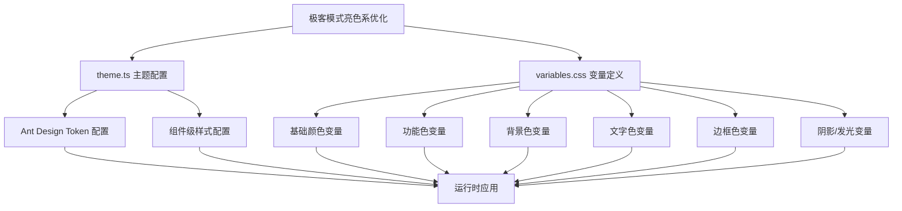
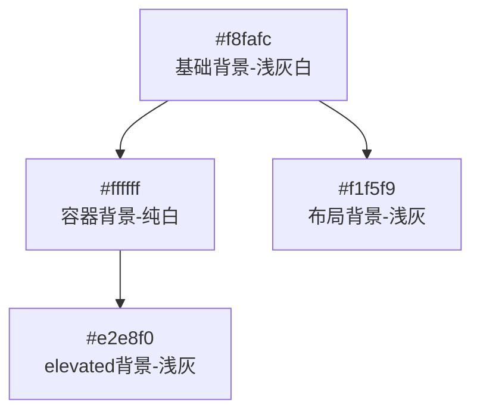
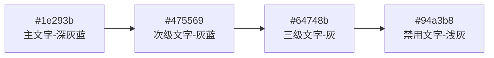
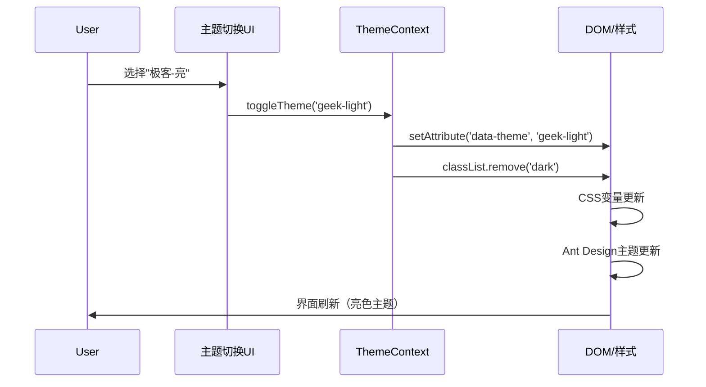
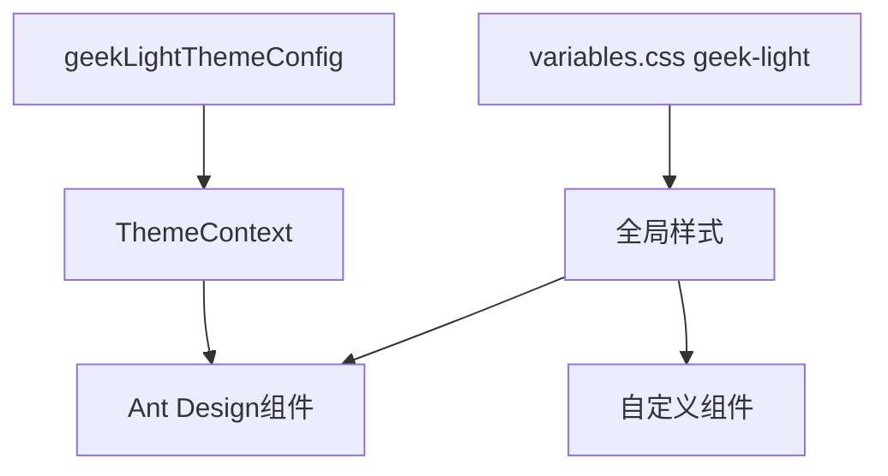

# 极客模式亮色系优化 - 架构设计文档（修订版）

## 整体架构



## 颜色系统架构

### 1. 主色调系统

```mermaid
graph LR
    Primary[#2563eb<br/>深蓝色主色] --> Hover[#3b82f6<br/>悬停色]
    Primary --> Active[#1d4ed8<br/>激活色]
    Primary --> Light[rgba(37,99,235,0.1)<br/>浅色背景]
    Primary --> Glow[rgba(37,99,235,0.15)<br/>柔和发光]
```

### 2. 背景色层次（真正的亮色）



### 3. 文字色层次（深色文字）



## 文件修改设计

### 1. theme.ts 修改方案

```typescript
// 新增：极客模式亮色系主题配置
export const geekLightThemeConfig: ThemeConfig = {
  token: {
    // 主色调 - 深蓝色（在亮色背景下协调）
    colorPrimary: '#2563eb',
    colorSuccess: '#059669',
    colorWarning: '#d97706',
    colorError: '#dc2626',
    colorInfo: '#2563eb',
    
    // 背景色 - 真正的亮色
    colorBgBase: '#f8fafc',
    colorBgContainer: '#ffffff',
    colorBgLayout: '#f1f5f9',
    colorBgElevated: '#e2e8f0',
    
    // 文字色 - 深色（在亮色背景上）
    colorTextBase: '#1e293b',
    colorTextSecondary: '#475569',
    colorTextTertiary: '#64748b',
    colorTextDisabled: '#94a3b8',
    
    // 边框色 - 浅灰
    colorBorder: '#cbd5e1',
    colorBorderSecondary: '#e2e8f0',
    
    // 阴影 - 柔和的发光效果
    boxShadow: '0 2px 8px rgba(37, 99, 235, 0.08)',
    boxShadowSecondary: '0 4px 12px rgba(37, 99, 235, 0.1)',
  },
  components: {
    // 组件级配置保持结构，调整颜色值
    Button: {
      borderRadius: 8,
      boxShadow: '0 0 10px rgba(37, 99, 235, 0.15)',
      primaryShadow: '0 0 15px rgba(37, 99, 235, 0.2)',
    },
    Card: {
      borderRadius: 12,
      boxShadow: '0 2px 12px rgba(37, 99, 235, 0.06), inset 0 0 0 1px rgba(37, 99, 235, 0.05)',
    },
    // ... 其他组件
  },
};
```

### 2. variables.css 修改方案

```css
/* 新增：极客模式亮色系变量 */
[data-theme="geek-light"] {
  /* 主色调 - 深蓝色 */
  --primary-color: #2563eb;
  --primary-hover: #3b82f6;
  --primary-active: #1d4ed8;
  --primary-light: rgba(37, 99, 235, 0.1);
  --primary-glow: rgba(37, 99, 235, 0.15);
  
  /* 功能色 */
  --success-color: #059669;
  --warning-color: #d97706;
  --error-color: #dc2626;
  --info-color: #2563eb;
  
  /* 中性色 - 深色文字 */
  --text-primary: #1e293b;
  --text-secondary: #475569;
  --text-tertiary: #64748b;
  --text-disabled: #94a3b8;
  --text-inverse: #f8fafc;
  
  /* 背景色 - 真正的亮色 */
  --bg-primary: #f8fafc;
  --bg-secondary: #f1f5f9;
  --bg-tertiary: #e2e8f0;
  --bg-container: #ffffff;
  --bg-elevated: #e2e8f0;
  
  /* 边框色 - 浅灰 */
  --border-color: #cbd5e1;
  --border-secondary: #e2e8f0;
  --border-glow: rgba(37, 99, 235, 0.15);
  
  /* 阴影 - 柔和发光 */
  --shadow-sm: 0 2px 8px rgba(37, 99, 235, 0.05);
  --shadow-md: 0 4px 12px rgba(37, 99, 235, 0.08);
  --shadow-lg: 0 8px 16px rgba(37, 99, 235, 0.1);
  --shadow-xl: 0 12px 24px rgba(37, 99, 235, 0.12);
  --shadow-glow: 0 0 20px rgba(37, 99, 235, 0.15);
  
  /* 状态色 */
  --hover-bg: rgba(37, 99, 235, 0.06);
  --selected-bg: rgba(37, 99, 235, 0.1);
  --disabled-bg: #f1f5f9;
  
  /* 交互色 */
  --focus-color: rgba(37, 99, 235, 0.15);
  --focus-shadow: 0 0 0 2px rgba(37, 99, 235, 0.15);
}
```

## 颜色映射关系

### 新旧颜色对照表

| 变量名 | 暗色主题 (dark) | 新亮色系 (geek-light) | 变化说明 |
|-------|----------------|---------------------|---------|
| `--primary-color` | `#00d4ff` | `#2563eb` | 天青→深蓝 |
| `--success-color` | `#00ff88` | `#059669` | 荧光绿→深翠绿 |
| `--warning-color` | `#ffcc00` | `#d97706` | 荧光黄→深琥珀 |
| `--error-color` | `#ff3366` | `#dc2626` | 荧光红→标准深红 |
| `--bg-primary` | `#0f172a` | `#f8fafc` | 暗→亮 |
| `--bg-container` | `#1e293b` | `#ffffff` | 暗→纯白 |
| `--text-primary` | `#f1f5f9` | `#1e293b` | 亮→暗 |
| `--shadow-md` | `rgba(0,212,255,0.15)` | `rgba(37,99,235,0.08)` | 降低强度 |

## 组件样式适配

### Ant Design 组件覆盖

所有 `.dark` 类名下的样式规则需要同步添加 `[data-theme="geek-light"]` 选择器，但使用新的亮色变量：

```css
/* 示例 */
.dark .ant-layout,
[data-theme="geek-light"] .ant-layout {
  background: var(--bg-primary);
}

.dark .ant-menu-item:hover,
[data-theme="geek-light"] .ant-menu-item:hover {
  color: var(--primary-color);
  border: 1px solid var(--primary-color);
  box-shadow: 0 0 8px var(--primary-glow);
}
```

### 自定义组件适配

使用 CSS 变量的组件将自动适配，无需修改代码。

## 主题切换机制

### 现有机制
当前通过 `data-theme` 属性和 `.dark` 类名切换主题。

### 新增机制
添加 `geek-light` 作为新的主题值：

```typescript
// 主题类型扩展
type ThemeType = 'light' | 'dark' | 'geek-light';

// 切换逻辑
const setTheme = (theme: ThemeType) => {
  document.documentElement.setAttribute('data-theme', theme);
  if (theme === 'dark') {
    document.body.classList.add('dark');
  } else {
    document.body.classList.remove('dark');
  }
};
```

**注意**: `geek-light` 主题不使用 `.dark` 类名，因为它使用深色文字在亮色背景上。

## 数据流向图



## 依赖关系



## 实现注意事项

1. **保持向后兼容**: 现有 `dark` 主题保持不变
2. **CSS 优先级**: 确保 `[data-theme="geek-light"]` 选择器优先级正确
3. **变量一致性**: theme.ts 和 variables.css 中的颜色值必须保持一致
4. **文字对比度**: 确保深色文字在亮色背景上有足够的对比度
5. **发光效果**: 在亮色背景下，发光效果应该更加柔和

## 文件变更清单

| 文件 | 变更类型 | 变更内容 |
|-----|---------|---------|
| `theme.ts` | 新增 | 添加 `geekLightThemeConfig` 配置 |
| `variables.css` | 新增 | 添加 `[data-theme="geek-light"]` 变量定义 |
| `ThemeContext.tsx` | 修改 | 扩展主题类型，支持 `geek-light`，不添加 `.dark` 类 |

## 视觉预览描述

### 极客亮色系效果预览

- **整体感觉**: 清爽明亮的科技感界面
- **背景**: 浅灰白渐变，类似现代 IDE 的亮色主题
- **主色**: 深蓝色按钮和高亮，专业稳重
- **发光**: 柔和的蓝色光晕，不刺眼
- **文字**: 深色文字，清晰易读
- **对比**: 与暗色极客模式形成鲜明对比，但保持一致的科技风格
