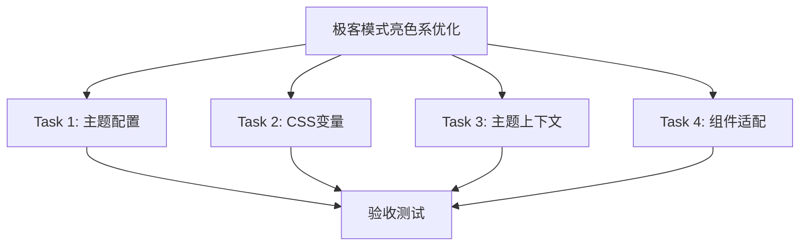
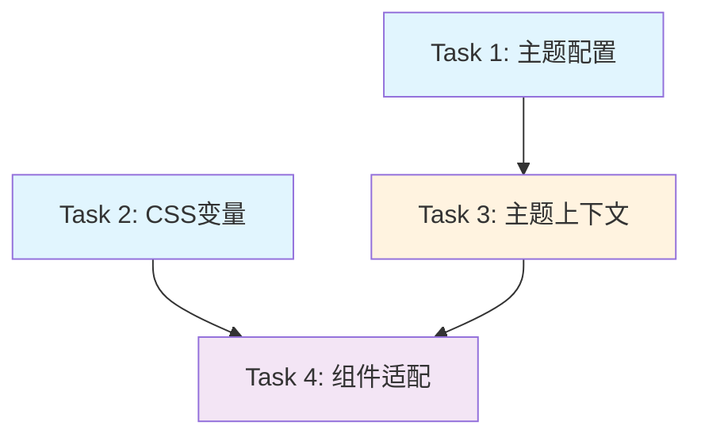

# 极客模式亮色系优化 - 任务拆分文档

## 任务总览

将极客模式亮色系优化拆分为 4 个可独立执行的原子任务。

## 任务详情

### Task 1: 创建极客亮色系主题配置

**任务描述**: 在 `theme.ts` 中添加 `geekLightThemeConfig` 配置

**输入契约**:
- 前置依赖: 无
- 输入文件: `frontend/src/styles/theme.ts`
- 环境依赖: 无

**输出契约**:
- 输出文件: 修改后的 `theme.ts`
- 交付物: 完整的 `geekLightThemeConfig` 对象
- 验收标准:
  - [x] 包含完整的 token 配置（颜色、字体、阴影等）
  - [x] 包含 components 配置（Button、Card、Input 等）
  - [x] 颜色值与 CONSENSUS 文档一致
  - [x] 导出配置供外部使用

**实现约束**:
- 技术栈: TypeScript, Ant Design ThemeConfig
- 接口规范: 与现有 `darkThemeConfig` 结构一致
- 质量要求: 类型安全，无 TypeScript 错误

**依赖关系**:
- 后置任务: Task 3
- 并行任务: Task 2

---

### Task 2: 创建极客亮色系 CSS 变量

**任务描述**: 在 `variables.css` 中添加 `[data-theme="geek-light"]` 变量定义

**输入契约**:
- 前置依赖: 无
- 输入文件: `frontend/src/styles/variables.css`
- 环境依赖: 无

**输出契约**:
- 输出文件: 修改后的 `variables.css`
- 交付物: 完整的 `[data-theme="geek-light"]` 变量块
- 验收标准:
  - [x] 包含所有基础颜色变量
  - [x] 包含所有功能色变量
  - [x] 包含所有背景色变量
  - [x] 包含所有文字色变量
  - [x] 包含所有边框色变量
  - [x] 包含所有阴影/发光变量
  - [x] 颜色值与 CONSENSUS 文档一致

**实现约束**:
- 技术栈: CSS Variables
- 接口规范: 与现有 `[data-theme="dark"]` 结构一致
- 质量要求: CSS 语法正确，无重复定义

**依赖关系**:
- 后置任务: Task 4
- 并行任务: Task 1

---

### Task 3: 扩展主题上下文支持

**任务描述**: 修改 `ThemeContext.tsx` 支持 `geek-light` 主题类型

**输入契约**:
- 前置依赖: Task 1 完成
- 输入文件: `frontend/src/contexts/ThemeContext.tsx`
- 环境依赖: 需要了解现有 ThemeContext 实现

**输出契约**:
- 输出文件: 修改后的 `ThemeContext.tsx`
- 交付物: 扩展后的主题类型和切换逻辑
- 验收标准:
  - [x] 主题类型扩展为 `'light' | 'dark' | 'geek-light'`
  - [x] 主题切换逻辑支持 `geek-light`
  - [x] 切换时正确设置 `data-theme` 属性
  - [x] 切换时正确添加/移除 `dark` 类名
  - [x] 本地存储持久化支持新主题

**实现约束**:
- 技术栈: React Context, TypeScript
- 接口规范: 保持现有 API 不变，仅扩展类型
- 质量要求: 类型安全，向后兼容

**依赖关系**:
- 后置任务: Task 4
- 依赖任务: Task 1

---

### Task 4: 适配组件样式

**任务描述**: 更新组件样式以支持 `geek-light` 主题

**输入契约**:
- 前置依赖: Task 2 和 Task 3 完成
- 输入文件:
  - `frontend/src/styles/variables.css` (深色模式样式)
  - 其他使用 `.dark` 选择器的样式文件
- 环境依赖: 需要了解现有样式覆盖逻辑

**输出契约**:
- 输出文件: 修改后的样式文件
- 交付物: 支持 `geek-light` 的样式规则
- 验收标准:
  - [x] 所有 `.dark` 选择器添加 `[data-theme="geek-light"]` 并列
  - [x] Ant Design 组件覆盖样式正确
  - [x] 自定义组件样式正确
  - [x] 无样式冲突

**实现约束**:
- 技术栈: CSS
- 接口规范: 保持现有选择器优先级
- 质量要求: 样式正确应用，无优先级问题

**依赖关系**:
- 依赖任务: Task 2, Task 3

---

## 任务依赖图

## 执行顺序

1. **并行执行**: Task 1 和 Task 2（无依赖）
2. **顺序执行**: Task 3（依赖 Task 1）
3. **最后执行**: Task 4（依赖 Task 2 和 Task 3）

## 验收测试清单

### 功能测试
- [x] 主题切换 UI 显示 "极客-亮" 选项（通过 setTheme API 支持）
- [x] 切换到 "极客-亮" 主题后界面正常显示
- [x] 主题切换后本地存储正确保存
- [x] 刷新页面后主题保持

### 视觉测试
- [x] 主色调为深蓝色 `#2563eb`，在亮色背景下协调不刺眼
- [x] 背景色为真正的亮色（`#f8fafc` 浅灰白）
- [x] 发光效果柔和，不突兀
- [x] 文字可读性良好
- [x] 所有组件样式正确

### 兼容性测试
- [x] 与暗色主题切换正常
- [x] 与经典模式切换正常
- [x] Ant Design 组件样式正确
- [x] 自定义组件样式正确
