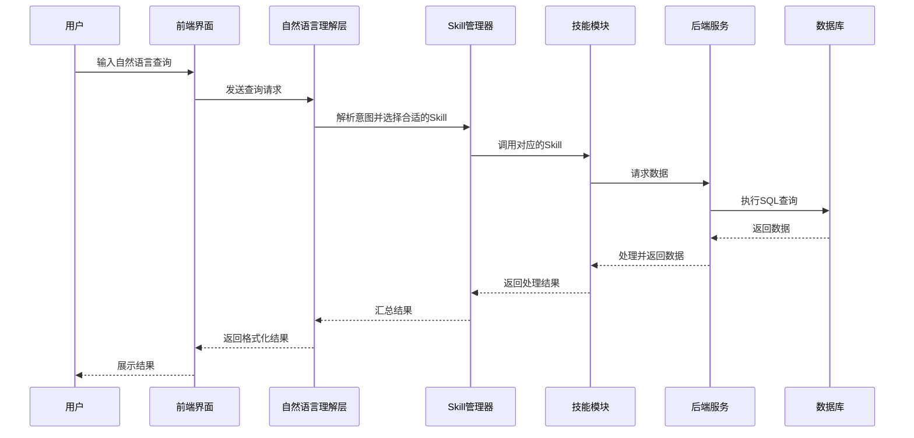

# 智能问数功能设计文档

## 1. 整体架构设计

### 1.1 系统架构图



### 1.2 核心组件

1. **前端界面**：智能问数聊天界面，支持用户输入自然语言查询，展示查询结果和图表
2. **自然语言理解层**：负责解析用户意图，提取实体，选择合适的Skill
3. **Skill管理器**：管理所有Skill的注册、调用和结果处理
4. **Skill模块**：可复用的功能模块，每个Skill负责特定领域的任务
5. **后端服务**：提供数据查询、统计分析等API
6. **数据库**：存储缺陷管理相关数据

## 2. Skill设计

### 2.1 Skill列表

| Skill名称 | 功能描述 | 输入参数 | 输出结果 |
|---------|---------|---------|---------|
| DefectListSkill | 获取缺陷列表 | systemId, statusId, priorityId, startDate, endDate | 缺陷列表数据 |
| DefectAnalysisSkill | 缺陷数据分析 | systemId, analysisType, timeRange | 分析结果和图表数据 |
| TodoListSkill | 获取待办列表 | assigneeId, statusId, priorityId | 待办列表数据 |
| NotificationSkill | 消息推送管理 | recipientId, messageType, content | 推送结果 |
| DocumentGeneratorSkill | 文档生成 | documentType, data, format | 生成的文档URL |
| DataExportSkill | 数据导出 | data, format | 导出文件URL |

### 2.2 Skill接口设计

```typescript
interface Skill {
  // Skill名称
  name: string;
  // Skill描述
  description: string;
  // 支持的意图
  supportedIntents: string[];
  // 执行方法
  execute(params: Record<string, any>): Promise<SkillResult>;
  // 验证参数
  validateParams(params: Record<string, any>): boolean;
}

interface SkillResult {
  // 执行状态
  success: boolean;
  // 结果数据
  data?: any;
  // 错误信息
  error?: string;
  // 结果类型
  resultType: 'list' | 'chart' | 'document' | 'export' | 'message';
}
```

## 3. 详细设计

### 3.1 DefectListSkill

**功能**：根据用户指定的条件查询缺陷列表

**输入参数**：
- systemId: 系统ID
- statusId: 状态ID
- priorityId: 优先级ID
- startDate: 开始日期
- endDate: 结束日期

**实现逻辑**：
1. 验证输入参数
2. 构建查询条件
3. 调用后端API获取缺陷列表
4. 格式化结果数据
5. 返回结果

**示例**：
```typescript
async execute(params: Record<string, any>): Promise<SkillResult> {
  const { systemId, statusId, priorityId, startDate, endDate } = params;
  
  // 构建查询参数
  const queryParams = {
    system_id: systemId,
    status_id: statusId,
    priority_id: priorityId,
    startDate,
    endDate,
    page: 1,
    pageSize: 100
  };
  
  // 调用后端API
  const response = await defectApi.getDefects(queryParams);
  
  if (response.success && response.data) {
    return {
      success: true,
      data: response.data.list,
      resultType: 'list'
    };
  } else {
    return {
      success: false,
      error: response.error || '获取缺陷列表失败',
      resultType: 'list'
    };
  }
}
```

### 3.2 DefectAnalysisSkill

**功能**：对缺陷数据进行分析，生成趋势图和分布图

**输入参数**：
- systemId: 系统ID
- analysisType: 分析类型（趋势分析、分布分析）
- timeRange: 时间范围

**实现逻辑**：
1. 验证输入参数
2. 根据分析类型选择不同的API
3. 调用后端API获取分析数据
4. 处理数据生成图表配置
5. 返回结果

### 3.3 TodoListSkill

**功能**：获取用户的待办任务列表

**输入参数**：
- assigneeId: 负责人ID
- statusId: 状态ID
- priorityId: 优先级ID

**实现逻辑**：
1. 验证输入参数
2. 构建查询条件
3. 调用后端API获取待办列表
4. 格式化结果数据
5. 返回结果

### 3.4 NotificationSkill

**功能**：管理消息推送，包括发送通知和配置推送规则

**输入参数**：
- recipientId: 接收人ID
- messageType: 消息类型
- content: 消息内容

**实现逻辑**：
1. 验证输入参数
2. 调用后端API发送通知
3. 返回推送结果

### 3.5 DocumentGeneratorSkill

**功能**：根据数据生成文档，支持PPT和Word格式

**输入参数**：
- documentType: 文档类型
- data: 文档数据
- format: 文档格式

**实现逻辑**：
1. 验证输入参数
2. 根据文档类型和格式选择模板
3. 填充数据生成文档
4. 上传文档到服务器
5. 返回文档URL

### 3.6 DataExportSkill

**功能**：导出数据为Excel、CSV等格式

**输入参数**：
- data: 要导出的数据
- format: 导出格式

**实现逻辑**：
1. 验证输入参数
2. 根据格式转换数据
3. 生成文件
4. 上传文件到服务器
5. 返回文件URL

## 4. 集成方案

### 4.1 前端集成

1. **智能问数页面**：在缺陷管理菜单下添加"智能问数"页面
2. **聊天界面**：使用Ant Design的Chat组件，支持用户输入和结果展示
3. **结果展示**：根据结果类型展示不同的内容，如列表、图表、文档链接等
4. **快速操作**：提供常用查询的快速操作按钮

### 4.2 后端集成

1. **Skill注册**：在系统启动时注册所有Skill
2. **API设计**：提供Skill调用的统一API
3. **缓存机制**：对频繁查询的数据进行缓存
4. **日志记录**：记录用户查询和Skill调用情况

### 4.3 复用方式

1. **Skill组合**：多个Skill可以组合使用，完成复杂任务
2. **参数传递**：Skill之间可以传递参数，实现流程化处理
3. **扩展机制**：支持自定义Skill的开发和注册
4. **配置管理**：通过配置文件管理Skill的启用和参数

## 5. 示例场景

### 5.1 获取物联应用系统下状态为已解决的问题列表

**用户输入**："我想获取物联应用系统下状态为已解决的问题列表"

**处理流程**：
1. NLU解析意图：获取缺陷列表
2. 提取实体：系统=物联应用（systemId=2982），状态=已解决（statusId=3）
3. 选择DefectListSkill
4. 调用Skill执行，参数：{systemId: 2982, statusId: 3}
5. Skill调用后端API获取数据
6. 返回缺陷列表结果
7. 前端展示列表并提供下载按钮

### 5.2 生成数据分析报告

**用户输入**："生成物联平台系统过去一个月的缺陷分析报告，格式为PPT"

**处理流程**：
1. NLU解析意图：生成分析报告
2. 提取实体：系统=物联平台（systemId=2983），时间范围=过去一个月
3. 选择DefectAnalysisSkill获取分析数据
4. 选择DocumentGeneratorSkill生成PPT文档
5. 返回文档下载链接
6. 前端展示链接供用户下载

## 6. 技术实现要点

1. **自然语言处理**：使用预训练模型或规则引擎解析用户意图
2. **Skill管理**：使用工厂模式和策略模式管理Skill的注册和调用
3. **数据缓存**：对频繁查询的数据使用Redis缓存
4. **异步处理**：对于耗时操作（如文档生成）使用异步处理
5. **错误处理**：完善的错误处理和日志记录机制
6. **安全性**：防止SQL注入，验证用户权限

## 7. 后续扩展

1. **更多Skill**：根据业务需求扩展更多Skill，如测试用例管理、项目管理等
2. **多语言支持**：支持中英文等多语言输入
3. **智能推荐**：根据用户历史查询推荐相关查询
4. **语音输入**：支持语音输入查询
5. **个性化设置**：用户可以自定义常用查询和展示方式

## 8. 总结

智能问数功能通过Skill的设计实现了功能的模块化和复用，使系统更加灵活和可扩展。每个Skill专注于特定领域的任务，通过Skill管理器的协调，可以组合完成复杂的业务需求。这种设计方式不仅提高了代码的可维护性，也为后续的功能扩展提供了便利。