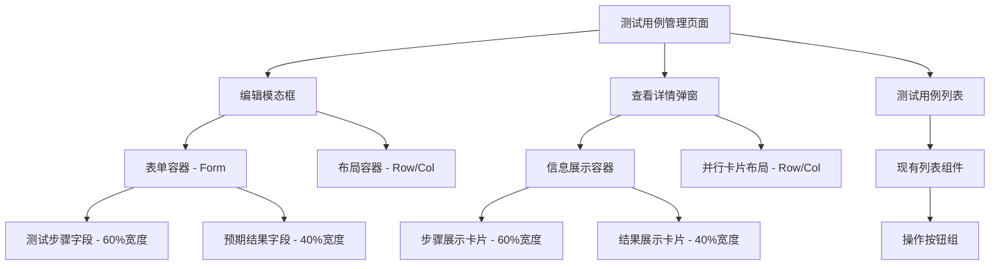
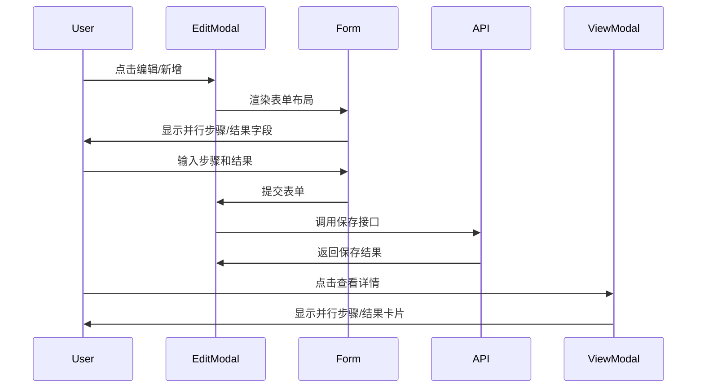

# 测试用例管理页面布局优化 - 架构设计

## 整体架构图



## 分层设计

### 表现层 (Presentation Layer)
- **编辑模态框**：使用Ant Design Modal组件，宽度1000px
- **表单布局**：使用Form + Row/Col实现并行布局
- **查看弹窗**：使用Modal.info，宽度900px，卡片式布局
- **响应式处理**：基于Ant Design的栅格系统

### 组件层 (Component Layer)
```tsx
// 编辑模态框组件结构
<Modal width={1000}>
  <Form>
    {/* 基本信息区域 */}
    <Row gutter={16}>
      <Col span={8}>系统选择</Col>
      <Col span={8}>模块选择</Col>
      <Col span={8}>场景选择</Col>
    </Row>
    
    {/* 状态属性区域 */}
    <Row gutter={16}>
      <Col span={12}>状态选择</Col>
      <Col span={12}>优先级选择</Col>
    </Row>
    
    {/* 步骤与结果并行区域 */}
    <Row gutter={16}>
      <Col span={14}>测试步骤</Col>
      <Col span={10}>预期结果</Col>
    </Row>
  </Form>
</Modal>
```

### 数据层 (Data Layer)
- 保持现有的Form数据绑定
- 保持现有的字段验证规则
- 保持现有的API调用逻辑

## 核心组件设计

### 编辑模态框优化
```tsx
interface EditModalProps {
  visible: boolean;
  editingTestCase: TestCase | null;
  width?: number;
  onCancel: () => void;
  onSubmit: (values: any) => void;
}

// 核心布局调整
const EditModal: React.FC<EditModalProps> = ({
  width = 1000,  // 默认宽度增大
  // ...其他属性
}) => {
  return (
    <Modal
      width={width}
      bodyStyle={{
        padding: '24px',
        background: '#fafafa',
        borderRadius: '8px',
      }}
    >
      <Form layout="vertical">
        {/* 步骤与结果并行布局 */}
        <Row gutter={16}>
          <Col span={14}>
            <Form.Item
              label="测试步骤"
              name="steps"
              rules={[/* 现有验证规则 */]}
            >
              <TextArea 
                rows={6}
                placeholder="请输入详细的测试步骤"
                maxLength={2000}
                showCount
              />
            </Form.Item>
          </Col>
          <Col span={10}>
            <Form.Item
              label="预期结果"
              name="expectedResult"
              rules={[/* 现有验证规则 */]}
            >
              <TextArea 
                rows={6}
                placeholder="请输入预期结果"
                maxLength={1000}
                showCount
              />
            </Form.Item>
          </Col>
        </Row>
      </Form>
    </Modal>
  );
};
```

### 查看详情弹窗优化
```tsx
interface ViewModalProps {
  testCase: TestCase;
  detailData: DetailViewData;
  width?: number;
}

const ViewModal: React.FC<ViewModalProps> = ({
  width = 900,  // 增大查看宽度
  testCase,
  detailData,
}) => {
  return (
    <Modal.info
      width={width}
      content={
        <div style={{ marginTop: 16 }}>
          {/* 基本信息区域 */}
          <Card size="small" style={{ marginBottom: 16 }}>
            <Descriptions column={1}>
              <Descriptions.Item label="标题">{testCase.title}</Descriptions.Item>
              <Descriptions.Item label="系统">{detailData.systemName}</Descriptions.Item>
              <Descriptions.Item label="模块">{detailData.moduleName}</Descriptions.Item>
            </Descriptions>
          </Card>
          
          {/* 步骤与结果并行卡片 */}
          <Row gutter={16}>
            <Col span={14}>
              <Card 
                title="测试步骤" 
                size="small"
                style={{ marginBottom: 16 }}
              >
                <pre style={{ 
                  margin: 0, 
                  whiteSpace: 'pre-wrap',
                  fontFamily: 'inherit',
                  maxHeight: '300px',
                  overflow: 'auto'
                }}>
                  {testCase.steps}
                </pre>
              </Card>
            </Col>
            <Col span={10}>
              <Card 
                title="预期结果" 
                size="small"
                style={{ marginBottom: 16 }}
              >
                <div style={{ 
                  maxHeight: '300px',
                  overflow: 'auto'
                }}>
                  {testCase.expectedResult}
                </div>
              </Card>
            </Col>
          </Row>
        </div>
      }
    />
  );
};
```

## 接口契约定义

### 现有数据结构 (保持不变)
```typescript
interface TestCase {
  id: number;
  title: string;
  systemId: number;
  moduleId: number;
  scenarioId?: number;
  status: string;
  priority: string;
  preconditions: string;
  steps: string;           // 测试步骤
  expectedResult: string;  // 预期结果
  tags?: string[];
  createdAt: string;
  updatedAt: string;
}
```

### 表单验证规则 (保持不变)
```typescript
const validationRules = {
  steps: [
    { required: true, message: '请输入测试步骤' },
    { max: 2000, message: '测试步骤不能超过2000个字符' }
  ],
  expectedResult: [
    { required: true, message: '请输入预期结果' },
    { max: 1000, message: '预期结果不能超过1000个字符' }
  ]
};
```

## 数据流向图



## 异常处理策略

### 布局异常处理
- **屏幕尺寸适配**：使用Ant Design的响应式栅格系统
- **内容溢出处理**：添加滚动条和最大高度限制
- **文本换行处理**：使用white-space: pre-wrap保持格式

### 用户体验异常处理
- **加载状态**：保持现有的loading状态处理
- **错误提示**：保持现有的错误提示机制
- **表单验证**：保持现有的验证规则和提示方式

## 设计原则遵循

### 一致性原则
- 保持与现有Ant Design组件风格一致
- 保持现有的交互模式和用户习惯
- 保持代码风格和命名规范一致

### 可用性原则
- 提高编辑效率和用户体验
- 优化信息展示的可读性
- 确保不同屏幕尺寸的可用性

### 可维护性原则
- 保持代码结构清晰
- 保持功能模块独立
- 保持样式和逻辑分离