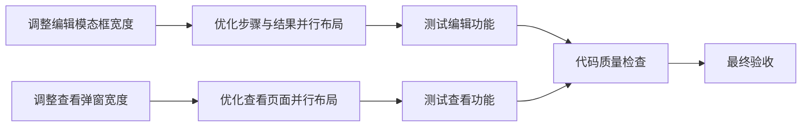

# 测试用例管理页面布局优化 - 任务拆分

## 任务依赖图

## 原子任务列表

### 任务1：调整编辑模态框宽度
**任务ID**: TASK-001  
**优先级**: High  
**前置依赖**: 无  

**输入契约**:
- 现有TestCaseManagementPage.tsx文件
- 当前模态框宽度：800px

**输出契约**:
- 模态框宽度调整为1000px
- 保持所有现有功能和样式

**实现约束**:
- 只修改width属性
- 不影响其他组件属性
- 保持TypeScript类型安全

**验收标准**:
- [ ] 模态框宽度成功调整为1000px
- [ ] 页面正常加载无报错
- [ ] 其他功能不受影响

### 任务2：优化步骤与结果并行布局
**任务ID**: TASK-002  
**优先级**: High  
**前置依赖**: TASK-001  

**输入契约**:
- 已调整宽度的编辑模态框
- 现有的Form.Item结构
- 现有的验证规则

**输出契约**:
- 测试步骤和预期结果在同一行显示
- 步骤区域占60%宽度（14栅格）
- 结果区域占40%宽度（10栅格）
- 保持16px间距（gutter=16）

**实现约束**:
- 使用Ant Design的Row/Col组件
- 保持现有的表单验证
- 保持文本域的rows和maxLength属性
- 保持showCount功能

**验收标准**:
- [ ] 步骤和结果字段并行显示
- [ ] 比例分配正确（6:4）
- [ ] 间距符合设计规范
- [ ] 表单验证正常工作
- [ ] 字符计数功能正常

### 任务3：调整查看弹窗宽度
**任务ID**: TASK-003  
**优先级**: Medium  
**前置依赖**: 无  

**输入契约**:
- 现有的handleView函数
- 当前弹窗宽度：650px（成功情况）和600px（降级情况）

**输出契约**:
- 弹窗宽度统一调整为900px
- 保持现有的信息展示结构

**实现约束**:
- 修改Modal.info的width参数
- 保持现有的内容结构
- 保持错误处理逻辑

**验收标准**:
- [ ] 成功场景弹窗宽度为900px
- [ ] 降级场景弹窗宽度为900px
- [ ] 弹窗正常显示无报错

### 任务4：优化查看页面并行布局
**任务ID**: TASK-004  
**优先级**: Medium  
**前置依赖**: TASK-003  

**输入契约**:
- 已调整宽度的查看弹窗
- 现有的测试用例数据展示逻辑
- 现有的样式定义

**输出契约**:
- 测试步骤和预期结果采用卡片布局并行显示
- 步骤卡片占60%宽度（14栅格）
- 结果卡片占40%宽度（10栅格）
- 使用Card组件提升视觉效果

**实现约束**:
- 使用Ant Design的Card组件
- 保持现有的pre标签格式处理
- 添加适当的边距和圆角
- 保持内容可滚动（内容过长时）

**验收标准**:
- [ ] 步骤和结果卡片并行显示
- [ ] 比例分配正确（6:4）
- [ ] 卡片样式美观专业
- [ ] 长内容可滚动查看
- [ ] 保持文本格式（换行等）

### 任务5：测试编辑功能
**任务ID**: TASK-005  
**优先级**: High  
**前置依赖**: TASK-002  

**输入契约**:
- 已优化的编辑模态框
- 现有的测试数据

**输出契约**:
- 验证所有编辑功能正常工作
- 验证表单提交功能
- 验证数据绑定正确性

**实现约束**:
- 测试新建用例功能
- 测试编辑现有用例功能
- 测试表单验证功能

**验收标准**:
- [ ] 新建用例功能正常
- [ ] 编辑现有用例功能正常
- [ ] 表单验证正常工作
- [ ] 数据保存正确

### 任务6：测试查看功能
**任务ID**: TASK-006  
**优先级**: Medium  
**前置依赖**: TASK-004  

**输入契约**:
- 已优化的查看弹窗
- 现有的测试用例数据

**输出契约**:
- 验证查看详情功能正常
- 验证并行布局显示正确
- 验证降级处理正常

**实现约束**:
- 测试正常数据查看
- 测试层级信息加载失败时的降级展示
- 测试长内容的显示效果

**验收标准**:
- [ ] 正常查看功能正常
- [ ] 降级查看功能正常
- [ ] 并行布局显示正确
- [ ] 长内容可正常滚动

### 任务7：代码质量检查
**任务ID**: TASK-007  
**优先级**: High  
**前置依赖**: TASK-005, TASK-006  

**输入契约**:
- 已完成布局优化的代码
- 项目代码规范要求

**输出契约**:
- TypeScript编译无错误
- 代码风格符合项目规范
- 无lint错误

**实现约束**:
- 运行TypeScript编译检查
- 运行ESLint检查
- 检查代码格式一致性

**验收标准**:
- [ ] TypeScript编译通过
- [ ] ESLint检查通过
- [ ] 代码风格一致
- [ ] 无控制台报错

### 任务8：最终验收
**任务ID**: TASK-008  
**优先级**: High  
**前置依赖**: TASK-007  

**输入契约**:
- 已完成所有优化的代码
- 功能测试结果
- 代码质量检查结果

**输出契约**:
- 完整的优化功能
- 符合需求的用户体验
- 可交付的代码质量

**实现约束**:
- 综合测试所有功能
- 验证用户体验改善
- 确保无回归问题

**验收标准**:
- [ ] 所有需求已实现
- [ ] 用户体验明显改善
- [ ] 代码质量达标
- [ ] 功能无回归
- [ ] 可以交付使用

## 任务复杂度评估

| 任务ID | 复杂度 | 预计时间 | 风险等级 |
|--------|--------|----------|----------|
| TASK-001 | 低 | 5分钟 | 低 |
| TASK-002 | 中 | 30分钟 | 中 |
| TASK-003 | 低 | 5分钟 | 低 |
| TASK-004 | 中 | 30分钟 | 中 |
| TASK-005 | 中 | 20分钟 | 中 |
| TASK-006 | 中 | 15分钟 | 低 |
| TASK-007 | 低 | 10分钟 | 低 |
| TASK-008 | 低 | 10分钟 | 低 |

**总计预计时间**: 2小时  
**主要风险**: 并行布局的样式调整和响应式适配