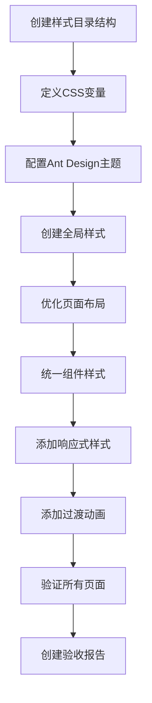

# 前端页面美化 - 任务分解

## 任务依赖图

## 原子任务清单

### 任务1: 创建样式目录结构
**输入契约**: 项目当前状态
**输出契约**: src/styles/目录结构创建完成
**验收标准**: 
- 创建src/styles/目录
- 创建variables.css、theme.ts、global.css文件
- 目录结构清晰规范

### 任务2: 定义CSS变量
**输入契约**: 样式目录结构创建完成
**输出契约**: src/styles/variables.css文件完成
**验收标准**:
- 包含色彩系统变量
- 包含字体系统变量
- 包含间距系统变量
- 包含圆角和阴影变量

### 任务3: 配置Ant Design主题
**输入契约**: CSS变量定义完成
**输出契约**: src/styles/theme.ts文件完成
**验收标准**:
- 自定义Ant Design主题配置
- 覆盖默认色彩和字体
- 主题配置可复用

### 任务4: 创建全局样式
**输入契约**: 主题配置完成
**输出契约**: src/styles/global.css文件完成
**验收标准**:
- 统一基础元素样式
- 统一组件样式覆盖
- 全局布局样式优化

### 任务5: 优化页面布局
**输入契约**: 全局样式创建完成
**输出契约**: 所有页面布局优化完成
**文件清单**:
- HomePage.tsx 布局优化
- TestCaseManagementPage.tsx 布局优化
- TestCaseAssistantPage.tsx 布局优化
- SystemManagement.tsx 布局优化
- PromptManagementPage.tsx 布局优化

### 任务6: 统一组件样式
**输入契约**: 页面布局优化完成
**输出契约**: 常用组件样式统一
**组件清单**:
- 按钮样式统一
- 表单样式统一
- 卡片样式统一
- 表格样式统一
- 模态框样式统一

### 任务7: 添加响应式样式
**输入契约**: 组件样式统一完成
**输出契约**: 响应式样式文件完成
**验收标准**:
- 移动端适配样式
- 平板端适配样式
- 桌面端适配样式
- 大屏端适配样式

### 任务8: 添加过渡动画
**输入契约**: 响应式样式完成
**输出契约**: 过渡动画样式完成
**验收标准**:
- 按钮hover动画
- 卡片hover动画
- 页面切换动画
- 加载状态动画

### 任务9: 验证所有页面
**输入契约**: 所有样式任务完成
**输出契约**: 页面验证报告
**验收标准**:
- 所有页面样式统一
- 响应式测试通过
- 构建验证通过
- 功能验证通过

### 任务10: 创建验收报告
**输入契约**: 验证任务完成
**输出契约**: 项目总结文档
**验收标准**: 包含美化统计、验证结果、项目状态