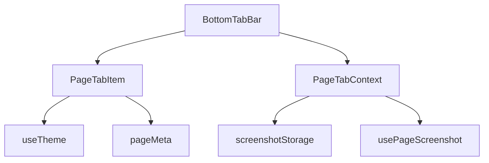

# 底部任务窗口实现文档

> **版本**: v1.0  
> **适用项目**: AITestCraft 自动化测试平台  
> **目标**: 极客模式下的底部隐藏式标签栏，支持页面截图预览和3D翻转切换效果

---

## 一、架构概览

```
┌─────────────────────────────────────────────────────────────────┐
│                     BottomTabBar (容器组件)                      │
│  ┌───────────────────────────────────────────────────────────┐  │
│  │  梯形提示条 (收起时显示)                                    │  │
│  │  ┌─────────────────────────────────────────────────────┐  │  │
│  │  │  任务窗口(3) - 带流光扫过效果                         │  │  │
│  │  └─────────────────────────────────────────────────────┘  │  │
│  └───────────────────────────────────────────────────────────┘  │
│                          ↓ 悬停展开                              │
│  ┌───────────────────────────────────────────────────────────┐  │
│  │  八边形标签栏主体                                          │  │
│  │  ┌─────────────────────────────────────────────────────┐  │  │
│  │  │  ┌─────┐ ┌─────┐ ┌─────┐ ┌─────┐ ┌─────┐          │  │  │
│  │  │  │Tab1 │ │Tab2 │ │Tab3 │ │Tab4 │ │Tab5 │ ...       │  │  │
│  │  │  │ ✓   │ │     │ │     │ │     │ │     │          │  │  │
│  │  │  └─────┘ └─────┘ └─────┘ └─────┘ └─────┘          │  │  │
│  │  └─────────────────────────────────────────────────────┘  │  │
│  └───────────────────────────────────────────────────────────┘  │
└─────────────────────────────────────────────────────────────────┘
```

### 组件关系图



---

## 二、文件结构

```
frontend/src/
├── components/
│   ├── BottomTabBar.tsx          # 底部标签栏容器
│   ├── PageTabBar.tsx            # 传统布局标签栏
│   └── PageTabItem.tsx           # 单个标签项组件
├── contexts/
│   └── PageTabContext.tsx        # 标签状态管理
├── hooks/
│   └── usePageScreenshot.ts      # 页面截图Hook
├── utils/
│   └── screenshotStorage.ts      # IndexedDB截图存储
└── config/
    └── pageMeta.ts               # 页面元数据配置
```

---

## 三、BottomTabBar.tsx - 底部标签栏容器

### 3.1 核心功能

| 功能 | 说明 |
|------|------|
| **悬停展开/收起** | 鼠标悬停200ms后展开，离开200ms后收起 |
| **梯形提示条** | 收起时显示，带流光扫过动画 |
| **八边形主体** | 展开后显示，双层荧光流转边框 |
| **标签列表** | 水平排列的 PageTabItem 组件 |

### 3.2 Props 定义

```typescript
interface BottomTabBarProps {
  pinned?: boolean;                    // 是否固定展开
  onPinChange?: (pinned: boolean) => void;      // 固定状态变化回调
  onExpandedChange?: (expanded: boolean) => void;  // 展开状态变化回调
}
```

### 3.3 状态管理

```typescript
const [expanded, setExpanded] = useState(false);      // 展开状态
const isHoveringRef = useRef(false);                  // 悬停状态
const collapseTimerRef = useRef<NodeJS.Timeout | null>(null);  // 收起定时器
```

### 3.4 交互逻辑

```typescript
// 鼠标进入展开
const handleMouseEnter = useCallback(() => {
  isHoveringRef.current = true;
  clearCollapseTimer();
  if (!expanded) {
    setExpanded(true);
    onExpandedChange?.(true);
  }
}, [expanded, clearCollapseTimer, onExpandedChange]);

// 鼠标离开延迟收起
const handleMouseLeave = useCallback(() => {
  isHoveringRef.current = false;
  if (!pinned) {
    startCollapseTimer();  // 200ms后收起
  }
}, [pinned, startCollapseTimer]);
```

### 3.5 视觉层级结构

| 层级 | 代码行 | 作用 | 实现方式 |
|------|--------|------|----------|
| 外层容器 | 171-186 | 八边形裁剪，控制展开/收起 | `clip-path: polygon(10% 0%, 90% 0%, ...)` |
| 背景遮罩层 | 189-200 | 毛玻璃渐变背景 | `backdrop-filter: blur(20px)` |
| **流光边框层1** | 203-214 | 从315°旋转的荧光边框 | `conic-gradient(from 315deg, ...)` |
| **流光边框层2** | 216-227 | 从135°旋转的荧光边框 | `conic-gradient(from 135deg, ...)` |
| 内层背景 | 230-240 | 内部八边形背景 | 略小的 `clip-path` |
| 扫描线纹理 | 243-258 | 赛博朋克扫描线效果 | `repeating-linear-gradient` |
| 网格背景 | 261-274 | 科技感网格 | `linear-gradient` 网格线 |
| 标签列表 | 277-320 | PageTabItem 组件渲染 | 水平 flex 布局 |

### 3.6 收起状态：梯形提示条

```tsx
{!expanded && (
  <div
    style={{
      width: 1200,
      height: 19,
      // 梯形裁剪
      clipPath: 'polygon(4% 0, 96% 0, 100% 100%, 0 100%)',
      background: isDark
        ? `linear-gradient(180deg, ${primaryColor}50, ${primaryColor}20)`
        : `linear-gradient(180deg, ${primaryColor}40, ${primaryColor}15)`,
      // 呼吸动画
      animation: 'pulseHint 2s ease-in-out infinite',
      borderTop: `2px solid ${primaryColor}`,
      boxShadow: isDark
        ? `0 -4px 25px ${primaryColor}50`
        : `0 -4px 20px ${primaryColor}40`,
    }}
  >
    {/* 流光扫过效果 */}
    <div
      style={{
        position: 'absolute',
        inset: 0,
        background: `linear-gradient(90deg, transparent, ${primaryColor}40, transparent)`,
        animation: 'dataFlow 3s linear infinite',
      }}
    />
    <span>任务窗口({tabs.length})</span>
  </div>
)}
```

### 3.7 展开状态：八边形标签栏主体

```tsx
<div
  style={{
    height: expanded ? 130 : 0,
    opacity: expanded ? 1 : 0,
    // 八边形裁剪（上下斜边）
    clipPath: 'polygon(10% 0%, 90% 0%, 100% 15%, 100% 85%, 90% 100%, 10% 100%, 0% 85%, 0% 15%)',
    transition: 'all 0.35s cubic-bezier(0.4, 0, 0.2, 1)',
  }}
>
  {/* 背景遮罩层 */}
  <div style={{
    position: 'absolute',
    inset: 0,
    background: isDark
      ? 'linear-gradient(135deg, rgba(10, 20, 40, 0.98) 0%, rgba(15, 30, 60, 0.95) 100%)'
      : 'linear-gradient(135deg, rgba(245, 247, 250, 0.98) 0%, rgba(235, 240, 250, 0.95) 100%)',
    backdropFilter: 'blur(20px)',
  }} />

  {/* 荧光流转边框层 - 流光1（从315°开始） */}
  <div style={{
    position: 'absolute',
    inset: 0,
    padding: 3,
    background: `conic-gradient(from 315deg, ${primaryColor}, ${primaryColor}40 5%, ${primaryColor}00 15%, ${primaryColor}00 85%, ${primaryColor}40 95%, ${primaryColor})`,
    animation: 'neonFlowRotate 3s linear infinite',
  }} />

  {/* 荧光流转边框层 - 流光2（从135°开始） */}
  <div style={{
    position: 'absolute',
    inset: 0,
    padding: 3,
    background: `conic-gradient(from 135deg, ${primaryColor}, ${primaryColor}40 5%, ${primaryColor}00 15%, ${primaryColor}00 85%, ${primaryColor}40 95%, ${primaryColor})`,
    animation: 'neonFlowRotate 3s linear infinite',
  }} />

  {/* 内层背景 */}
  <div style={{
    position: 'absolute',
    inset: 3,
    clipPath: 'polygon(9% 0%, 91% 0%, 100% 14%, 100% 86%, 91% 100%, 9% 100%, 0% 86%, 0% 14%)',
    background: isDark
      ? 'linear-gradient(135deg, rgba(10, 20, 40, 0.98) 0%, rgba(15, 30, 60, 0.95) 100%)'
      : 'linear-gradient(135deg, rgba(245, 247, 250, 0.98) 0%, rgba(235, 240, 250, 0.95) 100%)',
  }} />

  {/* 扫描线纹理 */}
  <div style={{
    background: `repeating-linear-gradient(
      0deg,
      transparent,
      transparent 2px,
      ${isDark ? 'rgba(0, 212, 255, 0.03)' : 'rgba(0, 212, 255, 0.02)'} 2px,
      ${isDark ? 'rgba(0, 212, 255, 0.03)' : 'rgba(0, 212, 255, 0.02)'} 4px
    )`,
  }} />

  {/* 网格背景 */}
  <div style={{
    backgroundImage: `
      linear-gradient(${isDark ? 'rgba(0, 212, 255, 0.05)' : 'rgba(0, 212, 255, 0.03)'} 1px, transparent 1px),
      linear-gradient(90deg, ${isDark ? 'rgba(0, 212, 255, 0.05)' : 'rgba(0, 212, 255, 0.03)'} 1px, transparent 1px)
    `,
    backgroundSize: '20px 20px',
  }} />

  {/* 标签列表 */}
  <div style={{ display: 'flex', gap: 24 }}>
    {tabs.map((tab) => (
      <PageTabItem key={tab.id} tab={tab} ... />
    ))}
  </div>
</div>
```

### 3.8 CSS 动画定义

```css
/* 呼吸提示动画 */
@keyframes pulseHint {
  0%, 100% {
    opacity: 0.85;
    filter: brightness(1);
  }
  50% {
    opacity: 1;
    filter: brightness(1.2);
  }
}

/* 数据流动画 */
@keyframes dataFlow {
  0% {
    transform: translateX(-100%);
  }
  100% {
    transform: translateX(100%);
  }
}

/* 霓虹流光旋转 */
@keyframes neonFlowRotate {
  0% {
    transform: rotate(0deg);
  }
  100% {
    transform: rotate(360deg);
  }
}
```

---

## 四、PageTabItem.tsx - 单个标签项

### 4.1 视觉特点

| 特性 | 实现 |
|------|------|
| **150度尖角形状** | `clip-path: polygon(12px 0%, calc(100% - 12px) 0%, 100% 50%, ...)` |
| **荧光边框** | 活动状态使用 `conic-gradient` 旋转流光 |
| **截图缩略图** | 显示页面截图，无截图时显示首字母占位 |
| **随机颜色** | 基于标签ID哈希生成，保持颜色一致性 |
| **右键菜单** | 刷新、关闭、关闭其他、关闭全部 |

### 4.2 Props 定义

```typescript
interface PageTabItemProps {
  tab: PageTab;              // 标签数据
  isActive: boolean;         // 是否为活动状态
  onClick: () => void;       // 点击回调
  onClose: () => void;       // 关闭回调
  onCloseOthers: () => void; // 关闭其他回调
  onCloseAll: () => void;    // 关闭全部回调
  onRefresh: () => void;     // 刷新回调
}
```

### 4.3 随机颜色生成

```typescript
const getRandomColorById = (id: string): string => {
  let hash = 0;
  for (let i = 0; i < id.length; i++) {
    const char = id.charCodeAt(i);
    hash = ((hash << 5) - hash) + char;
    hash = hash & hash;
  }
  const index = Math.abs(hash) % TAB_COLORS.length;
  return TAB_COLORS[index];
};

// 8种预设颜色
const TAB_COLORS = [
  '#00d4ff', // 青色
  '#10b981', // 翠绿
  '#f59e0b', // 琥珀
  '#8b5cf6', // 紫色
  '#ec4899', // 粉色
  '#3b82f6', // 蓝色
  '#14b8a6', // teal
  '#f97316', // 橙色
];
```

### 4.4 组件结构

```tsx
<div style={{ width: 120, height: 90, position: 'relative' }}>
  {/* 荧光边框层 */}
  <div style={{
    position: 'absolute',
    inset: 0,
    padding: isActive ? 2 : 1,
    borderRadius: '8px',
    background: isActive
      ? `conic-gradient(from 0deg, ${moduleColor}, ${moduleColor}60 20%, ${moduleColor}20 40%, ${moduleColor}20 60%, ${moduleColor}60 80%, ${moduleColor})`
      : isHovered
      ? `linear-gradient(135deg, ${moduleColor}60, ${moduleColor}20)`
      : `linear-gradient(135deg, ${moduleColor}30, transparent)`,
    opacity: isActive ? 1 : isHovered ? 0.8 : 0.5,
  }} />

  {/* 主背景层 */}
  <div style={{
    position: 'absolute',
    inset: isActive ? 2 : 1,
    borderRadius: '6px',
    background: isDark
      ? `linear-gradient(135deg, ${isActive ? moduleColor + '20' : 'rgba(10, 20, 40, 0.95)'} 0%, rgba(15, 30, 60, 0.98) 100%)`
      : `linear-gradient(135deg, ${isActive ? moduleColor + '15' : 'rgba(245, 247, 250, 0.95)'} 0%, rgba(235, 240, 250, 0.98) 100%)`,
  }} />

  {/* 扫描线纹理 */}
  <div style={{
    background: `repeating-linear-gradient(
      0deg,
      transparent,
      transparent 2px,
      ${isDark ? 'rgba(0, 212, 255, 0.02)' : 'rgba(0, 212, 255, 0.01)'} 2px,
      ${isDark ? 'rgba(0, 212, 255, 0.02)' : 'rgba(0, 212, 255, 0.01)'} 4px
    )`,
  }} />

  {/* 截图缩略图容器 - 150度尖角形状 */}
  <div style={{
    clipPath: 'polygon(12px 0%, calc(100% - 12px) 0%, 100% 50%, calc(100% - 12px) 100%, 12px 100%, 0% 50%)',
  }}>
    {tab.screenshot && !imageError ? (
      
    ) : (
      // 无截图时显示首字母占位
      <div style={{
        background: `linear-gradient(135deg, ${moduleColor}15 0%, ${moduleColor}30 100%)`,
      }}>
        <span>{tab.title.charAt(0)}</span>
      </div>
    )}
  </div>

  {/* 标题栏 */}
  <div style={{
    clipPath: 'polygon(8px 0%, calc(100% - 8px) 0%, 100% 50%, calc(100% - 8px) 100%, 8px 100%, 0% 50%)',
  }}>
    <span>{tab.title}</span>
  </div>

  {/* 关闭按钮 (悬停显示) */}
  <AnimatePresence>
    {isHovered && (
      <motion.div
        initial={{ opacity: 0, scale: 0.8 }}
        animate={{ opacity: 1, scale: 1 }}
        exit={{ opacity: 0, scale: 0.8 }}
        onClick={(e) => {
          e.stopPropagation();
          onClose();
        }}
      >
        <CloseOutlined />
      </motion.div>
    )}
  </AnimatePresence>

  {/* 活动指示器 (发光圆点) */}
  {isActive && (
    <div style={{
      position: 'absolute',
      top: 8,
      right: 8,
      width: 6,
      height: 6,
      borderRadius: '50%',
      backgroundColor: moduleColor,
      boxShadow: `0 0 8px ${moduleColor}, 0 0 12px ${moduleColor}80`,
    }} />
  )}
</div>
```

### 4.5 右键菜单

```tsx
const contextMenu = (
  <Menu>
    <Menu.Item key="refresh" icon={<ReloadOutlined />} onClick={onRefresh}>
      刷新页面
    </Menu.Item>
    <Menu.Divider />
    <Menu.Item key="close" danger onClick={onClose}>
      关闭
    </Menu.Item>
    <Menu.Item key="closeOthers" onClick={onCloseOthers}>
      关闭其他
    </Menu.Item>
    <Menu.Item key="closeAll" onClick={onCloseAll}>
      关闭全部
    </Menu.Item>
  </Menu>
);

<Dropdown overlay={contextMenu} trigger={['contextMenu']}>
  <div>...</div>
</Dropdown>
```

---

## 五、PageTabContext.tsx - 状态管理

### 5.1 核心功能

| 功能 | 说明 |
|------|------|
| **标签持久化** | localStorage 存储标签元数据 |
| **截图存储** | IndexedDB 存储截图 (screenshotStorage) |
| **3D翻转切换** | 切换标签时带450ms翻转动画 |
| **智能去重** | 同一页面只保留一个标签 |
| **导航来源追踪** | sidebar / tab / direct 三种来源 |

### 5.2 数据类型定义

```typescript
// 页面标签数据
export interface PageTab {
  id: string;                    // 唯一标识
  path: string;                  // 路由路径
  title: string;                 // 页面标题
  icon: string;                  // 图标名称
  module: ModuleType;            // 所属模块
  state: PageState;              // 页面状态
  screenshot: string | null;     // 截图数据(base64)
  scrollPosition: ScrollPosition; // 滚动位置
  timestamp: number;             // 访问时间戳
  isActive: boolean;             // 是否为当前活动标签
}

// 导航来源类型
export type NavigationSource = 'sidebar' | 'tab' | 'direct';

// Context 类型
interface PageTabContextType {
  tabs: PageTab[];
  activeTabId: string | null;
  isLoading: boolean;
  isFlipping: boolean;                    // 翻转动画状态
  flipDirection: 'left' | 'right' | null; // 翻转方向
  lastNavigationSource: NavigationSource;
  addTab: (path: string, screenshot?: string | null) => Promise<void>;
  switchTab: (tabId: string) => Promise<void>;
  closeTab: (tabId: string) => void;
  closeOtherTabs: (tabId: string) => void;
  closeAllTabs: () => void;
  refreshTab: (tabId: string) => Promise<void>;
  updateTabState: (tabId: string, state: PageState) => void;
  updateTabScreenshot: (tabId: string, screenshot: string | null) => Promise<void>;
  updateScrollPosition: (tabId: string, position: ScrollPosition) => void;
  getTabById: (tabId: string) => PageTab | undefined;
  getTabByPath: (path: string) => PageTab | undefined;
  navigateFromSidebar: (path: string) => void;
}
```

### 5.3 本地存储策略

```typescript
const PAGETAB_STORAGE_KEY = 'pageTabHistory';  // localStorage 键名
const SESSION_KEY = 'pageTabSession';          // 会话标识
const MAX_TABS = 8;                            // 最大标签数量

// 检查是否为新会话
const isNewSession = (): boolean => {
  const sessionId = sessionStorage.getItem(SESSION_KEY);
  if (!sessionId) {
    sessionStorage.setItem(SESSION_KEY, Date.now().toString());
    return true;
  }
  return false;
};

// 从 localStorage 加载标签
const loadTabsFromStorage = (): PageTab[] => {
  // 新会话清空历史
  if (isNewSession()) {
    localStorage.removeItem(PAGETAB_STORAGE_KEY);
    return [];
  }

  const stored = localStorage.getItem(PAGETAB_STORAGE_KEY);
  if (stored) {
    const parsed = JSON.parse(stored);
    return parsed.map((tab: PageTab) => ({
      ...tab,
      isActive: false,
      screenshot: null,  // 截图从 IndexedDB 加载
    }));
  }
  return [];
};

// 保存到 localStorage（不包含截图）
const saveTabsToStorage = (tabs: PageTab[]) => {
  const tabsWithoutScreenshot = tabs.map((tab) => ({
    ...tab,
    screenshot: null,
  }));
  localStorage.setItem(PAGETAB_STORAGE_KEY, JSON.stringify(tabsWithoutScreenshot));
};
```

### 5.4 切换标签流程 (3D翻转效果)

```typescript
const switchTab = useCallback(async (tabId: string) => {
  const tab = getTabById(tabId);
  if (!tab || tabId === activeTabIdRef.current) return;

  // 设置导航来源为任务窗口
  navigationSourceRef.current = 'tab';
  setLastNavigationSource('tab');

  const currentTabId = activeTabIdRef.current;

  // ========== 第1步：翻转前保存当前页面截图 ==========
  if (currentTabId && !isCapturingRef.current) {
    const contentArea = document.querySelector('.page-content-area') as HTMLDivElement;
    if (contentArea) {
      isCapturingRef.current = true;
      try {
        const screenshot = await captureQuick(contentArea);
        if (screenshot) {
          setTabs((prev) =>
            prev.map((t) =>
              t.id === currentTabId ? { ...t, screenshot } : t
            )
          );
          screenshotStorage.saveScreenshot(currentTabId, currentTab.path, screenshot);
        }
      } finally {
        isCapturingRef.current = false;
      }
    }
  }

  // 保存当前标签的滚动位置
  if (currentTabId) {
    const scrollX = window.scrollX || document.documentElement.scrollLeft;
    const scrollY = window.scrollY || document.documentElement.scrollTop;
    setTabs((prev) =>
      prev.map((t) =>
        t.id === currentTabId
          ? { ...t, scrollPosition: { x: scrollX, y: scrollY } }
          : t
      )
    );
  }

  // ========== 第2步：预加载目标标签的截图 ==========
  if (!tab.screenshot) {
    const screenshot = await screenshotStorage.getScreenshot(tab.id);
    if (screenshot) {
      setTabs((prev) =>
        prev.map((t) =>
          t.id === tab.id ? { ...t, screenshot } : t
        )
      );
    }
  }

  // ========== 第3步：触发3D翻转动画 ==========
  setFlipDirection('right');
  setIsFlipping(true);

  // 延迟执行页面切换
  setTimeout(() => {
    setTabs((prev) =>
      prev.map((t) => ({
        ...t,
        isActive: t.id === tabId,
        timestamp: t.id === tabId ? Date.now() : t.timestamp,
      }))
    );
    setActiveTabId(tabId);

    if (location.pathname !== tab.path) {
      navigate(tab.path);
    }

    // 恢复滚动位置
    requestAnimationFrame(() => {
      window.scrollTo(tab.scrollPosition.x, tab.scrollPosition.y);
    });
  }, 100);

  // ========== 第4步：翻转动画结束 ==========
  setTimeout(() => {
    setIsFlipping(false);
    setFlipDirection(null);
  }, 450);
}, [getTabById, location.pathname, navigate, captureQuick]);
```

### 5.5 侧边栏导航（重置页面状态）

```typescript
const navigateFromSidebar = useCallback((path: string) => {
  // 设置导航来源为侧边栏
  navigationSourceRef.current = 'sidebar';
  setLastNavigationSource('sidebar');

  // 检查是否已存在该路径的标签
  const existingTab = getTabByPath(path);

  if (existingTab) {
    // 重置已有标签状态
    setTabs((prev) =>
      prev.map((tab) =>
        tab.id === existingTab.id
          ? { ...tab, state: {}, scrollPosition: { x: 0, y: 0 }, timestamp: Date.now() }
          : tab
      )
    );
  }

  navigate(path);
}, [getTabByPath, navigate]);
```

---

## 六、截图存储 (screenshotStorage.ts)

### 6.1 IndexedDB 封装

```typescript
const DB_NAME = 'PageScreenshotDB';
const STORE_NAME = 'screenshots';
const DB_VERSION = 1;

export const screenshotStorage = {
  // 初始化数据库
  async initDB(): Promise<IDBDatabase> {
    return new Promise((resolve, reject) => {
      const request = indexedDB.open(DB_NAME, DB_VERSION);
      request.onerror = () => reject(request.error);
      request.onsuccess = () => resolve(request.result);
      request.onupgradeneeded = (event) => {
        const db = (event.target as IDBOpenDBRequest).result;
        if (!db.objectStoreNames.contains(STORE_NAME)) {
          db.createObjectStore(STORE_NAME, { keyPath: 'id' });
        }
      };
    });
  },

  // 保存截图
  async saveScreenshot(id: string, path: string, screenshot: string): Promise<void> {
    const db = await this.initDB();
    return new Promise((resolve, reject) => {
      const transaction = db.transaction([STORE_NAME], 'readwrite');
      const store = transaction.objectStore(STORE_NAME);
      const request = store.put({ id, path, screenshot, timestamp: Date.now() });
      request.onsuccess = () => resolve();
      request.onerror = () => reject(request.error);
    });
  },

  // 获取截图
  async getScreenshot(id: string): Promise<string | null> {
    const db = await this.initDB();
    return new Promise((resolve, reject) => {
      const transaction = db.transaction([STORE_NAME], 'readonly');
      const store = transaction.objectStore(STORE_NAME);
      const request = store.get(id);
      request.onsuccess = () => {
        const result = request.result;
        resolve(result ? result.screenshot : null);
      };
      request.onerror = () => reject(request.error);
    });
  },

  // 删除截图
  async deleteScreenshot(id: string): Promise<void> {
    const db = await this.initDB();
    return new Promise((resolve, reject) => {
      const transaction = db.transaction([STORE_NAME], 'readwrite');
      const store = transaction.objectStore(STORE_NAME);
      const request = store.delete(id);
      request.onsuccess = () => resolve();
      request.onerror = () => reject(request.error);
    });
  },

  // 批量删除
  async deleteScreenshots(ids: string[]): Promise<void> {
    await Promise.all(ids.map((id) => this.deleteScreenshot(id)));
  },

  // 清空所有截图
  async clearAllScreenshots(): Promise<void> {
    const db = await this.initDB();
    return new Promise((resolve, reject) => {
      const transaction = db.transaction([STORE_NAME], 'readwrite');
      const store = transaction.objectStore(STORE_NAME);
      const request = store.clear();
      request.onsuccess = () => resolve();
      request.onerror = () => reject(request.error);
    });
  },
};
```

---

## 七、使用方式

### 7.1 在 FeatureLayout 中引入

```tsx
import BottomTabBar from '../components/BottomTabBar';

const FeatureLayout: React.FC = () => {
  const [bottomPinned, setBottomPinned] = useState(false);
  const [bottomExpanded, setBottomExpanded] = useState(false);

  return (
    <div className="feature-layout">
      {/* 页面内容 */}
      <div className="page-content-area">
        <Outlet />
      </div>

      {/* 底部标签栏 */}
      <BottomTabBar
        pinned={bottomPinned}
        onPinChange={setBottomPinned}
        onExpandedChange={setBottomExpanded}
      />
    </div>
  );
};
```

### 7.2 在 App.tsx 中包裹 Provider

```tsx
import { PageTabProvider } from './contexts/PageTabContext';

function App() {
  return (
    <PageTabProvider>
      <ThemeProvider>
        <Router>
          <Routes>
            <Route path="/*" element={<FeatureLayout />} />
          </Routes>
        </Router>
      </ThemeProvider>
    </PageTabProvider>
  );
}
```

### 7.3 在组件中使用

```tsx
import { usePageTab } from '../contexts/PageTabContext';

const MyComponent = () => {
  const { tabs, activeTabId, switchTab, closeTab } = usePageTab();

  return (
    <div>
      <button onClick={() => switchTab('tab-id')}>
        切换到标签
      </button>
    </div>
  );
};
```

---

## 八、样式变量

### 8.1 颜色配置

```typescript
// 主色调（赛博青蓝）
const primaryColor = '#00d4ff';

// 暗色主题背景
const darkBg = {
  primary: '#0f172a',
  secondary: '#1e293b',
  container: '#1e293b',
};

// 亮色主题背景
const lightBg = {
  primary: '#f0f2f5',
  secondary: '#ffffff',
  container: '#ffffff',
};
```

### 8.2 尺寸配置

```typescript
const BOTTOM_TAB_CONFIG = {
  hintWidth: 1200,      // 梯形提示条宽度
  hintHeight: 19,       // 梯形提示条高度
  barWidth: 1200,       // 标签栏宽度
  barHeight: 130,       // 标签栏高度
  tabWidth: 120,        // 单个标签宽度
  tabHeight: 90,        // 单个标签高度
  tabGap: 24,           // 标签间距
  maxTabs: 8,           // 最大标签数量
};
```

---

## 九、性能优化

| 优化项 | 实现方式 |
|--------|----------|
| **截图懒加载** | 使用 `loading="lazy"` 延迟加载缩略图 |
| **定时器清理** | `useEffect` 返回清理函数 |
| **防抖处理** | 截图操作使用 `isCapturingRef` 防止重复 |
| **动画硬件加速** | 使用 `transform` 和 `opacity` 代替 `width/height` |
| **IndexedDB 存储** | 大体积截图不存 localStorage |

---

## 十、注意事项

1. **浏览器关闭时清空数据**：监听 `beforeunload` 事件清空 localStorage 和 IndexedDB
2. **新会话检测**：使用 `sessionStorage` 检测新标签页，清空历史标签
3. **截图失败处理**：图片加载错误时显示首字母占位符
4. **最大标签限制**：超过 `MAX_TABS` 时自动移除最旧的标签
5. **滚动位置恢复**：切换标签时恢复之前的滚动位置

---

*文档生成时间: 2026-02-25*  
*适用版本: AITestCraft v1.0+*  
*作者: AI Assistant*
