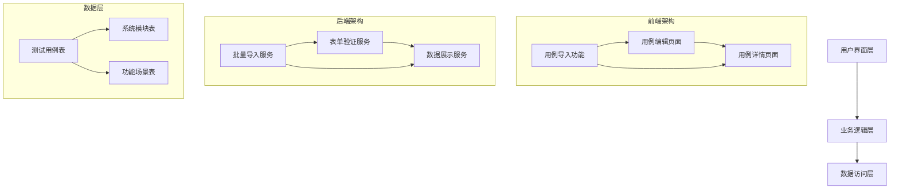
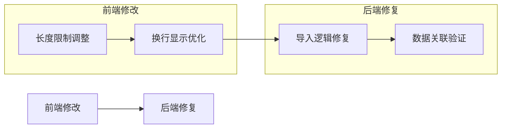
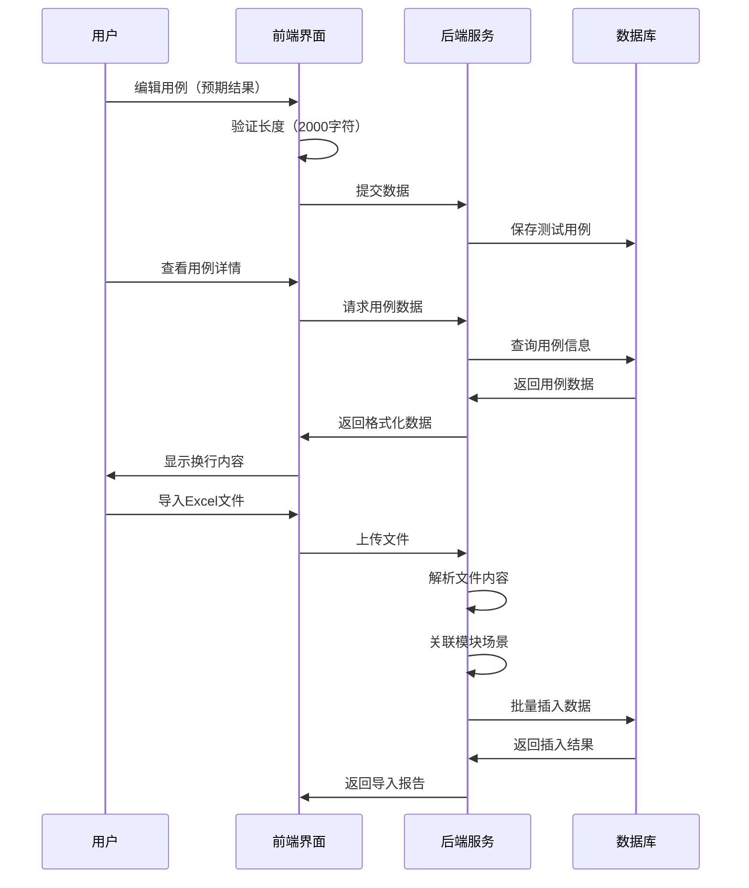

# 系统优化问题架构设计文档

## 整体架构图

## 分层设计

### 前端架构
- **组件层**：React组件，负责UI渲染和用户交互
- **服务层**：API调用和数据处理
- **状态管理层**：应用状态管理

### 后端架构
- **控制器层**：接收HTTP请求，返回响应
- **服务层**：业务逻辑处理
- **数据访问层**：数据库操作

## 核心组件

### 1. 用例编辑页面组件 (<mcfile name="TestCaseManagementPage.tsx" path="frontend\src\pages\TestCaseManagementPage.tsx"></mcfile>)
- **功能**：测试用例的创建和编辑
- **修改点**：预期结果字段长度限制
- **依赖**：Ant Design Form组件

### 2. 用例详情展示组件 (<mcfile name="TestCaseManagementPage.tsx" path="frontend\src\pages\TestCaseManagementPage.tsx"></mcfile>)
- **功能**：测试用例的详情查看
- **修改点**：预期结果换行显示逻辑
- **依赖**：Ant Design Modal组件

### 3. 批量导入服务 (<mcfile name="batchImportService.ts" path="backend\src\services\batchImportService.ts"></mcfile>)
- **功能**：Excel/CSV文件导入处理
- **修改点**：功能模块和场景关联逻辑
- **依赖**：Prisma ORM，ExcelJS库

## 模块依赖关系图

## 接口契约定义

### 前端接口
1. **表单验证接口**
   - 输入：预期结果文本（最大2000字符）
   - 输出：验证结果

2. **数据显示接口**
   - 输入：预期结果文本（带序号格式）
   - 输出：格式化后的HTML内容

### 后端接口
1. **导入数据处理接口**
   - 输入：Excel/CSV文件数据
   - 输出：导入结果（包含模块和场景关联状态）

## 数据流向图

## 异常处理策略

### 前端异常处理
1. **表单验证异常**
   - 长度超限：显示错误提示信息
   - 格式错误：提供实时反馈

2. **数据显示异常**
   - 内容解析失败：降级显示原始文本
   - 网络错误：显示友好错误页面

### 后端异常处理
1. **导入数据异常**
   - 文件格式错误：返回详细错误信息
   - 数据关联失败：记录日志并跳过当前记录
   - 数据库异常：事务回滚，保证数据一致性

## 技术实现方案

### 问题1：预期结果长度限制调整
**实现方案**：
1. 修改前端表单验证规则：`max: 1000` → `max: 2000`
2. 修改UI组件属性：`maxLength={1000}` → `maxLength={2000}`
3. 保持后端验证不变（后端无长度限制）

**代码位置**：<mcfile name="TestCaseManagementPage.tsx" path="frontend\src\pages\TestCaseManagementPage.tsx"></mcfile> 第938-950行

### 问题2：预期结果换行处理
**实现方案**：
1. 创建格式化函数，将文本按序号分割
2. 使用`<ol>`或`
`包裹序号内容
3. 应用与测试步骤相同的样式

**代码位置**：<mcfile name="TestCaseManagementPage.tsx" path="frontend\src\pages\TestCaseManagementPage.tsx"></mcfile> 第550行和第620行

### 问题3：功能模块和场景导入失败
**实现方案**：
1. 检查导入逻辑中的事务处理
2. 验证模块和场景的查找创建逻辑
3. 确保测试用例与模块场景的正确关联

**代码位置**：<mcfile name="batchImportService.ts" path="backend\src\services\batchImportService.ts"></mcfile> 第500-600行

## 设计原则验证

### 与现有架构一致性
- ✅ 使用现有技术栈和组件
- ✅ 遵循现有代码风格和模式
- ✅ 不破坏现有功能

### 复杂度可控
- ✅ 每个修改点独立且明确
- ✅ 修改范围最小化
- ✅ 风险在可控范围内

### 可测试性
- ✅ 每个功能点都有明确的验收标准
- ✅ 修改可独立验证
- ✅ 提供回归测试保障