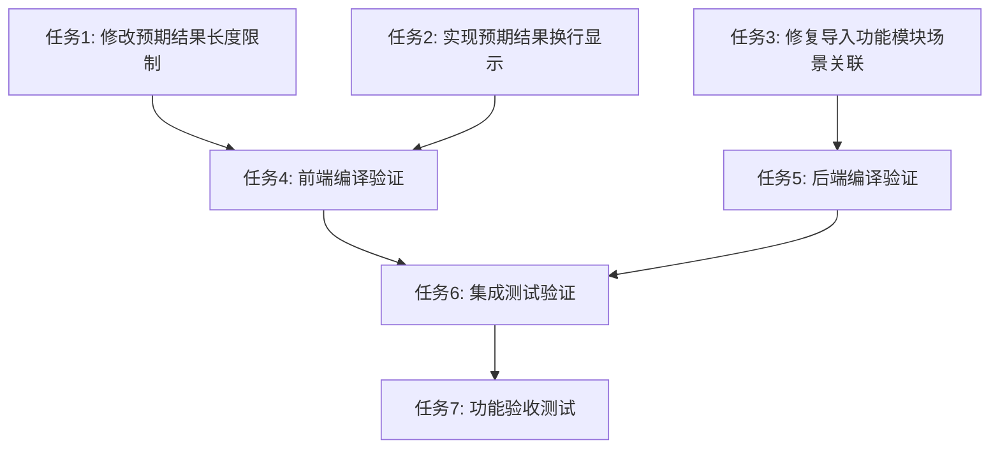

# 系统优化问题原子任务文档

## 任务依赖图

## 原子任务列表

### 任务1：修改预期结果长度限制
**任务ID**: TASK-001
**优先级**: 高

#### 输入契约
- **前置依赖**: 无
- **输入数据**: 前端用例编辑页面代码
- **环境依赖**: Node.js, React开发环境

#### 输出契约
- **输出数据**: 修改后的前端代码
- **交付物**: 预期结果字段长度限制从1000调整为2000
- **验收标准**: 前端编辑页面接受2000字符输入，验证规则正确

#### 实现约束
- **技术栈**: React + TypeScript + Ant Design
- **接口规范**: 保持现有表单验证接口
- **质量要求**: 代码编译通过，功能测试正常

#### 依赖关系
- **后置任务**: 任务4（前端编译验证）
- **并行任务**: 任务2、任务3

### 任务2：实现预期结果换行显示
**任务ID**: TASK-002
**优先级**: 高

#### 输入契约
- **前置依赖**: 无
- **输入数据**: 前端用例详情页面代码
- **环境依赖**: Node.js, React开发环境

#### 输出契约
- **输出数据**: 修改后的前端代码
- **交付物**: 预期结果按序号换行显示功能
- **验收标准**: 详情页面预期结果正确按序号换行显示

#### 实现约束
- **技术栈**: React + TypeScript + Ant Design
- **接口规范**: 保持现有数据显示接口
- **质量要求**: 代码编译通过，显示效果符合要求

#### 依赖关系
- **后置任务**: 任务4（前端编译验证）
- **并行任务**: 任务1、任务3

### 任务3：修复导入功能模块场景关联
**任务ID**: TASK-003
**优先级**: 高

#### 输入契约
- **前置依赖**: 无
- **输入数据**: 后端批量导入服务代码
- **环境依赖**: Node.js, TypeScript, Prisma

#### 输出契约
- **输出数据**: 修改后的后端代码
- **交付物**: 修复功能模块和场景导入关联逻辑
- **验收标准**: 导入功能正确关联功能模块和场景到测试用例

#### 实现约束
- **技术栈**: Node.js + TypeScript + Prisma
- **接口规范**: 保持现有导入接口
- **质量要求**: 代码编译通过，导入功能正常

#### 依赖关系
- **后置任务**: 任务5（后端编译验证）
- **并行任务**: 任务1、任务2

### 任务4：前端编译验证
**任务ID**: TASK-004
**优先级**: 中

#### 输入契约
- **前置依赖**: 任务1、任务2完成
- **输入数据**: 修改后的前端代码
- **环境依赖**: Node.js, npm构建环境

#### 输出契约
- **输出数据**: 编译验证结果
- **交付物**: 前端代码编译通过确认
- **验收标准**: npm run build 编译成功，无TypeScript错误

#### 实现约束
- **技术栈**: React + TypeScript构建工具链
- **接口规范**: 无
- **质量要求**: 编译无错误，类型检查通过

#### 依赖关系
- **前置任务**: 任务1、任务2
- **后置任务**: 任务6（集成测试验证）

### 任务5：后端编译验证
**任务ID**: TASK-005
**优先级**: 中

#### 输入契约
- **前置依赖**: 任务3完成
- **输入数据**: 修改后的后端代码
- **环境依赖**: Node.js, TypeScript编译环境

#### 输出契约
- **输出数据**: 编译验证结果
- **交付物**: 后端代码编译通过确认
- **验收标准**: npm run build 编译成功，无TypeScript错误

#### 实现约束
- **技术栈**: Node.js + TypeScript构建工具链
- **接口规范**: 无
- **质量要求**: 编译无错误，类型检查通过

#### 依赖关系
- **前置任务**: 任务3
- **后置任务**: 任务6（集成测试验证）

### 任务6：集成测试验证
**任务ID**: TASK-006
**优先级**: 中

#### 输入契约
- **前置依赖**: 任务4、任务5完成
- **输入数据**: 编译通过的前后端代码
- **环境依赖**: 完整开发环境，数据库连接

#### 输出契约
- **输出数据**: 集成测试结果
- **交付物**: 前后端集成验证通过
- **验收标准**: 前后端服务正常启动，基本功能可用

#### 实现约束
- **技术栈**: 完整应用技术栈
- **接口规范**: 保持现有API接口
- **质量要求**: 服务正常启动，无运行时错误

#### 依赖关系
- **前置任务**: 任务4、任务5
- **后置任务**: 任务7（功能验收测试）

### 任务7：功能验收测试
**任务ID**: TASK-007
**优先级**: 中

#### 输入契约
- **前置依赖**: 任务6完成
- **输入数据**: 运行中的应用服务
- **环境依赖**: 浏览器，测试数据

#### 输出契约
- **输出数据**: 功能测试报告
- **交付物**: 三个优化问题功能验证通过
- **验收标准**: 
  - 预期结果长度限制调整为2000字符
  - 预期结果按序号换行显示
  - 功能模块和场景导入成功关联

#### 实现约束
- **技术栈**: 浏览器测试环境
- **接口规范**: 用户界面交互
- **质量要求**: 功能符合需求，用户体验良好

#### 依赖关系
- **前置任务**: 任务6
- **后置任务**: 无

## 任务执行计划

### 第一阶段：并行开发（任务1-3）
1. 同时执行任务1、任务2、任务3
2. 每个任务独立开发，互不干扰
3. 完成后分别进行代码审查

### 第二阶段：编译验证（任务4-5）
1. 任务1、2完成后执行任务4（前端编译）
2. 任务3完成后执行任务5（后端编译）
3. 确保代码质量

### 第三阶段：集成测试（任务6-7）
1. 前后端编译通过后执行集成测试
2. 验证完整功能流程
3. 进行最终功能验收

## 质量门控

### 代码质量要求
- TypeScript编译无错误
- ESLint代码规范检查通过
- 代码可读性良好

### 功能质量要求
- 三个优化问题全部解决
- 不破坏现有功能
- 用户体验提升明显

### 测试质量要求
- 单元测试覆盖关键逻辑
- 集成测试验证完整流程
- 用户验收测试通过