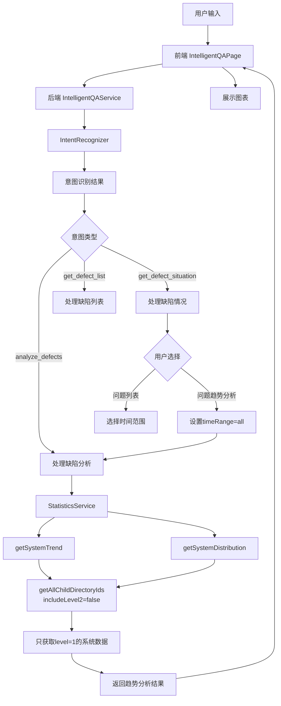
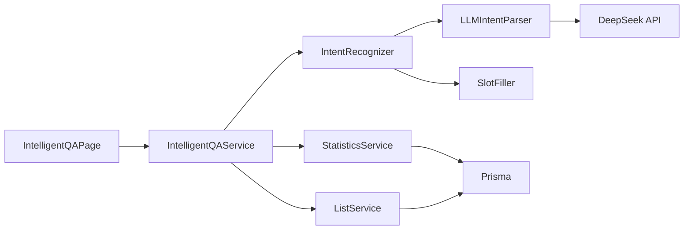
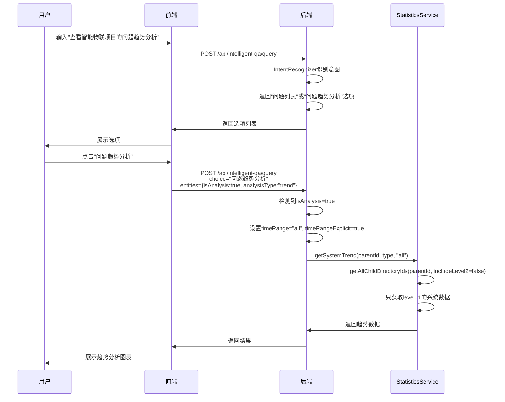
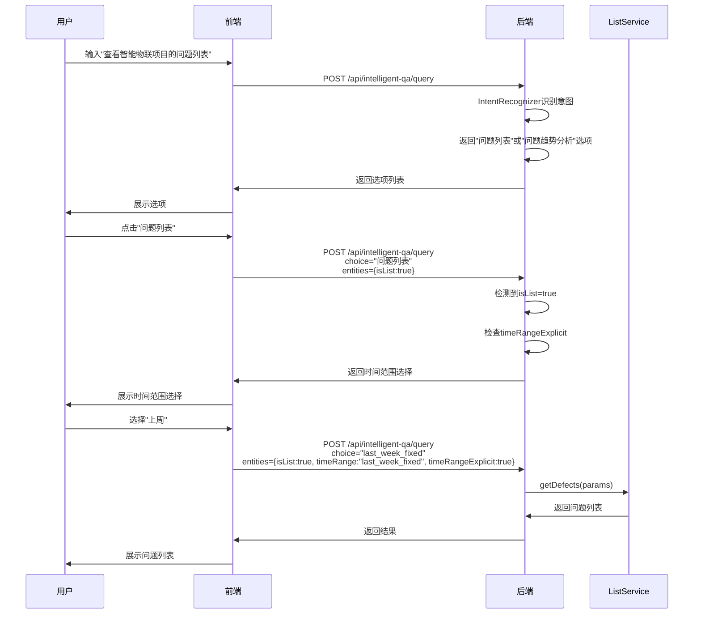

# 缺陷管理助手功能优化 - 设计文档

## 1. 整体架构图



## 2. 分层设计和核心组件

### 2.1 前端层
- **IntelligentQAPage.tsx**: 用户界面，处理用户输入和展示结果
- **核心方法**:
  - `handleSend`: 发送用户查询
  - `handleChoice`: 处理用户选择（问题列表/问题趋势分析）

### 2.2 后端服务层
- **IntelligentQAService.ts**: 智能问答服务，处理意图识别和响应
- **StatisticsService.ts**: 统计服务，提供趋势分析和分布数据
- **ListService.ts**: 列表服务，处理缺陷列表查询
- **IntentRecognizer.ts**: 意图识别器

### 2.3 数据层
- **Prisma ORM**: 数据库访问
- **directories表**: 存储目录结构（项目、系统、模块）

## 3. 模块依赖关系图



## 4. 接口契约定义

### 4.1 前端 -> 后端接口

**请求**: POST /api/intelligent-qa/query

```typescript
{
  query: string,           // 用户输入的查询语句
  choice?: string,         // 用户选择的选项（如："问题趋势分析"）
  entities?: {             // 提取的实体
    timeRange?: string,    // 时间范围
    timeRangeExplicit?: boolean,  // 是否明确指定了时间范围
    isAnalysis?: boolean,  // 是否是分析请求
    analysisType?: string, // 分析类型
    ...
  },
  context?: Array<{        // 上下文信息
    type: string,
    content: string,
    timestamp: Date,
    resultType: string,
    entities: Record<string, any>
  }>
}
```

**响应**:

```typescript
{
  success: boolean,
  message: string,
  data?: any,              // 返回的数据
  resultType?: 'list' | 'chart' | 'document' | 'export' | 'message' | 'choice',
  options?: Array<{       // 选项列表
    label: string,
    value: string,
    data?: any
  }>,
  suggestions?: string[],  // 建议列表
  qaMeta?: {               // QA元数据
    intent: string,
    confidence: number,
    entities: Record<string, any>
  }
}
```

### 4.2 StatisticsService 接口

**getAllChildDirectoryIds 方法**:

```typescript
/**
 * 递归获取所有子目录ID
 * @param parentId 父目录ID
 * @param includeLevel2 是否包含level=2的目录（模块），默认true
 * @returns 子目录ID数组
 */
private async getAllChildDirectoryIds(
  parentId: string,
  includeLevel2: boolean = true
): Promise<number[]>
```

## 5. 数据流向图

### 5.1 问题趋势分析流程（优化后）



### 5.2 问题列表流程（不受影响）



## 6. 异常处理策略

### 6.1 前端异常处理
- 网络请求失败：显示友好的错误提示
- 后端返回错误：根据错误类型显示不同的提示信息
- 加载状态：显示loading动画

### 6.2 后端异常处理
- 意图识别失败：返回unknown意图，提供选项让用户选择
- 数据查询失败：记录日志，返回友好的错误信息
- 参数验证失败：返回具体的错误信息

## 7. 设计原则

### 7.1 严格按照任务范围
- 只修改问题趋势分析相关功能
- 不影响问题列表、待办任务等其他功能

### 7.2 确保与现有系统架构一致
- 使用现有的意图识别、槽位填充、上下文管理机制
- 保持缓存机制正常工作
- 保持错误处理一致

### 7.3 复用现有组件和模式
- 复用 `getAllChildDirectoryIds` 方法，添加参数控制
- 复用现有的时间范围处理逻辑
- 复用现有的错误处理机制

## 8. 质量门控

- [x] 架构图清晰准确
- [x] 接口定义完整
- [x] 与现有系统无冲突
- [x] 设计可行性验证
