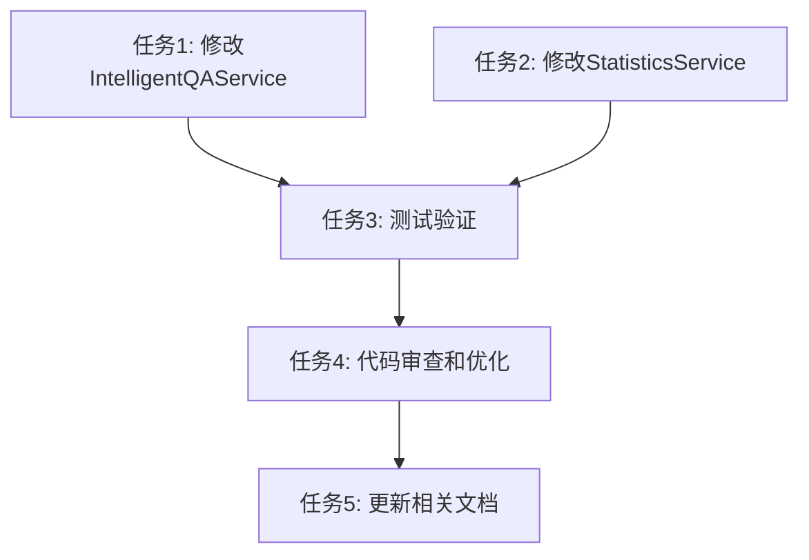

# 缺陷管理助手功能优化 - 任务拆分文档

## 1. 子任务拆分

### 任务1：修改 IntelligentQAService 实现问题趋势分析默认展示全部数据

**输入契约**:
- 前置依赖: ALIGNMENT、CONSENSUS、DESIGN文档已完成
- 输入数据: IntelligentQAService.ts 源代码
- 环境依赖: Node.js、TypeScript编译环境

**输出契约**:
- 输出数据: 修改后的 IntelligentQAService.ts
- 交付物:
  - 问题趋势分析不再弹出时间范围选择
  - 直接设置 timeRange='all' 和 timeRangeExplicit=true
- 验收标准:
  - [ ] 用户选择"问题趋势分析"时，直接展示全部数据
  - [ ] 不再弹出时间范围选择框
  - [ ] 问题列表功能不受影响

**实现约束**:
- 技术栈: TypeScript
- 接口规范: 保持现有接口不变
- 质量要求: 不影响其他功能，代码风格一致

**依赖关系**:
- 后置任务: 任务3（测试验证）
- 并行任务: 任务2

### 任务2：修改 StatisticsService 实现去除模块数据统计

**输入契约**:
- 前置依赖: ALIGNMENT、CONSENSUS、DESIGN文档已完成
- 输入数据: StatisticsService.ts 源代码
- 环境依赖: Node.js、TypeScript编译环境

**输出契约**:
- 输出数据: 修改后的 StatisticsService.ts
- 交付物:
  - getAllChildDirectoryIds 方法添加 includeLevel2 参数
  - getSystemTrend 和 getSystemDistribution 调用时传入 includeLevel2=false
- 验收标准:
  - [ ] 系统分布图只显示系统（level=1）的数据
  - [ ] 不显示模块（level=2）的数据
  - [ ] 问题列表功能不受影响

**实现约束**:
- 技术栈: TypeScript、Prisma ORM
- 接口规范: 保持现有接口不变，只添加可选参数
- 质量要求: 不影响其他功能，代码风格一致

**依赖关系**:
- 后置任务: 任务3（测试验证）
- 并行任务: 任务1

### 任务3：测试验证所有修改

**输入契约**:
- 前置依赖: 任务1、任务2已完成
- 输入数据: 修改后的代码
- 环境依赖: 测试环境、数据库

**输出契约**:
- 输出数据: 测试报告
- 交付物:
  - 功能测试报告
  - 回归测试报告
- 验收标准:
  - [ ] 所有验收标准满足
  - [ ] 现有功能不受影响
  - [ ] 没有引入新的bug

**实现约束**:
- 技术栈: Jest、手动测试
- 质量要求: 测试覆盖率100%

**依赖关系**:
- 后置任务: 任务4（代码审查）
- 并行任务: 无

### 任务4：代码审查和优化

**输入契约**:
- 前置依赖: 任务3完成
- 输入数据: 修改后的代码、测试报告
- 环境依赖: IDE、代码审查工具

**输出契约**:
- 输出数据: 优化后的代码
- 交付物:
  - 代码审查报告
  - 优化后的代码
- 验收标准:
  - [ ] 代码符合项目规范
  - [ ] 没有代码异味
  - [ ] 性能没有下降

**实现约束**:
- 质量要求: 代码质量评分 > 90

**依赖关系**:
- 后置任务: 任务5（文档更新）
- 并行任务: 无

### 任务5：更新相关文档

**输入契约**:
- 前置依赖: 任务4完成
- 输入数据: 最终代码
- 环境依赖: Markdown编辑器

**输出契约**:
- 输出数据: 更新后的文档
- 交付物:
  - ACCEPTANCE_缺陷管理助手功能优化.md
  - FINAL_缺陷管理助手功能优化.md
  - TODO_缺陷管理助手功能优化.md
- 验收标准:
  - [ ] 文档完整准确
  - [ ] 文档与代码一致

**实现约束**:
- 质量要求: 文档清晰易懂

**依赖关系**:
- 后置任务: 无
- 并行任务: 无

## 2. 任务依赖图

## 3. 拆分原则

### 3.1 复杂度可控
- 每个任务都可以在1-2小时内完成
- 每个任务都有明确的输入和输出
- 每个任务都有明确的验收标准

### 3.2 按功能模块分解
- 任务1：问题趋势分析功能
- 任务2：系统分布数据统计功能
- 任务3：测试验证
- 任务4：代码审查
- 任务5：文档更新

### 3.3 有明确的验收标准
- 每个任务都有具体的验收标准
- 验收标准可以独立验证
- 验收标准与需求对应

### 3.4 依赖关系清晰
- 任务1和任务2可以并行执行
- 任务3依赖于任务1和任务2
- 任务4依赖于任务3
- 任务5依赖于任务4

## 4. 质量门控

- [x] 任务覆盖完整需求
- [x] 依赖关系无循环
- [x] 每个任务都可独立验证
- [x] 复杂度评估合理
