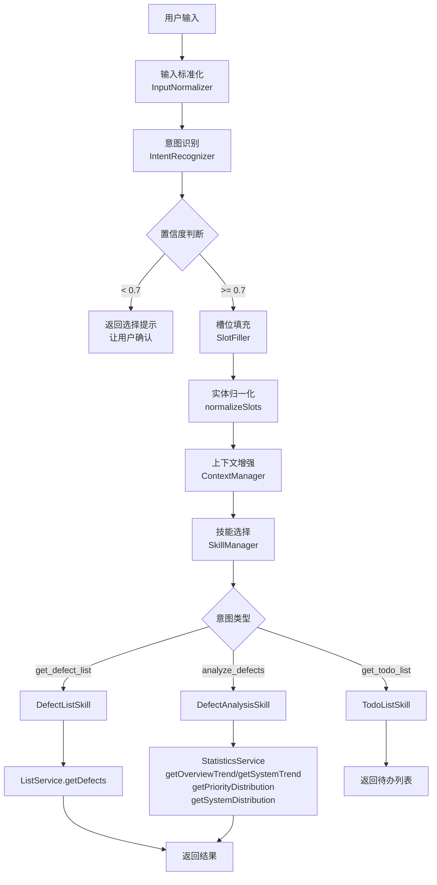
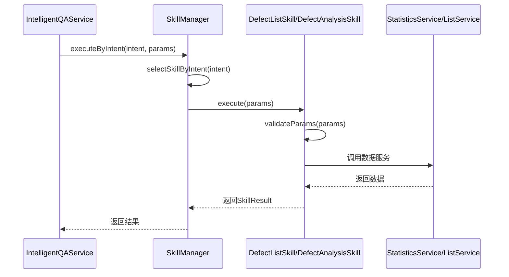
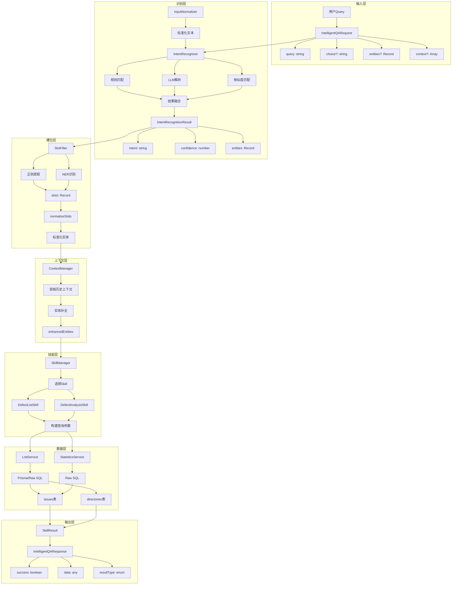

# 缺陷管理助手功能深度分析报告

## 一、工作流程梳理

### 1.1 整体工作流程



### 1.2 用户输入处理流程

**流程说明：**

1. **输入接收** (IntelligentQAService.ts#L23-L38)
   - 接收 `IntelligentQARequest` 对象，包含 query、choice、entities、context
   - 进行类型检查，确保 query 是字符串

2. **输入标准化** (IntentRecognizer.ts#L240-L241)
   - 使用 `InputNormalizer.normalize()` 清理输入
   - 转换为小写便于匹配

3. **同义词扩展** (IntentRecognizer.ts#L256)
   - 扩展查询，添加同义词库中的相关词汇

### 1.3 意图识别流程

**多策略融合识别：**


**关键代码分析：**

1. **规则匹配** (IntentRecognizer.ts#L450-L486)
   - 基于优先级排序的规则库
   - 支持 includes、regex、startsWith、endsWith 条件类型
   - 支持 negate 否定条件

2. **LLM解析** (LLMIntentParser.ts#L59-L95)
   - 调用 DeepSeek API 进行意图识别
   - 提取实体信息
   - 返回置信度评估

3. **结果融合** (IntentRecognizer.ts#L397-L422)
   - 规则匹配与LLM结果融合
   - 相同意图时取最高置信度
   - 不同意图时选择置信度更高的

### 1.4 技能执行流程

**SkillManager 执行流程：**



### 1.5 数据查询流程

**ListService 查询流程：**

1. **参数解析** (listService.ts#L13-L31)
2. **动态获取 parentIds** (listService.ts#L525-L589)
3. **构建 WHERE 子句** (listService.ts#L51-L250)
4. **执行 SQL 查询** (listService.ts#L323-L340)

**StatisticsService 统计流程：**

1. **缓存检查** (statisticsService.ts#L114-L118)
2. **日期范围计算** (statisticsService.ts#L121-L166)
3. **构建 SQL** (statisticsService.ts#L586-L626)
4. **数据合并** (statisticsService.ts#L629-L666)

---

## 二、核心组件分析

### 2.1 IntelligentQAService

**职责：** 智能问答服务的入口，协调整个处理流程

**关键方法：**
- `processRequest()` - 主处理流程 (IntelligentQAService.ts#L23-L696)
- `initializeSkills()` - 初始化技能

**核心逻辑分析：**

1. **意图分支处理** (IntelligentQAService.ts#L97-L201)
   - `get_project_defects` - 项目级别缺陷查询
   - `get_defect_situation` - 缺陷情况查询（列表/趋势选择）
   - `analyze_defects` - 缺陷分析
   - `get_defect_list` - 缺陷列表查询

2. **时间范围处理** (IntelligentQAService.ts#L122-L173)
   - 检查 `timeRangeExplicit` 标记
   - 未明确时返回时间范围选择选项

3. **Choice 参数处理** (IntelligentQAService.ts#L229-L483)
   - 根据用户选择执行不同逻辑
   - 区分列表查询和趋势分析

### 2.2 IntentRecognizer

**职责：** 多策略意图识别

**核心能力：**
- 规则匹配（基于关键词、正则）
- LLM 语义理解
- 上下文感知
- 同义词扩展
- 结果融合

**关键属性：**
```typescript
// 同义词库
private synonymMap: Record<string, string[]>
// 意图层次结构
private intentHierarchy: Record<string, { parent?: string; keywords: string[]; synonyms: string[] }>
// 规则库
private rules: Rule[]
```

**识别策略优先级：**
1. 上下文匹配（短句+时间/状态词）
2. 规则匹配（高优先级规则优先）
3. 关键词匹配（意图层次结构）
4. 相似度匹配（模糊匹配）
5. LLM 语义解析

### 2.3 SkillManager

**职责：** 技能注册与调度

**设计模式：** 策略模式 + 单例模式

**技能注册：**
```typescript
private initializeSkills(): void {
  this.registerSkill(DefectListSkill);
  this.registerSkill(DefectAnalysisSkill);
  this.registerSkill(TodoListSkill);
  this.registerSkill(NotificationSkill);
  this.registerSkill(DocumentGeneratorSkill);
  this.registerSkill(DataExportSkill);
}
```

**意图到技能的映射：**
- `get_defect_list` -> DefectListSkill
- `analyze_defects` -> DefectAnalysisSkill
- `get_todo_list` -> TodoListSkill
- `send_notification` -> NotificationSkill
- `generate_document` -> DocumentGeneratorSkill
- `export_data` -> DataExportSkill

### 2.4 DefectAnalysisSkill

**职责：** 缺陷数据分析

**分析类型：**
| 分析类型 | 说明 | 数据源 |
|---------|------|--------|
| `trend` | 趋势分析 | getSystemTrend + getPriorityDistribution |
| `project_analysis` | 项目分析 | getOverviewTrend + getPriorityDistribution + getSystemDistribution |
| `project_overview` | 项目概览 | 同上 |
| `system_analysis` | 系统分析 | getSystemTrend + getPriorityDistribution |
| `system_distribution` | 系统分布 | getSystemDistribution |
| `priority_distribution` | 优先级分布 | getPriorityDistribution |

**代码问题分析：**

1. **重复代码** (DefectAnalysisSkill.ts#L31-L72)
   - `project_analysis` 和 `project_overview` 逻辑几乎相同
   - 多处重复调用相同的数据服务

2. **参数处理不一致**
   - `parentId` 默认值 `'2980'` 硬编码
   - 未验证 `timeRange` 参数有效性

### 2.5 DefectListSkill

**职责：** 缺陷列表查询

**时间范围处理：**

支持的时间范围类型：
- 相对时间：`week`, `month`, `quarter`, `year`
- 固定时间：`last_week_fixed`, `last_month_fixed`, `last_quarter_fixed`, `last_year_fixed`
- 当前时间：`current_week`, `current_month`, `current_quarter`, `current_year`
- 单日：`day`, `yesterday`
- 全部：`all`

**问题分析：**

1. **硬编码映射** (DefectListSkill.ts#L29-L34)
   ```typescript
   // 硬编码的系统到项目映射
   if (firstSystemId === 2983 || firstSystemId === 2981 || firstSystemId === 2984) {
     projectId = '2980';
   }
   ```

2. **时间范围逻辑复杂** (DefectListSkill.ts#L50-L189)
   - 代码冗长，可提取为独立的时间处理工具

### 2.6 StatisticsService

**职责：** 统计数据服务

**核心方法：**

| 方法 | 功能 | 缓存键格式 |
|------|------|-----------|
| `getOverviewTrend` | 项目汇总趋势 | `trend_overview_${type}_${timeRange}` |
| `getSystemTrend` | 系统趋势 | `trend_system_${parentId}_${type}_${timeRange}` |
| `getSystemDistribution` | 系统分布 | `distribution_system_${urgentOnly}_${parentId}_${timeRange}` |
| `getPriorityDistribution` | 优先级分布 | `distribution_priority_${parentId}_${timeRange}` |

**缓存策略：**
- TTL: 5分钟（可配置）
- 使用 `serviceStartTimestamp` 确保服务重启后缓存失效

**SQL 构建问题：**

1. **SQL 注入风险** (statisticsService.ts#L397-L407)
   ```typescript
   const sql = `
     SELECT parent_id as directory_id, COUNT(*) as value
     FROM issues
     WHERE created_on >= '${startDate}'  // 直接字符串拼接
   `;
   ```

2. **重复代码** - 多个方法中重复的时间范围计算逻辑

### 2.7 ListService

**职责：** 缺陷列表查询服务

**核心功能：**
- 分页查询
- 多条件筛选（状态、优先级、分配人、时间等）
- 待办任务特殊处理
- 动态目录结构获取

**待办任务特殊逻辑：** (listService.ts#L92-L109)

```typescript
if (is_todo) {
  // 强制应用待办筛选条件
  whereClause += ` AND ((i.assigned_to_id = ${todoAssignedToId} AND i.status_id != ${todoResolvedStatusId}) OR i.status_id = 3)`;
}
```

**问题分析：**

1. **缓存键过长** (listService.ts#L34)
   - 包含所有参数，可读性差

2. **SQL 构建复杂** (listService.ts#L51-L250)
   - 条件分支过多
   - 嵌套层级深

---

## 三、数据流向分析

### 3.1 数据流向图



### 3.2 实体转换流程

```
用户输入: "查看低代码本周的紧急问题"

↓ 标准化
"查看低代码本周的紧急问题"

↓ SlotFiller.regexExtract
{
  systemId: "2981",
  system: "低代码",
  systemName: "低代码",
  priorityId: 4,
  priority: "紧急",
  priorityIds: [4],
  timeRange: "current_week",
  timeRangeName: "本周",
  timeRangeExplicit: true
}

↓ normalizeSlots
{
  systemId: 2981,
  systemName: "低代码",
  system: "低代码",  // 兼容字段
  priorityId: 4,
  priorityIds: [4],
  timeRange: "current_week",
  timeRangeExplicit: true
}

↓ ContextManager.enhanceWithContext
// 补充缺失的实体（如从上下文获取）

↓ Skill.execute
// 转换为服务层参数
{
  system_id: 2981,
  priority_id: 4,
  startDate: "2026-02-03T00:00:00.000Z",
  endDate: "2026-02-09T23:59:59.999Z"
}
```

---

## 四、当前实现存在的问题

### 4.1 代码逻辑问题

#### 4.1.1 重复代码严重

**问题位置：** DefectAnalysisSkill.ts

```typescript
// 重复的数据获取逻辑
if (projectMapping && projectMapping.systems.length > 0) {
  const systemIds = projectMapping.systems.map(s => s.id);
  const trendData = await statisticsService.getOverviewTrend(statisticsType, timeRange, undefined);
  const priorityDistribution = await statisticsService.getPriorityDistribution(undefined, timeRange);
  const systemDistribution = await statisticsService.getSystemDistribution(false, undefined, timeRange);
  // ...
} else {
  const trendData = await statisticsService.getOverviewTrend(statisticsType, timeRange, undefined);
  const priorityDistribution = await statisticsService.getPriorityDistribution(undefined, timeRange);
  const systemDistribution = await statisticsService.getSystemDistribution(false, undefined, timeRange);
  // ...
}
```

**影响：** 维护困难，一处修改需要多处同步

#### 4.1.2 硬编码值过多

| 位置 | 硬编码值 | 问题 |
|------|---------|------|
| DefectAnalysisSkill.ts#L17 | `parentId = '2980'` | 默认项目ID硬编码 |
| DefectListSkill.ts#L32 | `firstSystemId === 2983 \|\| 2981 \|\| 2984` | 系统ID硬编码 |
| IntelligentQAService.ts#L592 | `parentId: intentResult.entities['parentId'] \|\| '2980'` | 默认parentId硬编码 |
| listService.ts#L88-L89 | `TODO_ASSIGNED_TO_ID=130` | 用户ID硬编码 |

#### 4.1.3 复杂的条件分支

**问题位置：** IntelligentQAService.ts#L229-L483

`get_defect_situation` 意图的处理逻辑超过250行，包含多层嵌套条件：
- choice 是否存在
- choice 的值类型（timeRangeChoices / 问题列表 / 问题趋势分析）
- isList / isAnalysis 标记判断
- timeRangeExplicit 判断

**影响：** 可读性差，容易引入bug

### 4.2 数据一致性问题

#### 4.2.1 时间范围处理不一致

不同组件对时间范围的处理方式不同：

| 组件 | 处理方式 | 问题 |
|------|---------|------|
| SlotFiller | 正则匹配，设置 `timeRangeExplicit=true` | 只识别部分时间格式 |
| DefectListSkill | 复杂的 switch-case 处理 | 代码冗长 |
| StatisticsService | 再次计算时间范围 | 重复计算 |

#### 4.2.2 实体字段命名不一致

```typescript
// SlotFiller 输出
{ systemId, system, systemName }

// normalizeSlots 处理
{ systemId, systemName, system(兼容) }

// Skill 使用
{ system_id: systemId }
```

#### 4.2.3 缓存键生成不一致

**ListService:** (listService.ts#L34)
```typescript
const cacheKey = `defects_${page}_${pageSize}_${id || ''}_..._${is_todo ? 'todo' : 'normal'}`;
```

**StatisticsService:** (statisticsService.ts#L111)
```typescript
const cacheKey = `trend_overview_${type}_${timeRange || 'all'}_${this.serviceStartTimestamp}`;
```

### 4.3 性能问题

#### 4.3.1 N+1 查询问题

**问题位置：** SlotFiller.ts#L371-L403

```typescript
private async loadSystemPatterns(): Promise<void> {
  const projects = await mysqlProjectMappingService.getAllProjects();
  for (const project of projects) {
    const projectMapping = await mysqlProjectMappingService.getProjectMapping(project.id);
    // 每个项目都查询一次
  }
}
```

#### 4.3.2 重复数据库查询

**问题位置：** statisticsService.ts#L31-L56

`getAllChildDirectoryIds` 递归查询，每个目录都发起一次查询：
```typescript
private async getAllChildDirectoryIds(parentId: string): Promise<number[]> {
  const childDirectories = await prisma.directories.findMany({...});
  for (const dir of childDirectories) {
    const grandChildIds = await this.getAllChildDirectoryIds(dir.id); // 递归查询
  }
}
```

#### 4.3.3 缓存策略问题

1. **缓存粒度太细** - 每个参数组合都生成不同缓存键
2. **缓存未命中率高** - 用户查询参数组合多样
3. **缓存清理不及时** - 依赖TTL，数据更新后缓存可能过期

### 4.4 可维护性问题

#### 4.4.1 缺乏统一的错误处理

不同组件的错误处理方式不一致：
- 有些返回 `{ success: false, error: string }`
- 有些抛出异常
- 有些返回空对象

#### 4.4.2 类型定义不完善

```typescript
// 多处使用 any 类型
async execute(params: Record<string, any>): Promise<SkillResult>
private async extractEntities(query: string, intent: string, llmEntities?: Record<string, any>)
```

#### 4.4.3 缺乏单元测试

代码中没有看到测试文件，复杂逻辑缺乏测试覆盖。

#### 4.4.4 文档缺失

- 复杂的业务逻辑缺乏注释
- 意图识别规则没有文档说明
- 数据流转过程不清晰

---

## 五、优化建议

### 5.1 架构优化

#### 5.1.1 引入中间件模式

```typescript
// 建议的管道式处理架构
class QAProcessor {
  private middlewares: Middleware[] = [
    new InputValidationMiddleware(),
    new IntentRecognitionMiddleware(),
    new SlotFillingMiddleware(),
    new ContextEnhancementMiddleware(),
    new SkillExecutionMiddleware(),
    new ResponseFormattingMiddleware()
  ];
  
  async process(request: IntelligentQARequest): Promise<IntelligentQAResponse> {
    const context = new QAContext(request);
    for (const middleware of this.middlewares) {
      await middleware.process(context);
      if (context.isComplete) break;
    }
    return context.response;
  }
}
```

#### 5.1.2 统一实体模型

```typescript
// 建议的统一实体定义
interface DefectQueryEntity {
  project?: { id: number; name: string };
  system?: { id: number; name: string };
  module?: { id: number; name: string };
  status?: { id: number; name: string }[];
  priority?: { id: number; name: string }[];
  assignee?: { id: number | 'current_user'; name?: string };
  timeRange?: {
    type: 'relative' | 'absolute' | 'fixed';
    value: string;
    startDate: Date;
    endDate: Date;
    isExplicit: boolean;
  };
  pagination?: { page: number; pageSize: number };
  sort?: { field: string; direction: 'asc' | 'desc' };
}
```

#### 5.1.3 提取时间处理服务

```typescript
class TimeRangeService {
  parseTimeRange(input: string): TimeRange | null;
  calculateDateRange(timeRange: TimeRange): { start: Date; end: Date };
  toSQLCondition(timeRange: TimeRange, field: string): SQLCondition;
}
```

### 5.2 代码优化

#### 5.2.1 消除重复代码

**重构 DefectAnalysisSkill：**

```typescript
class DefectAnalysisSkill implements Skill {
  private async fetchAnalysisData(params: AnalysisParams): Promise<AnalysisData> {
    const { timeRange, parentId } = params;
    
    // 统一的数据获取
    const [trendData, priorityDistribution, systemDistribution] = await Promise.all([
      this.getTrendData(params),
      statisticsService.getPriorityDistribution(parentId, timeRange),
      parentId === '2980' ? statisticsService.getSystemDistribution(false, undefined, timeRange) : Promise.resolve(null)
    ]);
    
    return { trendData, priorityDistribution, systemDistribution };
  }
  
  async execute(params: Record<string, any>): Promise<SkillResult> {
    const analysisType = params.analysisType || 'trend';
    const data = await this.fetchAnalysisData(params);
    
    // 根据类型返回不同视图
    switch (analysisType) {
      case 'trend': return { data: { trendData: data.trendData, priorityDistribution: data.priorityDistribution } };
      case 'project_overview': return { data };
      // ...
    }
  }
}
```

#### 5.2.2 配置化硬编码值

```typescript
// config/defaults.ts
export const DEFAULTS = {
  PROJECT_ID: process.env.DEFAULT_PROJECT_ID || '2980',
  TODO_ASSIGNED_TO_ID: parseInt(process.env.TODO_ASSIGNED_TO_ID || '130'),
  TODO_RESOLVED_STATUS_ID: parseInt(process.env.TODO_RESOLVED_STATUS_ID || '5'),
  SYSTEM_PROJECT_MAPPINGS: JSON.parse(process.env.SYSTEM_PROJECT_MAPPINGS || '{"2980":[2981,2983,2984]}')
};
```

#### 5.2.3 简化条件分支

**重构 IntelligentQAService 的 choice 处理：**

```typescript
// 使用策略模式
const choiceHandlers: Record<string, ChoiceHandler> = {
  '问题列表': new DefectListHandler(),
  '问题趋势分析': new DefectTrendHandler(),
  'last_week_fixed': new TimeRangeHandler('last_week_fixed'),
  'last_month_fixed': new TimeRangeHandler('last_month_fixed'),
  // ...
};

async handleChoice(choice: string, context: QAContext): Promise<IntelligentQAResponse> {
  const handler = choiceHandlers[choice];
  if (!handler) {
    return { success: false, message: '无效的选择' };
  }
  return handler.handle(context);
}
```

### 5.3 性能优化

#### 5.3.1 优化数据库查询

**批量查询替代递归：**

```typescript
// 优化后的 getAllChildDirectoryIds
async getAllChildDirectoryIds(parentId: string): Promise<number[]> {
  // 一次性获取所有目录，在内存中构建树
  const allDirectories = await prisma.directories.findMany();
  const directoryMap = new Map(allDirectories.map(d => [d.id, d]));
  
  const result: number[] = [];
  const queue = [parentId];
  
  while (queue.length > 0) {
    const currentId = queue.shift()!;
    const children = allDirectories.filter(d => d.parent_id === currentId);
    for (const child of children) {
      result.push(parseInt(child.id));
      queue.push(child.id);
    }
  }
  
  return result;
}
```

#### 5.3.2 优化缓存策略

```typescript
class OptimizedStatisticsService {
  // 使用分层缓存
  private l1Cache: Map<string, any>; // 内存缓存，TTL 1分钟
  private l2Cache: Map<string, any>; // 内存缓存，TTL 5分钟
  
  // 缓存预热
  async warmupCache(): Promise<void> {
    const commonTimeRanges = ['week', 'month', 'quarter'];
    for (const range of commonTimeRanges) {
      await this.getOverviewTrend('all', range);
    }
  }
  
  // 缓存失效通知
  invalidateCache(pattern: string): void {
    // 支持通配符失效
  }
}
```

#### 5.3.3 异步并行处理

```typescript
// 并行执行独立的意图识别策略
async recognizeIntent(query: string): Promise<IntentResult> {
  const [ruleResult, llmResult, similarityResult] = await Promise.allSettled([
    this.matchByRule(query),
    this.callLLM(query),
    this.matchBySimilarity(query)
  ]);
  
  return this.fuseResults(ruleResult, llmResult, similarityResult);
}
```

### 5.4 可维护性优化

#### 5.4.1 完善类型定义

```typescript
// types/intelligentQa.ts
export type Intent = 
  | 'get_defect_list'
  | 'analyze_defects'
  | 'get_todo_list'
  | 'send_notification'
  | 'generate_document'
  | 'export_data'
  | 'get_defect_situation'
  | 'get_project_defects'
  | 'unknown';

export interface DefectQueryParams {
  page: number;
  pageSize: number;
  filters: {
    projectId?: number;
    systemId?: number;
    moduleId?: number;
    statusIds?: number[];
    priorityIds?: number[];
    assigneeId?: number;
    dateRange?: { start: Date; end: Date };
  };
  sort?: { field: SortableField; direction: SortDirection };
}
```

#### 5.4.2 统一的错误处理

```typescript
// errors/QAErrors.ts
export class QAError extends Error {
  constructor(
    message: string,
    public code: string,
    public userMessage: string,
    public suggestions?: string[]
  ) {
    super(message);
  }
}

export class IntentRecognitionError extends QAError {
  constructor(message: string) {
    super(message, 'INTENT_RECOGNITION_FAILED', '无法理解您的意图，请尝试其他表述');
  }
}

// 统一的错误处理中间件
async function errorHandler(error: Error): Promise<IntelligentQAResponse> {
  if (error instanceof QAError) {
    return {
      success: false,
      message: error.userMessage,
      error: error.code,
      suggestions: error.suggestions
    };
  }
  // 默认错误处理
  logger.error('Unhandled error:', error);
  return {
    success: false,
    message: '系统繁忙，请稍后重试',
    error: 'INTERNAL_ERROR'
  };
}
```

#### 5.4.3 增加日志追踪

```typescript
// 使用结构化日志
logger.info('Intent recognition started', {
  requestId: context.requestId,
  query: request.query,
  userId: context.userId
});

logger.info('Intent recognized', {
  requestId: context.requestId,
  intent: result.intent,
  confidence: result.confidence,
  entities: result.entities,
  duration: Date.now() - startTime
});
```

#### 5.4.4 添加单元测试

```typescript
// __tests__/IntentRecognizer.test.ts
describe('IntentRecognizer', () => {
  describe('recognizeIntent', () => {
    it('should recognize defect list intent', async () => {
      const result = await intentRecognizer.recognizeIntent('查看低代码的问题列表');
      expect(result.intent).toBe('get_defect_list');
      expect(result.entities.systemId).toBe(2981);
    });
    
    it('should handle unknown intent', async () => {
      const result = await intentRecognizer.recognizeIntent('今天天气怎么样');
      expect(result.intent).toBe('unknown');
    });
  });
});
```

---

## 六、总结

### 6.1 当前架构评估

| 维度 | 评分 | 说明 |
|------|------|------|
| 功能完整性 | 良好 | 支持主要的缺陷查询和分析功能 |
| 代码质量 | 一般 | 存在重复代码和硬编码问题 |
| 性能 | 一般 | 存在N+1查询和缓存策略问题 |
| 可维护性 | 较差 | 复杂条件分支，缺乏测试 |
| 扩展性 | 一般 | Skill模式支持扩展，但耦合度较高 |

### 6.2 优先优化项

1. **高优先级**
   - 修复 SQL 注入风险
   - 优化 N+1 查询问题
   - 提取硬编码配置

2. **中优先级**
   - 重构复杂条件分支
   - 统一实体模型
   - 完善错误处理

3. **低优先级**
   - 添加单元测试
   - 完善文档
   - 性能监控

### 6.3 重构路线图

```
Phase 1: 安全与性能（1-2周）
  - 修复 SQL 注入
  - 优化数据库查询
  - 配置化硬编码值

Phase 2: 代码质量（2-3周）
  - 消除重复代码
  - 简化条件分支
  - 统一实体模型

Phase 3: 可维护性（1-2周）
  - 完善类型定义
  - 统一错误处理
  - 添加单元测试
```

---

## 附录：关键文件位置

| 文件 | 路径 | 说明 |
|------|------|------|
| IntelligentQAService.ts | src/services/intelligentQa/IntelligentQAService.ts | 智能问答服务入口 |
| IntentRecognizer.ts | src/services/intelligentQa/IntentRecognizer.ts | 意图识别器 |
| SkillManager.ts | src/services/intelligentQa/SkillManager.ts | 技能管理器 |
| DefectAnalysisSkill.ts | src/services/intelligentQa/skills/DefectAnalysisSkill.ts | 缺陷分析技能 |
| DefectListSkill.ts | src/services/intelligentQa/skills/DefectListSkill.ts | 缺陷列表技能 |
| StatisticsService.ts | src/services/statisticsService.ts | 统计服务 |
| ListService.ts | src/services/listService.ts | 列表服务 |
| SlotFiller.ts | src/services/intelligentQa/slots.ts | 槽位填充器 |
| LLMIntentParser.ts | src/services/intelligentQa/LLMIntentParser.ts | LLM意图解析器 |

---

*报告生成时间：2026-02-11*
*版本：v1.0*
