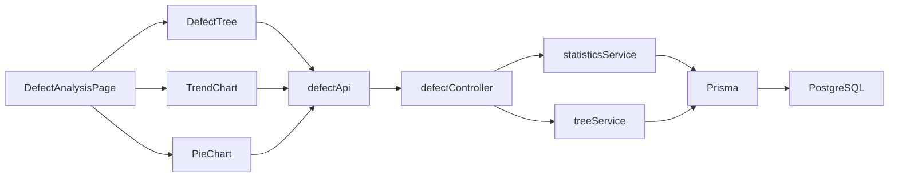
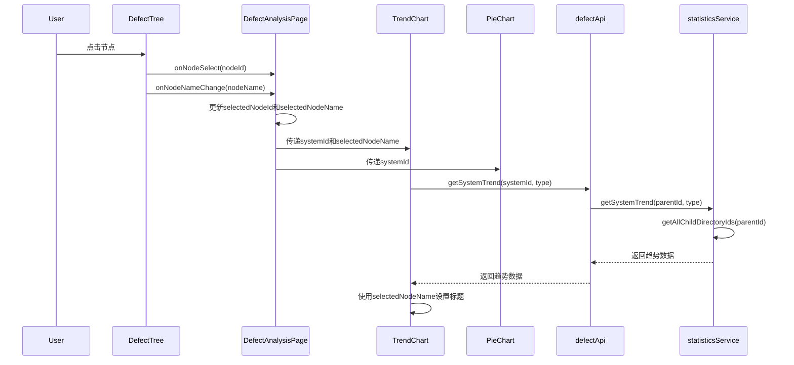
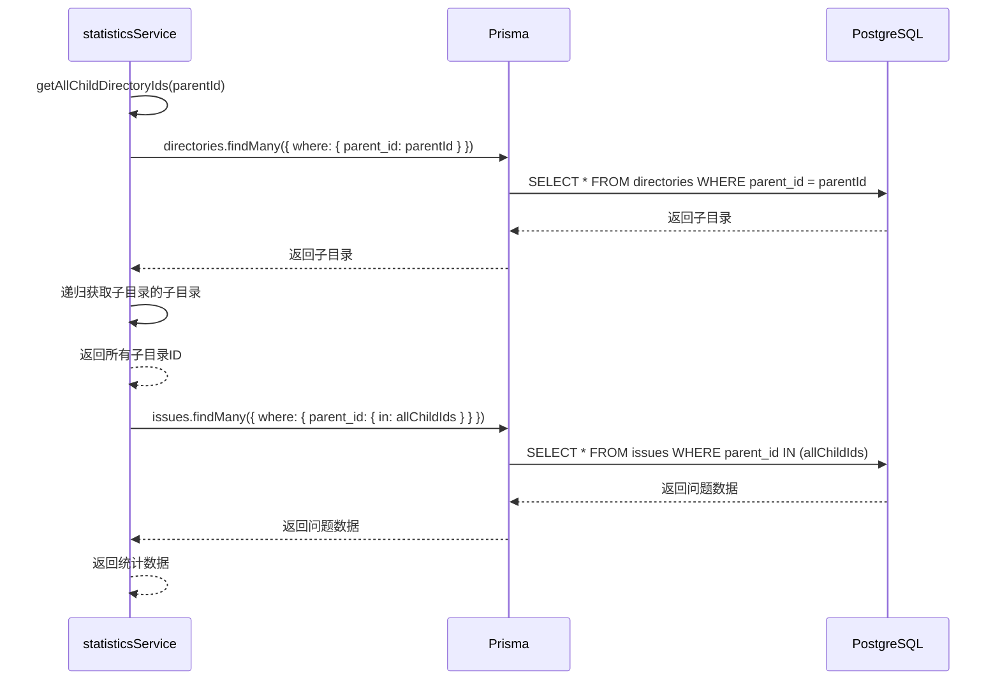

# 缺陷管理数据分析页面功能优化 - DESIGN

## 1. 整体架构图

```mermaid
graph TB
    subgraph 前端层
        A[DefectAnalysisPage] --> B[DefectTree]
        A --> C[TrendChart]
        A --> D[PieChart]
        B -->|onNodeSelect| A
        B -->|onNodeNameChange| A
        A -->|systemId| C
        A -->|selectedNodeName| C
        A -->|systemId| D
    end

    subgraph API层
        E[defectApi] --> F[/defects/tree]
        E --> G[/defects/statistics/system/:systemId/trend]
        E --> H[/defects/statistics/system/:systemId/pie/system]
        E --> I[/defects/statistics/system/:systemId/pie/priority]
    end

    subgraph 控制器层
        F --> J[defectController.getTree]
        G --> K[defectController.getSystemTrend]
        H --> L[defectController.getSystemSystemDistribution]
        I --> M[defectController.getSystemPriorityDistribution]
    end

    subgraph 服务层
        J --> N[treeService.buildTree]
        K --> O[statisticsService.getSystemTrend]
        L --> P[statisticsService.getSystemDistribution]
        M --> Q[statisticsService.getPriorityDistribution]
        O --> R[getAllChildDirectoryIds]
        P --> R
        Q --> R
    end

    subgraph 数据层
        N --> S[(Prisma)]
        R --> S
        S --> T[(PostgreSQL)]
    end

    A --> E
```

## 2. 分层设计和核心组件

### 2.1 前端层

#### 2.1.1 DefectAnalysisPage
**职责**:
- 管理选中节点ID和名称的状态
- 协调DefectTree、TrendChart、PieChart组件
- 处理项目管理根节点的特殊逻辑

**核心方法**:
- `handleNodeSelect(nodeId: number)`: 处理节点选择
- `handleNodeNameChange(nodeName: string)`: 处理节点名称变化

**状态**:
- `selectedNodeId`: 选中的节点ID
- `selectedNodeName`: 选中的节点名称

#### 2.1.2 DefectTree
**职责**:
- 展示目录树结构
- 处理节点选择事件
- 传递节点名称给父组件

**核心方法**:
- `handleSelect(selectedKeys: React.Key[], info: any)`: 处理节点选择
- `renderTreeNode(node: DefectTreeNode)`: 渲染树节点

**回调**:
- `onNodeSelect(nodeId: number)`: 通知父组件节点已选择
- `onNodeNameChange(nodeName: string)`: 通知父组件节点名称已变化

#### 2.1.3 TrendChart
**职责**:
- 展示趋势折线图
- 动态设置图表标题

**核心方法**:
- `fetchTrendData()`: 获取趋势数据
- `handleTrendTypeChange(value: 'all' | 'urgent')`: 处理趋势类型变化

**属性**:
- `systemId?: number`: 系统ID
- `selectedNodeName?: string`: 选中节点的名称

#### 2.1.4 PieChart
**职责**:
- 展示分布饼图

**核心方法**:
- `fetchDistributionData()`: 获取分布数据

**属性**:
- `type: 'system' | 'priority'`: 饼图类型
- `systemId?: number`: 系统ID

### 2.2 后端层

#### 2.2.1 statisticsService
**职责**:
- 提供统计数据查询服务
- 递归查询所有子节点的问题数据

**核心方法**:
- `getSystemTrend(parentId: string, type: 'all' | 'urgent', timeRange?: string)`: 获取系统趋势数据
- `getSystemDistribution(urgentOnly?: boolean, parentId?: string, timeRange?: string)`: 获取系统分布饼图数据
- `getPriorityDistribution(parentId?: string, timeRange?: string)`: 获取优先级分布饼图数据
- `getAllChildDirectoryIds(parentId: string)`: 递归获取所有子目录ID

## 3. 模块依赖关系图



## 4. 接口契约定义

### 4.1 前端组件接口

#### 4.1.1 DefectTreeProps
```typescript
interface DefectTreeProps {
  onNodeSelect?: (nodeId: number) => void;
  onNodeNameChange?: (nodeName: string) => void;
  selectedNodeId?: number;
}
```

#### 4.1.2 TrendChartProps
```typescript
interface TrendChartProps {
  systemId?: number;
  selectedNodeName?: string;
}
```

#### 4.1.3 PieChartProps
```typescript
interface PieChartProps {
  type: 'system' | 'priority';
  systemId?: number;
}
```

### 4.2 后端服务接口

#### 4.2.1 getSystemTrend
```typescript
async getSystemTrend(parentId: string, type: 'all' | 'urgent', timeRange?: string): Promise<TrendData>
```

**输入**:
- `parentId`: 父节点ID
- `type`: 趋势类型（'all' | 'urgent'）
- `timeRange`: 时间范围（可选）

**输出**:
- `TrendData`: 趋势数据

#### 4.2.2 getSystemDistribution
```typescript
async getSystemDistribution(urgentOnly?: boolean, parentId?: string, timeRange?: string): Promise<DistributionData[]>
```

**输入**:
- `urgentOnly`: 是否只统计紧急问题（可选）
- `parentId`: 父节点ID（可选）
- `timeRange`: 时间范围（可选）

**输出**:
- `DistributionData[]`: 分布数据数组

#### 4.2.3 getPriorityDistribution
```typescript
async getPriorityDistribution(parentId?: string, timeRange?: string): Promise<DistributionData[]>
```

**输入**:
- `parentId`: 父节点ID（可选）
- `timeRange`: 时间范围（可选）

**输出**:
- `DistributionData[]`: 分布数据数组

#### 4.2.4 getAllChildDirectoryIds
```typescript
private async getAllChildDirectoryIds(parentId: string): Promise<number[]>
```

**输入**:
- `parentId`: 父节点ID

**输出**:
- `number[]`: 所有子目录ID数组

## 5. 数据流向图

### 5.1 节点选择流程


### 5.2 数据查询流程


## 6. 异常处理策略

### 6.1 前端异常处理

#### 6.1.1 数据加载失败
- 显示错误提示信息
- 提供重试按钮

#### 6.1.2 网络错误
- 显示网络错误提示
- 提供重试按钮

### 6.2 后端异常处理

#### 6.2.1 数据库查询失败
- 记录错误日志
- 返回空数据或默认值

#### 6.2.2 参数验证失败
- 返回错误信息
- 记录错误日志

## 7. 设计原则

### 7.1 复用现有组件和模式
- 复用现有的 `DefectTree`、`TrendChart`、`PieChart` 组件
- 复用现有的 `statisticsService` 服务
- 复用现有的 `defectApi` API

### 7.2 保持与现有系统架构一致
- 不修改数据库结构
- 不改变现有的API接口设计
- 保持现有的图表展示方式

### 7.3 质量门控
- 架构图清晰准确
- 接口定义完整
- 与现有系统无冲突
- 设计可行性验证
