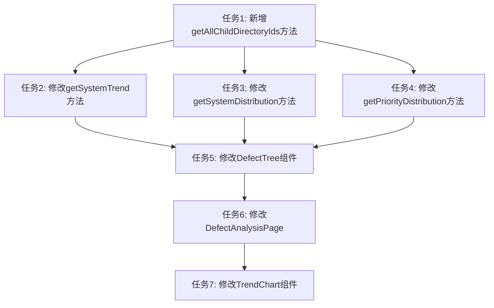

# 缺陷管理数据分析页面功能优化 - TASK

## 1. 子任务拆分

### 1.1 任务1：后端 - 新增getAllChildDirectoryIds方法

**输入契约**:
- 前置依赖: 无
- 输入数据: `parentId: string`
- 环境依赖: Prisma客户端已初始化

**输出契约**:
- 输出数据: `number[]` - 所有子目录ID数组
- 交付物: `getAllChildDirectoryIds` 方法实现
- 验收标准:
  - 能够递归获取所有子目录ID
  - 包括子目录的子目录

**实现约束**:
- 技术栈: TypeScript + Prisma
- 接口规范: 私有方法
- 质量要求: 递归查询性能良好

**依赖关系**:
- 后置任务: 任务2、任务3、任务4
- 并行任务: 无

### 1.2 任务2：后端 - 修改getSystemTrend方法

**输入契约**:
- 前置依赖: 任务1
- 输入数据: `parentId: string, type: 'all' | 'urgent', timeRange?: string`
- 环境依赖: Prisma客户端已初始化

**输出契约**:
- 输出数据: `TrendData` - 趋势数据
- 交付物: 修改后的 `getSystemTrend` 方法
- 验收标准:
  - 使用 `getAllChildDirectoryIds` 方法获取所有子目录ID
  - 使用 `IN` 子句查询所有子节点的问题数据
  - 统计数据包括所有层级的子节点

**实现约束**:
- 技术栈: TypeScript + Prisma
- 接口规范: 公共方法，保持现有接口签名
- 质量要求: 查询性能良好

**依赖关系**:
- 后置任务: 任务5
- 并行任务: 任务3、任务4

### 1.3 任务3：后端 - 修改getSystemDistribution方法

**输入契约**:
- 前置依赖: 任务1
- 输入数据: `urgentOnly?: boolean, parentId?: string, timeRange?: string`
- 环境依赖: Prisma客户端已初始化

**输出契约**:
- 输出数据: `DistributionData[]` - 分布数据数组
- 交付物: 修改后的 `getSystemDistribution` 方法
- 验收标准:
  - 使用 `getAllChildDirectoryIds` 方法获取所有子目录ID
  - 使用 `IN` 子句查询所有子节点的问题数据
  - 统计数据包括所有层级的子节点

**实现约束**:
- 技术栈: TypeScript + Prisma
- 接口规范: 公共方法，保持现有接口签名
- 质量要求: 查询性能良好

**依赖关系**:
- 后置任务: 任务5
- 并行任务: 任务2、任务4

### 1.4 任务4：后端 - 修改getPriorityDistribution方法

**输入契约**:
- 前置依赖: 任务1
- 输入数据: `parentId?: string, timeRange?: string`
- 环境依赖: Prisma客户端已初始化

**输出契约**:
- 输出数据: `DistributionData[]` - 分布数据数组
- 交付物: 修改后的 `getPriorityDistribution` 方法
- 验收标准:
  - 使用 `getAllChildDirectoryIds` 方法获取所有子目录ID
  - 使用 `IN` 子句查询所有子节点的问题数据
  - 统计数据包括所有层级的子节点

**实现约束**:
- 技术栈: TypeScript + Prisma
- 接口规范: 公共方法，保持现有接口签名
- 质量要求: 查询性能良好

**依赖关系**:
- 后置任务: 任务5
- 并行任务: 任务2、任务3

### 1.5 任务5：前端 - 修改DefectTree组件

**输入契约**:
- 前置依赖: 无
- 输入数据: `DefectTreeProps` - 组件属性
- 环境依赖: React已初始化

**输出契约**:
- 输出数据: 无
- 交付物: 修改后的 `DefectTree` 组件
- 验收标准:
  - 新增 `onNodeNameChange` 回调属性
  - 在节点选择时调用 `onNodeNameChange` 回调，传递节点名称

**实现约束**:
- 技术栈: React + TypeScript
- 接口规范: 组件属性接口
- 质量要求: 保持现有代码风格

**依赖关系**:
- 后置任务: 任务6
- 并行任务: 无

### 1.6 任务6：前端 - 修改DefectAnalysisPage

**输入契约**:
- 前置依赖: 任务5
- 输入数据: 无
- 环境依赖: React已初始化

**输出契约**:
- 输出数据: 无
- 交付物: 修改后的 `DefectAnalysisPage` 组件
- 验收标准:
  - 维护 `selectedNodeName` 状态
  - 处理 `onNodeNameChange` 回调，更新 `selectedNodeName` 状态
  - 处理项目管理根节点（ID: 0）的特殊逻辑，不展示统计数据
  - 传递 `selectedNodeName` 给 `TrendChart` 组件

**实现约束**:
- 技术栈: React + TypeScript
- 接口规范: 组件状态管理
- 质量要求: 保持现有代码风格

**依赖关系**:
- 后置任务: 任务7
- 并行任务: 无

### 1.7 任务7：前端 - 修改TrendChart组件

**输入契约**:
- 前置依赖: 任务6
- 输入数据: `TrendChartProps` - 组件属性
- 环境依赖: React已初始化

**输出契约**:
- 输出数据: 无
- 交付物: 修改后的 `TrendChart` 组件
- 验收标准:
  - 新增 `selectedNodeName` 属性
  - 使用 `selectedNodeName` 动态设置折线图标题
  - 移除硬编码的ID映射

**实现约束**:
- 技术栈: React + TypeScript
- 接口规范: 组件属性接口
- 质量要求: 保持现有代码风格

**依赖关系**:
- 后置任务: 无
- 并行任务: 无

## 2. 任务依赖关系图

## 3. 拆分原则

### 3.1 复杂度可控
- 每个任务都可以独立完成
- 每个任务都有明确的验收标准
- 每个任务都可以独立验证

### 3.2 按功能模块分解
- 任务1-4：后端统计服务相关
- 任务5-7：前端组件相关

### 3.3 有明确的验收标准
- 每个任务都有明确的输入契约和输出契约
- 每个任务都有明确的验收标准

### 3.4 依赖关系清晰
- 任务1是任务2-4的前置依赖
- 任务5是任务6的前置依赖
- 任务6是任务7的前置依赖

## 4. 质量门控

### 4.1 任务覆盖完整需求
- [x] 任务1-4：解决数据统计范围问题
- [x] 任务5-7：解决折线图标题显示问题
- [x] 任务6：解决项目管理节点处理问题

### 4.2 依赖关系无循环
- [x] 任务依赖关系清晰
- [x] 无循环依赖

### 4.3 每个任务都可独立验证
- [x] 每个任务都有明确的验收标准
- [x] 每个任务都可以独立验证

### 4.4 复杂度评估合理
- [x] 每个任务的复杂度可控
- [x] 每个任务都可以独立完成
