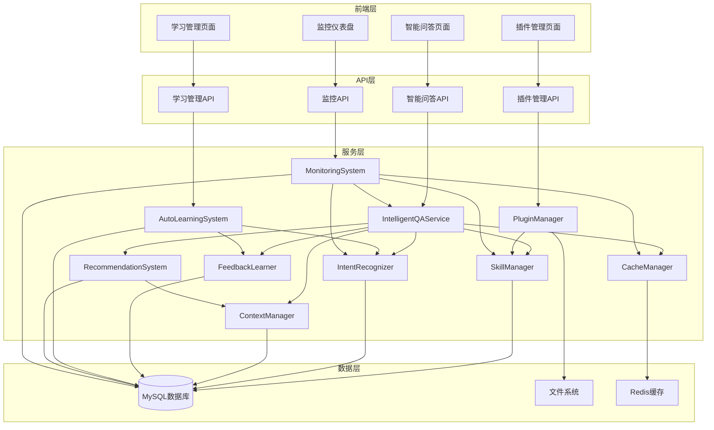
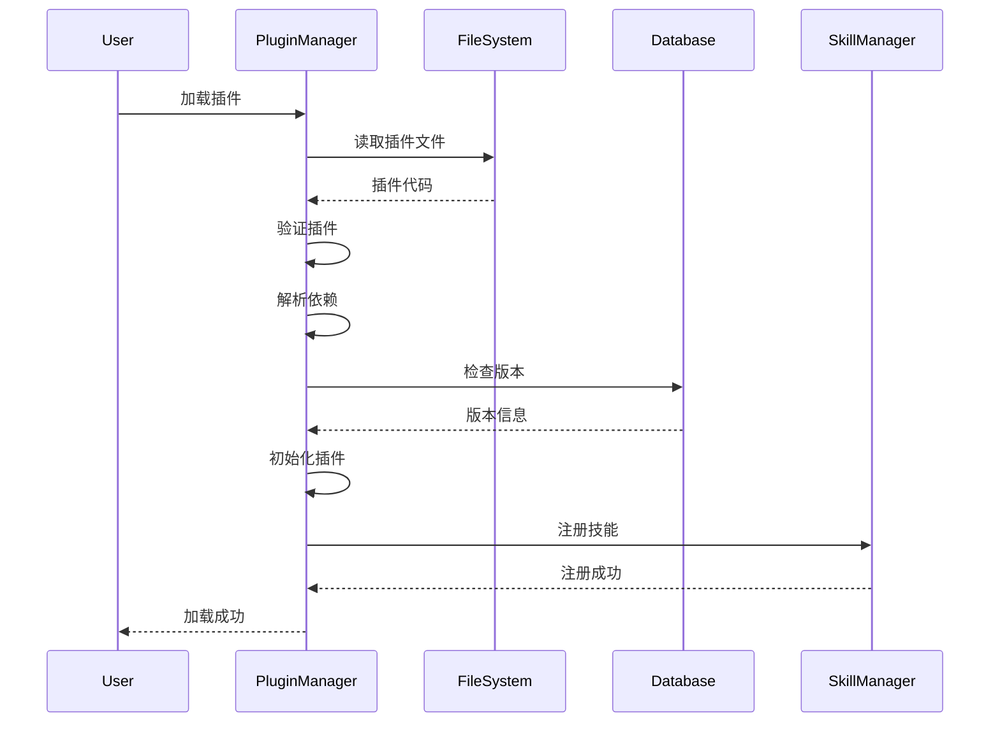
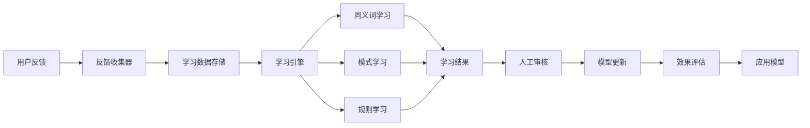
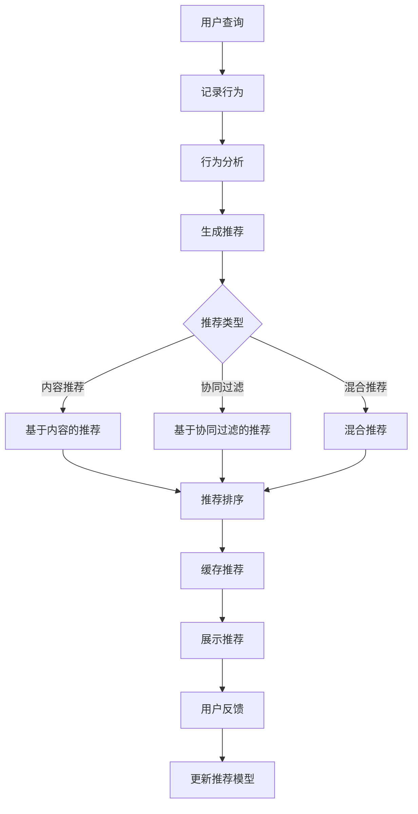
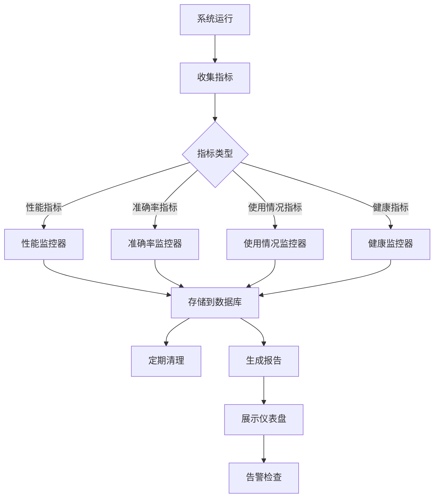
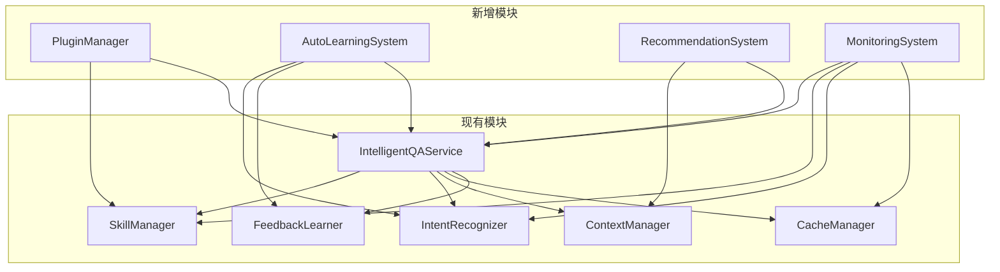
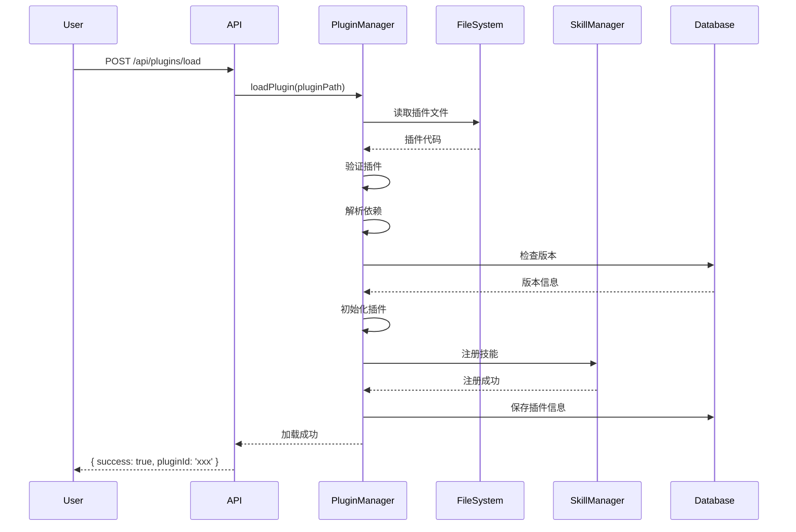
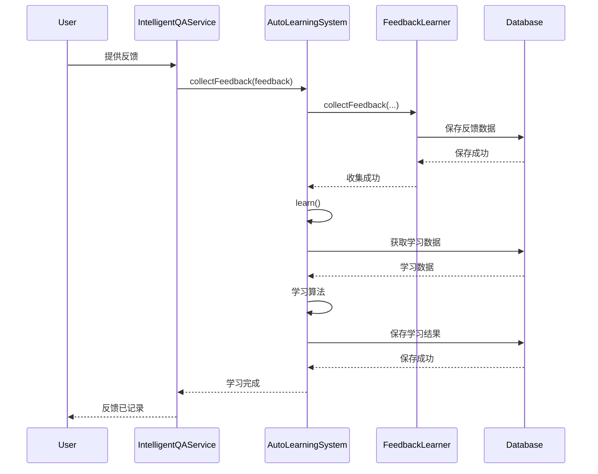
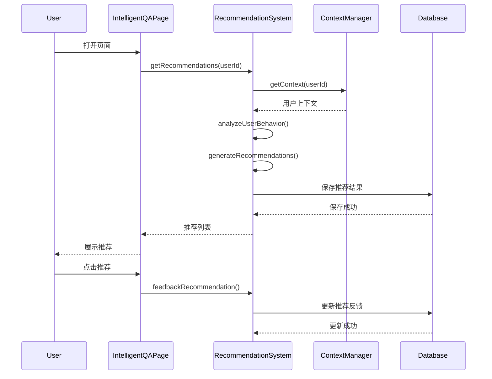
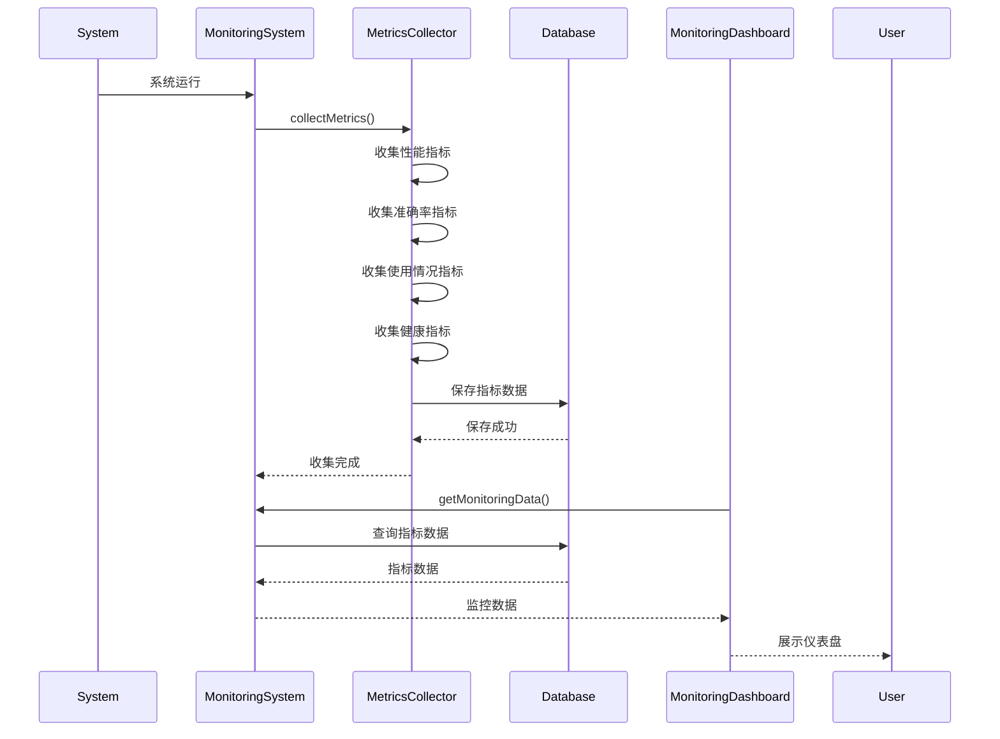

# DESIGN - 缺陷管理助手长期优化

## 整体架构设计

### 系统架构图



### 分层设计

#### 1. 前端层
- **智能问答页面**：IntelligentQAPage（增强推荐展示）
- **插件管理页面**：PluginManagementPage（新增）
- **学习管理页面**：LearningManagementPage（新增）
- **监控仪表盘**：MonitoringDashboardPage（新增）

#### 2. API层
- **智能问答API**：/api/intelligent-qa/*
- **插件管理API**：/api/plugins/*
- **学习管理API**：/api/learning/*
- **监控API**：/api/monitoring/*

#### 3. 服务层
- **IntelligentQAService**：智能问答服务（现有，增强）
- **PluginManager**：插件管理器（新增）
- **AutoLearningSystem**：自动学习系统（新增）
- **RecommendationSystem**：推荐系统（新增）
- **MonitoringSystem**：监控系统（新增）
- **SkillManager**：技能管理器（现有，增强）
- **IntentRecognizer**：意图识别器（现有，增强）
- **ContextManager**：上下文管理器（现有）
- **CacheManager**：缓存管理器（现有）
- **FeedbackLearner**：反馈学习器（现有，增强）

#### 4. 数据层
- **MySQL数据库**：存储所有业务数据、配置、监控数据
- **文件系统**：存储插件代码、日志文件
- **Redis缓存**：缓存热点数据（可选，用于性能优化）

## 核心组件设计

### 1. 插件架构

#### 1.1 插件接口定义

```typescript
// 插件接口
interface Plugin {
  // 插件基本信息
  id: string;
  name: string;
  version: string;
  description: string;
  author: string;

  // 插件配置
  config: PluginConfig;

  // 插件生命周期
  initialize(): Promise<void>;
  execute(params: Record<string, any>): Promise<PluginResult>;
  destroy(): Promise<void>;

  // 插件能力
  getIntents(): string[];
  getSkills(): Skill[];
  getDependencies(): string[];
}

// 插件配置
interface PluginConfig {
  enabled: boolean;
  priority: number;
  permissions: string[];
  settings: Record<string, any>;
}

// 插件执行结果
interface PluginResult {
  success: boolean;
  data?: any;
  error?: string;
  metadata?: Record<string, any>;
}
```

#### 1.2 插件管理器设计

```typescript
class PluginManager {
  // 插件存储
  private plugins: Map<string, Plugin> = new Map();
  private pluginVersions: Map<string, PluginVersion[]> = new Map();

  // 插件生命周期管理
  async loadPlugin(pluginPath: string): Promise<void>;
  async unloadPlugin(pluginId: string): Promise<void>;
  async reloadPlugin(pluginId: string): Promise<void>;

  // 插件查询
  getPlugin(pluginId: string): Plugin | null;
  getAllPlugins(): Plugin[];
  getPluginsByIntent(intent: string): Plugin[];

  // 插件执行
  async executePlugin(pluginId: string, params: Record<string, any>): Promise<PluginResult>;

  // 插件依赖管理
  async resolveDependencies(plugin: Plugin): Promise<void>;
  checkDependencies(plugin: Plugin): boolean;

  // 插件版本管理
  async installPlugin(pluginPath: string, version: string): Promise<void>;
  async upgradePlugin(pluginId: string, version: string): Promise<void>;
  async rollbackPlugin(pluginId: string, version: string): Promise<void>;
  getPluginVersions(pluginId: string): PluginVersion[];
}
```

#### 1.3 插件加载机制



### 2. 自动学习系统

#### 2.1 学习系统架构

```typescript
class AutoLearningSystem {
  // 反馈收集
  private feedbackCollector: FeedbackCollector;
  // 学习引擎
  private learningEngine: LearningEngine;
  // 模型更新器
  private modelUpdater: ModelUpdater;
  // 效果评估器
  private effectivenessEvaluator: EffectivenessEvaluator;

  // 收集反馈
  async collectFeedback(feedback: UserFeedback): Promise<void>;

  // 执行学习
  async learn(): Promise<LearningResult>;

  // 更新模型
  async updateModel(learningData: LearningData): Promise<void>;

  // 评估效果
  async evaluateEffectiveness(): Promise<EffectivenessReport>;

  // 获取学习报告
  getLearningReport(): LearningReport;
}
```

#### 2.2 学习流程



#### 2.3 学习算法

```typescript
class LearningEngine {
  // 同义词学习
  learnSynonyms(feedback: UserFeedback[]): Synonym[];

  // 模式学习
  learnPatterns(feedback: UserFeedback[]): Pattern[];

  // 规则学习
  learnRules(feedback: UserFeedback[]): Rule[];

  // 置信度调整
  adjustConfidence(intent: string, feedback: UserFeedback[]): number;
}
```

### 3. 智能推荐系统

#### 3.1 推荐系统架构

```typescript
class RecommendationSystem {
  // 用户行为分析器
  private behaviorAnalyzer: BehaviorAnalyzer;
  // 推荐引擎
  private recommendationEngine: RecommendationEngine;
  // 推荐缓存
  private recommendationCache: RecommendationCache;

  // 分析用户行为
  async analyzeUserBehavior(userId: string): Promise<UserBehavior>;

  // 生成推荐
  async generateRecommendations(userId: string): Promise<Recommendation[]>;

  // 获取推荐
  async getRecommendations(userId: string): Promise<Recommendation[]>;

  // 反馈推荐
  async feedbackRecommendation(userId: string, recommendationId: string, feedback: 'positive' | 'negative'): Promise<void>;
}
```

#### 3.2 推荐算法

```typescript
class RecommendationEngine {
  // 基于内容的推荐
  contentBasedRecommendation(userBehavior: UserBehavior): Recommendation[];

  // 协同过滤推荐
  collaborativeFilteringRecommendation(userId: string): Recommendation[];

  // 混合推荐
  hybridRecommendation(userId: string, userBehavior: UserBehavior): Recommendation[];

  // 推荐排序
  rankRecommendations(recommendations: Recommendation[]): Recommendation[];
}
```

#### 3.3 推荐流程



### 4. 全面监控系统

#### 4.1 监控系统架构

```typescript
class MonitoringSystem {
  // 指标收集器
  private metricsCollector: MetricsCollector;
  // 性能监控器
  private performanceMonitor: PerformanceMonitor;
  // 健康检查器
  private healthChecker: HealthChecker;
  // 告警管理器
  private alertManager: AlertManager;

  // 收集指标
  async collectMetrics(): Promise<void>;

  // 获取监控数据
  async getMonitoringData(timeRange: TimeRange): Promise<MonitoringData>;

  // 健康检查
  async healthCheck(): Promise<HealthStatus>;

  // 生成报告
  async generateReport(timeRange: TimeRange): Promise<MonitoringReport>;
}
```

#### 4.2 监控指标体系

```typescript
interface MonitoringMetrics {
  // 性能指标
  performance: {
    responseTime: number;
    throughput: number;
    errorRate: number;
    cacheHitRate: number;
  };

  // 准确率指标
  accuracy: {
    intentRecognitionAccuracy: number;
    entityExtractionAccuracy: number;
    overallAccuracy: number;
  };

  // 使用情况指标
  usage: {
    totalQueries: number;
    uniqueUsers: number;
    averageQueriesPerUser: number;
    topIntents: Array<{ intent: string; count: number }>;
  };

  // 系统健康指标
  health: {
    cpuUsage: number;
    memoryUsage: number;
    diskUsage: number;
    databaseConnectionPool: number;
  };
}
```

#### 4.3 监控流程



## 模块依赖关系

### 依赖关系图



### 依赖说明

1. **PluginManager**：
   - 依赖：SkillManager, IntelligentQAService
   - 原因：需要注册技能，需要集成到智能问答流程

2. **AutoLearningSystem**：
   - 依赖：IntentRecognizer, FeedbackLearner, IntelligentQAService
   - 原因：需要优化意图识别，需要收集反馈，需要应用到智能问答

3. **RecommendationSystem**：
   - 依赖：ContextManager, IntelligentQAService
   - 原因：需要分析用户行为，需要集成到智能问答

4. **MonitoringSystem**：
   - 依赖：IntelligentQAService, SkillManager, IntentRecognizer, CacheManager
   - 原因：需要监控所有核心模块

## 接口契约定义

### 1. 插件管理API

#### 1.1 加载插件
```typescript
POST /api/plugins/load
Request: {
  pluginPath: string;
  version?: string;
}
Response: {
  success: boolean;
  pluginId: string;
  message: string;
}
```

#### 1.2 卸载插件
```typescript
POST /api/plugins/unload
Request: {
  pluginId: string;
}
Response: {
  success: boolean;
  message: string;
}
```

#### 1.3 获取插件列表
```typescript
GET /api/plugins
Response: {
  success: boolean;
  plugins: Array<{
    id: string;
    name: string;
    version: string;
    description: string;
    author: string;
    enabled: boolean;
    intents: string[];
  }>;
}
```

#### 1.4 获取插件详情
```typescript
GET /api/plugins/:pluginId
Response: {
  success: boolean;
  plugin: {
    id: string;
    name: string;
    version: string;
    description: string;
    author: string;
    config: PluginConfig;
    intents: string[];
    dependencies: string[];
  };
}
```

### 2. 学习管理API

#### 2.1 获取学习报告
```typescript
GET /api/learning/report
Response: {
  success: boolean;
  report: {
    summary: {
      totalQueries: number;
      positiveFeedback: number;
      negativeFeedback: number;
      accuracy: number;
    };
    intentStats: Record<string, {
      total: number;
      correct: number;
      incorrect: number;
    }>;
    newSynonymsCount: number;
    patternImprovementsCount: number;
  };
}
```

#### 2.2 应用学习结果
```typescript
POST /api/learning/apply
Request: {
  learningData: LearningData;
}
Response: {
  success: boolean;
  message: string;
  appliedChanges: number;
}
```

#### 2.3 获取待审核的学习结果
```typescript
GET /api/learning/pending
Response: {
  success: boolean;
  pendingItems: Array<{
    id: string;
    type: 'synonym' | 'pattern' | 'rule';
    content: any;
    confidence: number;
  }>;
}
```

### 3. 推荐API

#### 3.1 获取推荐
```typescript
GET /api/recommendations/:userId
Response: {
  success: boolean;
  recommendations: Array<{
    id: string;
    type: 'query' | 'function' | 'intent';
    content: string;
    score: number;
    reason: string;
  }>;
}
```

#### 3.2 反馈推荐
```typescript
POST /api/recommendations/feedback
Request: {
  userId: string;
  recommendationId: string;
  feedback: 'positive' | 'negative';
}
Response: {
  success: boolean;
  message: string;
}
```

### 4. 监控API

#### 4.1 获取监控数据
```typescript
GET /api/monitoring/data?timeRange=1h
Response: {
  success: boolean;
  data: MonitoringMetrics;
}
```

#### 4.2 获取健康状态
```typescript
GET /api/monitoring/health
Response: {
  success: boolean;
  status: 'healthy' | 'degraded' | 'unhealthy';
  checks: Array<{
    name: string;
    status: 'pass' | 'fail';
    message: string;
  }>;
}
```

#### 4.3 生成监控报告
```typescript
GET /api/monitoring/report?timeRange=24h
Response: {
  success: boolean;
  report: MonitoringReport;
}
```

## 数据流向图

### 1. 插件加载流程



### 2. 学习流程



### 3. 推荐流程



### 4. 监控流程



## 异常处理策略

### 1. 插件加载异常

```typescript
// 插件加载失败
try {
  await pluginManager.loadPlugin(pluginPath);
} catch (error) {
  if (error instanceof PluginValidationError) {
    // 插件验证失败
    logger.error('Plugin validation failed:', error);
    return { success: false, message: '插件验证失败' };
  } else if (error instanceof PluginDependencyError) {
    // 插件依赖缺失
    logger.error('Plugin dependency error:', error);
    return { success: false, message: '插件依赖缺失' };
  } else if (error instanceof PluginInitializationError) {
    // 插件初始化失败
    logger.error('Plugin initialization failed:', error);
    return { success: false, message: '插件初始化失败' };
  } else {
    // 其他错误
    logger.error('Plugin load failed:', error);
    return { success: false, message: '插件加载失败' };
  }
}
```

### 2. 学习系统异常

```typescript
// 学习过程失败
try {
  await autoLearningSystem.learn();
} catch (error) {
  if (error instanceof InsufficientDataError) {
    // 数据不足
    logger.warn('Insufficient data for learning:', error);
    return { success: false, message: '数据不足，无法学习' };
  } else if (error instanceof LearningAlgorithmError) {
    // 学习算法错误
    logger.error('Learning algorithm error:', error);
    return { success: false, message: '学习算法错误' };
  } else {
    // 其他错误
    logger.error('Learning failed:', error);
    return { success: false, message: '学习失败' };
  }
}
```

### 3. 推荐系统异常

```typescript
// 推荐生成失败
try {
  const recommendations = await recommendationSystem.generateRecommendations(userId);
  return { success: true, recommendations };
} catch (error) {
  if (error instanceof NoUserDataError) {
    // 无用户数据
    logger.warn('No user data for recommendation:', error);
    return { success: true, recommendations: [] };
  } else if (error instanceof RecommendationAlgorithmError) {
    // 推荐算法错误
    logger.error('Recommendation algorithm error:', error);
    return { success: true, recommendations: getDefaultRecommendations() };
  } else {
    // 其他错误
    logger.error('Recommendation failed:', error);
    return { success: true, recommendations: getDefaultRecommendations() };
  }
}
```

### 4. 监控系统异常

```typescript
// 监控数据收集失败
try {
  await monitoringSystem.collectMetrics();
} catch (error) {
  logger.error('Metrics collection failed:', error);
  // 不影响系统运行，只记录错误
}

// 监控数据查询失败
try {
  const data = await monitoringSystem.getMonitoringData(timeRange);
  return { success: true, data };
} catch (error) {
  logger.error('Get monitoring data failed:', error);
  return { success: false, message: '获取监控数据失败' };
}
```

## 设计原则

### 1. 模块化设计
- 每个模块职责单一
- 模块间通过接口通信
- 模块可以独立测试和部署

### 2. 可扩展性
- 插件系统支持动态扩展
- 学习系统支持算法扩展
- 推荐系统支持策略扩展
- 监控系统支持指标扩展

### 3. 可维护性
- 代码结构清晰
- 日志记录完善
- 错误处理统一
- 文档完整

### 4. 性能优化
- 使用缓存减少重复计算
- 异步处理提高响应速度
- 批量操作减少数据库访问
- 定期清理过期数据

### 5. 安全性
- 插件权限控制
- 用户数据隔离
- 敏感信息加密
- 输入验证和过滤

## 质量门控

### 架构图清晰准确
- [ ] 所有模块都有明确的职责
- [ ] 模块间依赖关系清晰
- [ ] 数据流向清晰
- [ ] 接口定义完整

### 接口定义完整
- [ ] 所有API都有明确的请求和响应格式
- [ ] 所有接口都有错误处理
- [ ] 所有接口都有日志记录
- [ ] 所有接口都有文档说明

### 与现有系统无冲突
- [ ] 不修改现有核心逻辑
- [ ] 不影响现有功能
- [ ] 不降低系统性能
- [ ] 不降低系统安全性

### 设计可行性验证
- [ ] 技术方案可行
- [ ] 开发时间合理
- [ ] 资源需求合理
- [ ] 风险可控
