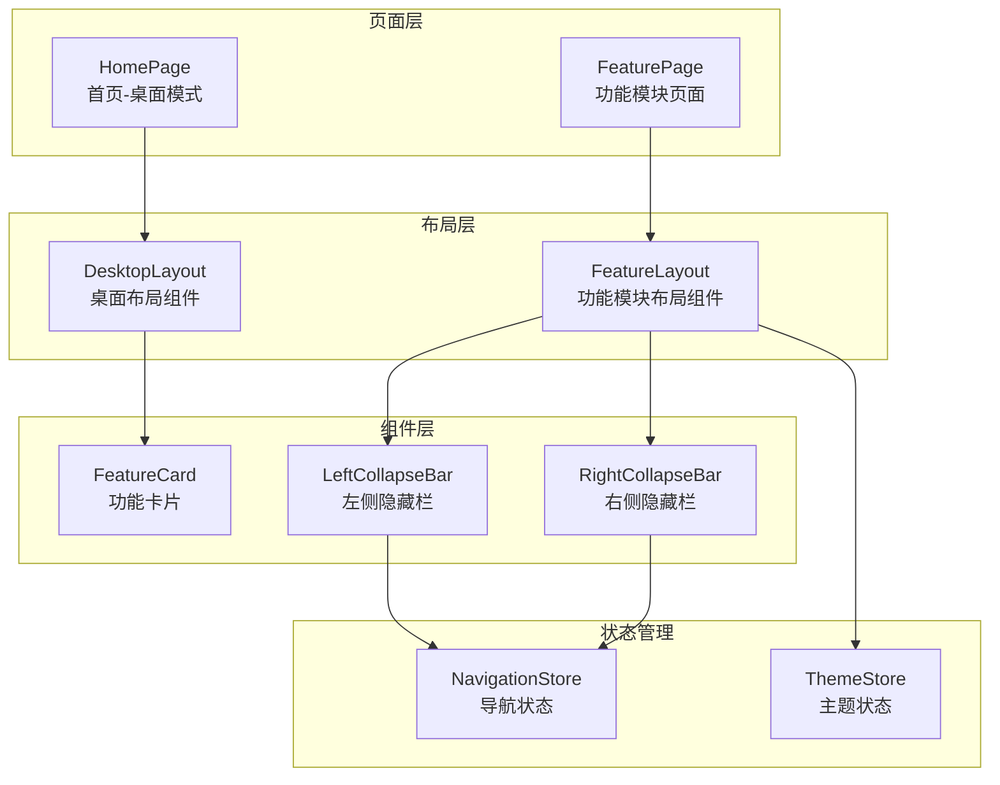
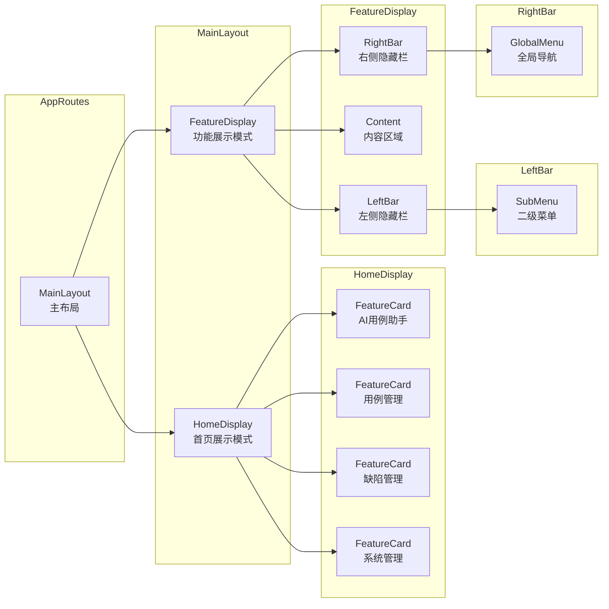
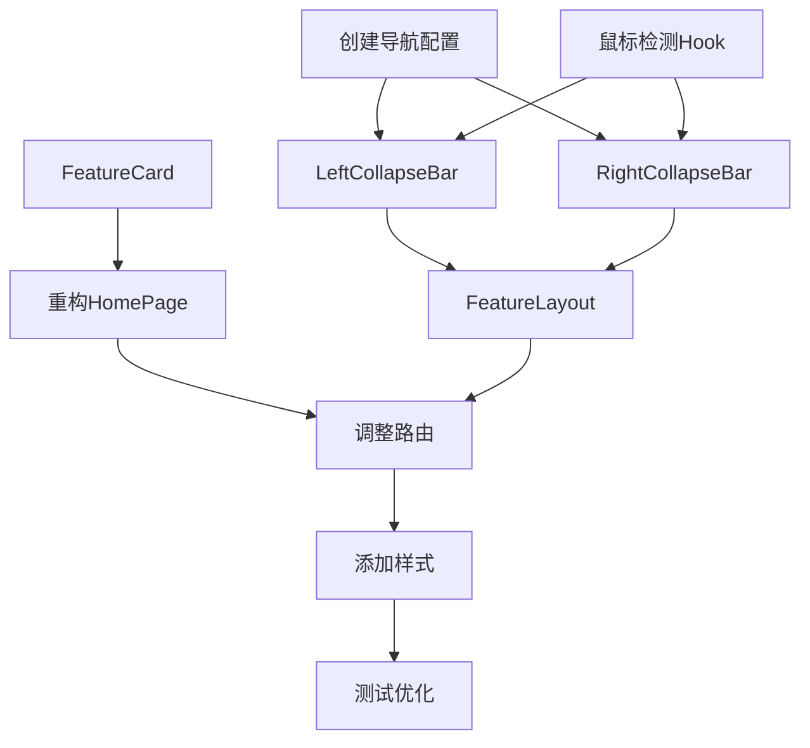

# 设计文档：动态窗口界面重构

> 文档版本：v1.0
> 创建时间：2026-02-13
> 关联需求：REQUIREMENT_动态窗口界面重构.md

---

## 1. 系统架构

### 1.1 整体架构图



### 1.2 组件关系图



---

## 2. 模块设计

### 2.1 路由结构调整

```typescript
// AppRoutes.tsx 调整
<Routes>
  <Route path="/" element={<MainLayout />}>
    {/* 首页 - 桌面模式 */}
    <Route index element={<HomePage />} />
    
    {/* 功能模块 - 使用FeatureLayout */}
    <Route element={<FeatureLayout />}>
      <Route path="assistant" element={<TestCaseAssistantPage />} />
      <Route path="test-cases" element={<TestCaseManagementPage />} />
      <Route path="prompts" element={<PromptManagementPage />} />
      <Route path="system" element={<SystemManagement />} />
      <Route path="defects" element={<DefectAnalysisPage />} />
      <Route path="defects/list" element={<DefectListPage />} />
      {/* ... 其他缺陷管理路由 */}
      <Route path="admin/monitoring" element={<SystemMonitoringPage />} />
      {/* ... 其他系统管理路由 */}
    </Route>
  </Route>
</Routes>
```

### 2.2 布局组件设计

#### 2.2.1 MainLayout 调整

```typescript
// MainLayout.tsx
const MainLayout: React.FC = () => {
  const location = useLocation();
  const isHomePage = location.pathname === '/';
  
  return (
    <Layout style={{ minHeight: '100vh' }}>
      {isHomePage ? (
        // 首页：纯净桌面模式
        <HomeLayout />
      ) : (
        // 功能页：动态隐藏栏模式
        <FeatureLayout />
      )}
    </Layout>
  );
};
```

#### 2.2.2 FeatureLayout 组件

```typescript
// layouts/FeatureLayout.tsx
interface FeatureLayoutProps {
  children: React.ReactNode;
}

const FeatureLayout: React.FC = () => {
  const [leftExpanded, setLeftExpanded] = useState(false);
  const [rightExpanded, setRightExpanded] = useState(false);
  
  // 鼠标位置监听
  useMouseEdgeDetection({
    onLeftEdge: () => setLeftExpanded(true),
    onRightEdge: () => setRightExpanded(true),
    onLeave: () => {
      setLeftExpanded(false);
      setRightExpanded(false);
    }
  });
  
  return (
    <Layout className="feature-layout">
      {/* 左侧隐藏栏 */}
      <LeftCollapseBar 
        expanded={leftExpanded}
        moduleType={getCurrentModuleType()}
      />
      
      {/* 内容区域 */}
      <Content className="feature-content">
        <Outlet />
      </Content>
      
      {/* 右侧隐藏栏 */}
      <RightCollapseBar 
        expanded={rightExpanded}
        currentPath={location.pathname}
      />
    </Layout>
  );
};
```

### 2.3 隐藏栏组件设计

#### 2.3.1 左侧隐藏栏 (LeftCollapseBar)

```typescript
// components/LeftCollapseBar.tsx
interface LeftCollapseBarProps {
  expanded: boolean;
  moduleType: 'test' | 'defect' | 'admin';
}

const LeftCollapseBar: React.FC<LeftCollapseBarProps> = ({
  expanded,
  moduleType
}) => {
  // 根据模块类型获取二级菜单配置
  const subMenus = getSubMenusByModule(moduleType);
  
  return (
    <div className={classNames('left-collapse-bar', { expanded })}>
      <div className="trigger-zone left-trigger" />
      <div className="bar-content">
        <Menu items={subMenus} mode="inline" />
      </div>
    </div>
  );
};

// 二级菜单配置
const subMenuConfig = {
  test: [
    { key: '/assistant', label: '用例助手', icon: <RobotOutlined /> },
    { key: '/test-cases', label: '用例列表', icon: <UnorderedListOutlined /> },
    { key: '/prompts', label: '提示词管理', icon: <FileTextOutlined /> },
    { key: '/system', label: '平台管理', icon: <AppstoreOutlined /> },
  ],
  defect: [
    { key: '/defects/list', label: '问题列表', icon: <BugOutlined /> },
    { key: '/defects', label: '数据分析', icon: <BarChartOutlined /> },
    { key: '/defects/todo', label: '我的待办', icon: <CheckSquareOutlined /> },
    { key: '/defects/project', label: '项目管理', icon: <ProjectOutlined /> },
    { key: '/defects/notification', label: '消息推送配置', icon: <NotificationOutlined /> },
    { key: '/defects/assistant', label: '缺陷管理助手', icon: <RobotOutlined /> },
  ],
  admin: [
    { key: '/admin/database', label: '数据库配置', icon: <DatabaseOutlined /> },
    { key: '/admin/llm', label: '大模型配置', icon: <OpenAIOutlined /> },
    { key: '/admin/monitoring', label: '系统监控', icon: <DashboardOutlined /> },
    { key: '/admin/plugins', label: '插件管理', icon: <PluginOutlined /> },
  ]
};
```

#### 2.3.2 右侧隐藏栏 (RightCollapseBar)

```typescript
// components/RightCollapseBar.tsx
interface RightCollapseBarProps {
  expanded: boolean;
  currentPath: string;
}

const RightCollapseBar: React.FC<RightCollapseBarProps> = ({
  expanded,
  currentPath
}) => {
  const navigate = useNavigate();
  
  const globalMenus = [
    { key: '/', label: '首页', icon: <HomeOutlined /> },
    { key: '/assistant', label: 'AI用例助手', icon: <RobotOutlined /> },
    { key: '/test-cases', label: '用例管理', icon: <UnorderedListOutlined /> },
    { key: '/defects', label: '缺陷管理', icon: <BugOutlined /> },
    { key: '/admin/monitoring', label: '系统管理', icon: <SettingOutlined /> },
  ];
  
  return (
    <div className={classNames('right-collapse-bar', { expanded })}>
      <div className="trigger-zone right-trigger" />
      <div className="bar-content">
        {globalMenus.map(menu => (
          <div
            key={menu.key}
            className={classNames('menu-item', {
              active: currentPath.startsWith(menu.key) && menu.key !== '/'
            })}
            onClick={() => navigate(menu.key)}
          >
            {menu.icon}
            <span>{menu.label}</span>
          </div>
        ))}
      </div>
    </div>
  );
};
```

### 2.4 功能卡片组件设计

```typescript
// components/FeatureCard.tsx
interface FeatureCardProps {
  title: string;
  icon: React.ReactNode;
  description?: string;
  color: string;
  onClick: () => void;
}

const FeatureCard: React.FC<FeatureCardProps> = ({
  title,
  icon,
  description,
  color,
  onClick
}) => {
  return (
    <Card
      className="feature-card"
      hoverable
      onClick={onClick}
      style={{ borderTop: `4px solid ${color}` }}
    >
      <div className="card-content">
        <div className="icon-wrapper" style={{ color }}>
          {icon}
        </div>
        <Title level={4}>{title}</Title>
        {description && (
          <Paragraph type="secondary" className="description">
            {description}
          </Paragraph>
        )}
      </div>
    </Card>
  );
};
```

---

## 3. 交互设计

### 3.1 鼠标边缘检测Hook

```typescript
// hooks/useMouseEdgeDetection.ts
interface UseMouseEdgeDetectionOptions {
  edgeWidth?: number;      // 触发区域宽度，默认20px
  delay?: number;          // 触发延迟，默认100ms
  onLeftEdge?: () => void;
  onRightEdge?: () => void;
  onLeave?: () => void;
}

const useMouseEdgeDetection = (options: UseMouseEdgeDetectionOptions) => {
  const { edgeWidth = 20, delay = 100, onLeftEdge, onRightEdge, onLeave } = options;
  const timerRef = useRef<NodeJS.Timeout>();
  const [isOnEdge, setIsOnEdge] = useState(false);
  
  useEffect(() => {
    const handleMouseMove = (e: MouseEvent) => {
      const { clientX } = e;
      const screenWidth = window.innerWidth;
      
      const onLeft = clientX <= edgeWidth;
      const onRight = clientX >= screenWidth - edgeWidth;
      
      if (onLeft || onRight) {
        if (!isOnEdge) {
          timerRef.current = setTimeout(() => {
            setIsOnEdge(true);
            if (onLeft) onLeftEdge?.();
            if (onRight) onRightEdge?.();
          }, delay);
        }
      } else {
        if (timerRef.current) {
          clearTimeout(timerRef.current);
        }
        if (isOnEdge) {
          setIsOnEdge(false);
          onLeave?.();
        }
      }
    };
    
    window.addEventListener('mousemove', handleMouseMove);
    return () => {
      window.removeEventListener('mousemove', handleMouseMove);
      if (timerRef.current) clearTimeout(timerRef.current);
    };
  }, [edgeWidth, delay, onLeftEdge, onRightEdge, onLeave, isOnEdge]);
};
```

### 3.2 动画效果设计

```css
/* styles/collapse-bar.css */

/* 左侧隐藏栏 */
.left-collapse-bar {
  position: fixed;
  left: 0;
  top: 0;
  height: 100vh;
  width: 0;
  z-index: 1000;
  transition: width 0.3s cubic-bezier(0.4, 0, 0.2, 1);
  overflow: hidden;
}

.left-collapse-bar.expanded {
  width: 220px;
}

/* 触发区域 */
.trigger-zone {
  position: fixed;
  top: 0;
  height: 100vh;
  width: 20px;
  z-index: 999;
}

.trigger-zone.left-trigger {
  left: 0;
}

/* 栏内容 */
.bar-content {
  width: 220px;
  height: 100%;
  background: var(--bg-container);
  box-shadow: 2px 0 8px rgba(0, 0, 0, 0.15);
  padding: 16px 0;
}

/* 右侧隐藏栏 */
.right-collapse-bar {
  position: fixed;
  right: 0;
  top: 0;
  height: 100vh;
  width: 0;
  z-index: 1000;
  transition: width 0.3s cubic-bezier(0.4, 0, 0.2, 1);
  overflow: hidden;
}

.right-collapse-bar.expanded {
  width: 180px;
}

.right-collapse-bar .bar-content {
  box-shadow: -2px 0 8px rgba(0, 0, 0, 0.15);
}

/* 菜单项样式 */
.menu-item {
  display: flex;
  align-items: center;
  padding: 12px 20px;
  cursor: pointer;
  transition: all 0.2s;
  gap: 12px;
}

.menu-item:hover {
  background: var(--primary-color-light);
}

.menu-item.active {
  background: var(--primary-color);
  color: white;
}
```

---

## 4. 首页重构设计

### 4.1 新首页布局

```typescript
// pages/HomePage.tsx
const HomePage: React.FC = () => {
  const navigate = useNavigate();
  
  const features = [
    {
      title: 'AI用例助手',
      icon: <RocketOutlined />,
      description: '基于DeepSeek大模型，智能生成测试用例和测试点',
      color: '#1890ff',
      path: '/assistant'
    },
    {
      title: '用例管理',
      icon: <CheckSquareOutlined />,
      description: '完整的测试用例生命周期管理，支持执行状态跟踪',
      color: '#52c41a',
      path: '/test-cases'
    },
    {
      title: '缺陷管理',
      icon: <BugOutlined />,
      description: '跟踪和管理缺陷，支持状态更新和问题分析',
      color: '#faad14',
      path: '/defects'
    },
    {
      title: '系统管理',
      icon: <SettingOutlined />,
      description: '管理系统配置、数据库连接、大模型设置和系统监控',
      color: '#722ed1',
      path: '/admin/monitoring'
    }
  ];
  
  return (
    <div className="home-page">
      {/* 英雄区域 */}
      <div className="hero-section">
        <Title level={1} className="hero-title">
          欢迎使用测试管理平台
        </Title>
        <Paragraph className="hero-description">
          全面的测试管理解决方案，集成AI辅助功能，让测试工作更高效、更智能
        </Paragraph>
      </div>
      
      {/* 功能卡片区域 */}
      <div className="features-section">
        <Row gutter={[32, 32]} justify="center">
          {features.map(feature => (
            <Col xs={24} sm={12} lg={6} key={feature.path}>
              <FeatureCard
                title={feature.title}
                icon={feature.icon}
                description={feature.description}
                color={feature.color}
                onClick={() => navigate(feature.path)}
              />
            </Col>
          ))}
        </Row>
      </div>
    </div>
  );
};
```

### 4.2 首页样式

```css
/* styles/home-page.css */
.home-page {
  min-height: 100vh;
  display: flex;
  flex-direction: column;
  justify-content: center;
  align-items: center;
  padding: 48px;
  background: var(--bg-layout);
}

.hero-section {
  text-align: center;
  margin-bottom: 64px;
}

.hero-title {
  color: var(--primary-color);
  margin-bottom: 16px;
  font-size: 48px;
}

.hero-description {
  font-size: 18px;
  color: var(--text-secondary);
  max-width: 600px;
}

.features-section {
  width: 100%;
  max-width: 1200px;
}

.feature-card {
  height: 100%;
  text-align: center;
  transition: transform 0.3s, box-shadow 0.3s;
}

.feature-card:hover {
  transform: translateY(-8px);
  box-shadow: 0 12px 24px rgba(0, 0, 0, 0.15);
}

.feature-card .icon-wrapper {
  font-size: 64px;
  margin-bottom: 16px;
}

.feature-card .description {
  margin-top: 8px;
  font-size: 14px;
}
```

---

## 5. 数据结构

### 5.1 导航配置数据

```typescript
// types/navigation.ts

// 功能模块类型
export type ModuleType = 'test' | 'defect' | 'admin';

// 菜单项
export interface MenuItem {
  key: string;
  label: string;
  icon: string;
  path: string;
  children?: MenuItem[];
}

// 功能模块配置
export interface ModuleConfig {
  type: ModuleType;
  name: string;
  icon: string;
  path: string;
  subMenus: MenuItem[];
}

// 全局导航配置
export const globalNavigation: MenuItem[] = [
  { key: 'home', label: '首页', icon: 'HomeOutlined', path: '/' },
  { key: 'assistant', label: 'AI用例助手', icon: 'RobotOutlined', path: '/assistant' },
  { key: 'test', label: '用例管理', icon: 'UnorderedListOutlined', path: '/test-cases' },
  { key: 'defect', label: '缺陷管理', icon: 'BugOutlined', path: '/defects' },
  { key: 'admin', label: '系统管理', icon: 'SettingOutlined', path: '/admin/monitoring' },
];

// 模块二级菜单配置
export const moduleSubMenus: Record<ModuleType, MenuItem[]> = {
  test: [
    { key: 'assistant', label: '用例助手', icon: 'RobotOutlined', path: '/assistant' },
    { key: 'list', label: '用例列表', icon: 'UnorderedListOutlined', path: '/test-cases' },
    { key: 'prompts', label: '提示词管理', icon: 'FileTextOutlined', path: '/prompts' },
    { key: 'system', label: '平台管理', icon: 'AppstoreOutlined', path: '/system' },
  ],
  defect: [
    { key: 'list', label: '问题列表', icon: 'BugOutlined', path: '/defects/list' },
    { key: 'analysis', label: '数据分析', icon: 'BarChartOutlined', path: '/defects' },
    { key: 'todo', label: '我的待办', icon: 'CheckSquareOutlined', path: '/defects/todo' },
    { key: 'project', label: '项目管理', icon: 'ProjectOutlined', path: '/defects/project' },
    { key: 'notification', label: '消息推送配置', icon: 'NotificationOutlined', path: '/defects/notification' },
    { key: 'assistant', label: '缺陷管理助手', icon: 'RobotOutlined', path: '/defects/assistant' },
  ],
  admin: [
    { key: 'database', label: '数据库配置', icon: 'DatabaseOutlined', path: '/admin/database' },
    { key: 'llm', label: '大模型配置', icon: 'OpenAIOutlined', path: '/admin/llm' },
    { key: 'monitoring', label: '系统监控', icon: 'DashboardOutlined', path: '/admin/monitoring' },
    { key: 'plugins', label: '插件管理', icon: 'PluginOutlined', path: '/admin/plugins' },
  ]
};
```

---

## 6. 异常处理

### 6.1 边界情况处理

| 异常情况 | 处理策略 |
|----------|----------|
| 鼠标快速划过边缘 | 设置100ms延迟，避免误触发 |
| 隐藏栏展开时鼠标移出 | 设置300ms延迟收起，给用户反应时间 |
| 窗口大小改变 | 重新计算边缘区域，确保触发区域正确 |
| 触摸设备 | 提供点击触发替代方案 |
| 键盘导航 | 支持Tab键和方向键操作 |

### 6.2 错误处理

```typescript
// 模块类型识别容错
const getCurrentModuleType = (path: string): ModuleType => {
  if (path.startsWith('/defects')) return 'defect';
  if (path.startsWith('/admin')) return 'admin';
  if (['/assistant', '/test-cases', '/prompts', '/system'].some(p => path.startsWith(p))) {
    return 'test';
  }
  // 默认返回test，避免报错
  return 'test';
};
```

---

## 7. 性能优化

### 7.1 优化策略

| 优化点 | 策略 |
|--------|------|
| 鼠标事件监听 | 使用节流(throttle)控制触发频率 |
| 动画性能 | 使用transform和opacity，避免触发重排 |
| 组件渲染 | 使用React.memo避免不必要的重渲染 |
| 菜单数据 | 使用useMemo缓存菜单配置 |

### 7.2 代码实现

```typescript
// hooks/useThrottledMouseMove.ts
import { useEffect, useRef } from 'react';

export const useThrottledMouseMove = (
  callback: (e: MouseEvent) => void,
  delay: number = 50
) => {
  const lastCallRef = useRef(0);
  
  useEffect(() => {
    const handleMouseMove = (e: MouseEvent) => {
      const now = Date.now();
      if (now - lastCallRef.current >= delay) {
        lastCallRef.current = now;
        callback(e);
      }
    };
    
    window.addEventListener('mousemove', handleMouseMove);
    return () => window.removeEventListener('mousemove', handleMouseMove);
  }, [callback, delay]);
};
```

---

## 8. 测试策略

### 8.1 单元测试

```typescript
// __tests__/LeftCollapseBar.test.tsx
describe('LeftCollapseBar', () => {
  it('should render sub menus based on module type', () => {
    const { getByText } = render(<LeftCollapseBar expanded moduleType="test" />);
    expect(getByText('用例助手')).toBeInTheDocument();
    expect(getByText('用例列表')).toBeInTheDocument();
  });
  
  it('should expand when expanded prop is true', () => {
    const { container } = render(<LeftCollapseBar expanded moduleType="test" />);
    expect(container.firstChild).toHaveClass('expanded');
  });
});
```

### 8.2 集成测试

```typescript
// __tests__/FeatureLayout.integration.test.tsx
describe('FeatureLayout Integration', () => {
  it('should show left bar when mouse is on left edge', () => {
    render(<FeatureLayout />);
    fireEvent.mouseMove(window, { clientX: 10, clientY: 100 });
    // 等待延迟后检查
    waitFor(() => {
      expect(screen.getByTestId('left-collapse-bar')).toHaveClass('expanded');
    });
  });
});
```

---

## 9. 实施计划

### 9.1 任务拆分

| 任务ID | 任务名称 | 优先级 | 依赖 |
|--------|----------|--------|------|
| T1 | 创建导航配置数据文件 | P0 | - |
| T2 | 实现useMouseEdgeDetection Hook | P0 | - |
| T3 | 实现LeftCollapseBar组件 | P0 | T1, T2 |
| T4 | 实现RightCollapseBar组件 | P0 | T1, T2 |
| T5 | 实现FeatureCard组件 | P0 | - |
| T6 | 重构HomePage页面 | P0 | T5 |
| T7 | 创建FeatureLayout布局 | P0 | T3, T4 |
| T8 | 调整MainLayout和AppRoutes | P0 | T6, T7 |
| T9 | 添加样式和动画 | P1 | T3-T8 |
| T10 | 测试和优化 | P1 | T9 |

### 9.2 依赖关系图



---

## 10. 风险评估

| 风险 | 影响 | 概率 | 缓解措施 |
|------|------|------|----------|
| 鼠标边缘检测误触发 | 中 | 中 | 设置合理的触发延迟和区域宽度 |
| 与现有主题系统冲突 | 高 | 低 | 充分测试深色/浅色模式兼容性 |
| 触摸设备体验不佳 | 中 | 中 | 提供点击触发替代方案 |
| 动画性能问题 | 中 | 低 | 使用CSS transform，避免重排 |
