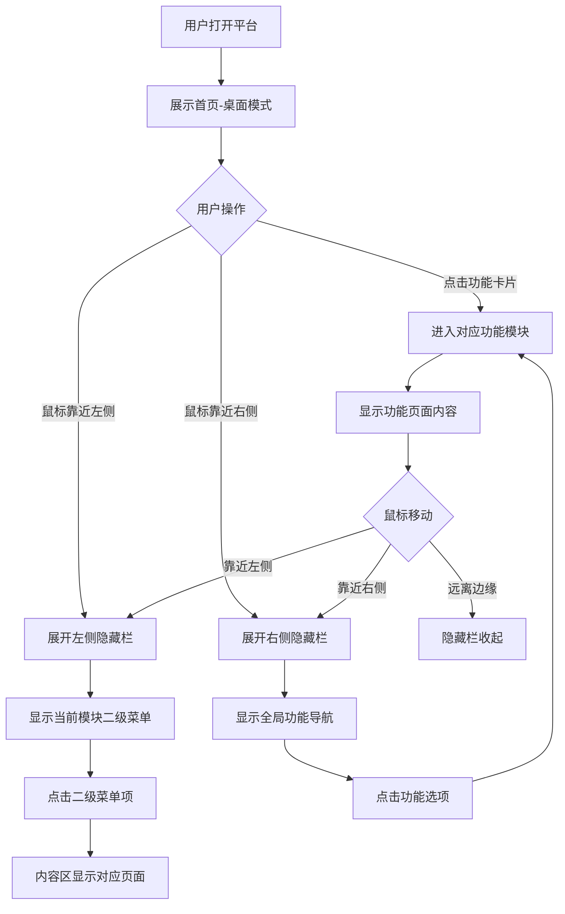

# 需求文档：动态窗口界面重构

> 文档版本：v1.0
> 创建时间：2026-02-13
> 状态：待确认

---

## 1. 需求背景

### 1.1 业务场景
当前测试管理平台采用传统的侧边栏导航模式，用户进入平台后首先看到左侧固定的菜单栏和顶部的面包屑导航。这种布局虽然功能完整，但缺乏现代感和沉浸式的用户体验。

### 1.2 当前痛点
- 左侧固定菜单栏占用了宝贵的屏幕空间
- 首页内容被菜单和面包屑分散注意力
- 核心功能入口不够直观，需要多次点击才能进入
- 缺乏类似现代操作系统（如macOS）的优雅交互体验

### 1.3 期望目标
将平台界面重构为动态窗口形式，参考macOS的隐藏栏与Dock设计理念：
- 首页呈现纯净的"桌面"体验，无干扰元素
- 功能模块通过卡片形式直观展示
- 进入功能模块后，通过两侧隐藏栏进行导航
- 提升用户体验的沉浸感和操作效率

---

## 2. 用户角色

| 角色 | 描述 | 核心诉求 |
|------|------|----------|
| 测试工程师 | 日常使用平台进行测试用例管理和缺陷跟踪 | 快速进入功能模块，减少操作步骤 |
| 测试主管 | 查看测试进度、统计数据和团队管理 | 直观的功能入口，清晰的信息架构 |
| 系统管理员 | 配置系统参数、监控系统状态 | 便捷的系统管理入口 |

---

## 3. 功能范围

### 3.1 功能清单

| 功能模块 | 功能点 | 优先级 | 描述 |
|----------|--------|--------|------|
| 首页重构 | 纯净桌面展示 | P0 | 去除左侧菜单和面包屑，仅保留欢迎内容 |
| 首页重构 | 功能卡片展示 | P0 | 4个核心功能以卡片形式展示，支持点击进入 |
| 首页重构 | 卡片交互优化 | P0 | 点击卡片直接进入对应功能模块 |
| 动态侧边栏 | 左侧隐藏栏 | P0 | 鼠标靠近左侧边缘时展开，显示二级菜单 |
| 动态侧边栏 | 右侧隐藏栏 | P0 | 鼠标靠近右侧边缘时展开，显示主功能导航 |
| 动态侧边栏 | 展开/收起动画 | P1 | 平滑的过渡动画效果 |
| 功能模块适配 | 用例管理模块 | P0 | 左侧栏展示：用例助手、用例列表、提示词管理、平台管理 |
| 功能模块适配 | 缺陷管理模块 | P0 | 左侧栏展示对应二级菜单 |
| 功能模块适配 | 系统管理模块 | P0 | 左侧栏展示对应二级菜单 |

### 3.2 明确边界

**✅ 包含范围：**
- 首页UI重构（去除菜单栏、面包屑，改为卡片布局）
- 左侧动态隐藏栏组件开发
- 右侧动态隐藏栏组件开发
- 各功能模块的二级菜单配置
- 路由跳转逻辑适配
- 响应式交互效果

**❌ 不包含范围：**
- 功能模块内部业务逻辑修改
- 后端API接口调整
- 新增业务功能
- 数据模型变更

---

## 4. 用户故事

### US-001: 作为测试工程师，我希望首页简洁直观
```
作为 测试工程师
我希望 进入平台后看到简洁的首页，没有复杂的菜单干扰
以便 快速了解平台并进入需要的功能模块
```

**验收标准：**
- [ ] 首页不显示左侧菜单栏
- [ ] 首页不显示面包屑导航
- [ ] 首页保留"欢迎使用测试管理平台"标题和描述
- [ ] 首页以卡片形式展示4个核心功能入口

### US-002: 作为测试工程师，我希望通过卡片快速进入功能模块
```
作为 测试工程师
我希望 点击首页的功能卡片就能进入对应模块
以便 减少操作步骤，提高工作效率
```

**验收标准：**
- [ ] 4个功能卡片可点击
- [ ] 点击AI用例助手卡片进入 `/assistant`
- [ ] 点击用例管理卡片进入 `/test-cases`
- [ ] 点击缺陷管理卡片进入 `/defects`
- [ ] 点击系统管理卡片进入 `/admin/monitoring`

### US-003: 作为测试工程师，我希望在功能模块内有便捷的导航方式
```
作为 测试工程师
我希望 进入功能模块后，鼠标靠近屏幕边缘能展开导航栏
以便 快速切换功能或访问二级菜单
```

**验收标准：**
- [ ] 鼠标靠近左侧边缘（0-20px范围）时，左侧隐藏栏展开
- [ ] 鼠标靠近右侧边缘（屏幕宽度-20px到屏幕宽度范围）时，右侧隐藏栏展开
- [ ] 鼠标离开隐藏栏区域后，栏自动收起
- [ ] 展开/收起有平滑的动画效果

### US-004: 作为测试工程师，我希望左侧栏显示当前模块的二级菜单
```
作为 测试工程师
我希望 左侧隐藏栏显示当前功能模块的二级菜单
以便 快速访问模块内的各个功能页面
```

**验收标准：**
- [ ] 进入用例管理模块时，左侧栏显示：用例助手、用例列表、提示词管理、平台管理
- [ ] 进入缺陷管理模块时，左侧栏显示对应的二级菜单
- [ ] 进入系统管理模块时，左侧栏显示对应的二级菜单
- [ ] 点击二级菜单项，中间内容区显示对应页面

### US-005: 作为测试工程师，我希望右侧栏提供全局功能导航
```
作为 测试工程师
我希望 右侧隐藏栏提供全局功能导航入口
以便 快速切换到其他主功能模块
```

**验收标准：**
- [ ] 右侧栏显示5个选项：首页、AI用例助手、用例管理、缺陷管理、系统管理
- [ ] 点击选项可跳转到对应功能模块
- [ ] 当前所在模块在右侧栏有高亮标识

---

## 5. 业务流程



---

## 6. 界面设计规范

### 6.1 首页布局

```
┌─────────────────────────────────────────────────────────────┐
│                                                             │
│                    欢迎使用测试管理平台                      │
│         全面的测试管理解决方案，集成AI辅助功能...            │
│                                                             │
│  ┌────────────┐  ┌────────────┐  ┌────────────┐  ┌────────┐ │
│  │  AI用例    │  │   用例     │  │   缺陷     │  │  系统  │ │
│  │   助手     │  │   管理     │  │   管理     │  │  管理  │ │
│  │  [图标]    │  │  [图标]    │  │  [图标]    │  │ [图标] │ │
│  └────────────┘  └────────────┘  └────────────┘  └────────┘ │
│                                                             │
└─────────────────────────────────────────────────────────────┘
```

### 6.2 功能模块布局（隐藏栏收起状态）

```
┌─────────────────────────────────────────────────────────────┐
│  内容区域（全屏展示）                                        │
│                                                             │
│                                                             │
│                                                             │
│                                                             │
│                                                             │
│                                                             │
└─────────────────────────────────────────────────────────────┘
```

### 6.3 功能模块布局（左侧栏展开）

```
┌──────┬──────────────────────────────────────────────────────┐
│ 用例 │                                                      │
│ 助手 │                                                      │
│──────│                   页面内容区域                        │
│ 用例 │                                                      │
│ 列表 │                                                      │
│──────│                                                      │
│ 提示 │                                                      │
│ 词管 │                                                      │
│ 理   │                                                      │
│──────│                                                      │
│ 平台 │                                                      │
│ 管理 │                                                      │
└──────┴──────────────────────────────────────────────────────┘
```

### 6.4 功能模块布局（右侧栏展开）

```
┌──────────────────────────────────────────────────────┬──────┐
│                                                      │ 首页 │
│                                                      ├──────┤
│                                                      │AI用例│
│                   页面内容区域                        │ 助手 │
│                                                      ├──────┤
│                                                      │ 用例 │
│                                                      │ 管理 │
│                                                      ├──────┤
│                                                      │ 缺陷 │
│                                                      │ 管理 │
│                                                      ├──────┤
│                                                      │ 系统 │
│                                                      │ 管理 │
└──────────────────────────────────────────────────────┴──────┘
```

---

## 7. 技术约束

### 7.1 现有技术栈
- **前端框架**: React 18 + TypeScript
- **UI组件库**: Ant Design 5.x
- **路由**: React Router 6
- **状态管理**: React Context
- **样式**: CSS + CSS Variables

### 7.2 设计约束
- 保持与现有主题系统兼容（深色/浅色模式）
- 保持与现有路由系统兼容
- 不破坏现有功能模块的内部逻辑
- 支持响应式布局

---

## 8. 验收标准

### 8.1 功能验收
- [ ] 首页去除左侧菜单栏和面包屑导航
- [ ] 首页保留欢迎标题和描述
- [ ] 首页展示4个可点击的功能卡片
- [ ] 功能卡片点击进入对应模块（路由跳转正确）
- [ ] 左侧隐藏栏在鼠标靠近左边缘时展开
- [ ] 左侧隐藏栏显示当前模块的二级菜单
- [ ] 右侧隐藏栏在鼠标靠近右边缘时展开
- [ ] 右侧隐藏栏显示5个全局功能选项
- [ ] 隐藏栏展开/收起有平滑动画
- [ ] 鼠标离开隐藏栏区域后自动收起

### 8.2 非功能验收
- **性能要求**: 隐藏栏展开/收起动画流畅，无明显卡顿
- **兼容性**: 支持Chrome、Firefox、Edge等主流浏览器
- **响应式**: 适配不同屏幕尺寸（最小1280px宽度）
- **可访问性**: 支持键盘导航

---

## 9. 疑问与假设

### 9.1 已做假设
- **假设1**: 用户期望类似macOS的交互体验，隐藏栏触发区域为边缘20px范围内
- **假设2**: 功能卡片的视觉设计保持与现有主题风格一致
- **假设3**: 隐藏栏的展开宽度为200-250px，与现有侧边栏宽度相近

### 9.2 待确认事项
- [ ] 隐藏栏的触发区域宽度（建议20px，是否合适？）
- [ ] 隐藏栏收起的延迟时间（建议300ms，是否合适？）
- [ ] 功能卡片是否需要显示描述文字，还是仅显示图标和标题？
- [ ] 是否需要提供"固定隐藏栏"的功能，让用户可以选择不自动收起？

---

## 10. 附录

### 10.1 现有路由映射

| 功能模块 | 路由路径 | 对应页面 |
|----------|----------|----------|
| AI用例助手 | /assistant | TestCaseAssistantPage |
| 用例列表 | /test-cases | TestCaseManagementPage |
| 提示词管理 | /prompts | PromptManagementPage |
| 平台管理 | /system | SystemManagement |
| 缺陷管理 | /defects | DefectAnalysisPage |
| 系统管理 | /admin/monitoring | SystemMonitoringPage |

### 10.2 二级菜单配置

**用例管理模块二级菜单：**
1. 用例助手 → /assistant
2. 用例列表 → /test-cases
3. 提示词管理 → /prompts
4. 平台管理 → /system

**缺陷管理模块二级菜单：**
1. 问题列表 → /defects/list
2. 数据分析 → /defects
3. 我的待办 → /defects/todo
4. 项目管理 → /defects/project
5. 消息推送配置 → /defects/notification
6. 缺陷管理助手 → /defects/assistant

**系统管理模块二级菜单：**
1. 数据库配置 → /admin/database
2. 大模型配置 → /admin/llm
3. 系统监控 → /admin/monitoring
4. 插件管理 → /admin/plugins
