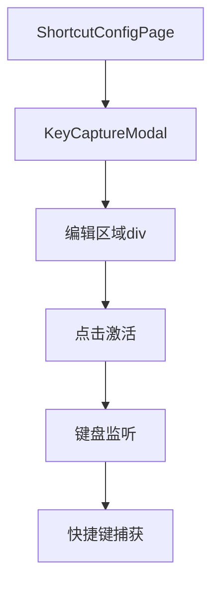
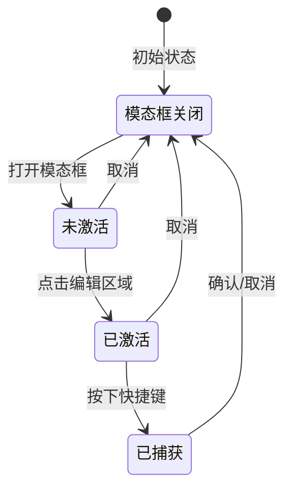

# 设计文档：快捷键录入优化

> 文档版本：v1.0
> 创建时间：2026-02-26
> 状态：设计中

## 1. 整体架构

### 1.1 组件关系图



### 1.2 状态流转图



## 2. 核心组件设计

### 2.1 KeyCaptureModal 组件变更

**新增状态**：
```typescript
const [isActivated, setIsActivated] = useState(false); // 编辑区域是否已激活
```

**状态重置逻辑**：
```typescript
// 模态框打开时重置状态
useEffect(() => {
  if (visible) {
    setCapturedConfig(null);
    setValidationError(null);
    setIsActivated(false); // 重置激活状态
  }
}, [visible]);
```

**键盘监听逻辑变更**：
```typescript
useEffect(() => {
  // 只有在可见、已激活、且未捕获快捷键时才监听
  if (visible && isActivated && !capturedConfig) {
    window.addEventListener('keydown', handleKeyDown, true);
  }
  return () => {
    window.removeEventListener('keydown', handleKeyDown, true);
  };
}, [visible, isActivated, capturedConfig, handleKeyDown]);
```

**点击激活处理**：
```typescript
const handleActivate = () => {
  if (!capturedConfig) {
    setIsActivated(true);
  }
};
```

### 2.2 编辑区域样式设计

**样式配置对象**：
```typescript
// 根据状态和主题获取样式
const getCaptureAreaStyle = () => {
  const baseStyle = {
    padding: '40px',
    textAlign: 'center',
    borderRadius: 8,
    outline: 'none',
    cursor: capturedConfig ? 'default' : 'pointer',
    position: 'relative',
    overflow: 'hidden',
    transition: 'all 0.3s ease',
  };

  // 已捕获状态 - 显示结果
  if (capturedConfig) {
    return {
      ...baseStyle,
      border: `2px solid ${validationError ? '#ff4d4f' : '#52c41a'}`,
      background: isDark 
        ? validationError ? 'rgba(255, 77, 79, 0.1)' : 'rgba(82, 196, 26, 0.1)'
        : validationError ? 'rgba(255, 77, 79, 0.05)' : 'rgba(82, 196, 26, 0.05)',
    };
  }

  // 已激活状态 - 荧光效果
  if (isActivated) {
    const accentColor = isDark ? '#00d4ff' : '#1890ff';
    return {
      ...baseStyle,
      border: `2px solid ${accentColor}`,
      background: isDark ? 'rgba(0, 212, 255, 0.1)' : 'rgba(24, 144, 255, 0.1)',
      boxShadow: `0 0 20px ${isDark ? 'rgba(0, 212, 255, 0.3)' : 'rgba(24, 144, 255, 0.3)'}`,
      animation: 'pulse-glow 2s ease-in-out infinite',
    };
  }

  // 未激活状态
  return {
    ...baseStyle,
    border: `2px dashed ${isDark ? 'rgba(0, 212, 255, 0.3)' : '#d9d9d9'}`,
    background: 'transparent',
    ':hover': {
      borderColor: isDark ? 'rgba(0, 212, 255, 0.5)' : '#1890ff',
    },
  };
};
```

### 2.3 CSS 动画定义

**脉冲动画**：
```css
@keyframes pulse-glow {
  0%, 100% {
    box-shadow: 0 0 20px rgba(0, 212, 255, 0.3);
  }
  50% {
    box-shadow: 0 0 30px rgba(0, 212, 255, 0.5);
  }
}
```

## 3. 界面状态设计

### 3.1 状态与UI对应表

| 状态 | 边框 | 背景 | 阴影 | 提示文字 |
|------|------|------|------|----------|
| 未激活 | 2px dashed 灰色 | 透明 | 无 | "点击此处激活，然后按下快捷键..." |
| 已激活 | 2px solid 青色/蓝色 | 半透明主题色 | 荧光光晕 + 脉冲动画 | "已激活，请按下快捷键..." |
| 已捕获-有效 | 2px solid 绿色 | 半透明绿色 | 无 | 显示快捷键 + "快捷键有效" |
| 已捕获-无效 | 2px solid 红色 | 半透明红色 | 无 | 显示快捷键 + 错误信息 |

### 3.2 提示文字逻辑

```typescript
const getPromptText = () => {
  if (capturedConfig) {
    return null; // 显示捕获结果
  }
  if (isActivated) {
    return '已激活，请按下快捷键...';
  }
  return '点击此处激活，然后按下快捷键...';
};
```

## 4. 交互流程

### 4.1 完整交互时序

```
1. 用户点击"修改"按钮
   ↓
2. 打开模态框，isActivated = false
   ↓
3. 显示未激活状态（虚线边框，提示"点击此处激活..."）
   ↓
4. 用户点击编辑区域
   ↓
5. isActivated = true，开始监听键盘
   ↓
6. 显示已激活状态（荧光效果，提示"已激活，请按下..."）
   ↓
7. 用户按下快捷键组合
   ↓
8. 捕获快捷键，isActivated = false，停止监听
   ↓
9. 显示捕获结果（边框变绿/红，显示验证结果）
   ↓
10. 用户点击确认/取消
    ↓
11. 关闭模态框
```

## 5. 异常处理

### 5.1 边界情况

| 场景 | 处理方案 |
|------|----------|
| 用户点击已捕获状态的区域 | 不响应，保持显示结果 |
| 用户按 Escape 键 | 保持现有逻辑，关闭模态框 |
| 模态框关闭时正在监听 | useEffect cleanup 自动移除监听 |
| 快速多次点击编辑区域 | 防抖处理，或状态判断避免重复激活 |

## 6. 代码实现位置

### 6.1 修改文件
- [ShortcutConfigPage.tsx](file:///d:/自动化测试平台/AITestCraft-Tech-style/frontend/src/pages/admin/ShortcutConfigPage.tsx)
  - 修改范围：`KeyCaptureModal` 组件（第208-373行）

### 6.2 可能的新增文件
- 如需全局CSS动画，可能需要更新全局样式文件
- 但优先使用内联样式 + CSS-in-JS 方案

## 7. 质量门控

- [ ] 架构图清晰准确
- [ ] 接口定义完整
- [ ] 状态流转无遗漏
- [ ] 异常场景已考虑
- [ ] 与现有系统无冲突

---

**下一步**：进入 Atomize 阶段，拆分子任务。
