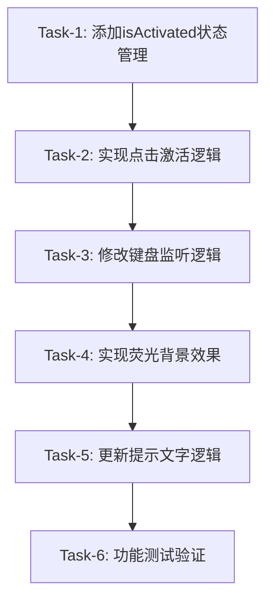

# 任务文档：快捷键录入优化

> 文档版本：v1.0
> 创建时间：2026-02-26
> 状态：待执行

## 任务依赖图



---

## Task-1: 添加 isActivated 状态管理

### 输入契约
- 前置依赖：无
- 输入数据：无
- 环境依赖：[ShortcutConfigPage.tsx](file:///d:/自动化测试平台/AITestCraft-Tech-style/frontend/src/pages/admin/ShortcutConfigPage.tsx) 文件可编辑

### 任务描述
在 `KeyCaptureModal` 组件中添加 `isActivated` 状态，用于控制编辑区域的激活状态。

### 实现步骤
1. 在 `KeyCaptureModal` 组件的状态定义区域（约第221行）添加：
   ```typescript
   const [isActivated, setIsActivated] = useState(false);
   ```
2. 在模态框打开时重置该状态

### 输出契约
- 输出数据：新增状态定义代码
- 交付物：修改后的组件代码
- 验收标准：
  - [ ] 状态定义正确，TypeScript 无报错
  - [ ] 模态框打开时状态重置为 false

---

## Task-2: 实现点击激活逻辑

### 输入契约
- 前置依赖：Task-1 完成
- 输入数据：`isActivated` 状态
- 环境依赖：无

### 任务描述
实现编辑区域的点击激活功能，点击后设置 `isActivated = true`。

### 实现步骤
1. 添加点击处理函数：
   ```typescript
   const handleActivate = useCallback(() => {
     if (!capturedConfig) {
       setIsActivated(true);
     }
   }, [capturedConfig]);
   ```
2. 在编辑区域 `div` 上添加 `onClick={handleActivate}`

### 输出契约
- 输出数据：点击处理函数和事件绑定
- 交付物：修改后的组件代码
- 验收标准：
  - [ ] 点击编辑区域后 `isActivated` 变为 true
  - [ ] 已捕获快捷键后点击不响应

---

## Task-3: 修改键盘监听逻辑

### 输入契约
- 前置依赖：Task-1 完成
- 输入数据：`isActivated` 状态
- 环境依赖：无

### 任务描述
修改 `useEffect` 中的键盘监听逻辑，仅在 `isActivated` 为 true 时才监听键盘事件。

### 实现步骤
1. 修改键盘事件监听 useEffect（约第253-264行）：
   ```typescript
   useEffect(() => {
     // 只有在可见、已激活、且未捕获快捷键时才监听
     if (visible && isActivated && !capturedConfig) {
       window.addEventListener('keydown', handleKeyDown, true);
     }
     return () => {
       window.removeEventListener('keydown', handleKeyDown, true);
     };
   }, [visible, isActivated, capturedConfig, handleKeyDown]);
   ```
2. 移除原有的 `setTimeout(() => inputRef.current?.focus(), 100);`

### 输出契约
- 输出数据：修改后的 useEffect 代码
- 交付物：修改后的组件代码
- 验收标准：
  - [ ] 模态框打开但未激活时，键盘输入不被捕获
  - [ ] 激活后键盘输入被正确捕获
  - [ ] 捕获成功后停止监听

---

## Task-4: 实现荧光背景效果

### 输入契约
- 前置依赖：Task-1、Task-2 完成
- 输入数据：`isActivated` 状态、`isDark` 主题状态
- 环境依赖：无

### 任务描述
根据 `isActivated` 状态动态设置编辑区域的样式，实现荧光背景效果。

### 实现步骤
1. 修改编辑区域 `div` 的 `style` 属性（约第309-330行）
2. 根据状态设置不同样式：
   - 未激活：虚线边框、透明背景
   - 已激活：实线边框、半透明背景、荧光阴影、脉冲动画
   - 已捕获：根据验证结果显示绿色或红色边框

### 样式规范
```typescript
// 未激活状态
border: `2px dashed ${isDark ? 'rgba(0, 212, 255, 0.3)' : '#d9d9d9'}`
background: 'transparent'

// 已激活状态
border: `2px solid ${isDark ? '#00d4ff' : '#1890ff'}`
background: isDark ? 'rgba(0, 212, 255, 0.1)' : 'rgba(24, 144, 255, 0.1)'
boxShadow: `0 0 20px ${isDark ? 'rgba(0, 212, 255, 0.3)' : 'rgba(24, 144, 255, 0.3)'}`
animation: 'pulse-glow 2s ease-in-out infinite'
```

3. 在组件内添加 CSS 动画定义（使用 styled-jsx 或内联 style 标签）

### 输出契约
- 输出数据：样式配置代码和 CSS 动画
- 交付物：修改后的组件代码
- 验收标准：
  - [ ] 未激活状态显示虚线边框
  - [ ] 已激活状态显示荧光效果（边框+背景+阴影）
  - [ ] 暗黑模式和明亮模式颜色正确
  - [ ] 脉冲动画效果正常

---

## Task-5: 更新提示文字逻辑

### 输入契约
- 前置依赖：Task-1 完成
- 输入数据：`isActivated` 状态、`capturedConfig` 状态
- 环境依赖：无

### 任务描述
根据状态动态更新编辑区域内的提示文字。

### 实现步骤
1. 修改提示文字渲染逻辑（约第356-359行）：
   ```typescript
   {capturedConfig ? (
     // 显示捕获结果...（保持现有逻辑）
   ) : isActivated ? (
     <Text style={{ 
       fontSize: 16, 
       color: isDark ? '#00d4ff' : '#1890ff',
       fontWeight: 'bold'
     }}>
       已激活，请按下快捷键...
     </Text>
   ) : (
     <Text type="secondary" style={{ fontSize: 16 }}>
       点击此处激活，然后按下快捷键...
     </Text>
   )}
   ```

### 输出契约
- 输出数据：修改后的提示文字渲染逻辑
- 交付物：修改后的组件代码
- 验收标准：
  - [ ] 未激活时显示"点击此处激活，然后按下快捷键..."
  - [ ] 已激活时显示"已激活，请按下快捷键..."
  - [ ] 已激活时文字颜色为主题色

---

## Task-6: 功能测试验证

### 输入契约
- 前置依赖：Task-1 至 Task-5 全部完成
- 输入数据：完整的修改后代码
- 环境依赖：前端开发服务器运行中

### 任务描述
验证所有功能是否按预期工作。

### 测试步骤
1. 进入系统管理 → 快捷键配置页面
2. 点击任意快捷键的"修改"按钮
3. 验证：模态框打开后，不点击编辑区域时键盘输入不被捕获
4. 验证：编辑区域显示虚线边框和"点击此处激活..."提示
5. 点击编辑区域
6. 验证：编辑区域显示荧光效果（边框变实线、背景变色、有光晕）
7. 验证：提示文字变为"已激活，请按下快捷键..."
8. 按下快捷键组合（如 Ctrl+Shift+A）
9. 验证：快捷键被正确捕获并显示
10. 点击确认保存
11. 验证：快捷键更新成功

### 输出契约
- 输出数据：测试结果记录
- 交付物：测试通过标记
- 验收标准：
  - [ ] 所有功能测试通过
  - [ ] 暗黑模式和明亮模式都正常
  - [ ] 无 TypeScript 编译错误
  - [ ] 无运行时错误

---

## 任务汇总

| 任务ID | 任务名称 | 预估复杂度 | 依赖任务 |
|--------|----------|------------|----------|
| Task-1 | 添加 isActivated 状态管理 | 低 | 无 |
| Task-2 | 实现点击激活逻辑 | 低 | Task-1 |
| Task-3 | 修改键盘监听逻辑 | 中 | Task-1 |
| Task-4 | 实现荧光背景效果 | 中 | Task-1, Task-2 |
| Task-5 | 更新提示文字逻辑 | 低 | Task-1 |
| Task-6 | 功能测试验证 | 低 | Task-1~5 |

---

**下一步**：进入 Approve 阶段，等待审批确认。
