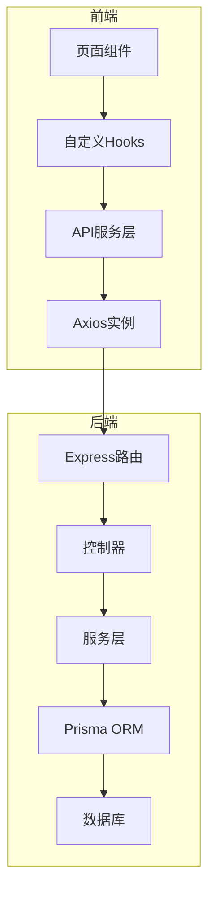
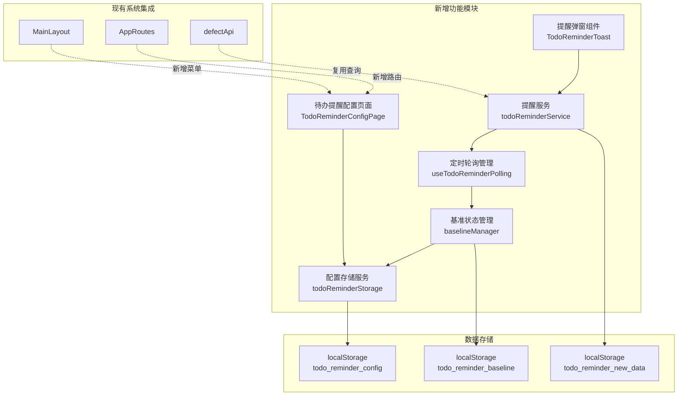

# 技术设计：我的待办提醒功能

> 文档版本：v1.0
> 创建时间：2026-02-24
> 关联需求：REQUIREMENT_我的待办提醒功能.md

---

## 1. 项目现状分析

### 1.1 技术栈识别

| 层级 | 技术 | 版本 | 说明 |
|------|------|------|------|
| 前端框架 | React | 18.2.0 | UI框架 |
| 前端语言 | TypeScript | 5.x | 类型安全 |
| 构建工具 | Vite | 4.5.0 | 开发服务器和构建 |
| UI组件库 | Ant Design | 5.27.0 | 组件库 |
| 路由 | React Router DOM | 6.20.1 | 页面路由 |
| 状态管理 | React Hooks | - | useState/useEffect等 |
| HTTP客户端 | Axios | - | API请求 |
| 后端框架 | Express.js | 4.18.2 | Node.js框架 |
| 后端语言 | TypeScript | - | 类型安全 |
| 数据库ORM | Prisma | 6.14.0 | 数据库访问 |
| 数据库 | MySQL/PostgreSQL | - | 双数据库架构 |

### 1.2 现有架构



### 1.3 相关模块分析

| 模块 | 路径 | 功能 | 可复用点 |
|------|------|------|----------|
| 菜单配置 | layouts/MainLayout.tsx | 系统管理菜单定义 | 新增菜单项 |
| 路由配置 | routes/AppRoutes.tsx | 页面路由注册 | 新增路由 |
| 我的待办 | pages/defect/MyTodoPage.tsx | 待办列表展示 | 数据查询逻辑 |
| 缺陷API | services/defect/defectApi.ts | 缺陷相关API | 查询方法 |
| 数据库配置页 | pages/admin/DatabaseConfigPage.tsx | 配置页面示例 | 页面结构、表单处理 |
| 消息推送配置 | pages/defect/NotificationConfigPage.tsx | 配置页面示例 | 配置页面模式 |

### 1.4 技术约束

- **编码规范**：使用TypeScript严格类型检查
- **组件风格**：函数组件 + React Hooks
- **UI规范**：Ant Design组件库
- **状态管理**：React Context用于全局状态，localStorage用于持久化
- **API规范**：RESTful API，统一响应格式
- **路由规范**：React Router v6，路径以`/admin`开头为系统管理页面

---

## 2. 整体架构设计

### 2.1 架构图



### 2.2 模块划分

| 模块 | 职责 | 依赖 | 文件路径 |
|------|------|------|----------|
| 配置页面 | 用户配置界面，设置间隔时间和启用状态 | 配置存储服务 | pages/admin/TodoReminderConfigPage.tsx |
| 配置存储服务 | 管理localStorage中的配置数据 | - | services/todoReminder/storage.ts |
| 提醒服务 | 核心逻辑，查询待办、对比基准、触发提醒 | 缺陷API、基准管理 | services/todoReminder/reminderService.ts |
| 基准管理 | 管理各项目待办基准状态 | 配置存储服务 | services/todoReminder/baselineManager.ts |
| 定时轮询Hook | 管理定时器，控制轮询启停 | 提醒服务 | hooks/useTodoReminderPolling.ts |
| 提醒弹窗组件 | UI展示，显示提醒和明细 | - | components/todoReminder/TodoReminderToast.tsx |
| 类型定义 | 接口和类型定义 | - | types/todoReminder.ts |

### 2.3 文件结构

```
frontend/src/
├── pages/
│   └── admin/
│       └── TodoReminderConfigPage.tsx    # 配置页面
├── components/
│   └── todoReminder/
│       └── TodoReminderToast.tsx         # 提醒弹窗组件
├── hooks/
│   └── useTodoReminderPolling.ts         # 定时轮询Hook
├── services/
│   └── todoReminder/
│       ├── storage.ts                    # 配置存储服务
│       ├── reminderService.ts            # 提醒核心服务
│       └── baselineManager.ts            # 基准状态管理
├── types/
│   └── todoReminder.ts                   # 类型定义
└── layouts/
    └── MainLayout.tsx                    # 修改：新增菜单

frontend/src/routes/
└── AppRoutes.tsx                         # 修改：新增路由
```

---

## 3. 接口设计

### 3.1 类型定义

```typescript
// types/todoReminder.ts

// 提醒配置
export interface TodoReminderConfig {
  enabled: boolean;           // 是否启用提醒
  intervalSeconds: number;    // 检查间隔（秒）
  updatedAt: string;          // 更新时间 ISO格式
}

// 项目待办基准
export interface ProjectBaseline {
  todoIds: number[];          // 待办缺陷ID列表
  updatedAt: string;          // 更新时间
}

// 所有项目基准映射
export type TodoBaselineMap = Record<string, ProjectBaseline>;

// 项目新增明细
export interface ProjectNewTodoDetail {
  projectId: number;
  projectName: string;
  newIds: number[];           // 新增缺陷ID列表
  count: number;
}

// 新增待办数据（用于展示）
export interface NewTodoData {
  totalCount: number;         // 总新增数量
  projectBreakdown: ProjectNewTodoDetail[];  // 按项目明细
  detectedAt: string;         // 检测时间
}

// 待办缺陷（复用现有类型）
export interface TodoDefect {
  id: number;
  subject: string;
  project_id: number;
  project_name?: string;
  status_id: number;
  status_name: string;
  priority_id: number;
  priority_name: string;
  assigned_to_id?: number;
  assigned_to_name?: string;
  created_on: string;
  updated_on: string;
}

// 查询结果
export interface TodoQueryResult {
  projectId: number;
  projectName: string;
  todos: TodoDefect[];
  total: number;
}

// localStorage键名
export const STORAGE_KEYS = {
  CONFIG: 'todo_reminder_config',
  BASELINE: 'todo_reminder_baseline',
  NEW_DATA: 'todo_reminder_new_data',
} as const;
```

### 3.2 存储服务接口

```typescript
// services/todoReminder/storage.ts

class TodoReminderStorage {
  // 获取配置
  getConfig(): TodoReminderConfig;
  
  // 保存配置
  saveConfig(config: Partial<TodoReminderConfig>): void;
  
  // 获取基准
  getBaseline(): TodoBaselineMap;
  
  // 保存基准
  saveBaseline(baseline: TodoBaselineMap): void;
  
  // 更新指定项目的基准
  updateProjectBaseline(projectId: string, todoIds: number[]): void;
  
  // 获取新增数据
  getNewTodoData(): NewTodoData | null;
  
  // 保存新增数据
  saveNewTodoData(data: NewTodoData): void;
  
  // 清除新增数据
  clearNewTodoData(): void;
  
  // 清除所有数据（重置）
  clearAll(): void;
}

export default new TodoReminderStorage();
```

### 3.3 提醒服务接口

```typescript
// services/todoReminder/reminderService.ts

interface ReminderService {
  // 检查所有项目的待办
  checkAllProjects(): Promise<NewTodoData | null>;
  
  // 检查指定项目的待办
  checkProject(projectId: number): Promise<TodoQueryResult>;
  
  // 对比基准识别新增
  detectNewTodos(
    currentTodos: TodoQueryResult[], 
    baseline: TodoBaselineMap
  ): NewTodoData | null;
  
  // 更新基准为当前状态
  updateBaseline(currentTodos: TodoQueryResult[]): void;
  
  // 获取提醒状态
  getReminderStatus(): {
    isEnabled: boolean;
    lastCheckTime: string | null;
    nextCheckTime: string | null;
  };
}

export const reminderService: ReminderService;
```

### 3.4 定时轮询Hook接口

```typescript
// hooks/useTodoReminderPolling.ts

interface UseTodoReminderPollingResult {
  isRunning: boolean;         // 是否正在运行
  lastCheckTime: Date | null; // 上次检查时间
  nextCheckTime: Date | null; // 下次检查时间
  newTodoData: NewTodoData | null;  // 新增待办数据
  isToastVisible: boolean;    // 弹窗是否显示
  showToast: boolean;         // 是否显示弹窗
  hideToast: () => void;      // 隐藏弹窗
  checkNow: () => Promise<void>;  // 立即检查
}

export function useTodoReminderPolling(): UseTodoReminderPollingResult;
```

---

## 4. 技术方案

### 4.1 核心实现方案

#### 4.1.1 配置存储服务

```typescript
// 默认配置
const DEFAULT_CONFIG: TodoReminderConfig = {
  enabled: true,
  intervalSeconds: 60,
  updatedAt: new Date().toISOString(),
};

class TodoReminderStorage {
  getConfig(): TodoReminderConfig {
    try {
      const stored = localStorage.getItem(STORAGE_KEYS.CONFIG);
      if (stored) {
        return { ...DEFAULT_CONFIG, ...JSON.parse(stored) };
      }
    } catch (e) {
      console.error('读取待办提醒配置失败:', e);
    }
    return DEFAULT_CONFIG;
  }

  saveConfig(config: Partial<TodoReminderConfig>): void {
    const current = this.getConfig();
    const updated = {
      ...current,
      ...config,
      updatedAt: new Date().toISOString(),
    };
    localStorage.setItem(STORAGE_KEYS.CONFIG, JSON.stringify(updated));
  }
  
  // ... 其他方法
}
```

#### 4.1.2 提醒核心服务

```typescript
class ReminderService {
  // 检查所有项目
  async checkAllProjects(): Promise<NewTodoData | null> {
    // 1. 获取所有项目
    const projects = await projectApi.getProjects();
    
    // 2. 查询各项目待办
    const results: TodoQueryResult[] = [];
    for (const project of projects) {
      const todos = await this.checkProject(project.id);
      results.push(todos);
    }
    
    // 3. 获取当前基准
    const baseline = storage.getBaseline();
    
    // 4. 检测新增
    const newData = this.detectNewTodos(results, baseline);
    
    // 5. 如果有新增，更新基准
    if (newData && newData.totalCount > 0) {
      this.updateBaseline(results);
      storage.saveNewTodoData(newData);
    }
    
    return newData;
  }

  // 检测新增待办
  detectNewTodos(
    currentTodos: TodoQueryResult[],
    baseline: TodoBaselineMap
  ): NewTodoData | null {
    const projectBreakdown: ProjectNewTodoDetail[] = [];
    let totalCount = 0;

    for (const result of currentTodos) {
      const projectId = result.projectId.toString();
      const currentIds = result.todos.map(t => t.id);
      const baselineIds = baseline[projectId]?.todoIds || [];
      
      // 找出新增的ID（当前存在但基准中不存在）
      const newIds = currentIds.filter(id => !baselineIds.includes(id));
      
      if (newIds.length > 0) {
        projectBreakdown.push({
          projectId: result.projectId,
          projectName: result.projectName,
          newIds,
          count: newIds.length,
        });
        totalCount += newIds.length;
      }
    }

    if (totalCount === 0) return null;

    return {
      totalCount,
      projectBreakdown,
      detectedAt: new Date().toISOString(),
    };
  }
}
```

#### 4.1.3 定时轮询Hook

```typescript
export function useTodoReminderPolling(): UseTodoReminderPollingResult {
  const [isRunning, setIsRunning] = useState(false);
  const [lastCheckTime, setLastCheckTime] = useState<Date | null>(null);
  const [nextCheckTime, setNextCheckTime] = useState<Date | null>(null);
  const [newTodoData, setNewTodoData] = useState<NewTodoData | null>(null);
  const [isToastVisible, setIsToastVisible] = useState(false);
  
  const timerRef = useRef<NodeJS.Timeout | null>(null);
  const config = storage.getConfig();

  // 执行检查
  const performCheck = useCallback(async () => {
    if (!config.enabled) return;
    
    setLastCheckTime(new Date());
    
    try {
      const result = await reminderService.checkAllProjects();
      if (result && result.totalCount > 0) {
        setNewTodoData(result);
        setIsToastVisible(true);
      }
    } catch (error) {
      console.error('待办提醒检查失败:', error);
    }
    
    // 设置下次检查时间
    setNextCheckTime(new Date(Date.now() + config.intervalSeconds * 1000));
  }, [config.enabled, config.intervalSeconds]);

  // 启动轮询
  useEffect(() => {
    if (!config.enabled) {
      setIsRunning(false);
      return;
    }

    setIsRunning(true);
    performCheck(); // 立即执行一次

    // 设置定时器
    timerRef.current = setInterval(performCheck, config.intervalSeconds * 1000);

    return () => {
      if (timerRef.current) {
        clearInterval(timerRef.current);
      }
    };
  }, [config.enabled, config.intervalSeconds, performCheck]);

  return {
    isRunning,
    lastCheckTime,
    nextCheckTime,
    newTodoData,
    isToastVisible,
    showToast: () => setIsToastVisible(true),
    hideToast: () => setIsToastVisible(false),
    checkNow: performCheck,
  };
}
```

### 4.2 异常处理策略

| 异常类型 | 处理方式 | 用户提示 |
|----------|----------|----------|
| localStorage不可用 | 降级到内存存储 | 静默处理，记录日志 |
| API请求失败 | 重试3次后跳过 | 不提示，下次轮询继续 |
| 数据解析错误 | 重置基准数据 | 静默处理 |
| 定时器错误 | 重新初始化 | 不提示 |

### 4.3 安全考虑

- **数据验证**：所有localStorage读取的数据都需要验证类型和格式
- **输入过滤**：配置页面的输入需要限制范围（10-3600秒）
- **XSS防护**：弹窗展示的数据使用React默认转义
- **数据清理**：提供清除所有数据的功能按钮

---

## 5. 风险评估

| 风险 | 等级 | 影响 | 应对方案 |
|------|------|------|----------|
| localStorage容量限制（5MB） | 低 | 基准数据过多时可能溢出 | 只存储ID列表，定期清理旧数据 |
| 频繁API调用影响性能 | 中 | 轮询间隔过短导致服务器压力 | 限制最小间隔为10秒，建议60秒 |
| 用户同时打开多个标签页 | 低 | 重复提醒 | 使用BroadcastChannel同步状态（可选） |
| 浏览器休眠/后台运行 | 低 | 定时器不准确 | 使用Page Visibility API检测，唤醒后重新检查 |

---

## 6. 测试策略

### 6.1 单元测试

| 测试目标 | 测试内容 | 覆盖率要求 |
|----------|----------|------------|
| storage.ts | 配置的读写、默认值、异常处理 | 90% |
| reminderService.ts | 新增检测逻辑、基准更新 | 85% |
| useTodoReminderPolling.ts | 定时器管理、状态更新 | 80% |

### 6.2 集成测试

| 测试场景 | 测试步骤 | 预期结果 |
|----------|----------|----------|
| 首次启用 | 清除数据→启用提醒→等待检查 | 记录初始基准，不提醒 |
| 新增检测 | 模拟新增待办→等待检查 | 显示提醒弹窗，数据正确 |
| 配置修改 | 修改间隔时间→保存 | 新配置生效，定时器重置 |
| 禁用提醒 | 禁用→等待 | 不执行检查，不显示弹窗 |
| 页面刷新 | 刷新页面→等待检查 | 保留基准，正确识别新增 |

---

## 7. 部署方案

### 7.1 环境要求

- 浏览器支持：Chrome 80+, Firefox 75+, Edge 80+
- localStorage必须可用
- 无后端部署需求（纯前端功能）

### 7.2 配置变更

无需变更服务器配置，所有配置存储在浏览器本地。

### 7.3 数据库迁移

无需数据库迁移，不涉及后端数据库变更。

---

## 8. 附录

### 8.1 参考资料

- [React Hooks最佳实践](https://react.dev/reference/react)
- [Ant Design组件文档](https://ant.design/components/overview-cn/)
- [localStorage MDN文档](https://developer.mozilla.org/zh-CN/docs/Web/API/Window/localStorage)

### 8.2 命名规范

| 类型 | 命名规范 | 示例 |
|------|----------|------|
| 组件 | PascalCase | TodoReminderToast |
| Hook | camelCase前缀use | useTodoReminderPolling |
| 服务 | camelCase | reminderService |
| 类型 | PascalCase | TodoReminderConfig |
| 常量 | UPPER_SNAKE_CASE | STORAGE_KEYS |
| 文件 | camelCase | todoReminder.ts |

### 8.3 性能指标

| 指标 | 目标值 | 测量方式 |
|------|--------|----------|
| 配置读取时间 | < 10ms | console.time |
| 待办检查时间 | < 500ms | API响应时间 |
| 弹窗渲染时间 | < 100ms | React DevTools |
| 内存占用 | < 5MB | Chrome DevTools |
