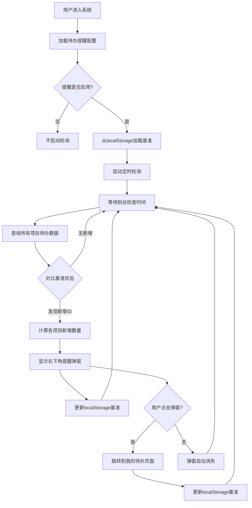

# 需求文档：我的待办提醒功能

> 文档版本：v1.1
> 创建时间：2026-02-24
> 更新时间：2026-02-24
> 状态：已确认

---

## 1. 需求背景

### 1.1 业务场景
在极客模式下，用户需要持续关注缺陷表中是否有新的待办数据产生。当前用户需要手动刷新页面或主动查看我的待办页面才能了解最新待办情况，无法及时获取新的待办任务提醒。

### 1.2 当前痛点
- **被动查看**：用户必须主动进入我的待办页面才能看到待办数据
- **时效性差**：无法及时感知新产生的待办任务
- **缺乏提醒机制**：系统没有主动提醒用户新待办的功能
- **无法自定义**：用户无法根据自身需求调整数据检查频率

### 1.3 期望目标
- 实现定时自动检查缺陷表中的待办数据
- 当有新待办产生时，在内容展示区右下角弹出提醒
- 点击提醒可快速跳转到我的待办页面
- 支持用户自定义数据查询频率（间隔时间）

---

## 2. 用户角色

| 角色 | 描述 | 核心诉求 |
|------|------|----------|
| 测试工程师 | 负责缺陷跟踪和处理 | 及时获取新的待办任务提醒，避免遗漏 |
| 项目经理 | 关注项目缺陷状态 | 实时了解待办任务变化，便于资源调配 |
| 开发人员 | 处理分配的缺陷 | 第一时间收到新的缺陷分配提醒 |

---

## 3. 功能范围

### 3.1 功能清单

| 功能模块 | 功能点 | 优先级 | 描述 |
|----------|--------|--------|------|
| 基准管理 | 多项目基准记录 | P0 | 按项目维度记录待办基准状态 |
| 定时检查 | 自动轮询检查 | P0 | 前端定时轮询检查新的待办数据 |
| 新增检测 | 对比基准识别新增 | P0 | 对比基准状态识别新增待办 |
| 提醒弹窗 | 右下角提醒 | P0 | 有新增待办时在右下角弹出提醒通知 |
| 详情展示 | 悬停显示明细 | P0 | 鼠标悬停显示各项目新增缺陷ID列表 |
| 快捷跳转 | 点击跳转 | P0 | 点击提醒弹窗跳转到我的待办页面 |
| 配置管理 | 频率设置 | P0 | 在系统管理菜单下新增配置页面，设置轮询间隔 |
| 开关控制 | 启用/禁用 | P0 | 支持开启/关闭提醒功能 |
| 数据持久化 | localStorage存储 | P1 | 基准数据存储在localStorage，页面刷新保留 |

### 3.2 明确边界

**✅ 包含范围：**
- 前端定时轮询检查待办数据
- 按项目维度记录待办基准状态
- 对比基准识别新增待办
- 右下角弹出式提醒组件
- 悬停显示各项目新增缺陷ID明细
- 点击提醒跳转到我的待办页面
- 系统管理菜单下的配置页面
- 轮询间隔时间设置（以秒为单位）
- 启用/禁用提醒功能开关
- 基准数据localStorage持久化存储

**❌ 不包含范围：**
- 后端定时任务改造（保持现有Server酱定时任务不变）
- WebSocket实时推送（保持现有WebSocket功能不变）
- 消息推送渠道扩展（如邮件、短信等）
- 待办数据的筛选逻辑修改

---

## 4. 用户故事

**US-001: 自动检查新待办**
```
作为 测试工程师
我希望 系统能自动检查是否有新的待办任务
以便 我能及时获知需要处理的工作
```

**验收标准：**
- [ ] 系统按照配置的频率自动检查待办数据
- [ ] 检查逻辑与我的待办页面保持一致
- [ ] 按项目维度分别记录基准状态
- [ ] 只在检测到新增待办时触发提醒

**US-002: 待办提醒弹窗**
```
作为 测试工程师
我希望 有新增待办时在页面右下角看到提醒
以便 我能立即注意到有新的工作任务
```

**验收标准：**
- [ ] 提醒弹窗显示在内容展示区右下角
- [ ] 弹窗显示新增待办总数量
- [ ] 鼠标悬停显示各项目新增缺陷ID列表
- [ ] 弹窗支持手动关闭
- [ ] 弹窗自动消失（如5秒后）

**US-003: 快捷跳转待办页面**
```
作为 测试工程师
我希望 点击提醒弹窗能快速跳转到我的待办页面
以便 我能立即查看和处理待办任务
```

**验收标准：**
- [ ] 点击提醒弹窗任意区域可跳转
- [ ] 跳转后自动关闭提醒弹窗
- [ ] 跳转到我的待办页面时保持原有筛选条件
- [ ] 跳转后更新基准状态为当前数据

**US-004: 自定义检查频率**
```
作为 测试工程师
我希望 能自定义数据检查的频率
以便 根据我的工作习惯调整提醒间隔
```

**验收标准：**
- [ ] 在系统管理菜单下有"我的待办提醒"配置菜单
- [ ] 菜单位于"消息推送配置"下方
- [ ] 可设置轮询间隔时间（秒）
- [ ] 设置范围：10-3600秒（10秒-1小时）
- [ ] 默认间隔：60秒
- [ ] 配置保存后即时生效

**US-005: 启用/禁用提醒**
```
作为 测试工程师
我希望 能开启或关闭待办提醒功能
以便 在不需要时暂停提醒
```

**验收标准：**
- [ ] 配置页面有启用/禁用开关
- [ ] 禁用后停止定时轮询
- [ ] 禁用后不显示提醒弹窗
- [ ] 重新启用后恢复轮询

---

## 5. 业务流程

### 5.1 核心逻辑说明

**基准状态管理**：
- 按项目ID分别记录待办缺陷ID列表
- 存储在localStorage中，页面刷新保留
- 首次查询时记录为初始基准

**新增检测逻辑**：
- 查询当前所有项目的待办数据
- 对比localStorage中的基准状态
- 当前存在但基准中不存在的ID = 新增待办
- 触发提醒后更新基准为当前状态

### 5.2 整体流程



### 5.3 配置管理流程

```mermaid
flowchart TD
    A[用户进入系统管理] --> B[点击"我的待办提醒"菜单]
    B --> C[加载当前配置]
    C --> D[显示配置页面]
    D --> E[用户修改配置]
    E --> F[点击保存]
    F --> G[验证输入合法性]
    G --> H{验证通过?}
    H -->|是| I[保存配置到localStorage]
    H -->|否| J[显示错误提示]
    I --> K[更新前端定时器]
    J --> E
    K --> L[提示保存成功]
```

---

## 6. 数据需求

### 6.1 数据实体

**localStorage存储结构**

```typescript
// 配置数据
interface TodoReminderConfig {
  enabled: boolean;           // 是否启用
  intervalSeconds: number;    // 轮询间隔（秒）
  updatedAt: string;          // 更新时间
}

// 基准数据 - 按项目存储
interface TodoBaseline {
  [projectId: string]: {
    todoIds: number[];        // 待办缺陷ID列表
    updatedAt: string;        // 更新时间
  }
}

// 新增待办数据 - 临时存储
interface NewTodoData {
  totalCount: number;         // 总新增数量
  projectBreakdown: {         // 按项目明细
    projectId: number;
    projectName: string;
    newIds: number[];         // 新增缺陷ID列表
    count: number;
  }[];
  detectedAt: string;         // 检测时间
}
```

**localStorage键名**：
- `todo_reminder_config` - 配置数据
- `todo_reminder_baseline` - 基准数据
- `todo_reminder_new_data` - 新增待办数据（用于悬停展示）

### 6.2 API接口

**查询待办（复用现有接口）**
```
GET /api/defects/my-todo?project_id={projectId}
Response: {
  data: Defect[],
  total: number
}
```

**批量查询待办（新增接口）**
```
GET /api/defects/my-todo/all-projects
Response: {
  projects: [
    {
      project_id: number,
      project_name: string,
      todos: Defect[],
      total: number
    }
  ]
}
```

### 6.3 数据流向

```
┌─────────────────┐     ┌─────────────────┐     ┌─────────────────┐
│   前端定时器    │────▶│   缺陷API       │────▶│   缺陷数据库    │
│                 │     │                 │     │                 │
│ 轮询检查待办    │     │ 查询各项目待办  │     │ issues表        │
│                 │◀────│                 │◀────│                 │
└────────┬────────┘     └─────────────────┘     └─────────────────┘
         │
         │ 对比基准
         ▼
┌─────────────────┐
│  localStorage   │
│                 │
│ • todo_reminder │
│   _baseline     │
│ • todo_reminder │
│   _config       │
└────────┬────────┘
         │
         │ 发现新增
         ▼
┌─────────────────┐
│   提醒弹窗组件   │
│                 │
│ 显示总数量      │
│ 悬停显示明细    │
│ 点击跳转待办页  │
└─────────────────┘
```

---

## 7. 界面设计

### 7.1 菜单位置

在系统管理菜单下新增"我的待办提醒"菜单项，位于"消息推送配置"下方：

```
系统管理
├── 数据库配置
├── 大模型配置
├── 系统监控
├── 插件管理
└── 我的待办提醒  ← 新增
```

### 7.2 配置页面布局

```
┌─────────────────────────────────────────────────────────────┐
│  我的待办提醒配置                                            │
├─────────────────────────────────────────────────────────────┤
│                                                             │
│  提醒设置                                                    │
│  ┌─────────────────────────────────────────────────────┐   │
│  │                                                     │   │
│  │  启用待办提醒      [开关按钮]                        │   │
│  │                                                     │   │
│  │  检查间隔时间      [输入框] 秒                      │   │
│  │                    (10-3600秒，默认60秒)            │   │
│  │                                                     │   │
│  │  [保存设置]                                         │   │
│  │                                                     │   │
│  └─────────────────────────────────────────────────────┘   │
│                                                             │
│  说明：                                                      │
│  • 启用后系统将按照设定的时间间隔自动检查新的待办任务         │
│  • 当有新待办产生时，会在页面右下角弹出提醒                  │
│  • 点击提醒弹窗可快速跳转到我的待办页面                      │
│  • 鼠标悬停提醒弹窗可查看各项目新增缺陷ID列表                │
│                                                             │
└─────────────────────────────────────────────────────────────┘
```

### 7.3 提醒弹窗设计

**默认状态**：
```
┌─────────────────────────────────────────────────────────────┐
│                                                             │
│                                    ┌─────────────────────┐ │
│                                    │  🔔 新待办提醒      │ │
│                                    │                     │ │
│                                    │  您有 3 条新的      │ │
│                                    │  待办任务           │ │
│                                    │                     │ │
│                                    │  [点击查看]         │ │
│                                    │              [×]    │ │
│                                    └─────────────────────┘ │
│                                                             │
└─────────────────────────────────────────────────────────────┘
```

**悬停状态**（显示明细）：
```
┌─────────────────────────────────────────────────────────────┐
│                                                             │
│                                    ┌─────────────────────┐ │
│                                    │  🔔 新待办提醒      │ │
│                                    │                     │ │
│                                    │  您有 3 条新的      │ │
│                                    │  待办任务           │ │
│                                    │                     │ │
│                                    │  [点击查看]         │ │
│                                    │              [×]    │ │
│                                    └─────────────────────┘ │
│                                          │                  │
│                                          ▼                  │
│                                    ┌─────────────────────┐ │
│                                    │  📋 新增明细        │ │
│                                    │                     │ │
│                                    │  智能物联项目       │ │
│                                    │  • #1234, #1235     │ │
│                                    │                     │ │
│                                    │  电商平台项目       │ │
│                                    │  • #2345            │ │
│                                    │                     │ │
│                                    └─────────────────────┘ │
│                                                             │
└─────────────────────────────────────────────────────────────┘
```

**弹窗样式要求：**
- 位置：内容展示区右下角，距边缘16px
- 尺寸：宽度280px，高度自适应
- 背景：白色卡片，带阴影效果
- 动画：滑入/淡出效果
- 自动消失：5秒后自动关闭
- 明细tooltip：宽度320px，最大高度200px，可滚动

---

## 8. 验收标准

### 8.1 功能验收

- [ ] **AC-001**: 系统管理菜单下显示"我的待办提醒"菜单项
- [ ] **AC-002**: 菜单项位于"消息推送配置"下方
- [ ] **AC-003**: 配置页面可正常打开并显示当前设置
- [ ] **AC-004**: 可启用/禁用提醒功能
- [ ] **AC-005**: 可修改轮询间隔时间（10-3600秒）
- [ ] **AC-006**: 非法输入（<10或>3600）时显示错误提示
- [ ] **AC-007**: 配置保存后即时生效
- [ ] **AC-008**: 首次查询时记录基准状态到localStorage
- [ ] **AC-009**: 按项目维度分别记录基准状态
- [ ] **AC-010**: 前端按照配置的时间间隔自动检查待办
- [ ] **AC-011**: 有新增待办时在右下角显示提醒弹窗
- [ ] **AC-012**: 提醒弹窗显示新增待办总数量
- [ ] **AC-013**: 鼠标悬停弹窗显示各项目新增缺陷ID明细
- [ ] **AC-014**: 点击提醒弹窗跳转到我的待办页面
- [ ] **AC-015**: 跳转后更新localStorage基准状态
- [ ] **AC-016**: 弹窗支持手动关闭
- [ ] **AC-017**: 弹窗支持自动消失
- [ ] **AC-018**: 页面刷新后基准状态保留
- [ ] **AC-019**: 禁用提醒后停止定时轮询

### 8.2 非功能验收

**性能要求：**
- 轮询检查API响应时间 < 500ms
- 提醒弹窗渲染时间 < 100ms
- 配置保存响应时间 < 1s
- localStorage读写时间 < 50ms

**安全要求：**
- localStorage数据需加密存储（可选）
- 输入数据需要验证和过滤

**兼容性要求：**
- 支持Chrome、Firefox、Edge等主流浏览器
- 响应式布局适配不同屏幕尺寸
- localStorage容量限制处理（5MB）

---

## 9. 疑问与假设

### 9.1 已做假设

- **假设1**: 使用localStorage存储基准数据
  - **理由**: 页面刷新后基准状态保留，符合用户需求

- **假设2**: 按项目维度分别记录基准
  - **理由**: 用户需要跟踪所有项目的待办变化

- **假设3**: 使用前端轮询而非WebSocket推送
  - **理由**: 实现简单，与现有架构兼容

- **假设4**: 默认检查间隔为60秒
  - **理由**: 平衡实时性和系统负载

- **假设5**: 弹窗自动消失时间为5秒
  - **理由**: 给用户足够时间查看，又不影响工作

### 9.2 待确认事项

- [x] **Q1**: 是否需要显示具体新增数量？
  - **答案**: 是，显示总数量，悬停显示各项目缺陷ID明细

- [x] **Q2**: 切换项目时是否重置基准？
  - **答案**: 否，记录所有项目的基准

- [x] **Q3**: 是否需要支持关闭提醒功能？
  - **答案**: 是，支持启用/禁用

- [x] **Q4**: 基准数据存储方式？
  - **答案**: localStorage，页面刷新保留

---

## 10. 附录

### 10.1 参考资料

- [MainLayout.tsx](file:///d:/自动化测试平台/AITestCraft-Tech-style/frontend/src/layouts/MainLayout.tsx) - 菜单配置
- [MyTodoPage.tsx](file:///d:/自动化测试平台/AITestCraft-Tech-style/frontend/src/pages/defect/MyTodoPage.tsx) - 我的待办页面
- [NotificationConfigPage.tsx](file:///d:/自动化测试平台/AITestCraft-Tech-style/frontend/src/pages/defect/NotificationConfigPage.tsx) - 消息推送配置页面
- [defectRoutes.ts](file:///d:/自动化测试平台/AITestCraft-Tech-style/backend/src/routes/defectRoutes.ts) - 缺陷相关API

### 10.2 术语说明

| 术语 | 说明 |
|------|------|
| 极客模式 | 系统的专业工作模式，提供更丰富的功能 |
| 内容展示区 | 页面主内容区域，位于左侧菜单右侧 |
| 我的待办 | 分配给当前用户的待处理缺陷任务 |
| 轮询 | 前端定时向后端发送请求获取最新数据 |
| 基准状态 | 上次提醒/查看时的待办数据快照 |
| localStorage | 浏览器本地存储，页面刷新数据保留 |

### 10.3 本地存储结构示例

```json
// todo_reminder_config
{
  "enabled": true,
  "intervalSeconds": 60,
  "updatedAt": "2026-02-24T10:30:00.000Z"
}

// todo_reminder_baseline
{
  "2980": {
    "todoIds": [1234, 1235, 1236],
    "updatedAt": "2026-02-24T10:30:00.000Z"
  },
  "2981": {
    "todoIds": [2345, 2346],
    "updatedAt": "2026-02-24T10:30:00.000Z"
  }
}

// todo_reminder_new_data
{
  "totalCount": 3,
  "projectBreakdown": [
    {
      "projectId": 2980,
      "projectName": "智能物联项目",
      "newIds": [1237, 1238],
      "count": 2
    },
    {
      "projectId": 2981,
      "projectName": "电商平台项目",
      "newIds": [2347],
      "count": 1
    }
  ],
  "detectedAt": "2026-02-24T10:35:00.000Z"
}
```
