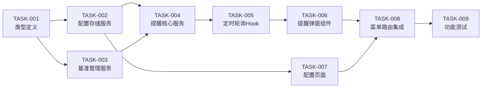

# 任务清单：我的待办提醒功能

> 文档版本：v1.0
> 创建时间：2026-02-24
> 关联设计：DESIGN_我的待办提醒功能.md

---

## 任务依赖图



---

## 任务列表

### TASK-001: 类型定义

- **优先级**: P0
- **类型**: 基础设施
- **前置依赖**: 无
- **预估复杂度**: 低
- **预计耗时**: 15分钟

**输入契约**：
- 输入数据：需求文档中的类型定义
- 环境依赖：TypeScript环境

**输出契约**：
- 输出数据：类型定义文件
- 交付物：
  - `frontend/src/types/todoReminder.ts`

**实现要点**：
1. 定义TodoReminderConfig接口
2. 定义ProjectBaseline和TodoBaselineMap类型
3. 定义ProjectNewTodoDetail和NewTodoData接口
4. 定义TodoDefect和TodoQueryResult接口
5. 定义STORAGE_KEYS常量

**验收标准**：
- [ ] 所有类型定义完整
- [ ] 类型导出正确
- [ ] 无TypeScript类型错误

**执行状态**: 待开始

---

### TASK-002: 配置存储服务

- **优先级**: P0
- **类型**: 基础设施
- **前置依赖**: TASK-001
- **预估复杂度**: 低
- **预计耗时**: 30分钟

**输入契约**：
- 输入数据：类型定义、localStorage API
- 环境依赖：浏览器环境

**输出契约**：
- 输出数据：配置存储服务
- 交付物：
  - `frontend/src/services/todoReminder/storage.ts`

**实现要点**：
1. 实现getConfig方法（带默认值）
2. 实现saveConfig方法
3. 实现getBaseline和saveBaseline方法
4. 实现updateProjectBaseline方法
5. 实现getNewTodoData、saveNewTodoData、clearNewTodoData方法
6. 实现clearAll方法
7. 添加异常处理（try-catch）

**验收标准**：
- [ ] 配置读写正常
- [ ] 默认值正确
- [ ] localStorage数据格式正确
- [ ] 异常处理完善

**执行状态**: 待开始

---

### TASK-003: 基准管理服务

- **优先级**: P0
- **类型**: 基础设施
- **前置依赖**: TASK-001, TASK-002
- **预估复杂度**: 中
- **预计耗时**: 30分钟

**输入契约**：
- 输入数据：TodoQueryResult数组
- 环境依赖：配置存储服务

**输出契约**：
- 输出数据：基准状态管理功能
- 交付物：
  - `frontend/src/services/todoReminder/baselineManager.ts`

**实现要点**：
1. 实现初始化基准方法（首次记录）
2. 实现更新基准方法
3. 实现获取指定项目基准方法
4. 实现获取所有项目基准方法
5. 实现清除基准方法

**验收标准**：
- [ ] 基准数据正确存储
- [ ] 按项目维度管理
- [ ] 时间戳更新正确

**执行状态**: 待开始

---

### TASK-004: 提醒核心服务

- **优先级**: P0
- **类型**: 核心功能
- **前置依赖**: TASK-002, TASK-003
- **预估复杂度**: 高
- **预计耗时**: 60分钟

**输入契约**：
- 输入数据：项目列表、缺陷API
- 环境依赖：基准管理服务、配置存储服务

**输出契约**：
- 输出数据：提醒检测逻辑
- 交付物：
  - `frontend/src/services/todoReminder/reminderService.ts`

**实现要点**：
1. 实现checkProject方法（查询单个项目待办）
2. 实现checkAllProjects方法（查询所有项目）
3. 实现detectNewTodos方法（核心：对比基准识别新增）
4. 实现updateBaseline方法
5. 处理API错误和重试逻辑
6. 添加日志记录

**验收标准**：
- [ ] 正确查询所有项目待办
- [ ] 正确识别新增待办
- [ ] 正确更新基准
- [ ] 错误处理完善

**执行状态**: 待开始

---

### TASK-005: 定时轮询Hook

- **优先级**: P0
- **类型**: 核心功能
- **前置依赖**: TASK-004
- **预估复杂度**: 中
- **预计耗时**: 45分钟

**输入契约**：
- 输入数据：提醒核心服务、配置
- 环境依赖：React Hooks环境

**输出契约**：
- 输出数据：定时轮询管理Hook
- 交付物：
  - `frontend/src/hooks/useTodoReminderPolling.ts`

**实现要点**：
1. 使用useState管理状态
2. 使用useRef保存定时器引用
3. 实现performCheck回调函数
4. 使用useEffect启动/停止轮询
5. 实现状态暴露（isRunning, lastCheckTime等）
6. 实现checkNow方法
7. 处理组件卸载时清理定时器

**验收标准**：
- [ ] 定时器正确启动和停止
- [ ] 配置变更时重新初始化
- [ ] 状态更新正确
- [ ] 无内存泄漏

**执行状态**: 待开始

---

### TASK-006: 提醒弹窗组件

- **优先级**: P0
- **类型**: UI组件
- **前置依赖**: TASK-005
- **预估复杂度**: 中
- **预计耗时**: 60分钟

**输入契约**：
- 输入数据：NewTodoData、显示状态
- 环境依赖：Ant Design组件

**输出契约**：
- 输出数据：提醒弹窗UI组件
- 交付物：
  - `frontend/src/components/todoReminder/TodoReminderToast.tsx`
  - `frontend/src/components/todoReminder/TodoReminderToast.css`

**实现要点**：
1. 设计弹窗布局（右下角固定定位）
2. 显示总新增数量
3. 实现悬停显示明细功能（Tooltip/Popover）
4. 显示各项目新增缺陷ID列表
5. 实现点击跳转功能
6. 实现手动关闭功能
7. 实现自动消失功能（5秒）
8. 添加动画效果

**验收标准**：
- [ ] 弹窗位置正确（右下角）
- [ ] 显示数量正确
- [ ] 悬停显示明细
- [ ] 点击跳转正常
- [ ] 自动消失正常
- [ ] 动画流畅

**执行状态**: 待开始

---

### TASK-007: 配置页面

- **优先级**: P0
- **类型**: UI页面
- **前置依赖**: TASK-002
- **预估复杂度**: 中
- **预计耗时**: 45分钟

**输入契约**：
- 输入数据：配置存储服务
- 环境依赖：Ant Design表单组件

**输出契约**：
- 输出数据：配置页面
- 交付物：
  - `frontend/src/pages/admin/TodoReminderConfigPage.tsx`

**实现要点**：
1. 创建页面组件结构
2. 实现启用/禁用开关
3. 实现间隔时间输入框（带范围限制）
4. 实现保存按钮
5. 添加表单验证
6. 显示保存成功提示
7. 添加说明文字

**验收标准**：
- [ ] 页面布局正确
- [ ] 开关控制正常
- [ ] 输入验证正确（10-3600）
- [ ] 保存功能正常
- [ ] 提示信息正确

**执行状态**: 待开始

---

### TASK-008: 菜单路由集成

- **优先级**: P0
- **类型**: 集成
- **前置依赖**: TASK-006, TASK-007
- **预估复杂度**: 低
- **预计耗时**: 20分钟

**输入契约**：
- 输入数据：配置页面组件、提醒弹窗组件
- 环境依赖：MainLayout、AppRoutes

**输出契约**：
- 输出数据：菜单和路由配置
- 交付物：
  - `frontend/src/layouts/MainLayout.tsx`（修改）
  - `frontend/src/routes/AppRoutes.tsx`（修改）
  - `frontend/src/App.tsx`（修改，集成提醒弹窗）

**实现要点**：
1. 在MainLayout中添加"我的待办提醒"菜单项
2. 在AppRoutes中添加路由配置
3. 在App.tsx中集成TodoReminderToast组件
4. 使用useTodoReminderPolling Hook

**验收标准**：
- [ ] 菜单显示正确
- [ ] 菜单位置正确（消息推送配置下方）
- [ ] 路由跳转正常
- [ ] 弹窗全局显示

**执行状态**: 待开始

---

### TASK-009: 功能测试

- **优先级**: P1
- **类型**: 测试
- **前置依赖**: TASK-008
- **预估复杂度**: 中
- **预计耗时**: 30分钟

**输入契约**：
- 输入数据：完整功能实现
- 环境依赖：浏览器环境

**输出契约**：
- 输出数据：测试结果
- 交付物：
  - 测试报告（本文件更新）

**测试场景**：
1. 首次启用测试
2. 新增检测测试
3. 配置修改测试
4. 禁用提醒测试
5. 页面刷新测试
6. 多项目测试
7. 边界条件测试

**验收标准**：
- [ ] 所有测试场景通过
- [ ] 无严重bug
- [ ] 性能满足要求

**执行状态**: 待开始

---

## 执行进度

| 任务 | 状态 | 开始时间 | 完成时间 | 备注 |
|------|------|----------|----------|------|
| TASK-001 | 待开始 | - | - | - |
| TASK-002 | 待开始 | - | - | - |
| TASK-003 | 待开始 | - | - | - |
| TASK-004 | 待开始 | - | - | - |
| TASK-005 | 待开始 | - | - | - |
| TASK-006 | 待开始 | - | - | - |
| TASK-007 | 待开始 | - | - | - |
| TASK-008 | 待开始 | - | - | - |
| TASK-009 | 待开始 | - | - | - |

---

## 阻塞问题记录

| 问题 | 影响任务 | 发现时间 | 解决方案 | 状态 |
|------|----------|----------|----------|------|
| 无 | - | - | - | - |

---

## 快速开始开发

按依赖顺序执行任务：

```bash
# 1. 创建目录结构
mkdir -p frontend/src/services/todoReminder
mkdir -p frontend/src/components/todoReminder

# 2. 按顺序开发
# TASK-001 → TASK-002 → TASK-003 → TASK-004 → TASK-005 → TASK-006 → TASK-007 → TASK-008 → TASK-009
```

**开发顺序建议**：
1. 先完成基础设施（TASK-001, 002, 003）
2. 再完成核心逻辑（TASK-004, 005）
3. 然后完成UI（TASK-006, 007）
4. 最后集成和测试（TASK-008, 009）
