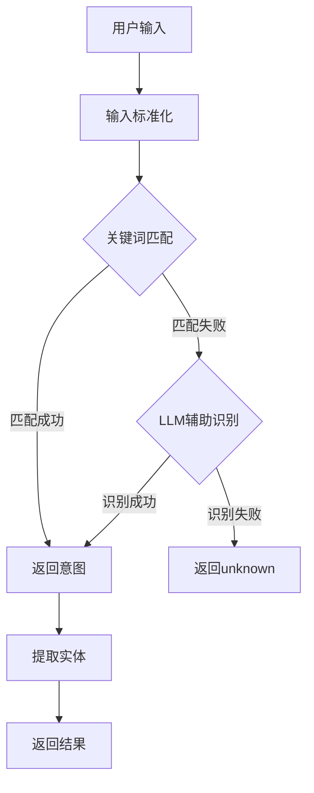

# 技术设计：缺陷管理助手重构

> 文档版本：v1.0
> 创建时间：2026-02-12
> 关联需求：REQUIREMENT_缺陷管理助手重构.md

## 1. 项目现状分析

### 1.1 技术栈识别

| 层级 | 技术 | 版本 | 说明 |
|------|------|------|------|
| 前端框架 | React | 18.2.0 | UI框架 |
| 前端UI | Ant Design | 5.27.0 | 组件库 |
| 图表库 | Chart.js | 4.5.1 | 数据可视化 |
| 构建工具 | Vite | 4.5.0 | 前端构建 |
| 后端框架 | Express | 4.18.2 | Web框架 |
| ORM | Prisma | 6.14.0 | 数据库ORM |
| 数据库 | MySQL | - | 主数据库 |
| 实时通信 | Socket.io | 4.7.4 | WebSocket |
| 运行时 | Node.js | TypeScript 5.3 | 后端运行环境 |

### 1.2 现有架构

```mermaid
graph TB
    subgraph 前端
        A[IntelligentQAPage.tsx<br/>对话页面] --> B[defectApi.ts<br/>API调用]
        B --> C[Chart.js<br/>图表渲染]
    end
    
    subgraph 后端路由
        D[intelligentQARoutes.ts] --> E[intelligentQAController.ts]
    end
    
    subgraph 智能问答服务（待重构）
        E --> F[IntelligentQAService.ts<br/>主服务1000+行]
        F --> G[IntentRecognizer.ts<br/>意图识别]
        F --> H[SkillManager.ts<br/>技能管理]
        F --> I[DialogStateMachine.ts<br/>对话状态机]
        F --> J[其他辅助模块...]
    end
    
    subgraph 公共服务（复用）
        K[listService.ts<br/>问题列表]
        L[statisticsService.ts<br/>统计分析]
        M[treeService.ts<br/>目录树]
        N[MySQLProjectMappingService.ts<br/>项目映射]
    end
    
    H --> K
    H --> L
    G --> N
    
    B --> D
```

### 1.3 相关模块分析

| 模块 | 路径 | 功能 | 可复用点 | 重构策略 |
|------|------|------|----------|----------|
| 问题列表服务 | `services/listService.ts` | 问题列表查询 | 完全复用 | 不修改 |
| 统计服务 | `services/statisticsService.ts` | 趋势/分布数据 | 完全复用 | 不修改 |
| 目录树服务 | `services/treeService.ts` | 项目/系统树 | 完全复用 | 不修改 |
| 项目映射服务 | `services/intelligentQa/MySQLProjectMappingService.ts` | 项目ID映射 | 复用 | 迁移到新模块 |
| 智能问答服务 | `services/intelligentQa/` | 意图识别+对话 | 重构 | 新建独立模块 |
| 前端页面 | `pages/defect/IntelligentQAPage.tsx` | 对话界面 | 重构 | 简化逻辑 |

### 1.4 现有问题诊断

**代码层面**：
1. `IntelligentQAService.ts` 超过1000行，包含大量重复的条件判断
2. 意图识别逻辑分散在多个模块中，难以维护
3. 对话状态机与业务逻辑耦合严重

**架构层面**：
1. 过度设计：引入了10+个辅助模块，但实际使用效果不佳
2. 职责不清：意图识别、状态管理、任务执行混杂
3. 依赖复杂：模块间相互依赖，难以独立测试

### 1.5 技术约束

- **编码规范**：TypeScript + ESLint，遵循项目现有规范
- **安全要求**：不暴露敏感信息，API密钥使用环境变量
- **性能要求**：单次查询响应时间 < 3秒
- **解耦要求**：不修改公共服务，新建独立模块

## 2. 整体架构设计

### 2.1 架构图

```mermaid
graph TB
    subgraph 前端
        A[DefectAssistantPage.tsx<br/>新版对话页面] --> B[defectAssistantApi.ts<br/>新版API]
        B --> C[ChatPanel<br/>对话面板]
        B --> D[ResultDisplay<br/>结果展示]
        D --> E[DataTable<br/>数据表格]
        D --> F[ChartDisplay<br/>图表展示]
    end
    
    subgraph 后端路由
        G[defectAssistantRoutes.ts<br/>新版路由] --> H[defectAssistantController.ts<br/>新版控制器]
    end
    
    subgraph 新版智能问答服务
        H --> I[DefectAssistantService.ts<br/>核心服务<200行]
        I --> J[IntentParser.ts<br/>意图解析器]
        I --> K[EntityExtractor.ts<br/>实体提取器]
        I --> L[QueryExecutor.ts<br/>查询执行器]
        J --> M[KeywordMatcher.ts<br/>关键词匹配]
        J --> N[LLMParser.ts<br/>LLM辅助]
    end
    
    subgraph 公共服务（复用，不修改）
        O[listService.ts]
        P[statisticsService.ts]
        Q[treeService.ts]
        R[MySQLProjectMappingService.ts]
    end
    
    L --> O
    L --> P
    K --> R
    
    B --> G
```

### 2.2 模块划分

| 模块 | 职责 | 依赖 | 文件路径 |
|------|------|------|----------|
| DefectAssistantService | 核心服务，协调各模块 | IntentParser, EntityExtractor, QueryExecutor | `services/defectAssistant/DefectAssistantService.ts` |
| IntentParser | 意图解析，识别用户意图 | KeywordMatcher, LLMParser | `services/defectAssistant/IntentParser.ts` |
| EntityExtractor | 实体提取，从输入中提取参数 | MySQLProjectMappingService | `services/defectAssistant/EntityExtractor.ts` |
| QueryExecutor | 查询执行，调用公共服务 | listService, statisticsService | `services/defectAssistant/QueryExecutor.ts` |
| DefectAssistantPage | 前端对话页面 | defectAssistantApi | `pages/defect/DefectAssistantPage.tsx` |
| defectAssistantApi | 前端API封装 | axios | `services/defectAssistant/defectAssistantApi.ts` |

### 2.3 新旧模块对比

| 功能 | 旧模块 | 新模块 | 变化 |
|------|--------|--------|------|
| 核心服务 | IntelligentQAService.ts (1000+行) | DefectAssistantService.ts (<200行) | 简化80% |
| 意图识别 | IntentRecognizer.ts + 多个辅助模块 | IntentParser.ts (单一模块) | 简化合并 |
| 实体提取 | SlotFiller.ts + 多个辅助模块 | EntityExtractor.ts (单一模块) | 简化合并 |
| 查询执行 | SkillManager.ts + 多个Skill | QueryExecutor.ts (单一模块) | 简化合并 |
| 对话状态 | DialogStateMachine.ts | 移除 | 不再需要 |
| 模糊匹配 | FuzzyMatcher.ts | 移除 | 不再需要 |
| 反馈学习 | FeedbackLearner.ts | 移除 | 不再需要 |

## 3. 接口设计

### 3.1 API接口

| 接口 | 方法 | 路径 | 描述 |
|------|------|------|------|
| 处理查询 | POST | `/api/defect-assistant/query` | 处理用户自然语言查询 |
| 获取建议 | GET | `/api/defect-assistant/suggestions` | 获取查询建议 |
| 导出数据 | POST | `/api/defect-assistant/export` | 导出查询结果 |

#### 3.1.1 处理查询接口

**请求体**：
```typescript
interface QueryRequest {
  query: string;           // 用户输入的自然语言
  context?: {              // 可选的上下文信息
    recentQueries?: string[];  // 最近查询历史
  };
}
```

**响应体**：
```typescript
interface QueryResponse {
  success: boolean;
  message: string;
  resultType: 'list' | 'chart' | 'document' | 'guide';
  data?: {
    // 列表结果
    list?: DefectItem[];
    total?: number;
    
    // 图表结果
    trendData?: TrendData;
    distributionData?: DistributionData;
    
    // 文档结果
    documentUrl?: string;
    taskId?: string;
  };
  intent?: {
    type: string;          // 意图类型
    confidence: number;    // 置信度
    entities: Record<string, any>;  // 提取的实体
  };
  suggestions?: string[];  // 查询建议
}
```

### 3.2 数据模型

#### 3.2.1 意图类型

```typescript
type IntentType = 
  | 'query_list'        // 查询问题列表
  | 'query_trend'       // 查询趋势分析
  | 'query_distribution' // 查询分布分析
  | 'generate_document' // 生成文档
  | 'export_data'       // 导出数据
  | 'unknown';          // 无法识别
```

#### 3.2.2 查询参数

```typescript
interface QueryParams {
  projectId?: number;      // 项目ID
  systemId?: number;       // 系统ID
  moduleId?: number;       // 模块ID
  statusId?: number;       // 状态ID
  statusName?: string;     // 状态名称
  priorityId?: number;     // 优先级ID
  priorityName?: string;   // 优先级名称
  timeRange?: 'week' | 'month' | 'quarter' | 'all';  // 时间范围
  page?: number;           // 页码
  pageSize?: number;       // 每页数量
}
```

#### 3.2.3 查询结果

```typescript
interface DefectItem {
  id: number;
  subject: string;
  status_name: string;
  priority_name: string;
  system_module_name: string;
  created_on: string;
  updated_on: string;
}

interface TrendData {
  labels: string[];
  datasets: Array<{
    label: string;
    data: number[];
  }>;
}

interface DistributionData {
  systemDistribution: Array<{ name: string; value: number }>;
  priorityDistribution: Array<{ name: string; value: number }>;
}
```

### 3.3 前端状态模型

```typescript
interface ChatState {
  messages: ChatMessage[];
  loading: boolean;
  error: string | null;
}

interface ChatMessage {
  id: string;
  type: 'user' | 'assistant';
  content: string;
  timestamp: Date;
  resultType?: 'list' | 'chart' | 'document' | 'guide';
  data?: any;
}
```

## 4. 技术方案

### 4.1 核心实现方案

#### 4.1.1 意图解析流程



#### 4.1.2 关键词匹配规则

```typescript
const INTENT_KEYWORDS = {
  query_list: ['列表', '清单', '查看', '查询', '获取', '问题', '缺陷'],
  query_trend: ['趋势', '变化', '折线', '走势'],
  query_distribution: ['分布', '占比', '饼图', '比例'],
  generate_document: ['文档', '报告', 'PPT', 'Word'],
  export_data: ['导出', '下载', 'Excel']
};
```

#### 4.1.3 实体提取规则

| 实体类型 | 匹配规则 | 示例 |
|----------|----------|------|
| 项目名称 | 匹配项目关键词 | "智能物联"、"物联平台" |
| 系统名称 | 匹配系统关键词 | "低代码"、"物联应用" |
| 状态名称 | 匹配状态关键词 | "已解决"、"新建"、"进行中" |
| 优先级名称 | 匹配优先级关键词 | "紧急"、"一般" |
| 时间范围 | 匹配时间关键词 | "上周"、"上个月"、"过去三个月" |

### 4.2 异常处理策略

| 异常类型 | 处理方式 | 用户提示 |
|----------|----------|----------|
| 意图无法识别 | 返回guide类型 | "我理解您想查询缺陷相关数据，请尝试以下方式..." |
| 实体缺失 | 使用默认值 | 默认查询全部项目/系统 |
| 查询超时 | 返回错误 | "查询超时，请稍后重试" |
| 数据为空 | 返回空结果 | "未找到符合条件的数据" |
| LLM服务异常 | 降级到关键词匹配 | 静默降级，不影响用户 |

### 4.3 安全考虑

- **权限控制**：复用现有权限体系，不新增权限逻辑
- **数据校验**：对用户输入进行基本校验，防止注入攻击
- **敏感信息**：LLM API密钥使用环境变量管理

## 5. 风险评估

| 风险 | 等级 | 影响 | 应对方案 |
|------|------|------|----------|
| LLM服务不可用 | 中 | 意图识别准确率下降 | 降级到关键词匹配 |
| 现有服务依赖变更 | 低 | 查询功能异常 | 公共服务接口稳定，风险可控 |
| 前端兼容性 | 低 | 旧浏览器显示异常 | 仅支持Chrome/Edge主流浏览器 |
| 数据量过大 | 中 | 查询响应慢 | 分页查询，限制单次返回数量 |

## 6. 测试策略

### 6.1 单元测试

- 测试范围：IntentParser、EntityExtractor、QueryExecutor
- 覆盖率要求：核心逻辑 > 80%

### 6.2 集成测试

- 测试场景：
  1. 用户输入"查看物联应用已解决的问题" → 返回问题列表
  2. 用户输入"物联平台问题趋势分析" → 返回趋势图
  3. 用户输入"问题分布分析" → 返回分布图
  4. 用户输入无法识别的内容 → 返回引导提示

### 6.3 端到端测试

- 测试场景：完整对话流程，从输入到结果展示

## 7. 部署方案

### 7.1 文件变更清单

**新增文件**：
```
backend/src/services/defectAssistant/
├── DefectAssistantService.ts
├── IntentParser.ts
├── EntityExtractor.ts
├── QueryExecutor.ts
├── types.ts
└── constants.ts

backend/src/controllers/defectAssistantController.ts
backend/src/routes/defectAssistantRoutes.ts

frontend/src/pages/defect/DefectAssistantPage.tsx
frontend/src/services/defectAssistant/defectAssistantApi.ts
frontend/src/components/defectAssistant/
├── ChatPanel.tsx
├── ResultDisplay.tsx
└── SuggestionBar.tsx
```

**修改文件**：
```
backend/src/index.ts  (注册新路由)
frontend/src/routes/AppRoutes.tsx  (添加新路由)
```

**保留文件**（不删除，便于回滚）：
```
backend/src/services/intelligentQa/  (旧模块，保留但不使用)
frontend/src/pages/defect/IntelligentQAPage.tsx  (旧页面，保留但不使用)
```

### 7.2 环境配置

- 无需新增环境变量
- 复用现有LLM配置

### 7.3 数据库变更

- 无数据库变更
- 复用现有数据表

## 8. 实施计划

### 8.1 开发顺序

1. **后端核心服务**：DefectAssistantService → IntentParser → EntityExtractor → QueryExecutor
2. **后端路由控制器**：defectAssistantRoutes → defectAssistantController
3. **前端API封装**：defectAssistantApi
4. **前端页面组件**：DefectAssistantPage → ChatPanel → ResultDisplay
5. **集成测试**：端到端测试验证

### 8.2 预估工时

| 任务 | 预估工时 |
|------|----------|
| 后端核心服务 | 4小时 |
| 后端路由控制器 | 1小时 |
| 前端API封装 | 0.5小时 |
| 前端页面组件 | 3小时 |
| 集成测试 | 1.5小时 |
| **总计** | **10小时** |
