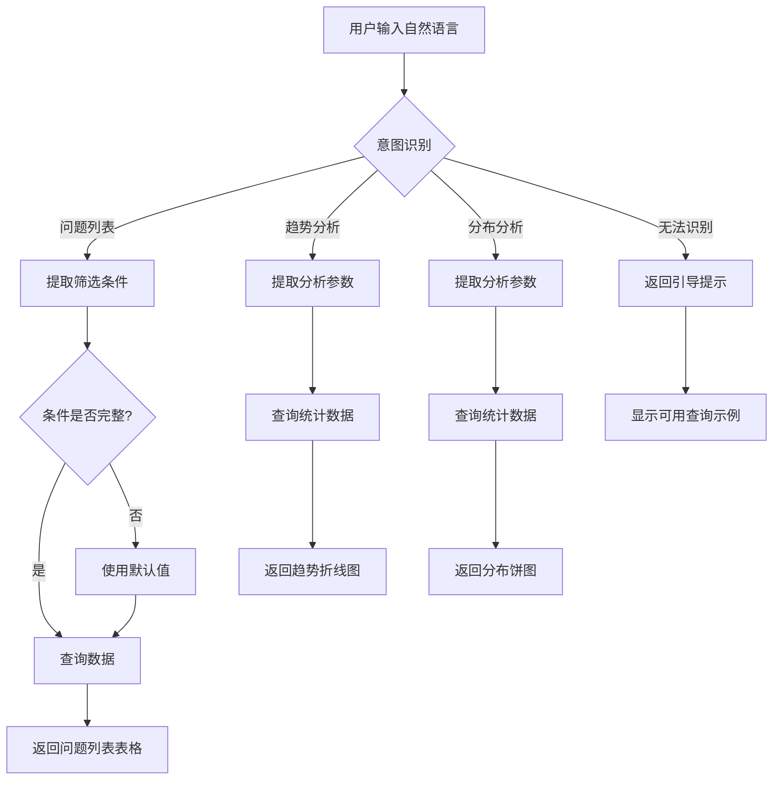
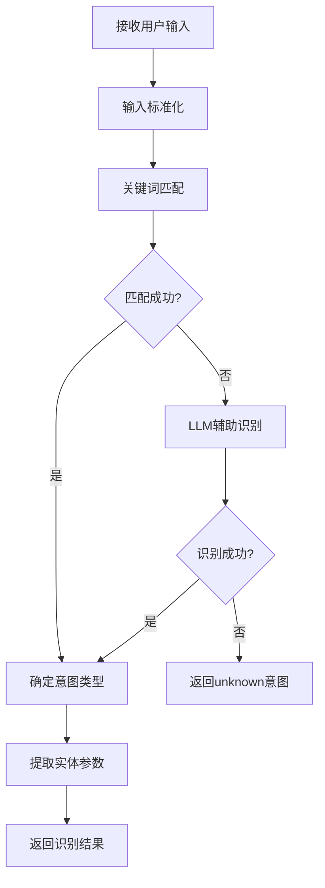

# 需求文档：缺陷管理助手重构

> 文档版本：v1.1
> 创建时间：2026-02-12
> 更新时间：2026-02-12
> 状态：已确认

## 1. 需求背景

### 1.1 业务场景

缺陷管理助手是缺陷管理模块下的一个智能对话功能，旨在为用户提供灵活、便捷的问题查询和数据分析能力。用户可以通过自然语言与系统交互，快速获取所需的问题列表或数据分析结果。

### 1.2 当前痛点

经过对现有代码的深入分析，发现以下核心问题：

**架构层面**：
1. **代码结构混乱**：`IntelligentQAService.ts` 文件超过1000行，包含大量重复的条件判断逻辑
2. **职责不清**：意图识别、对话状态管理、任务执行混杂在一起
3. **过度设计**：引入了对话状态机、槽位填充器、模糊匹配器等多个组件，但实际使用效果不佳

**逻辑层面**：
1. **意图识别冗余**：规则匹配、关键词匹配、LLM解析、相似度匹配多种方式并存，融合逻辑复杂且容易冲突
2. **状态流转混乱**：对话状态机与主服务逻辑相互纠缠，难以追踪执行路径
3. **重复代码多**：时间范围选择、意图确认等逻辑在多处重复实现

**用户体验层面**：
1. **交互流程繁琐**：需要多次选择才能完成查询
2. **错误提示不友好**：异常情况处理不统一
3. **意图识别不稳定**：相似查询可能得到不同结果

### 1.3 期望目标

1. **代码简洁**：摒弃现有复杂架构，采用清晰的分层设计
2. **逻辑清晰**：意图识别 → 参数提取 → 数据查询 → 结果展示，流程一目了然
3. **体验友好**：减少交互步骤，提供智能默认值，错误提示清晰
4. **易于维护**：模块职责单一，代码可读性强

## 2. 用户角色

| 角色 | 描述 | 核心诉求 |
|------|------|----------|
| 测试人员 | 负责缺陷管理和跟踪 | 快速查询问题列表，了解问题分布情况 |
| 项目经理 | 负责项目质量把控 | 查看项目整体缺陷分析，了解趋势变化 |
| 开发人员 | 负责缺陷修复 | 查看待办任务，了解分配给自己的问题 |

## 3. 功能范围

### 3.1 功能清单

| 功能模块 | 功能点 | 优先级 | 描述 |
|----------|--------|--------|------|
| 意图识别 | 自然语言理解 | P0 | 解析用户输入，识别查询意图 |
| 意图识别 | 实体提取 | P0 | 从用户输入中提取项目、系统、状态、时间等实体 |
| 意图识别 | 智能默认值 | P0 | 当实体缺失时提供合理的默认值 |
| 问题查询 | 问题列表查询 | P0 | 根据条件查询问题列表 |
| 问题查询 | 多条件筛选 | P0 | 支持按项目、系统、状态、优先级、时间范围筛选 |
| 数据分析 | 趋势分析 | P0 | 展示问题数量随时间变化的趋势图 |
| 数据分析 | 分布分析 | P0 | 展示问题按系统、优先级的分布饼图 |
| 文档生成 | 分析报告生成 | P1 | 生成PPT/Word格式的分析报告 |
| 交互优化 | 快捷入口 | P1 | 提供常用查询的快捷按钮 |
| 交互优化 | 结果导出 | P1 | 支持将查询结果导出为Excel |
| 异常处理 | 友好提示 | P0 | 无法识别意图时给出明确引导 |

### 3.2 明确边界

**✅ 包含范围：**
- 问题列表查询（支持多条件筛选）
- 问题趋势分析（折线图展示）
- 问题分布分析（饼图展示）
- 数据导出功能
- 文档生成功能（PPT/Word报告）
- 智能对话交互

**❌ 不包含范围：**
- 问题详情编辑功能
- 问题状态流转功能
- 通知推送功能
- 我的待办查询（已有独立页面）

### 3.3 实施约束

**🔒 功能解耦要求：**
1. **独立模块**：重构后的缺陷管理助手代码应独立于其他缺陷管理功能模块
2. **最小影响**：实施过程中不修改 `listService.ts`、`statisticsService.ts`、`treeService.ts` 等公共服务
3. **独立路由**：保持现有API路由不变，新增独立的服务入口
4. **前端独立**：前端组件独立，不依赖其他缺陷管理页面的状态

## 4. 用户故事

### US-001: 查询问题列表

```
作为 测试人员
我希望 通过自然语言描述查询条件来获取问题列表
以便 快速找到我关注的问题
```

**验收标准：**
- [ ] 支持识别"查看物联应用系统已解决的问题"等自然语言
- [ ] 自动提取系统名称、状态等筛选条件
- [ ] 当条件不完整时，使用智能默认值
- [ ] 结果以表格形式展示，支持分页

### US-002: 查看趋势分析

```
作为 项目经理
我希望 查看某个系统的问题趋势变化
以便 了解问题数量是否在可控范围内
```

**验收标准：**
- [ ] 支持识别"物联平台问题趋势分析"等自然语言
- [ ] 自动生成折线图展示趋势变化
- [ ] 支持选择时间范围（上周、上个月、过去三个月、全部）

### US-003: 查看分布分析

```
作为 项目经理
我希望 查看问题的分布情况
以便 了解问题集中在哪些系统或优先级
```

**验收标准：**
- [ ] 支持识别"问题分布分析"等自然语言
- [ ] 自动生成饼图展示分布情况
- [ ] 支持按系统分布、优先级分布两种维度

### US-004: 意图不明确时的引导

```
作为 用户
我希望 当我的输入无法被识别时得到明确引导
以便 我能正确表达需求
```

**验收标准：**
- [ ] 当无法识别意图时，提示用户可用的查询类型
- [ ] 提供示例查询语句供用户参考
- [ ] 不返回技术性错误信息

## 5. 业务流程

### 5.1 整体交互流程



### 5.2 意图识别流程



## 6. 数据需求

### 6.1 数据实体

| 实体名称 | 主要字段 | 说明 |
|----------|----------|------|
| Issue | id, subject, status_id, priority_id, project_id, created_on, updated_on | 问题主表 |
| Directory | id, name, parent_id, type | 项目/系统/模块目录结构 |
| IssueStatus | id, name, is_closed | 问题状态 |
| Enumeration | id, name, type | 优先级等枚举值 |

### 6.2 查询参数实体

```typescript
interface QueryParams {
  projectId?: number;      // 项目ID
  systemId?: number;       // 系统ID（目录ID）
  statusId?: number;       // 状态ID
  statusName?: string;     // 状态名称
  priorityId?: number;     // 优先级ID
  priorityName?: string;   // 优先级名称
  timeRange?: string;      // 时间范围：week/month/quarter/all
  page?: number;           // 页码
  pageSize?: number;       // 每页数量
}
```

## 7. 验收标准

### 7.1 功能验收

- [ ] 用户输入"查看物联应用已解决的问题"能正确返回问题列表
- [ ] 用户输入"物联平台问题趋势分析"能正确返回趋势图
- [ ] 用户输入"问题分布分析"能正确返回分布图
- [ ] 用户输入无法识别的内容时，返回友好的引导提示
- [ ] 查询结果支持分页展示
- [ ] 趋势图和分布图正确渲染

### 7.2 非功能验收

- 性能要求：单次查询响应时间 < 3秒
- 安全要求：仅返回用户有权限查看的数据
- 兼容性要求：支持Chrome、Edge主流浏览器

## 8. 疑问与假设

### 8.1 已做假设

1. 假设用户输入为中文，暂不考虑多语言支持
2. 假设LLM服务可用，用于辅助意图识别
3. 假设用户已有项目/系统的访问权限
4. 假设时间范围默认为"全部"，用户可主动指定

### 8.2 已确认事项

- [x] ~~是否需要保留"我的待办"查询功能？~~ **已确认：移除**（已有独立待办页面）
- [x] ~~是否需要保留"文档生成"功能？~~ **已确认：保留**
- [x] ~~是否需要保留"通知推送"功能？~~ **已确认：移除**
- [x] ~~实施范围约束？~~ **已确认：仅限缺陷管理助手功能，不影响其他模块，做功能解耦**

### 8.3 待后续确认事项

- [ ] 数据导出是否需要支持更多格式（如PDF）？
- [ ] 是否需要支持查询历史记录？

## 9. 重构方案建议

### 9.1 架构简化

**现有架构（过于复杂）**：
```
IntelligentQAService (1000+行)
├── IntentRecognizer (意图识别器)
│   ├── 规则匹配
│   ├── 关键词匹配
│   ├── LLM解析
│   ├── 相似度匹配
│   └── 上下文增强
├── DialogStateMachine (对话状态机)
├── SlotFiller (槽位填充器)
├── FuzzyMatcher (模糊匹配器)
├── InputNormalizer (输入标准化器)
├── ContextManager (上下文管理器)
├── CacheManager (缓存管理器)
├── FeedbackLearner (反馈学习器)
└── SkillManager (技能管理器)
    └── Skills (多个技能模块)
```

**建议架构（清晰简洁）**：
```
DefectAssistantService (核心服务，200行以内)
├── IntentParser (意图解析器)
│   ├── 关键词匹配
│   └── LLM辅助识别
├── EntityExtractor (实体提取器)
│   └── 从输入中提取参数
└── QueryExecutor (查询执行器)
    ├── DefectListQuery (问题列表查询)
    └── DefectAnalysisQuery (数据分析查询)
```

### 9.2 核心设计原则

1. **单一职责**：每个模块只做一件事
2. **最小必要**：只保留核心功能，删除冗余组件
3. **渐进增强**：基础功能优先，高级功能可选
4. **明确优先**：代码逻辑清晰可追踪，避免隐式状态

## 10. 附录

### 10.1 参考资料

- 现有代码：`backend/src/services/intelligentQa/`
- 前端页面：`frontend/src/pages/defect/IntelligentQAPage.tsx`
- 数据服务：`backend/src/services/listService.ts`、`backend/src/services/statisticsService.ts`

### 10.2 术语说明

| 术语 | 说明 |
|------|------|
| 意图识别 | 解析用户自然语言输入，确定用户想要执行的操作类型 |
| 实体提取 | 从用户输入中提取具体的参数值，如项目名、状态名等 |
| 趋势分析 | 展示数据随时间变化的趋势图表 |
| 分布分析 | 展示数据在不同维度上的分布比例 |
