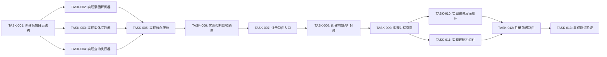

# 任务清单：缺陷管理助手重构

> 文档版本：v1.0
> 创建时间：2026-02-12
> 关联设计：DESIGN_缺陷管理助手重构.md

## 任务依赖图

## 任务列表

### TASK-001: 创建后端目录结构和类型定义

- **优先级**: P0
- **类型**: 基础设施
- **前置依赖**: 无
- **预估复杂度**: 低

**输入契约**：
- 输入数据：设计文档
- 环境依赖：项目已初始化

**输出契约**：
- 输出数据：目录结构、类型定义文件
- 交付物：
  - `backend/src/services/defectAssistant/` 目录
  - `backend/src/services/defectAssistant/types.ts`
  - `backend/src/services/defectAssistant/constants.ts`

**实现要点**：
1. 创建 `defectAssistant` 目录
2. 定义意图类型、查询参数、响应结果等类型
3. 定义关键词映射、默认值等常量

**验收标准**：
- [ ] 目录结构创建完成
- [ ] 类型定义完整且符合设计文档
- [ ] 常量定义完整

**执行状态**: 待开始

---

### TASK-002: 实现意图解析器 (IntentParser)

- **优先级**: P0
- **类型**: 功能开发
- **前置依赖**: TASK-001
- **预估复杂度**: 中

**输入契约**：
- 输入数据：用户自然语言查询
- 环境依赖：types.ts, constants.ts

**输出契约**：
- 输出数据：意图类型、置信度
- 交付物：`backend/src/services/defectAssistant/IntentParser.ts`

**实现要点**：
1. 实现 `KeywordMatcher` 关键词匹配逻辑
2. 实现 `LLMParser` LLM辅助识别（可选）
3. 实现 `parseIntent` 主方法，返回意图类型和置信度
4. 处理边界情况：空输入、超长输入

**验收标准**：
- [ ] 关键词匹配能正确识别5种意图
- [ ] LLM辅助识别能处理关键词无法匹配的情况
- [ ] 无法识别时返回 `unknown` 意图
- [ ] 单元测试通过

**执行状态**: 待开始

---

### TASK-003: 实现实体提取器 (EntityExtractor)

- **优先级**: P0
- **类型**: 功能开发
- **前置依赖**: TASK-001
- **预估复杂度**: 中

**输入契约**：
- 输入数据：用户自然语言查询、意图类型
- 环境依赖：MySQLProjectMappingService

**输出契约**：
- 输出数据：QueryParams 对象
- 交付物：`backend/src/services/defectAssistant/EntityExtractor.ts`

**实现要点**：
1. 提取项目名称 → 调用 MySQLProjectMappingService 获取ID
2. 提取系统名称 → 调用 MySQLProjectMappingService 获取ID
3. 提取状态名称 → 映射到状态ID
4. 提取优先级名称 → 映射到优先级ID
5. 提取时间范围 → 映射到时间范围枚举
6. 设置默认值：默认查询全部项目/系统

**验收标准**：
- [ ] 能正确提取项目、系统、状态、优先级、时间范围
- [ ] 缺失实体时使用合理的默认值
- [ ] 单元测试通过

**执行状态**: 待开始

---

### TASK-004: 实现查询执行器 (QueryExecutor)

- **优先级**: P0
- **类型**: 功能开发
- **前置依赖**: TASK-001
- **预估复杂度**: 中

**输入契约**：
- 输入数据：意图类型、QueryParams
- 环境依赖：listService, statisticsService

**输出契约**：
- 输出数据：查询结果（列表/图表数据）
- 交付物：`backend/src/services/defectAssistant/QueryExecutor.ts`

**实现要点**：
1. 实现 `executeQuery` 主方法
2. 根据意图类型调用对应服务：
   - `query_list` → listService.getDefectList
   - `query_trend` → statisticsService.getTrendData
   - `query_distribution` → statisticsService.getDistributionData
3. 处理异常情况：服务不可用、数据为空

**验收标准**：
- [ ] 能正确调用 listService 获取问题列表
- [ ] 能正确调用 statisticsService 获取趋势数据
- [ ] 能正确调用 statisticsService 获取分布数据
- [ ] 异常情况处理得当
- [ ] 单元测试通过

**执行状态**: 待开始

---

### TASK-005: 实现核心服务 (DefectAssistantService)

- **优先级**: P0
- **类型**: 功能开发
- **前置依赖**: TASK-002, TASK-003, TASK-004
- **预估复杂度**: 中

**输入契约**：
- 输入数据：QueryRequest
- 环境依赖：IntentParser, EntityExtractor, QueryExecutor

**输出契约**：
- 输出数据：QueryResponse
- 交付物：`backend/src/services/defectAssistant/DefectAssistantService.ts`

**实现要点**：
1. 实现 `processQuery` 主方法（<200行）
2. 调用流程：IntentParser → EntityExtractor → QueryExecutor
3. 处理 `unknown` 意图：返回引导提示
4. 生成查询建议

**验收标准**：
- [ ] 核心方法代码行数 < 200
- [ ] 调用流程清晰
- [ ] unknown意图返回友好引导
- [ ] 单元测试通过

**执行状态**: 待开始

---

### TASK-006: 实现控制器和路由

- **优先级**: P0
- **类型**: 功能开发
- **前置依赖**: TASK-005
- **预估复杂度**: 低

**输入契约**：
- 输入数据：HTTP请求
- 环境依赖：DefectAssistantService

**输出契约**：
- 输出数据：HTTP响应
- 交付物：
  - `backend/src/controllers/defectAssistantController.ts`
  - `backend/src/routes/defectAssistantRoutes.ts`

**实现要点**：
1. 控制器实现 `query`、`suggestions`、`export` 方法
2. 路由定义 POST `/api/defect-assistant/query`
3. 添加请求验证中间件

**验收标准**：
- [ ] 控制器方法实现完整
- [ ] 路由定义正确
- [ ] 请求验证有效

**执行状态**: 待开始

---

### TASK-007: 注册路由入口

- **优先级**: P0
- **类型**: 功能开发
- **前置依赖**: TASK-006
- **预估复杂度**: 低

**输入契约**：
- 输入数据：路由模块
- 环境依赖：Express应用

**输出契约**：
- 输出数据：无
- 交付物：修改 `backend/src/index.ts`

**实现要点**：
1. 导入 defectAssistantRoutes
2. 注册到 `/api/defect-assistant` 路径

**验收标准**：
- [ ] 路由注册成功
- [ ] API可访问

**执行状态**: 待开始

---

### TASK-008: 创建前端API封装

- **优先级**: P0
- **类型**: 功能开发
- **前置依赖**: TASK-007
- **预估复杂度**: 低

**输入契约**：
- 输入数据：API接口定义
- 环境依赖：axios

**输出契约**：
- 输出数据：API调用方法
- 交付物：`frontend/src/services/defectAssistant/defectAssistantApi.ts`

**实现要点**：
1. 实现 `query` 方法
2. 实现 `getSuggestions` 方法
3. 实现 `exportData` 方法
4. 定义响应类型

**验收标准**：
- [ ] API方法实现完整
- [ ] 类型定义正确

**执行状态**: 待开始

---

### TASK-009: 实现对话页面 (DefectAssistantPage)

- **优先级**: P0
- **类型**: 功能开发
- **前置依赖**: TASK-008
- **预估复杂度**: 中

**输入契约**：
- 输入数据：API方法
- 环境依赖：React, Ant Design

**输出契约**：
- 输出数据：对话页面组件
- 交付物：`frontend/src/pages/defect/DefectAssistantPage.tsx`

**实现要点**：
1. 实现对话消息列表展示
2. 实现输入框和发送按钮
3. 实现加载状态和错误处理
4. 实现欢迎消息和快捷入口

**验收标准**：
- [ ] 对话消息正确展示
- [ ] 发送消息功能正常
- [ ] 加载状态显示正确
- [ ] 错误提示友好

**执行状态**: 待开始

---

### TASK-010: 实现结果展示组件 (ResultDisplay)

- **优先级**: P0
- **类型**: 功能开发
- **前置依赖**: TASK-009
- **预估复杂度**: 中

**输入契约**：
- 输入数据：查询结果数据
- 环境依赖：Ant Design Table, Chart.js

**输出契约**：
- 输出数据：结果展示组件
- 交付物：`frontend/src/components/defectAssistant/ResultDisplay.tsx`

**实现要点**：
1. 实现列表结果展示（表格）
2. 实现图表结果展示（折线图、饼图）
3. 实现文档结果展示（下载链接）
4. 实现引导结果展示（建议列表）

**验收标准**：
- [ ] 列表展示正确
- [ ] 图表渲染正确
- [ ] 文档下载功能正常
- [ ] 引导提示清晰

**执行状态**: 待开始

---

### TASK-011: 实现建议栏组件 (SuggestionBar)

- **优先级**: P1
- **类型**: 功能开发
- **前置依赖**: TASK-009
- **预估复杂度**: 低

**输入契约**：
- 输入数据：建议列表
- 环境依赖：Ant Design Button

**输出契约**：
- 输出数据：建议栏组件
- 交付物：`frontend/src/components/defectAssistant/SuggestionBar.tsx`

**实现要点**：
1. 展示常用查询快捷按钮
2. 点击按钮填充输入框

**验收标准**：
- [ ] 快捷按钮展示正确
- [ ] 点击功能正常

**执行状态**: 待开始

---

### TASK-012: 注册前端路由

- **优先级**: P0
- **类型**: 功能开发
- **前置依赖**: TASK-010, TASK-011
- **预估复杂度**: 低

**输入契约**：
- 输入数据：页面组件
- 环境依赖：React Router

**输出契约**：
- 输出数据：无
- 交付物：修改 `frontend/src/routes/AppRoutes.tsx`

**实现要点**：
1. 导入 DefectAssistantPage
2. 添加路由 `/defects/assistant`

**验收标准**：
- [ ] 路由注册成功
- [ ] 页面可访问

**执行状态**: 待开始

---

### TASK-013: 集成测试验证

- **优先级**: P0
- **类型**: 测试
- **前置依赖**: TASK-012
- **预估复杂度**: 中

**输入契约**：
- 输入数据：完整功能
- 环境依赖：前后端服务运行

**输出契约**：
- 输出数据：测试报告
- 交付物：测试验证记录

**实现要点**：
1. 测试问题列表查询
2. 测试趋势分析
3. 测试分布分析
4. 测试文档生成
5. 测试无法识别意图的处理
6. 测试边界情况

**验收标准**：
- [ ] 所有测试场景通过
- [ ] 无严重Bug

**执行状态**: 待开始

---

## 执行进度

| 任务 | 状态 | 开始时间 | 完成时间 | 备注 |
|------|------|----------|----------|------|
| TASK-001 | 待开始 | - | - | - |
| TASK-002 | 待开始 | - | - | - |
| TASK-003 | 待开始 | - | - | - |
| TASK-004 | 待开始 | - | - | - |
| TASK-005 | 待开始 | - | - | - |
| TASK-006 | 待开始 | - | - | - |
| TASK-007 | 待开始 | - | - | - |
| TASK-008 | 待开始 | - | - | - |
| TASK-009 | 待开始 | - | - | - |
| TASK-010 | 待开始 | - | - | - |
| TASK-011 | 待开始 | - | - | - |
| TASK-012 | 待开始 | - | - | - |
| TASK-013 | 待开始 | - | - | - |

## 阻塞问题记录

| 问题 | 影响任务 | 发现时间 | 解决方案 | 状态 |
|------|----------|----------|----------|------|
| - | - | - | - | - |
