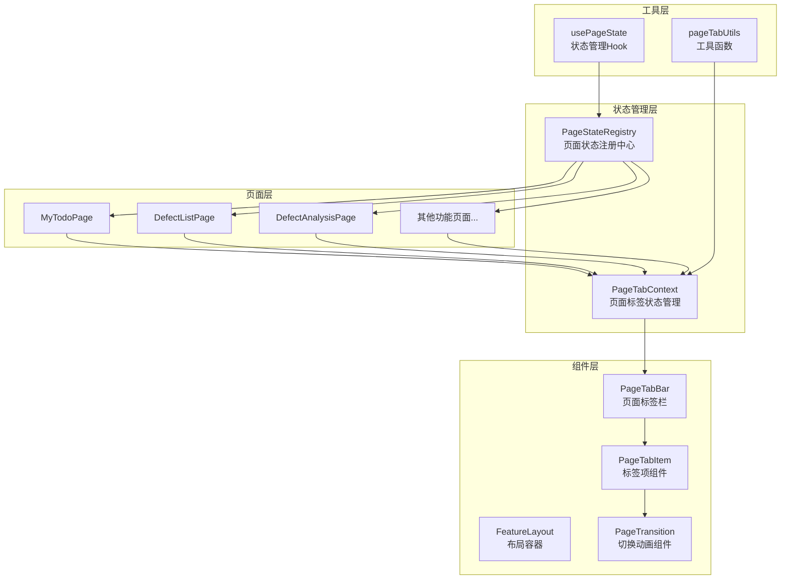
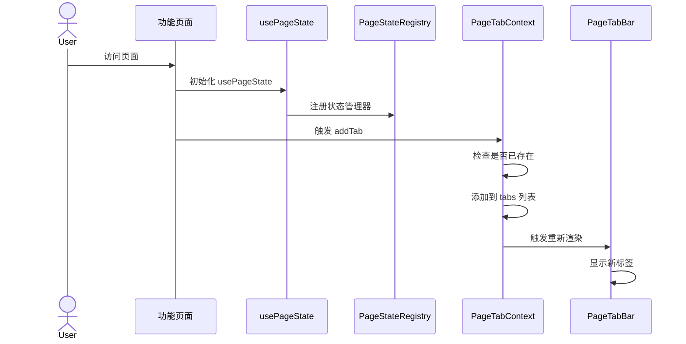
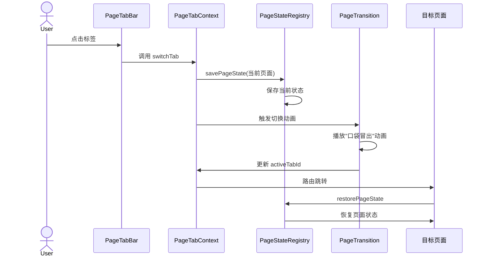
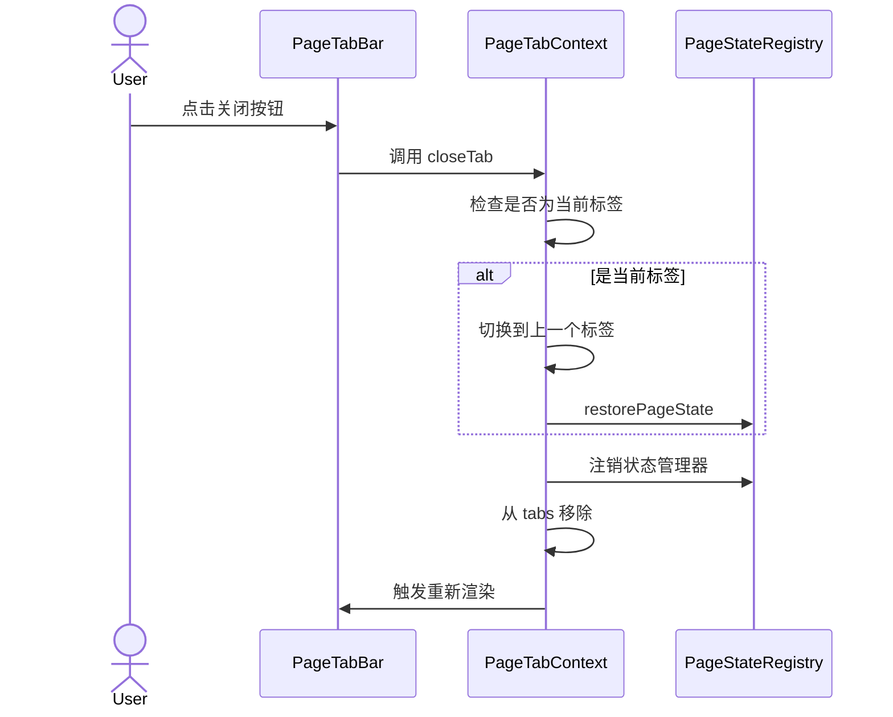

# 架构设计文档：页面标签/历史记录模块（极客模式）

> 文档版本：v1.0
> 创建时间：2026-02-14
> 状态：待确认
> 依赖文档：[REQUIREMENT_页面标签历史记录模块.md](./REQUIREMENT_页面标签历史记录模块.md)

---

## 1. 整体架构

### 1.1 架构图



### 1.2 核心组件关系

```
┌─────────────────────────────────────────────────────────────┐
│                      FeatureLayout                          │
│  ┌─────────────────────────────────────────────────────┐   │
│  │                    Content                          │   │
│  │  ┌─────────────────────────────────────────────┐   │   │
│  │  │              Outlet (页面内容)               │   │   │
│  │  │                                             │   │   │
│  │  │    ┌─────────────────────────────────┐      │   │   │
│  │  │    │      PageTransition             │      │   │   │
│  │  │    │      (切换动画层)                │      │   │   │
│  │  │    │                                 │      │   │   │
│  │  │    │   ┌─────────────────────────┐   │      │   │   │
│  │  │    │   │   实际页面组件           │   │      │   │   │
│  │  │    │   │   (MyTodoPage等)        │   │      │   │   │
│  │  │    │   └─────────────────────────┘   │      │   │   │
│  │  │    └─────────────────────────────────┘      │   │   │
│  │  └─────────────────────────────────────────────┘   │   │
│  └─────────────────────────────────────────────────────┘   │
│  ┌─────────────────────────────────────────────────────┐   │
│  │                   PageTabBar                        │   │
│  │  [🏠待办] [📋列表] [📊分析] [×] ...               │   │
│  │   ↑ 页面标签栏（固定在内容区底部）                   │   │
│  └─────────────────────────────────────────────────────┘   │
└─────────────────────────────────────────────────────────────┘
```

---

## 2. 分层设计

### 2.1 状态管理层

#### 2.1.1 PageTabContext - 页面标签状态管理

**文件路径**：`frontend/src/contexts/PageTabContext.tsx`

**核心职责**：
- 管理页面标签列表状态
- 提供添加、切换、关闭标签的接口
- 管理当前活动标签

**状态结构**：
```typescript
interface PageTab {
  id: string;              // 唯一标识：path + query
  path: string;            // 路由路径
  title: string;           // 页面标题
  icon: string;            // 页面图标名称（用于序列化）
  state: PageState;        // 页面状态
  screenshot: string;      // 页面截图（base64格式）
  scrollPosition: { x: number; y: number }; // 滚动位置
  timestamp: number;       // 访问时间戳
  isActive: boolean;       // 是否为当前活动标签
}

interface PageTabContextType {
  tabs: PageTab[];                           // 标签列表
  activeTabId: string | null;                // 当前活动标签ID
  addTab: (tab: Omit<PageTab, 'id' | 'timestamp' | 'screenshot'>) => Promise<void>;  // 添加标签
  switchTab: (tabId: string) => Promise<void>;        // 切换标签（异步，需要截图）
  closeTab: (tabId: string) => void;         // 关闭标签
  closeOtherTabs: (tabId: string) => void;   // 关闭其他标签
  closeAllTabs: () => void;                  // 关闭所有标签
  refreshTab: (tabId: string) => Promise<void>; // 刷新页面（重新截图）
  updateTabState: (tabId: string, state: PageState) => void; // 更新标签状态
}

// localStorage 存储键名
const PAGETAB_STORAGE_KEY = 'pageTabHistory';
const MAX_TABS = 8; // 最大标签数量
```

#### 2.1.2 PageStateRegistry - 页面状态注册中心

**文件路径**：`frontend/src/utils/pageStateRegistry.ts`

**核心职责**：
- 为每个页面提供状态保存/恢复的机制
- 管理页面级别的状态订阅

**实现思路**：
```typescript
// 页面状态注册表
const stateRegistry = new Map<string, {
  save: () => PageState;
  restore: (state: PageState) => void;
}>();

// 页面组件注册自己的状态管理器
export const registerPageState = (path: string, handlers: {
  save: () => PageState;
  restore: (state: PageState) => void;
}) => {
  stateRegistry.set(path, handlers);
};

// 获取页面状态
export const savePageState = (path: string): PageState => {
  const handlers = stateRegistry.get(path);
  return handlers ? handlers.save() : {};
};

// 恢复页面状态
export const restorePageState = (path: string, state: PageState) => {
  const handlers = stateRegistry.get(path);
  if (handlers) {
    handlers.restore(state);
  }
};
```

### 2.2 组件层

#### 2.2.1 PageTabBar - 页面标签栏组件

**文件路径**：`frontend/src/components/PageTabBar.tsx`

**职责**：
- 渲染标签列表
- 处理标签点击事件
- 处理标签关闭事件

**Props**：
```typescript
interface PageTabBarProps {
  className?: string;
}
```

**视觉设计**：
- 固定在内容区域底部
- 高度：48px
- 背景：半透明毛玻璃效果（backdrop-filter: blur(10px)）
- 边框：1px solid rgba(255,255,255,0.1)
- 标签项间距：8px

#### 2.2.2 PageTabItem - 标签项组件

**文件路径**：`frontend/src/components/PageTabItem.tsx`

**职责**：
- 渲染单个标签
- **显示页面截图缩略图**（类似 Windows 任务切换）
- 显示页面标题
- 显示关闭按钮（悬停时）
- 支持右键菜单（关闭其他、关闭全部、刷新）
- 当前活动标签高亮

**Props**：
```typescript
interface PageTabItemProps {
  tab: PageTab;
  isActive: boolean;
  onClick: () => void;
  onClose: () => void;
  onCloseOthers: () => void;
  onCloseAll: () => void;
  onRefresh: () => void;
}
```

**视觉状态**：
- **默认状态**：背景透明，灰色边框，显示截图缩略图
- **悬停状态**：背景 rgba(255,255,255,0.05)，显示关闭按钮和标题
- **活动状态**：主题色边框 + 发光效果（box-shadow）

**截图缩略图设计**：
- 尺寸：120px × 80px（16:10 比例）
- 圆角：8px
- 边框：1px solid rgba(255,255,255,0.1)
- 阴影：0 4px 12px rgba(0,0,0,0.3)
- 图片填充：object-fit: cover

#### 2.2.3 PageTransition - 页面切换动画组件

**文件路径**：`frontend/src/components/PageTransition.tsx`

**职责**：
- 包装 Outlet，提供切换动画
- 实现"口袋冒出"动画效果
- 管理动画状态

**动画实现**：
```typescript
// 使用 Framer Motion 实现动画
const variants = {
  initial: {
    scale: 0.3,
    y: 100,
    opacity: 0,
    rotateX: 15,
  },
  animate: {
    scale: 1,
    y: 0,
    opacity: 1,
    rotateX: 0,
    transition: {
      duration: 0.5,
      ease: [0.34, 1.56, 0.64, 1], // 带弹性的缓动函数
    },
  },
  exit: {
    scale: 0.95,
    opacity: 0,
    transition: {
      duration: 0.2,
    },
  },
};
```

### 2.3 工具层

#### 2.3.1 usePageState Hook

**文件路径**：`frontend/src/hooks/usePageState.ts`

**职责**：
- 为页面组件提供状态管理功能
- 自动注册到 PageStateRegistry
- 监听路由变化自动保存状态
- **管理页面滚动位置**

**使用示例**：
```typescript
// 在 MyTodoPage 中使用
const MyTodoPage = () => {
  const [filters, setFilters] = useState({...});
  const [page, setPage] = useState(1);
  
  // 使用 Hook 管理页面状态
  usePageState('/defects/todo', {
    save: () => ({ filters, page }),
    restore: (state) => {
      setFilters(state.filters);
      setPage(state.page);
    },
  });
  
  return (...);
};
```

#### 2.3.2 usePageScreenshot Hook

**文件路径**：`frontend/src/hooks/usePageScreenshot.ts`

**职责**：
- 使用 html2canvas 捕获页面截图
- 生成 base64 格式的图片数据
- 优化截图性能（降低分辨率、压缩质量）

**实现要点**：
```typescript
import html2canvas from 'html2canvas';

export const usePageScreenshot = () => {
  const captureScreenshot = async (element: HTMLElement): Promise<string> => {
    const canvas = await html2canvas(element, {
      scale: 0.5, // 降低分辨率以提高性能
      useCORS: true,
      allowTaint: true,
      backgroundColor: null,
      logging: false,
    });
    
    // 压缩为 JPEG，质量 0.7
    return canvas.toDataURL('image/jpeg', 0.7);
  };
  
  return { captureScreenshot };
};
```

#### 2.3.2 页面信息配置

**文件路径**：`frontend/src/config/pageMeta.ts`

**职责**：
- 定义每个页面的元数据（标题、图标等）
- 用于生成标签时获取页面信息

```typescript
export const pageMetaConfig: Record<string, {
  title: string;
  icon: React.ReactNode;
  module: 'test' | 'defect' | 'admin';
}> = {
  '/defects/todo': {
    title: '我的待办',
    icon: <CheckSquareOutlined />,
    module: 'defect',
  },
  '/defects/list': {
    title: '问题列表',
    icon: <OrderedListOutlined />,
    module: 'defect',
  },
  // ... 其他页面配置
};
```

---

## 3. 数据流向

### 3.1 页面访问流程



### 3.2 页面切换流程



### 3.3 页面关闭流程



---

## 4. 接口规范

### 4.1 PageTabContext 接口

```typescript
// 添加标签
addTab(tab: {
  path: string;
  title: string;
  icon: React.ReactNode;
  state?: PageState;
}): void;

// 切换标签
switchTab(tabId: string): void;

// 关闭标签
closeTab(tabId: string): void;

// 关闭其他标签
closeOtherTabs(excludeTabId: string): void;

// 关闭所有标签
closeAllTabs(): void;

// 更新标签状态
updateTabState(tabId: string, state: PageState): void;
```

### 4.2 usePageState Hook 接口

```typescript
usePageState(
  path: string,
  handlers: {
    save: () => PageState;
    restore: (state: PageState) => void;
  },
  deps?: DependencyList
): void;
```

---

## 5. 异常处理策略

### 5.1 边界情况处理

| 场景 | 处理策略 |
|------|----------|
| 标签数量超过上限 | 移除最早访问的标签，保持最多 8 个 |
| 关闭最后一个标签 | 自动跳转到首页或默认页面 |
| 页面状态保存失败 | 静默失败，不影响切换流程 |
| 页面状态恢复失败 | 使用默认状态，记录错误日志 |
| 重复添加相同页面 | 更新现有标签的状态和时间戳 |
| 切换动画被打断 | 使用 AnimatePresence 的 exitBeforeEnter 模式 |

### 5.2 错误处理

```typescript
// 添加错误边界
try {
  savePageState(currentPath);
} catch (error) {
  console.warn('保存页面状态失败:', error);
  // 继续切换流程
}

try {
  restorePageState(targetPath, state);
} catch (error) {
  console.error('恢复页面状态失败:', error);
  // 使用默认状态
}
```

---

## 6. 性能优化

### 6.1 渲染优化

- **标签栏使用 React.memo**：避免不必要的重渲染
- **虚拟列表**：如果标签数量很多，使用虚拟列表
- **延迟加载**：缩略图延迟加载（如果使用真实截图）

### 6.2 状态优化

- **状态分片**：每个页面只保存必要的状态
- **防抖保存**：频繁的状态变化使用防抖
- **懒恢复**：页面切换后再恢复状态，避免阻塞动画

### 6.3 动画优化

- **GPU 加速**：使用 transform 和 opacity 属性
- **will-change**：动画元素添加 will-change 提示
- **减少重排**：避免动画过程中触发布局重排

---

## 7. 文件结构

```
frontend/src/
├── contexts/
│   └── PageTabContext.tsx          # 页面标签状态管理（含持久化）
├── components/
│   ├── PageTabBar.tsx              # 页面标签栏
│   ├── PageTabItem.tsx             # 标签项组件（含截图缩略图）
│   └── PageTransition.tsx          # 切换动画组件
├── hooks/
│   ├── usePageState.ts             # 页面状态管理 Hook
│   └── usePageScreenshot.ts        # 页面截图 Hook
├── utils/
│   ├── pageStateRegistry.ts        # 页面状态注册中心
│   └── screenshotCache.ts          # 截图缓存管理
├── config/
│   └── pageMeta.ts                 # 页面元数据配置
└── layouts/
    └── FeatureLayout.tsx           # 集成 PageTabBar（修改）
```

---

## 8. 依赖库

| 库名 | 版本 | 用途 |
|------|------|------|
| framer-motion | ^10.x | 页面切换动画 |
| html2canvas | ^1.4.x | 页面截图生成 |
| react | ^18.x | 核心框架 |
| react-router-dom | ^6.x | 路由管理 |

---

## 9. 与现有系统集成

### 9.1 FeatureLayout 修改

```typescript
// FeatureLayout.tsx 需要集成 PageTabBar
const FeatureLayout: React.FC = () => {
  // ... 现有代码

  return (
    <Layout style={{...}}>
      {/* 左侧栏 */}
      <LeftCollapseBar ... />

      {/* 内容区域 */}
      <Content style={{...}}>
        <div style={{ 
          display: 'flex', 
          flexDirection: 'column',
          height: '100%' 
        }}>
          {/* 页面内容 */}
          <div style={{ flex: 1, overflow: 'hidden' }}>
            <PageTransition>
              <Outlet />
            </PageTransition>
          </div>
          
          {/* 页面标签栏 */}
          <PageTabBar />
        </div>
      </Content>

      {/* 右侧栏 */}
      <RightCollapseBar ... />
    </Layout>
  );
};
```

### 9.2 页面组件修改示例

以 MyTodoPage 为例，需要添加 usePageState：

```typescript
// MyTodoPage.tsx
import { usePageState } from '../../hooks/usePageState';

const MyTodoPage: React.FC = () => {
  const [filters, setFilters] = useState({...});
  const [page, setPage] = useState(1);
  const [pageSize, setPageSize] = useState(10);

  // 注册页面状态管理
  usePageState('/defects/todo', {
    save: () => ({
      filters,
      page,
      pageSize,
    }),
    restore: (state) => {
      setFilters(state.filters);
      setPage(state.page);
      setPageSize(state.pageSize);
    },
  });

  // ... 现有代码
};
```

---

## 10. 风险评估

| 风险 | 影响 | 概率 | 缓解措施 |
|------|------|------|----------|
| 页面状态保存不完整 | 中 | 中 | 提供状态保存检查清单 |
| 动画性能问题 | 中 | 低 | 使用 GPU 加速，提供降级方案 |
| 与现有代码冲突 | 低 | 低 | 充分测试，逐步集成 |
| 浏览器兼容性 | 低 | 低 | 使用主流浏览器支持的特性 |

---

## 11. 验收检查清单

- [ ] PageTabContext 正确管理标签状态
- [ ] PageTabBar 正确渲染标签列表
- [ ] 切换动画流畅，效果符合设计
- [ ] 页面状态正确保存和恢复
- [ ] 关闭标签功能正常
- [ ] 边界情况处理正确
- [ ] 性能满足要求（60fps）
- [ ] 代码符合项目规范
- [ ] 与现有系统无冲突
