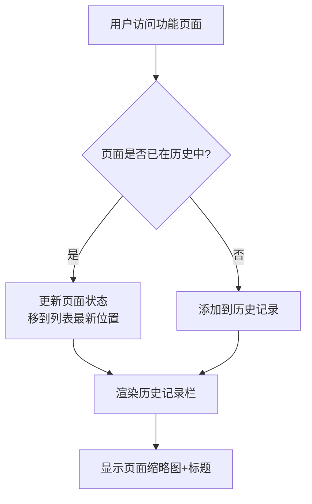
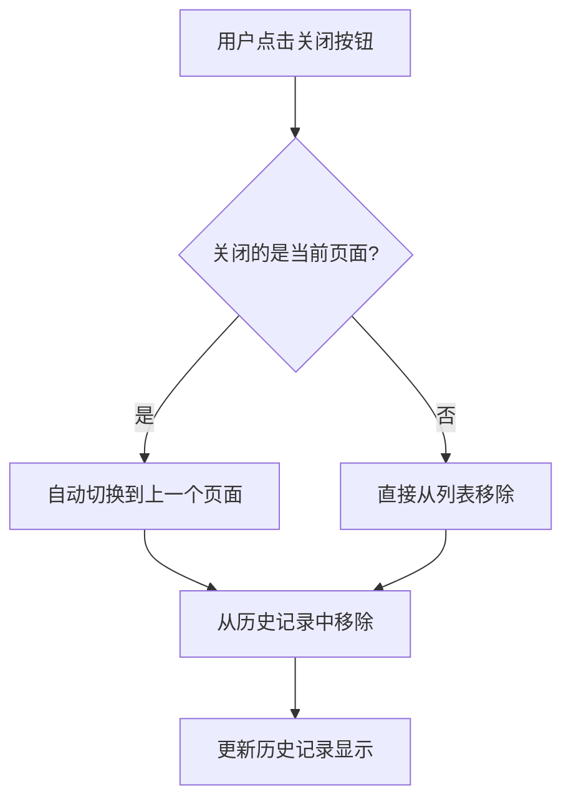

# 需求文档：页面标签/历史记录模块（极客模式）

> 文档版本：v1.0
> 创建时间：2026-02-14
> 状态：待确认

---

## 1. 需求背景

### 1.1 业务场景
在极客模式下，用户经常需要在多个功能页面之间快速切换。例如：
- 用户正在"我的待办"页面处理缺陷
- 需要临时切换到"问题列表"页面查看相关信息
- 处理完后需要快速回到"我的待办"页面继续之前的工作

### 1.2 当前痛点
1. **切换成本高**：每次切换页面都需要通过侧边栏菜单重新导航
2. **状态丢失**：返回原页面时，筛选条件、分页状态等需要重新设置
3. **效率低下**：无法快速在多个常用页面间来回切换

### 1.3 期望目标
1. 提供类似浏览器标签页的页面历史记录功能
2. 支持一键切换回之前打开的页面，且保持页面状态
3. 支持关闭不再需要的页面记录
4. 提供炫酷的视觉切换效果，增强极客模式的科技感

---

## 2. 用户角色

| 角色 | 描述 | 核心诉求 |
|------|------|----------|
| 测试工程师 | 日常使用缺陷管理、用例管理功能 | 快速在待办、问题列表、用例管理间切换 |
| 技术负责人 | 查看数据分析、系统管理页面 | 快速切换不同分析视角 |
| 系统管理员 | 配置系统参数、查看监控 | 在多个管理页面间高效切换 |

---

## 3. 功能范围

### 3.1 功能清单

| 功能模块 | 功能点 | 优先级 | 描述 |
|----------|--------|--------|------|
| 页面记录管理 | 自动记录已打开页面 | P0 | 自动将访问过的功能页面加入历史记录 |
| 页面记录管理 | 页面状态保持 | P0 | 切换回来时保持筛选、分页等状态 |
| 页面记录管理 | 重复页面去重 | P0 | 同一页面只保留一个记录 |
| 页面切换 | 点击切换页面 | P0 | 点击历史记录项切换到对应页面 |
| 页面切换 | 炫酷切换动画 | P0 | 从下方模块图片向上冒出的动画效果 |
| 页面关闭 | 关闭页面记录 | P0 | 支持删除单个历史记录项 |
| 页面关闭 | 关闭其他页面 | P1 | 一键关闭除当前页面外的所有记录 |
| 视觉展示 | 页面缩略图 | P0 | 显示页面内容的缩略预览图 |
| 视觉展示 | 页面标题显示 | P0 | 显示页面名称和图标 |
| 视觉展示 | 当前页面标识 | P0 | 高亮显示当前所在页面 |

### 3.2 明确边界

**✅ 包含范围：**
- 仅极客模式（modern layout）下的功能页面
- 记录用户在 FeatureLayout 内访问的页面
- 页面状态的保持与恢复（筛选条件、分页、表单输入等）
- **页面截图缩略图**：使用 html2canvas 捕获页面内容作为标签预览
- 历史记录条目的可视化展示与交互
- **持久化存储**：使用 localStorage 保存历史记录，刷新后数据保留
- 炫酷的页面切换动画效果
- 批量操作：关闭其他、关闭全部功能

**❌ 不包含范围：**
- 经典模式（traditional layout）下的实现
- 首页（HomePage）的记录（首页作为入口，不加入历史）
- 跨会话的历史记录保留（仅当前浏览器会话）
- 浏览器级别的前进/后退功能替代

---

## 4. 用户故事

**US-001: 自动记录访问的页面**
```
作为 测试工程师
我希望 系统能自动记录我访问过的功能页面
以便 我可以快速找到之前打开的页面
```

**验收标准：**
- [ ] 每访问一个新页面，自动添加到历史记录
- [ ] 同一页面重复访问时，更新其在列表中的位置（移到最新）
- [ ] 历史记录显示在功能页面展示区下方
- [ ] 最多显示最近访问的 8 个页面

**US-002: 快速切换页面并保持状态**
```
作为 测试工程师
我希望 点击历史记录中的页面缩略图就能快速切换
以便 我可以高效地在多个任务间切换
```

**验收标准：**
- [ ] 点击历史记录项，页面平滑切换到目标页面
- [ ] 切换动画采用"从下方冒出"的效果（像从口袋放气）
- [ ] 返回页面时，筛选条件、分页等状态保持一致
- [ ] 切换过程流畅，无明显卡顿

**US-003: 关闭不需要的页面记录**
```
作为 测试工程师
我希望 可以关闭历史记录中不再需要的页面
以便 保持历史记录的整洁
```

**验收标准：**
- [ ] 每个历史记录项显示关闭按钮（悬停时显示）
- [ ] 点击关闭按钮，该记录从历史列表中移除
- [ ] 支持右键菜单：关闭其他、关闭全部、刷新页面
- [ ] 关闭当前页面后，自动切换到上一个页面
- [ ] 批量关闭操作有确认提示

**US-004: 炫酷的视觉切换效果**
```
作为 用户
我希望 页面切换时有炫酷的动画效果
以便 增强极客模式的科技感和使用体验
```

**验收标准：**
- [ ] 切换动画采用"从下方模块图片向上冒出"的效果
- [ ] 动画过程中图片呈现"下面小上面大"的透视变形
- [ ] 动画时长控制在 400-600ms
- [ ] 动画曲线流畅，使用 cubic-bezier 缓动函数

---

## 5. 业务流程

### 5.1 页面访问与记录流程



### 5.2 页面切换流程

```mermaid
flowchart TD
    A[用户点击历史记录项] --> B[触发切换动画]
    B --> C[播放"向上冒出"动画]
    C --> D[保存当前页面状态]
    D --> E[路由跳转到目标页面]
    E --> F[恢复目标页面状态]
    F --> G[更新当前页面标识]
```

### 5.3 页面关闭流程



---

## 6. 数据需求

### 6.1 数据实体

| 实体名称 | 主要字段 | 说明 |
|----------|----------|------|
| PageTab | id: string | 唯一标识 |
| | path: string | 页面路由路径 |
| | title: string | 页面标题 |
| | icon: string | 页面图标 |
| | state: object | 页面状态（筛选、分页等） |
| | **screenshot: string** | **页面截图（base64格式，使用html2canvas生成）** |
| | timestamp: number | 访问时间戳 |
| | isActive: boolean | 是否为当前活动页面 |
| | scrollPosition: object | 页面滚动位置 {x, y} |

### 6.2 数据流向

```
用户操作（访问/切换/关闭页面）
    ↓
PageTabContext 状态更新
    ↓
localStorage 持久化（自动同步）
    ↓
PageTabBar 组件重新渲染
    ↓
用户界面更新

页面访问时：
    ↓
html2canvas 捕获页面截图
    ↓
生成 base64 图片数据
    ↓
存储到 PageTab.screenshot
```

---

## 7. 界面设计

### 7.1 布局位置

在极客模式的 FeatureLayout 中，页面标签栏位于内容区域下方：

```
┌─────────────────────────────────────────────────────────────┐
│  ┌──────┐                                    ┌──────┐      │
│  │ Left │        内容区域 (Content)           │ Right│      │
│  │CollapseBar    ┌─────────────────────┐    │CollapseBar   │
│  │      │        │                     │    │      │      │
│  │      │        │    <Outlet />       │    │      │      │
│  │      │        │   (实际页面内容)      │    │      │      │
│  └──────┘        │                     │    └──────┘      │
│                  └─────────────────────┘                   │
│  ┌──────────────────────────────────────────────────────┐  │
│  │  [🏠] [📋待办] [📊分析] [⚙️设置] ...          [×]   │  │
│  │   ↑ 页面标签历史记录栏（位于内容区底部）               │  │
│  └──────────────────────────────────────────────────────┘  │
└─────────────────────────────────────────────────────────────┘
```

### 7.2 视觉样式

- **背景**：半透明毛玻璃效果，与极客模式风格一致
- **标签项**：
  - 圆角矩形，带边框
  - 当前活动标签：高亮边框 + 发光效果
  - 非活动标签：普通边框
- **关闭按钮**：悬停时显示，红色高亮
- **缩略图**：初期使用页面图标，后期可考虑真实截图

---

## 8. 动画设计

### 8.1 切换动画效果

**效果名称**："口袋冒出"（Pocket Pop-up）

**动画描述**：
1. 用户点击历史记录项
2. 被点击的缩略图从下方栏位置开始放大
3. 放大过程中呈现透视变形：底部小、顶部大
4. 同时向上移动，逐渐覆盖整个内容区域
5. 最终变形为完整的页面内容

**技术参数**：
- 时长：500ms
- 缓动函数：cubic-bezier(0.34, 1.56, 0.64, 1)（带弹性效果）
- 初始状态：scale(0.3) translateY(100px) perspective(500px) rotateX(15deg)
- 结束状态：scale(1) translateY(0) perspective(500px) rotateX(0deg)

### 8.2 关闭动画效果

- 时长：200ms
- 效果：淡出 + 缩小
- 缓动函数：ease-out

---

## 9. 验收标准

### 9.1 功能验收

- [ ] 访问新页面自动添加到历史记录
- [ ] 重复访问同一页面，更新位置不重复添加
- [ ] 点击历史记录项，页面正确切换
- [ ] 切换后页面状态（筛选、分页）保持一致
- [ ] 关闭历史记录项，正确从列表移除
- [ ] 关闭当前页面，自动切换到上一个页面
- [ ] 历史记录最多显示 8 个条目

### 9.2 非功能验收

- **性能要求**：
  - 切换动画帧率不低于 60fps
  - 页面状态保存/恢复时间 < 100ms
  - 历史记录栏渲染时间 < 50ms

- **兼容性要求**：
  - 支持 Chrome、Firefox、Edge 最新版本
  - 响应式适配不同屏幕尺寸

- **用户体验要求**：
  - 动画流畅无卡顿
  - 交互反馈明确
  - 视觉风格与极客模式一致

---

## 10. 疑问与假设

### 10.1 已做假设

- **假设1**：页面状态保存范围包括筛选条件、分页参数、表单输入值
  - 理由：这些是用户最关心的状态
  
- **假设2**：历史记录仅在当前会话有效，刷新页面后重置
  - 理由：简化实现，避免状态同步复杂性
  
- **假设3**：使用 html2canvas 生成页面截图作为缩略图
  - 理由：您明确要求类似 Windows 任务切换的缩略图效果
  - 实现：页面切换前捕获当前页面内容，生成 base64 图片

### 10.2 已确认事项 ✅

| 问题 | 决策 | 说明 |
|------|------|------|
| **Q1** | 同意限制 8 个 | 超出时移除最早访问的标签 |
| **Q2** | 需要批量关闭 | 支持"关闭其他"和"关闭全部" |
| **Q3** | 需要持久化 | 使用 localStorage，刷新后数据保留 |
| **Q4** | 动画效果符合预期 | 使用"口袋冒出"效果 |
| **Q5** | 仅极客模式 | 经典模式不实现 |
| **Q6** | 截图缩略图 | 使用 html2canvas 生成页面截图，类似 Windows 任务切换 |

---

## 11. 附录

### 11.1 参考资料

- [FeatureLayout.tsx](file:///d:/自动化测试平台/AITestCraft-Tech-style/frontend/src/layouts/FeatureLayout.tsx) - 极客模式布局
- [LayoutModeContext.tsx](file:///d:/自动化测试平台/AITestCraft-Tech-style/frontend/src/contexts/LayoutModeContext.tsx) - 布局模式状态
- [QuickAccessIcons.tsx](file:///d:/自动化测试平台/AITestCraft-Tech-style/frontend/src/components/QuickAccessIcons.tsx) - 快捷入口组件

### 11.2 术语说明

| 术语 | 说明 |
|------|------|
| 极客模式 | 现代风格的布局模式，使用隐藏式侧边栏 |
| 经典模式 | 传统风格的布局模式，使用固定侧边栏 |
| FeatureLayout | 极客模式下的功能页面布局组件 |
| 页面状态 | 页面的筛选条件、分页、表单输入等用户数据 |
| 历史记录 | 用户访问过的页面列表 |
