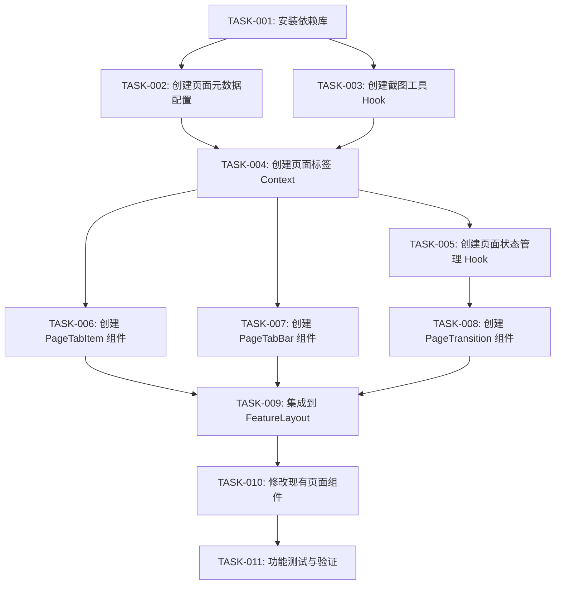

# 任务清单：页面标签/历史记录模块（极客模式）

> 文档版本：v1.0
> 创建时间：2026-02-14
> 关联设计：[DESIGN_页面标签历史记录模块.md](./DESIGN_页面标签历史记录模块.md)

---

## 任务依赖图



---

## 任务列表

### TASK-001: 安装依赖库

- **优先级**: P0
- **类型**: 基础设施
- **前置依赖**: 无
- **预估复杂度**: 低
- **预计耗时**: 5分钟

**输入契约**：
- 项目使用 npm 作为包管理器
- 需要安装 html2canvas 用于截图

**输出契约**：
- html2canvas 成功安装到 dependencies
- package.json 更新

**实现要点**：
1. 执行 `npm install html2canvas@^1.4.1`
2. 验证安装成功

**验收标准**：
- [ ] html2canvas 出现在 package.json dependencies 中
- [ ] 可以在代码中正常 import

**执行状态**: 待开始

---

### TASK-002: 创建页面元数据配置

- **优先级**: P0
- **类型**: 基础设施
- **前置依赖**: 无
- **预估复杂度**: 低
- **预计耗时**: 15分钟

**输入契约**：
- 分析现有页面路由结构
- 确定每个页面的标题和图标

**输出契约**：
- `frontend/src/config/pageMeta.ts` 文件
- 包含所有功能页面的元数据配置

**实现要点**：
1. 创建 config 目录（如不存在）
2. 定义 pageMetaConfig 对象
3. 配置各页面的 title、icon、module

**页面列表**：
- /defects/todo - 我的待办
- /defects/list - 问题列表
- /defects/analysis - 缺陷分析
- /defects/assistant - 缺陷助手
- /test-cases - 用例管理
- /assistant - AI用例助手
- /admin/* - 系统管理相关页面

**验收标准**：
- [ ] 文件创建成功
- [ ] 包含所有功能页面的配置
- [ ] 图标使用 Ant Design Icons

**执行状态**: 待开始

---

### TASK-003: 创建截图工具 Hook

- **优先级**: P0
- **类型**: 功能开发
- **前置依赖**: TASK-001
- **预估复杂度**: 中
- **预计耗时**: 30分钟

**输入契约**：
- html2canvas 已安装
- 需要捕获 FeatureLayout 的内容区域

**输出契约**：
- `frontend/src/hooks/usePageScreenshot.ts` 文件
- 提供 captureScreenshot 方法

**实现要点**：
1. 导入 html2canvas
2. 配置截图参数（scale: 0.5, quality: 0.7）
3. 处理跨域图片问题
4. 返回 base64 格式的图片数据
5. 添加错误处理

**代码结构**：
```typescript
export const usePageScreenshot = () => {
  const captureScreenshot = async (element: HTMLElement): Promise<string> => {
    // 实现截图逻辑
  };
  
  return { captureScreenshot };
};
```

**验收标准**：
- [ ] Hook 可以正常调用
- [ ] 返回有效的 base64 图片数据
- [ ] 截图性能可接受（< 500ms）
- [ ] 错误处理完善

**执行状态**: 待开始

---

### TASK-004: 创建页面标签 Context

- **优先级**: P0
- **类型**: 功能开发
- **前置依赖**: TASK-002
- **预估复杂度**: 高
- **预计耗时**: 60分钟

**输入契约**：
- 页面元数据配置已完成
- 需要持久化到 localStorage

**输出契约**：
- `frontend/src/contexts/PageTabContext.tsx` 文件
- 提供完整的标签管理功能

**实现要点**：
1. 定义 PageTab 接口（含 screenshot、scrollPosition）
2. 实现 Context Provider
3. 实现 addTab、switchTab、closeTab、closeOtherTabs、closeAllTabs、refreshTab
4. 实现 localStorage 持久化（自动同步）
5. 实现最大标签数限制（8个）
6. 处理页面状态保存和恢复

**核心功能**：
- 标签列表管理
- 当前活动标签跟踪
- 持久化存储
- 批量操作

**验收标准**：
- [ ] Context 可以正常使用
- [ ] 标签增删改查功能正常
- [ ] localStorage 持久化正常
- [ ] 最大标签数限制生效
- [ ] 批量操作功能正常

**执行状态**: 待开始

---

### TASK-005: 创建页面状态管理 Hook

- **优先级**: P0
- **类型**: 功能开发
- **前置依赖**: TASK-004
- **预估复杂度**: 中
- **预计耗时**: 30分钟

**输入契约**：
- PageTabContext 已完成
- 需要与 PageStateRegistry 配合

**输出契约**：
- `frontend/src/hooks/usePageState.ts` 文件
- 提供页面状态注册和管理功能

**实现要点**：
1. 定义 usePageState Hook
2. 实现状态保存和恢复逻辑
3. 管理页面滚动位置
4. 自动注册到 PageStateRegistry
5. 监听路由变化自动保存

**代码结构**：
```typescript
export const usePageState = (
  path: string,
  handlers: {
    save: () => PageState;
    restore: (state: PageState) => void;
  },
  deps?: DependencyList
) => {
  // 实现逻辑
};
```

**验收标准**：
- [ ] Hook 可以正常使用
- [ ] 状态保存和恢复正常
- [ ] 滚动位置管理正常
- [ ] 路由变化时自动保存

**执行状态**: 待开始

---

### TASK-006: 创建 PageTabItem 组件

- **优先级**: P0
- **类型**: 功能开发
- **前置依赖**: TASK-004
- **预估复杂度**: 中
- **预计耗时**: 45分钟

**输入契约**：
- PageTabContext 已完成
- 需要显示截图缩略图

**输出契约**：
- `frontend/src/components/PageTabItem.tsx` 文件
- 提供单个标签项的渲染和交互

**实现要点**：
1. 定义组件 Props 接口
2. 实现截图缩略图显示（120×80px）
3. 实现悬停效果（显示关闭按钮和标题）
4. 实现右键菜单（关闭其他、关闭全部、刷新）
5. 实现当前活动状态高亮
6. 添加动画效果

**视觉设计**：
- 缩略图：圆角 8px，阴影效果
- 悬停：显示关闭按钮（右上角）
- 活动状态：主题色边框 + 发光

**验收标准**：
- [ ] 组件可以正常渲染
- [ ] 截图缩略图显示正常
- [ ] 悬停效果正常
- [ ] 右键菜单功能正常
- [ ] 活动状态高亮正常

**执行状态**: 待开始

---

### TASK-007: 创建 PageTabBar 组件

- **优先级**: P0
- **类型**: 功能开发
- **前置依赖**: TASK-006
- **预估复杂度**: 中
- **预计耗时**: 30分钟

**输入契约**：
- PageTabItem 组件已完成
- PageTabContext 可用

**输出契约**：
- `frontend/src/components/PageTabBar.tsx` 文件
- 提供标签栏容器组件

**实现要点**：
1. 使用 PageTabContext 获取标签列表
2. 渲染 PageTabItem 列表
3. 实现水平滚动（标签多时）
4. 添加毛玻璃背景效果
5. 固定在内容区底部

**样式要求**：
- 高度：100px（容纳缩略图 + 边距）
- 背景：半透明毛玻璃
- 边框：顶部细边框

**验收标准**：
- [ ] 组件可以正常渲染
- [ ] 标签列表显示正常
- [ ] 水平滚动正常
- [ ] 视觉效果符合设计

**执行状态**: 待开始

---

### TASK-008: 创建 PageTransition 组件

- **优先级**: P0
- **类型**: 功能开发
- **前置依赖**: 无
- **预估复杂度**: 中
- **预计耗时**: 45分钟

**输入契约**：
- 使用 framer-motion 实现动画
- 需要实现"口袋冒出"效果

**输出契约**：
- `frontend/src/components/PageTransition.tsx` 文件
- 提供页面切换动画包装器

**实现要点**：
1. 导入 framer-motion
2. 定义动画 variants
3. 实现 AnimatePresence 包装
4. 配置"口袋冒出"动画参数
5. 处理动画打断情况

**动画参数**：
- 初始：scale(0.3) translateY(100px) rotateX(15deg)
- 结束：scale(1) translateY(0) rotateX(0deg)
- 时长：500ms
- 缓动：cubic-bezier(0.34, 1.56, 0.64, 1)

**验收标准**：
- [ ] 组件可以正常使用
- [ ] 切换动画流畅
- [ ] 效果符合"口袋冒出"设计
- [ ] 动画打断处理正常

**执行状态**: 待开始

---

### TASK-009: 集成到 FeatureLayout

- **优先级**: P0
- **类型**: 功能开发
- **前置依赖**: TASK-007, TASK-008
- **预估复杂度**: 中
- **预计耗时**: 30分钟

**输入契约**：
- PageTabBar 组件已完成
- PageTransition 组件已完成
- PageTabContext 可用

**输出契约**：
- 修改 `frontend/src/layouts/FeatureLayout.tsx`
- 集成标签栏和动画组件

**实现要点**：
1. 导入 PageTabBar、PageTransition
2. 导入 PageTabProvider（包裹）
3. 修改 Content 区域布局（flex 列布局）
4. 在 Outlet 外包裹 PageTransition
5. 在 Content 底部添加 PageTabBar
6. 确保截图时获取正确的内容区域

**布局结构**：
```
<PageTabProvider>
  <Layout>
    <LeftCollapseBar />
    <Content>
      <div style={{ display: 'flex', flexDirection: 'column', height: '100%' }}>
        <div style={{ flex: 1 }}>
          <PageTransition>
            <Outlet />
          </PageTransition>
        </div>
        <PageTabBar />
      </div>
    </Content>
    <RightCollapseBar />
  </Layout>
</PageTabProvider>
```

**验收标准**：
- [ ] FeatureLayout 正常渲染
- [ ] 标签栏显示在内容区底部
- [ ] 页面切换动画正常
- [ ] 布局无错位

**执行状态**: 待开始

---

### TASK-010: 修改现有页面组件

- **优先级**: P0
- **类型**: 功能开发
- **前置依赖**: TASK-005, TASK-009
- **预估复杂度**: 中
- **预计耗时**: 45分钟

**输入契约**：
- usePageState Hook 可用
- FeatureLayout 已集成

**输出契约**：
- 修改主要页面组件，添加状态管理

**需要修改的页面**：
1. MyTodoPage - 保存 filters、page、pageSize
2. DefectListPage - 保存筛选状态
3. DefectAnalysisPage - 保存分析视图状态
4. TestCaseManagementPage - 保存用例列表状态
5. 其他主要功能页面...

**实现要点**：
1. 导入 usePageState
2. 在组件中调用 usePageState
3. 配置 save 和 restore 逻辑
4. 测试状态保存和恢复

**示例代码**：
```typescript
const MyTodoPage = () => {
  const [filters, setFilters] = useState({...});
  const [page, setPage] = useState(1);
  
  usePageState('/defects/todo', {
    save: () => ({ filters, page }),
    restore: (state) => {
      setFilters(state.filters);
      setPage(state.page);
    },
  });
  
  // ...
};
```

**验收标准**：
- [ ] 主要页面都添加了 usePageState
- [ ] 状态保存和恢复正常
- [ ] 页面功能不受影响

**执行状态**: 待开始

---

### TASK-011: 功能测试与验证

- **优先级**: P0
- **类型**: 测试验证
- **前置依赖**: TASK-010
- **预估复杂度**: 中
- **预计耗时**: 30分钟

**输入契约**：
- 所有功能开发完成
- 开发服务器可运行

**输出契约**：
- 测试报告
- 问题修复

**测试场景**：
1. **基础功能测试**
   - 访问新页面，自动添加到历史记录
   - 重复访问，更新位置不重复添加
   - 点击标签切换页面
   - 关闭标签功能

2. **状态保持测试**
   - 设置筛选条件，切换页面，返回后筛选条件保持
   - 分页状态保持
   - 滚动位置保持

3. **持久化测试**
   - 刷新页面，历史记录保留
   - 关闭浏览器重新打开，数据清除（符合设计）

4. **批量操作测试**
   - 关闭其他功能
   - 关闭全部功能
   - 刷新页面功能

5. **动画效果测试**
   - 切换动画流畅
   - 效果符合设计
   - 无卡顿

6. **边界情况测试**
   - 标签数量达到上限（8个）
   - 关闭最后一个标签
   - 快速切换页面

**验收标准**：
- [ ] 所有测试场景通过
- [ ] 无明显 bug
- [ ] 性能满足要求

**执行状态**: 待开始

---

## 执行进度

| 任务 | 状态 | 开始时间 | 完成时间 | 备注 |
|------|------|----------|----------|------|
| TASK-001 | 待开始 | - | - | - |
| TASK-002 | 待开始 | - | - | - |
| TASK-003 | 待开始 | - | - | - |
| TASK-004 | 待开始 | - | - | - |
| TASK-005 | 待开始 | - | - | - |
| TASK-006 | 待开始 | - | - | - |
| TASK-007 | 待开始 | - | - | - |
| TASK-008 | 待开始 | - | - | - |
| TASK-009 | 待开始 | - | - | - |
| TASK-010 | 待开始 | - | - | - |
| TASK-011 | 待开始 | - | - | - |

---

## 阻塞问题记录

| 问题 | 影响任务 | 发现时间 | 解决方案 | 状态 |
|------|----------|----------|----------|------|
| 无 | - | - | - | - |

---

## 风险与注意事项

1. **截图性能**：html2canvas 截图可能耗时较长，需要优化参数
2. **内存占用**：base64 图片数据可能占用较多内存，需要控制截图质量
3. **localStorage 容量**：历史记录数据可能超过 localStorage 限制（5MB）
4. **跨域图片**：如果页面包含跨域图片，截图可能失败
5. **兼容性**：确保动画在目标浏览器中流畅运行

---

## 开发顺序建议

**第一阶段（基础设施）**：
1. TASK-001: 安装依赖
2. TASK-002: 页面元数据配置
3. TASK-003: 截图工具 Hook

**第二阶段（核心功能）**：
4. TASK-004: 页面标签 Context
5. TASK-005: 页面状态管理 Hook
6. TASK-008: 切换动画组件

**第三阶段（UI 组件）**：
7. TASK-006: PageTabItem 组件
8. TASK-007: PageTabBar 组件

**第四阶段（集成与测试）**：
9. TASK-009: 集成到 FeatureLayout
10. TASK-010: 修改现有页面
11. TASK-011: 功能测试
