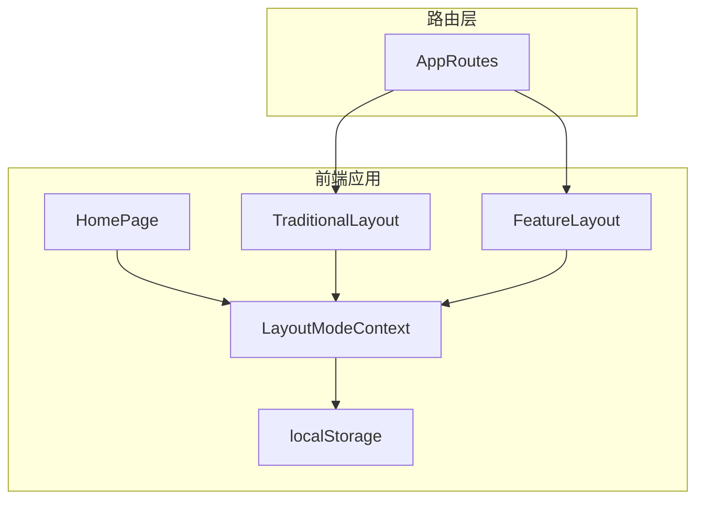
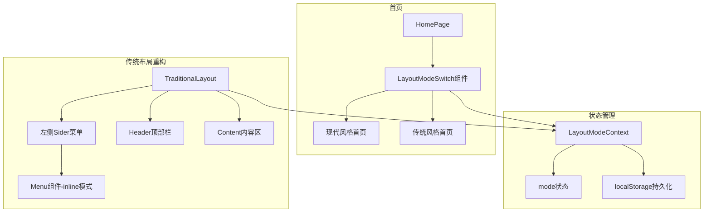

# 技术设计：首页模式切换与菜单重构

> 文档版本：v1.0
> 创建时间：2026-02-14
> 关联需求：REQUIREMENT_首页模式切换与菜单重构.md

## 1. 项目现状分析

### 1.1 技术栈识别

| 层级 | 技术 | 版本 | 说明 |
|------|------|------|------|
| 前端框架 | React | 18.x | UI框架 |
| 路由 | React Router | 6.x | 页面路由 |
| UI组件库 | Ant Design | 5.x | 组件库 |
| 构建工具 | Vite | 4.x | 构建工具 |
| 状态管理 | Context API | - | 状态管理 |
| 样式 | CSS Modules + 全局CSS | - | 样式方案 |

### 1.2 现有架构



### 1.3 相关模块分析

| 模块 | 路径 | 功能 | 可复用点 |
|------|------|------|----------|
| LayoutModeContext | /src/contexts/LayoutModeContext.tsx | 布局模式状态管理 | 模式切换逻辑、localStorage持久化 |
| TraditionalLayout | /src/layouts/TraditionalLayout.tsx | 传统模式布局 | 需要重构为左侧菜单 |
| FeatureLayout | /src/layouts/FeatureLayout.tsx | 现代模式布局 | 参考其Header和Content结构 |
| navigation.ts | /src/types/navigation.ts | 导航配置 | 需要添加传统模式菜单配置 |
| HomePage | /src/pages/HomePage.tsx | 首页 | 需要添加模式切换UI |

### 1.4 技术约束

- 使用Ant Design组件库保持UI一致性
- 模式状态通过Context + localStorage管理
- 路由使用React Router v6
- 样式使用CSS变量支持主题切换

## 2. 整体架构设计

### 2.1 架构图



### 2.2 模块划分

| 模块 | 职责 | 依赖 | 文件路径 |
|------|------|------|----------|
| LayoutModeSwitch | 模式切换UI组件 | LayoutModeContext | /src/components/LayoutModeSwitch.tsx |
| TraditionalMenu | 传统模式菜单组件 | navigation.ts | /src/components/TraditionalMenu.tsx |
| TraditionalLayout | 传统布局容器 | TraditionalMenu, Header | /src/layouts/TraditionalLayout.tsx |
| 传统菜单配置 | 菜单数据结构定义 | - | /src/types/navigation.ts |

## 3. 接口设计

### 3.1 数据模型

```typescript
// 传统模式菜单项
export interface TraditionalMenuItem {
  key: string;
  label: string;
  icon: string;
  path?: string;
  children?: TraditionalMenuItem[];
}

// 传统模式菜单配置
export const traditionalMenuConfig: TraditionalMenuItem[] = [...];
```

### 3.2 组件接口

```typescript
// LayoutModeSwitch组件
interface LayoutModeSwitchProps {
  className?: string;
}

// TraditionalMenu组件
interface TraditionalMenuProps {
  collapsed?: boolean;
  onCollapse?: (collapsed: boolean) => void;
}
```

## 4. 技术方案

### 4.1 首页模式切换实现

**方案**：在HomePage右上角添加模式切换控件（位于主题切换左侧）

```tsx
// HomePage.tsx
import { Segmented } from 'antd';
import { LayoutModeSwitch } from '../components/LayoutModeSwitch';

const HomePage: React.FC = () => {
  const { layoutMode } = useLayoutMode();
  
  return (
    <div className="home-page" style={{ position: 'relative' }}>
      {/* 右上角控制区：模式切换 + 主题切换 */}
      <div style={{ 
        position: 'absolute', 
        top: 24, 
        right: 24, 
        display: 'flex', 
        alignItems: 'center',
        gap: 16,
        zIndex: 100 
      }}>
        {/* 模式切换 - 左侧 */}
        <LayoutModeSwitch />
        
        {/* 主题切换 - 右侧（保持原有） */}
        <ThemeToggle />
      </div>
      
      {layoutMode === 'modern' ? <ModernHome /> : <TraditionalHome />}
    </div>
  );
};
```

**LayoutModeSwitch组件设计**：
- 使用Segmented组件，选项：现代模式 | 传统模式
- 现代模式图标：💎 (DiamondOutlined)
- 传统模式图标：📋 (ProfileOutlined)
- 样式与主题切换控件保持一致

### 4.2 传统布局重构实现

**方案**：使用Ant Design的Layout组件，左侧Sider + 顶部Header + Content，添加面包屑导航

```tsx
// TraditionalLayout.tsx
import { Layout, Menu, Breadcrumb } from 'antd';
const { Sider, Header, Content } = Layout;

const TraditionalLayout: React.FC = () => {
  const [collapsed, setCollapsed] = useState(false);
  const [openKeys, setOpenKeys] = useState<string[]>([]);
  const location = useLocation();
  const navigate = useNavigate();
  
  // 根据当前路径计算选中的菜单项
  const selectedKeys = useMemo(() => {
    const currentPath = location.pathname;
    // 遍历菜单配置，找到匹配的path对应的key
    for (const menu of traditionalMenuConfig) {
      if (menu.path === currentPath) return [menu.key];
      if (menu.children) {
        for (const child of menu.children) {
          if (child.path === currentPath) return [child.key];
        }
      }
    }
    return [];
  }, [location.pathname]);
  
  // 计算需要展开的子菜单（仅当前模块展开）
  const currentOpenKeys = useMemo(() => {
    const currentPath = location.pathname;
    // 根据当前路径找到所属的父菜单key
    for (const menu of traditionalMenuConfig) {
      if (menu.children) {
        const hasChildMatch = menu.children.some(child => child.path === currentPath);
        if (hasChildMatch) return [menu.key];
      }
    }
    return [];
  }, [location.pathname]);
  
  // 同步openKeys状态
  useEffect(() => {
    setOpenKeys(currentOpenKeys);
  }, [currentOpenKeys]);
  
  // 生成面包屑数据
  const breadcrumbItems = useMemo(() => {
    const items = [{ title: '首页', path: '/' }];
    const currentPath = location.pathname;
    
    for (const menu of traditionalMenuConfig) {
      if (menu.path === currentPath) {
        items.push({ title: menu.label, path: menu.path });
        break;
      }
      if (menu.children) {
        for (const child of menu.children) {
          if (child.path === currentPath) {
            items.push({ title: menu.label, path: menu.path || '#' });
            items.push({ title: child.label, path: child.path });
            break;
          }
        }
      }
    }
    return items;
  }, [location.pathname]);
  
  // 菜单点击处理
  const handleMenuClick = ({ key }: { key: string }) => {
    // 查找对应的path并跳转
    for (const menu of traditionalMenuConfig) {
      if (menu.key === key && menu.path) {
        navigate(menu.path);
        return;
      }
      if (menu.children) {
        for (const child of menu.children) {
          if (child.key === key && child.path) {
            navigate(child.path);
            return;
          }
        }
      }
    }
  };
  
  // 子菜单展开/收起处理
  const handleOpenChange = (keys: string[]) => {
    // 仅展开当前模块，收起其他模块
    const latestOpenKey = keys.find(key => !openKeys.includes(key));
    if (latestOpenKey) {
      setOpenKeys([latestOpenKey]);
    } else {
      setOpenKeys([]);
    }
  };
  
  return (
    <Layout className="traditional-layout" style={{ minHeight: '100vh' }}>
      <Sider 
        trigger={null} 
        collapsible 
        collapsed={collapsed}
        width={220}
        theme="dark"
      >
        <div className="logo" style={{ 
          height: 64, 
          display: 'flex', 
          alignItems: 'center', 
          justifyContent: 'center',
          color: '#fff',
          fontSize: 18,
          fontWeight: 'bold',
          borderBottom: '1px solid rgba(255,255,255,0.1)'
        }}>
          AI测试平台
        </div>
        <Menu
          mode="inline"
          theme="dark"
          selectedKeys={selectedKeys}
          openKeys={openKeys}
          onOpenChange={handleOpenChange}
          onClick={handleMenuClick}
          items={traditionalMenuItems}
          style={{ borderRight: 0 }}
        />
      </Sider>
      <Layout>
        <Header className="traditional-header" style={{ 
          background: '#fff', 
          padding: '0 24px',
          display: 'flex',
          alignItems: 'center',
          justifyContent: 'space-between',
          boxShadow: '0 1px 4px rgba(0,0,0,0.1)'
        }}>
          <div style={{ display: 'flex', alignItems: 'center' }}>
            <Button 
              type="text"
              icon={collapsed ? <MenuUnfoldOutlined /> : <MenuFoldOutlined />}
              onClick={() => setCollapsed(!collapsed)}
              style={{ marginRight: 16 }}
            />
            {/* 面包屑导航 */}
            <Breadcrumb>
              {breadcrumbItems.map((item, index) => (
                <Breadcrumb.Item key={index}>
                  {index === breadcrumbItems.length - 1 ? (
                    item.title
                  ) : (
                    <a onClick={() => navigate(item.path)}>{item.title}</a>
                  )}
                </Breadcrumb.Item>
              ))}
            </Breadcrumb>
          </div>
          <div style={{ display: 'flex', alignItems: 'center', gap: 16 }}>
            <LayoutModeSwitch />
            <UserInfo />
          </div>
        </Header>
        <Content className="traditional-content" style={{ 
          margin: 24,
          padding: 24,
          background: '#fff',
          borderRadius: 8,
          minHeight: 280
        }}>
          <Outlet />
        </Content>
      </Layout>
    </Layout>
  );
};
```

**关键实现要点**：
1. **面包屑导航**：根据当前路由动态生成面包屑，显示首页 > 1级菜单 > 2级菜单的层级关系
2. **仅当前模块展开**：通过`handleOpenChange`控制，同时只能展开一个父菜单
3. **菜单选中同步**：使用`useMemo`根据pathname计算selectedKeys，确保菜单选中状态与路由匹配
4. **菜单折叠**：Sider支持折叠，折叠后宽度从220px变为80px

### 4.3 菜单配置实现

```typescript
// navigation.ts
export const traditionalMenuConfig: TraditionalMenuItem[] = [
  {
    key: 'home',
    label: '首页',
    icon: 'HomeOutlined',
    path: '/'
  },
  {
    key: 'test',
    label: '用例管理',
    icon: 'UnorderedListOutlined',
    children: [
      { key: 'assistant', label: '用例助手', icon: 'RocketOutlined', path: '/assistant' },
      { key: 'list', label: '用例列表', icon: 'UnorderedListOutlined', path: '/test-cases' },
      { key: 'prompts', label: '提示词管理', icon: 'FileTextOutlined', path: '/prompts' },
      { key: 'system', label: '平台管理', icon: 'AppstoreOutlined', path: '/system' },
    ]
  },
  {
    key: 'defect',
    label: '缺陷管理',
    icon: 'BugOutlined',
    children: [
      { key: 'defect-list', label: '问题列表', icon: 'BugOutlined', path: '/defects/list' },
      { key: 'defect-analysis', label: '数据分析', icon: 'BarChartOutlined', path: '/defects' },
      { key: 'defect-todo', label: '我的待办', icon: 'CheckSquareOutlined', path: '/defects/todo' },
      { key: 'defect-project', label: '项目管理', icon: 'ProjectOutlined', path: '/defects/project' },
      { key: 'defect-notification', label: '消息推送配置', icon: 'NotificationOutlined', path: '/defects/notification' },
      { key: 'defect-assistant', label: '缺陷管理助手', icon: 'RobotOutlined', path: '/defects/assistant' },
    ]
  },
  {
    key: 'admin',
    label: '系统管理',
    icon: 'SettingOutlined',
    children: [
      { key: 'admin-database', label: '数据库配置', icon: 'DatabaseOutlined', path: '/admin/database' },
      { key: 'admin-llm', label: '大模型配置', icon: 'OpenAIOutlined', path: '/admin/llm' },
      { key: 'admin-monitoring', label: '系统监控', icon: 'DashboardOutlined', path: '/admin/monitoring' },
      { key: 'admin-plugins', label: '插件管理', icon: 'PluginOutlined', path: '/admin/plugins' },
    ]
  }
];
```

### 4.4 样式统一方案

使用CSS变量统一管理两种模式的样式：

```css
/* variables.css */
:root {
  /* 主题色 */
  --primary-color: #1890ff;
  --primary-color-hover: #40a9ff;
  
  /* 布局 */
  --sider-width: 220px;
  --sider-collapsed-width: 80px;
  --header-height: 64px;
  
  /* 颜色 */
  --bg-color: #f0f2f5;
  --sider-bg: #001529;
  --header-bg: #fff;
}
```

## 5. 风险评估

| 风险 | 等级 | 影响 | 应对方案 |
|------|------|------|----------|
| 路由嵌套复杂度 | 中 | 传统布局使用嵌套路由，可能导致路由匹配问题 | 仔细设计Route结构，使用Outlet渲染子路由 |
| 菜单状态同步 | 低 | 菜单展开状态需要与路由同步 | 使用useMemo根据pathname计算展开状态 |
| 样式冲突 | 低 | 两种模式样式可能冲突 | 使用CSS Module或BEM命名规范 |

## 6. 测试策略

### 6.1 单元测试
- 测试LayoutModeSwitch组件切换逻辑
- 测试TraditionalMenu菜单项渲染
- 测试菜单点击跳转逻辑

### 6.2 集成测试
- 测试模式切换后页面正确渲染
- 测试菜单展开/收起功能
- 测试路由切换时菜单选中状态更新

## 7. 部署方案

- 无后端API变更
- 纯前端代码更新
- 需要验证localStorage兼容性
