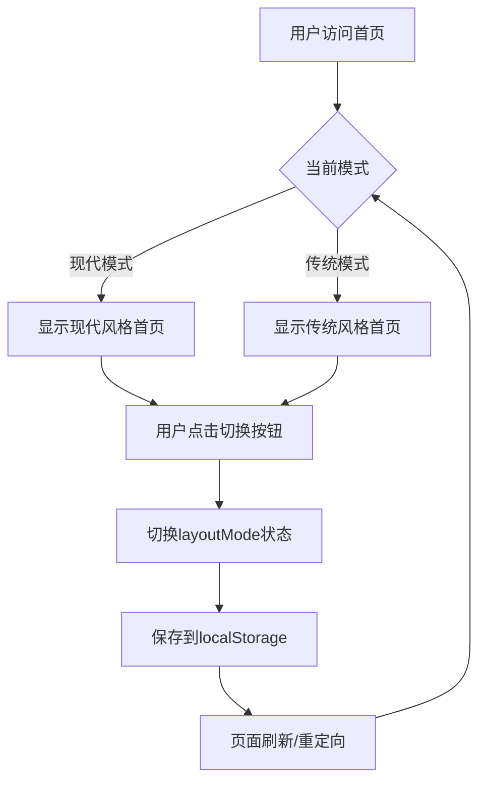
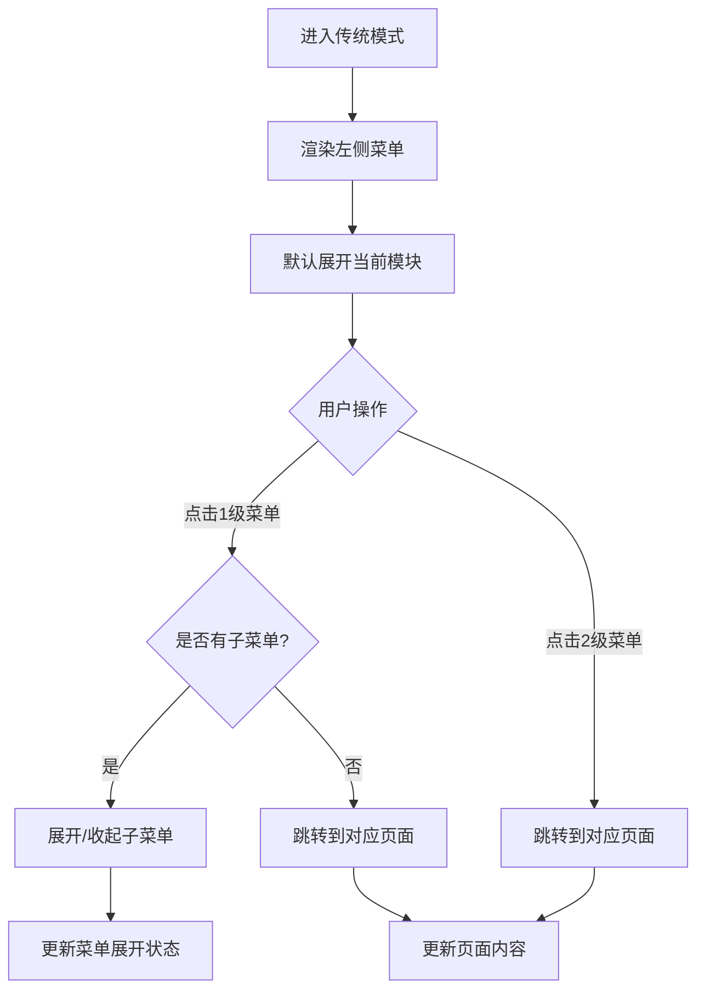

# 需求文档：首页模式切换与菜单重构

> 文档版本：v1.0
> 创建时间：2026-02-14
> 状态：待确认

## 1. 需求背景

### 1.1 业务场景
当前系统支持两种布局模式：现代模式（modern）和传统模式（traditional）。用户需要在首页就能方便地切换布局模式，并且两种模式下的视觉风格需要保持一致。

### 1.2 当前痛点
1. 首页缺少模式切换入口，用户无法直观切换布局模式
2. 传统模式的菜单结构不符合用户预期，1级菜单显示在顶部而非左侧树状结构
3. 两种模式的视觉风格不够统一

### 1.3 期望目标
1. 在首页提供直观的模式切换功能
2. 重构传统模式的菜单结构，采用左侧树状菜单展示
3. 统一两种模式的视觉风格

## 2. 用户角色

| 角色 | 描述 | 核心诉求 |
|------|------|----------|
| 测试工程师 | 使用系统进行测试用例管理和缺陷管理 | 快速切换熟悉的布局模式，高效访问功能模块 |
| 系统管理员 | 管理系统配置和监控 | 统一的操作体验，清晰的菜单结构 |

## 3. 功能范围

### 3.1 功能清单

| 功能模块 | 功能点 | 优先级 | 描述 |
|----------|--------|--------|------|
| 首页模式切换 | 模式切换控件 | P0 | 在首页提供现代/传统模式切换按钮/开关 |
| 首页模式切换 | 模式状态持久化 | P0 | 切换后模式状态保存到localStorage |
| 传统模式菜单 | 左侧树状菜单 | P0 | 重构为左侧菜单栏，包含4个1级菜单 |
| 传统模式菜单 | 二级菜单展开 | P0 | 用例管理、缺陷管理、系统管理支持展开二级菜单 |
| 风格统一 | 视觉风格统一 | P1 | 两种模式使用一致的配色和组件样式 |

### 3.2 明确边界

**✅ 包含范围：**
- 首页模式切换UI和逻辑
- 传统布局菜单结构重构
- 菜单配置文件更新
- 样式统一调整

**❌ 不包含范围：**
- 现代模式布局的修改（保持现有实现）
- 功能模块内部的业务逻辑修改
- 后端API接口修改

## 4. 用户故事

**US-001: 首页模式切换**
```
作为 测试工程师
我希望 在首页就能切换现代/传统布局模式
以便 根据我的使用习惯选择最适合的操作界面
```

**验收标准：**
- [ ] 首页显示模式切换按钮/开关
- [ ] 点击切换后页面立即响应
- [ ] 切换后的模式状态持久化保存
- [ ] 刷新页面后保持上次选择的模式

**US-002: 传统模式左侧树状菜单**
```
作为 测试工程师
我希望 传统模式使用左侧树状菜单展示所有功能
以便 符合传统软件的操作习惯，快速找到所需功能
```

**验收标准：**
- [ ] 左侧菜单栏显示4个1级菜单：首页、用例管理、缺陷管理、系统管理
- [ ] 用例管理、缺陷管理、系统管理可展开显示二级菜单
- [ ] 首页无二级菜单，点击直接跳转
- [ ] 菜单选中状态与当前页面匹配
- [ ] 菜单样式与整体风格统一

## 5. 菜单结构

### 5.1 传统模式菜单结构

```
📁 首页 (无二级菜单，直接跳转)
📁 用例管理
   ├── 用例助手 → /assistant
   ├── 用例列表 → /test-cases
   ├── 提示词管理 → /prompts
   └── 平台管理 → /system
📁 缺陷管理
   ├── 问题列表 → /defects/list
   ├── 数据分析 → /defects
   ├── 我的待办 → /defects/todo
   ├── 项目管理 → /defects/project
   ├── 消息推送配置 → /defects/notification
   └── 缺陷管理助手 → /defects/assistant
📁 系统管理
   ├── 数据库配置 → /admin/database
   ├── 大模型配置 → /admin/llm
   ├── 系统监控 → /admin/monitoring
   └── 插件管理 → /admin/plugins
```

### 5.2 菜单配置更新

更新 `src/types/navigation.ts`：

```typescript
// 传统模式菜单结构
export interface TraditionalMenuItem {
  key: string;
  label: string;
  icon: string;
  path?: string;  // 可选，有子菜单时不需要
  children?: TraditionalMenuItem[];
}

export const traditionalMenuConfig: TraditionalMenuItem[] = [
  {
    key: 'home',
    label: '首页',
    icon: 'HomeOutlined',
    path: '/'
  },
  {
    key: 'test',
    label: '用例管理',
    icon: 'UnorderedListOutlined',
    children: [
      { key: 'assistant', label: '用例助手', icon: 'RocketOutlined', path: '/assistant' },
      { key: 'list', label: '用例列表', icon: 'UnorderedListOutlined', path: '/test-cases' },
      { key: 'prompts', label: '提示词管理', icon: 'FileTextOutlined', path: '/prompts' },
      { key: 'system', label: '平台管理', icon: 'AppstoreOutlined', path: '/system' },
    ]
  },
  // ... 其他菜单
];
```

## 6. 业务流程

### 6.1 模式切换流程



### 6.2 传统模式菜单交互



## 7. 界面设计

### 7.1 首页模式切换UI

**位置**：首页右上角或顶部导航栏
**样式**：
- 使用Segmented组件或Switch组件
- 选项：现代模式 | 传统模式
- 图标：现代模式使用💎图标，传统模式使用📋图标
- 当前选中状态高亮显示

### 7.2 传统模式布局

**整体结构**：
```
┌─────────────────────────────────────────────────────┐
│  Logo          顶部标题栏                    用户信息  │  ← Header
├──────────┬──────────────────────────────────────────┤
│          │                                          │
│  首页     │                                          │
│  ▼        │                                          │
│  用例管理  │           页面内容区域                    │  ← Content
│    ├─用例助手│                                          │
│    ├─用例列表│                                          │
│    ├─提示词 │                                          │
│    └─平台管理│                                          │
│  缺陷管理  │                                          │
│  系统管理  │                                          │
│          │                                          │
└──────────┴──────────────────────────────────────────┘
     ↑
   Sider (左侧菜单，宽度200-220px)
```

**菜单样式**：
- 背景色：与主题一致（深色或浅色）
- 选中项：高亮背景色 + 左边框
- 展开/收起：使用动画过渡
- 图标：每个菜单项左侧显示对应图标

## 8. 技术实现

### 8.1 涉及文件

| 文件路径 | 修改类型 | 说明 |
|----------|----------|------|
| src/pages/HomePage.tsx | 修改 | 添加模式切换UI |
| src/layouts/TraditionalLayout.tsx | 修改 | 重构为左侧树状菜单 |
| src/types/navigation.ts | 修改 | 添加传统模式菜单配置 |
| src/contexts/LayoutModeContext.tsx | 修改 | 确保模式状态持久化 |
| src/styles/theme.ts | 修改 | 统一两种模式样式变量 |

### 8.2 关键逻辑

**模式切换**：
```typescript
// 使用现有的LayoutModeContext
const { layoutMode, setLayoutMode } = useLayoutMode();

// 切换处理
const handleModeChange = (mode: 'modern' | 'traditional') => {
  setLayoutMode(mode);
  localStorage.setItem('layoutMode', mode);
};
```

**传统菜单渲染**：
```typescript
// 使用Ant Design的Menu组件
<Menu
  mode="inline"
  theme={themeMode}
  selectedKeys={[currentKey]}
  openKeys={openKeys}
  onOpenChange={setOpenKeys}
  items={traditionalMenuConfig}
/>
```

## 9. 验收标准

### 9.1 功能验收
- [ ] 首页显示模式切换控件，样式美观
- [ ] 点击切换后模式立即生效
- [ ] 模式状态保存到localStorage，刷新后保持
- [ ] 传统模式左侧显示4个1级菜单
- [ ] 用例管理、缺陷管理、系统管理可展开二级菜单
- [ ] 首页菜单无二级菜单，点击直接跳转
- [ ] 菜单选中状态与当前路由匹配
- [ ] 菜单展开/收起有平滑动画
- [ ] 两种模式视觉风格统一（配色、字体、间距）

### 9.2 非功能验收
- 性能：模式切换响应时间 < 500ms
- 兼容性：支持Chrome、Edge、Firefox最新版本
- 响应式：菜单在较小屏幕下可正常显示

## 10. 疑问与假设

### 10.1 已做假设
- 假设用户希望首页也能切换模式（不仅限于功能页面）
- 假设传统模式的菜单结构如上述设计所示
- 假设两种模式使用相同的主题配色

### 10.2 待确认事项
- [ ] 首页模式切换控件的具体位置（右上角/顶部栏/其他位置）？
- [ ] 传统模式是否需要显示面包屑导航？
- [ ] 菜单默认展开状态（全部展开/仅当前模块展开）？

## 11. 附录

### 11.1 参考资料
- Ant Design Menu组件文档：https://ant.design/components/menu
- React Router文档：https://reactrouter.com/

### 11.2 术语说明
| 术语 | 说明 |
|------|------|
| 现代模式 | 顶部导航栏 + 卡片式功能入口的布局 |
| 传统模式 | 左侧树状菜单 + 内容区域的布局 |
| 1级菜单 | 菜单的第一层级，如"用例管理" |
| 2级菜单 | 菜单的第二层级，如"用例助手" |
