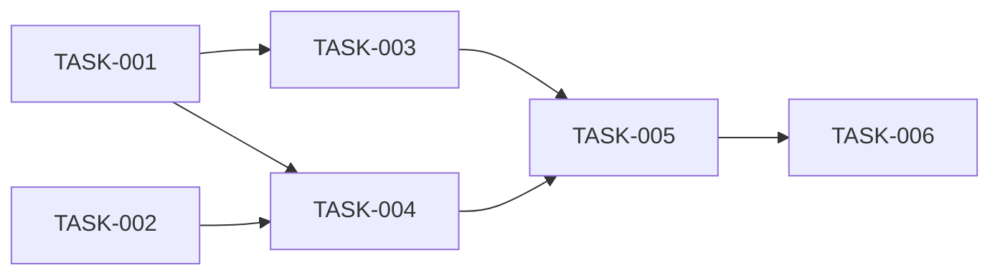

# 任务清单：首页模式切换与菜单重构

> 文档版本：v1.0
> 创建时间：2026-02-14
> 关联设计：DESIGN_首页模式切换与菜单重构.md

## 任务依赖图

## 任务列表

### TASK-001: 更新传统模式菜单配置

- **优先级**: P0
- **类型**: 基础设施
- **前置依赖**: 无
- **预估复杂度**: 低

**输入契约**：
- 输入数据：现有navigation.ts文件
- 环境依赖：TypeScript编译环境

**输出契约**：
- 输出数据：traditionalMenuConfig配置
- 交付物：src/types/navigation.ts（更新）

**实现要点**：
1. 添加TraditionalMenuItem接口定义
2. 添加traditionalMenuConfig数组，包含4个1级菜单
3. 用例管理、缺陷管理、系统管理配置二级菜单
4. 首页配置为无子菜单的直接跳转项

**验收标准**：
- [ ] TraditionalMenuItem接口定义正确
- [ ] traditionalMenuConfig包含所有菜单项
- [ ] 菜单key、label、icon、path配置正确
- [ ] TypeScript编译通过

**执行状态**: 待开始

---

### TASK-002: 创建LayoutModeSwitch组件

- **优先级**: P0
- **类型**: 组件开发
- **前置依赖**: 无
- **预估复杂度**: 低

**输入契约**：
- 输入数据：LayoutModeContext
- 环境依赖：React + Ant Design

**输出契约**：
- 输出数据：模式切换UI组件
- 交付物：src/components/LayoutModeSwitch.tsx

**实现要点**：
1. 使用Segmented或Switch组件实现切换UI
2. 集成LayoutModeContext获取/设置模式
3. 支持modern/traditional两个选项
4. 添加适当的图标和样式

**验收标准**：
- [ ] 组件能正确显示当前模式
- [ ] 点击切换后模式立即变更
- [ ] 切换后localStorage同步更新
- [ ] 样式美观，与主题一致

**执行状态**: 待开始

---

### TASK-003: 重构TraditionalLayout布局

- **优先级**: P0
- **类型**: 布局重构
- **前置依赖**: TASK-001
- **预估复杂度**: 高

**输入契约**：
- 输入数据：traditionalMenuConfig, LayoutModeContext
- 环境依赖：React Router v6, Ant Design Layout

**输出契约**：
- 输出数据：重构后的传统布局
- 交付物：src/layouts/TraditionalLayout.tsx（重写）

**实现要点**：
1. 使用Ant Design的Layout组件
2. 左侧Sider（220px宽度）放置Menu组件
3. Menu使用inline模式，支持展开/收起
4. 顶部Header放置菜单折叠按钮和模式切换
5. Content区域使用Outlet渲染子路由
6. 根据当前路由计算selectedKeys和openKeys
7. 添加菜单折叠功能

**验收标准**：
- [ ] 左侧显示4个1级菜单
- [ ] 有子菜单的可展开/收起
- [ ] 菜单选中状态与路由匹配
- [ ] 菜单点击正确跳转
- [ ] 布局响应式正常
- [ ] 菜单折叠功能正常

**执行状态**: 待开始

---

### TASK-004: 更新HomePage添加模式切换

- **优先级**: P0
- **类型**: 页面修改
- **前置依赖**: TASK-002
- **预估复杂度**: 中

**输入契约**：
- 输入数据：现有HomePage.tsx, LayoutModeSwitch组件
- 环境依赖：React, LayoutModeContext

**输出契约**：
- 输出数据：支持模式切换的首页
- 交付物：src/pages/HomePage.tsx（更新）

**实现要点**：
1. 在页面头部添加LayoutModeSwitch组件
2. 根据layoutMode状态渲染不同风格的首页
3. 现代模式保持现有卡片式布局
4. 传统模式显示简洁的功能入口或跳转到第一个功能页
5. 确保模式切换后页面正确响应

**验收标准**：
- [ ] 首页显示模式切换控件
- [ ] 切换模式后页面正确渲染
- [ ] 现代模式显示功能卡片
- [ ] 传统模式风格统一
- [ ] 模式状态持久化

**执行状态**: 待开始

---

### TASK-005: 统一样式风格

- **优先级**: P1
- **类型**: 样式调整
- **前置依赖**: TASK-003, TASK-004
- **预估复杂度**: 中

**输入契约**：
- 输入数据：现有样式文件
- 环境依赖：CSS/LESS

**输出契约**：
- 输出数据：统一的样式变量和组件样式
- 交付物：src/styles/theme.ts, src/styles/variables.css（更新）

**实现要点**：
1. 定义统一的CSS变量（主题色、布局尺寸等）
2. 更新TraditionalLayout样式，使用CSS变量
3. 确保两种模式配色一致
4. 统一字体、间距、圆角等视觉元素
5. 添加TraditionalLayout.css文件

**验收标准**：
- [ ] 两种模式使用一致的配色
- [ ] 菜单样式美观统一
- [ ] 布局尺寸一致
- [ ] 主题切换时样式正确响应

**执行状态**: 待开始

---

### TASK-006: 验证测试

- **优先级**: P0
- **类型**: 测试验证
- **前置依赖**: TASK-005
- **预估复杂度**: 中

**输入契约**：
- 输入数据：所有修改的文件
- 环境依赖：浏览器测试环境

**输出契约**：
- 输出数据：测试报告
- 交付物：ACCEPTANCE_首页模式切换与菜单重构.md

**实现要点**：
1. 验证模式切换功能
2. 验证传统菜单展开/收起
3. 验证菜单跳转功能
4. 验证路由匹配
5. 验证样式统一性
6. 验证localStorage持久化
7. 运行TypeScript编译检查
8. 检查控制台是否有错误

**验收标准**：
- [ ] 模式切换正常
- [ ] 菜单结构正确
- [ ] 页面跳转正常
- [ ] 样式统一美观
- [ ] 无控制台错误
- [ ] TypeScript编译通过

**执行状态**: 待开始

---

## 执行进度

| 任务 | 状态 | 开始时间 | 完成时间 | 备注 |
|------|------|----------|----------|------|
| TASK-001 | 待开始 | - | - | - |
| TASK-002 | 待开始 | - | - | - |
| TASK-003 | 待开始 | - | - | - |
| TASK-004 | 待开始 | - | - | - |
| TASK-005 | 待开始 | - | - | - |
| TASK-006 | 待开始 | - | - | - |

## 阻塞问题记录

| 问题 | 影响任务 | 发现时间 | 解决方案 | 状态 |
|------|----------|----------|----------|------|
| 无 | - | - | - | - |
