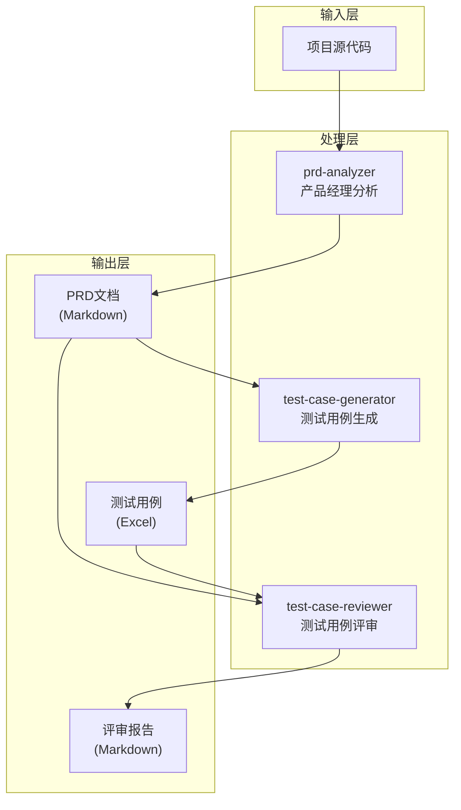

# DESIGN - 功能测试技能架构设计

## 1. 整体架构

```
┌─────────────────────────────────────────────────────────────┐
│                    功能测试自动化流程                        │
├─────────────────────────────────────────────────────────────┤
│                                                             │
│  ┌──────────────┐    ┌──────────────┐    ┌──────────────┐  │
│  │   阶段1      │───▶│   阶段2      │───▶│   阶段3      │  │
│  │  PRD分析     │    │ 用例生成     │    │ 用例评审     │  │
│  └──────────────┘    └──────────────┘    └──────────────┘  │
│         │                   │                   │          │
│         ▼                   ▼                   ▼          │
│  ┌──────────────┐    ┌──────────────┐    ┌──────────────┐  │
│  │prd-analyzer  │    │test-case-    │    │test-case-    │  │
│  │   Skill      │    │  generator   │    │  reviewer   │  │
│  │   (技能1)    │    │   (技能2)    │    │   (技能3)    │  │
│  └──────────────┘    └──────────────┘    └──────────────┘  │
│         │                   │                   │          │
│         ▼                   ▼                   ▼          │
│  ┌──────────────┐    ┌──────────────┐    ┌──────────────┐  │
│  │ PRD文档      │    │ 测试用例     │    │ 评审报告     │  │
│  │  (Markdown)  │    │ Excel文件    │    │  (Markdown)  │  │
│  └──────────────┘    └──────────────┘    └──────────────┘  │
│                                                             │
└─────────────────────────────────────────────────────────────┘
```

## 2. 技能架构图

```
┌─────────────────────────────────────────────────────────────┐
│                      Skill Registry                          │
│                   (.trae/skills/)                           │
├─────────────────────────────────────────────────────────────┤
│                                                             │
│  ┌─────────────────┐                                       │
│  │  prd-analyzer   │  角色：产品经理                        │
│  │                 │  输入：项目代码                         │
│  │  SKILL.md       │  输出：PRD文档                          │
│  │                 │  职责：分析功能，提炼需求               │
│  └─────────────────┘                                       │
│                                                             │
│  ┌─────────────────┐                                       │
│  │ test-case-      │  角色：测试经理                        │
│  │   generator     │  输入：PRD文档                          │
│  │                 │  输出：测试用例Excel                    │
│  │  SKILL.md       │  职责：设计用例，准备数据               │
│  └─────────────────┘                                       │
│                                                             │
│  ┌─────────────────┐                                       │
│  │  test-case-     │  角色：PM+测试+研发                     │
│  │   reviewer      │  输入：PRD+用例                         │
│  │                 │  输出：评审报告                          │
│  │  SKILL.md       │  职责：多视角评审，质量把关             │
│  └─────────────────┘                                       │
│                                                             │
└─────────────────────────────────────────────────────────────┘
```

## 3. 数据流向图



## 4. 模块依赖关系

```
┌────────────────────────────────────────────────────────────┐
│                      依赖关系图                             │
├────────────────────────────────────────────────────────────┤
│                                                            │
│  prd-analyzer                                              │
│       │                                                    │
│       ├── 依赖：项目代码                                    │
│       │       ├── frontend/src/pages/*.tsx                 │
│       │       ├── backend/src/routes/*.ts                  │
│       │       ├── backend/src/services/*.ts                │
│       │       └── backend/prisma/schema.prisma             │
│       │                                                    │
│       └── 输出：PRD_AITestCraft.md                         │
│                                                            │
│  test-case-generator                                       │
│       │                                                    │
│       ├── 依赖：PRD_AITestCraft.md                         │
│       │                                                    │
│       └── 输出：测试用例_[模块名].xlsx (8个文件)            │
│                                                            │
│  test-case-reviewer                                        │
│       │                                                    │
│       ├── 依赖：PRD_AITestCraft.md                         │
│       ├── 依赖：测试用例_[模块名].xlsx                      │
│       │                                                    │
│       └── 输出：评审报告.md                                 │
│                                                            │
└────────────────────────────────────────────────────────────┘
```

## 5. 接口契约定义

### 5.1 技能调用接口

| 技能 | 输入 | 输出 | 触发条件 |
|------|------|------|----------|
| prd-analyzer | 项目路径 | PRD文档 | 用户请求分析项目 |
| test-case-generator | PRD路径 | Excel文件 | PRD完成生成 |
| test-case-reviewer | PRD路径+Excel路径 | 评审报告 | 用例完成生成 |

### 5.2 文件命名规范

| 类型 | 命名格式 | 示例 |
|------|----------|------|
| PRD文档 | PRD_[项目名].md | PRD_AITestCraft.md |
| 测试用例 | 测试用例_[模块名].xlsx | 测试用例_测试用例管理.xlsx |
| 评审报告 | 评审报告.md | 评审报告.md |

### 5.3 目录结构规范

```
test-output/
├── docs/
│   ├── ALIGNMENT_功能测试.md
│   ├── CONSENSUS_功能测试.md
│   ├── DESIGN_技能架构.md
│   ├── TASK_功能测试.md
│   ├── PRD_AITestCraft.md
│   ├── 评审报告.md
│   ├── FINAL_功能测试.md
│   └── TODO_功能测试.md
├── test-cases/
│   ├── 测试用例_测试用例管理.xlsx
│   ├── 测试用例_缺陷管理.xlsx
│   ├── 测试用例_缺陷管理助手.xlsx
│   ├── 测试用例_项目管理.xlsx
│   ├── 测试用例_系统配置.xlsx
│   ├── 测试用例_消息通知.xlsx
│   ├── 测试用例_快捷键管理.xlsx
│   └── 测试用例_Prompt管理.xlsx
└── scripts/
    └── generate-test-cases.js
```

## 6. 异常处理策略

### 6.1 错误类型

| 错误类型 | 处理策略 | 恢复方式 |
|----------|----------|----------|
| 文件读取错误 | 记录错误，跳过该文件 | 人工检查文件权限 |
| 解析错误 | 记录错误位置，使用默认值 | 人工修正源文件 |
| 生成错误 | 保存已生成内容，中断任务 | 修复后从断点继续 |
| 依赖缺失 | 检查依赖完整性，提示用户 | 补充缺失依赖 |

### 6.2 日志记录

```typescript
interface LogEntry {
  timestamp: string;
  level: 'info' | 'warn' | 'error';
  skill: string;
  task: string;
  message: string;
  details?: any;
}
```

## 7. 扩展性设计

### 7.1 新技能添加

```
1. 在 .trae/skills/ 创建新技能目录
2. 编写 SKILL.md 文件
3. 更新技能注册表
4. 添加对应任务到TASK文档
```

### 7.2 新模块支持

```
1. 在PRD中添加新模块描述
2. 生成对应模块的测试用例Excel
3. 更新评审范围
```

## 8. 质量保障机制

### 8.1 自动化检查

- 文件格式验证
- 必填字段检查
- 命名规范检查
- 依赖完整性检查

### 8.2 人工审核点

- PRD业务逻辑准确性
- 测试用例覆盖度
- 评审结论合理性

---

**文档版本**：v1.0  
**创建时间**：2026-02-28
