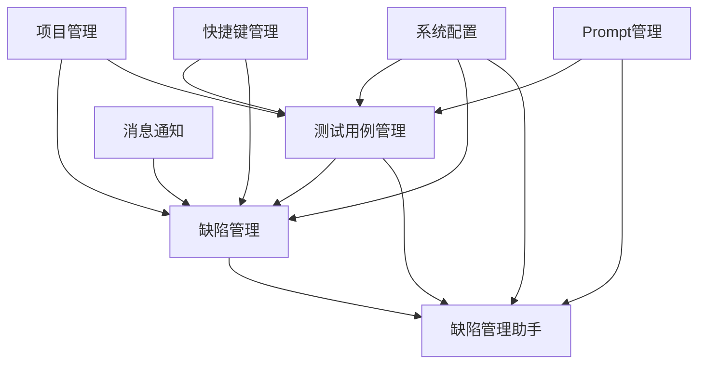
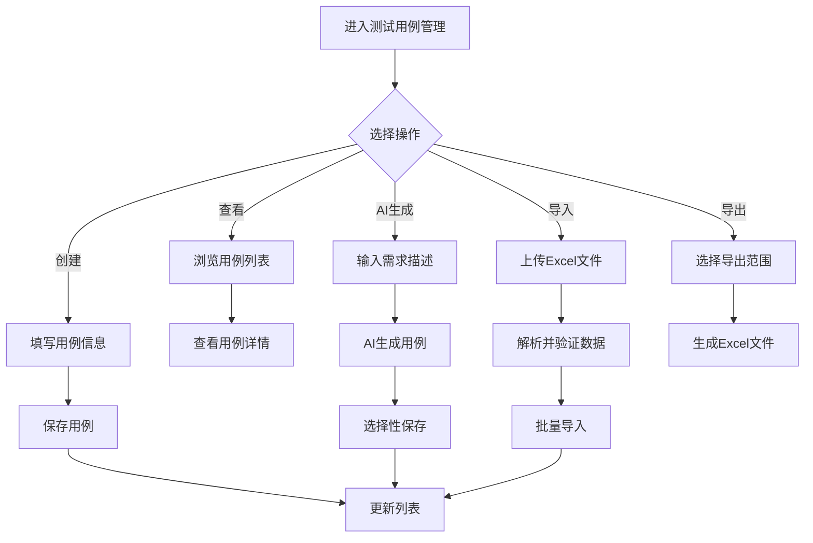
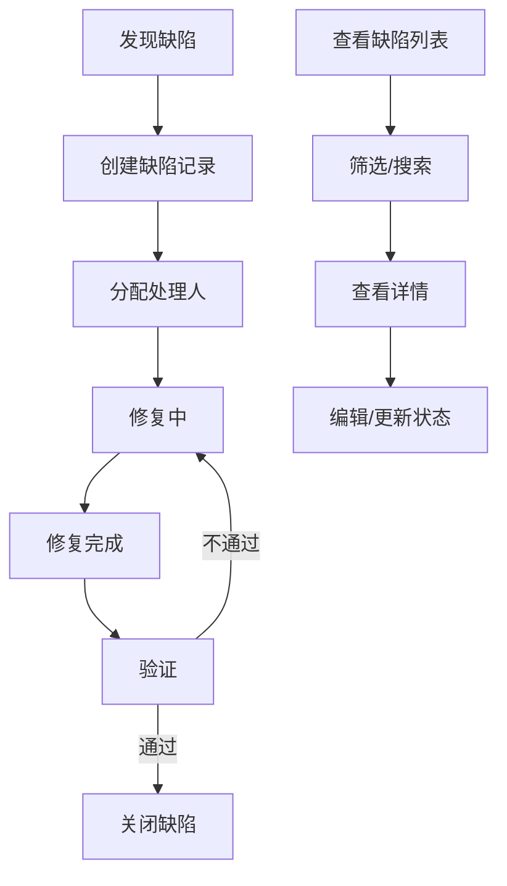
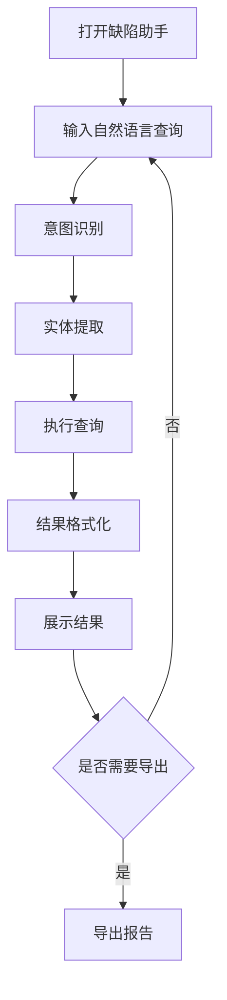

# PRD - AITestCraft 产品需求文档

## 1. 文档信息

| 项目 | 内容 |
|------|------|
| 文档版本 | v1.0 |
| 创建日期 | 2026-02-28 |
| 作者 | AI Product Manager |
| 产品名称 | AITestCraft |
| 产品定位 | AI驱动的自动化测试用例生成与管理平台 |

---

## 2. 产品概述

### 2.1 产品背景

AITestCraft是一款面向测试工程师和QA团队的智能化测试用例管理平台。平台集成DeepSeek AI能力，支持测试用例的智能生成、缺陷全生命周期管理、以及AI驱动的缺陷查询助手。

### 2.2 产品目标

1. **提升测试设计效率**：通过AI辅助，减少测试用例设计时间50%以上
2. **规范化测试管理**：建立统一的测试用例管理和缺陷跟踪流程
3. **智能化数据分析**：提供缺陷趋势分析和智能查询能力
4. **降低测试成本**：减少重复性工作，提高测试覆盖率

### 2.3 目标用户

| 用户角色 | 主要职责 | 使用场景 |
|----------|----------|----------|
| 测试工程师 | 编写和执行测试用例 | 用例生成、用例管理 |
| QA经理 | 测试计划和质量把控 | 缺陷分析、报表查看 |
| 项目经理 | 项目进度跟踪 | 缺陷统计、紧急问题跟踪 |
| 开发人员 | 缺陷修复和验证 | 缺陷查询、待办处理 |

### 2.4 核心价值主张

- **AI赋能**：自然语言输入，自动生成测试用例
- **全链路管理**：从用例设计到缺陷跟踪的完整闭环
- **智能助手**：通过对话方式快速查询缺陷数据
- **灵活配置**：支持多项目、多系统的灵活配置

---

## 3. 功能架构

### 3.1 系统架构图

```
┌─────────────────────────────────────────────────────────────────┐
│                         前端层 (React + Vite)                    │
│  ┌──────────────┐ ┌──────────────┐ ┌──────────────┐            │
│  │ 测试用例管理  │ │  缺陷管理     │ │  系统配置     │            │
│  └──────────────┘ └──────────────┘ └──────────────┘            │
│  ┌──────────────┐ ┌──────────────┐ ┌──────────────┐            │
│  │ 缺陷管理助手  │ │  项目管理     │ │  Prompt管理   │            │
│  └──────────────┘ └──────────────┘ └──────────────┘            │
└─────────────────────────────────────────────────────────────────┘
                              │
                              ▼
┌─────────────────────────────────────────────────────────────────┐
│                      API网关层 (Express)                         │
│         REST API                    WebSocket                   │
└─────────────────────────────────────────────────────────────────┘
                              │
                              ▼
┌─────────────────────────────────────────────────────────────────┐
│                      服务层 (Node.js)                            │
│  ┌──────────────┐ ┌──────────────┐ ┌──────────────┐            │
│  │ 测试用例服务  │ │  缺陷服务     │ │  AI助手服务   │            │
│  └──────────────┘ └──────────────┘ └──────────────┘            │
│  ┌──────────────┐ ┌──────────────┐ ┌──────────────┐            │
│  │ 项目管理服务  │ │  配置服务     │ │  通知服务     │            │
│  └──────────────┘ └──────────────┘ └──────────────┘            │
└─────────────────────────────────────────────────────────────────┘
                              │
                              ▼
┌─────────────────────────────────────────────────────────────────┐
│                      数据层                                      │
│  ┌──────────────┐ ┌──────────────┐ ┌──────────────┐            │
│  │   MySQL      │ │  DeepSeek    │ │   文件存储    │            │
│  │  (Prisma)    │ │    API       │ │              │            │
│  └──────────────┘ └──────────────┘ └──────────────┘            │
└─────────────────────────────────────────────────────────────────┘
```

### 3.2 功能模块清单

| 模块ID | 模块名称 | 优先级 | 功能点数 | 复杂度 |
|--------|----------|--------|----------|--------|
| M01 | 测试用例管理 | P0 | 8 | 高 |
| M02 | 缺陷管理 | P0 | 6 | 高 |
| M03 | 缺陷管理助手 | P0 | 5 | 高 |
| M04 | 项目管理 | P1 | 4 | 中 |
| M05 | 系统配置 | P1 | 6 | 中 |
| M06 | 消息通知 | P1 | 3 | 低 |
| M07 | 快捷键管理 | P2 | 2 | 低 |
| M08 | Prompt管理 | P2 | 3 | 低 |

### 3.3 模块关系图



---

## 4. 功能详细说明

### 4.1 测试用例管理模块 (M01)

#### 4.1.1 功能描述

测试用例管理是系统的核心模块，提供测试用例的全生命周期管理，包括创建、编辑、删除、查询、导入导出等功能，同时支持AI辅助生成测试用例。

#### 4.1.2 用户故事

**US-M01-001 作为测试工程师，我想要查看测试用例列表，以便了解当前项目的测试覆盖情况**
- 接受标准：
  - 可以按系统-模块-场景三级树形结构浏览用例
  - 支持按状态、优先级筛选
  - 支持关键词搜索
  - 分页展示，每页默认20条

**US-M01-002 作为测试工程师，我想要创建新的测试用例，以便记录测试步骤**
- 接受标准：
  - 可以填写用例标题、前置条件、测试步骤、预期结果
  - 可以选择优先级（P0-P3）
  - 可以选择所属系统、模块、场景
  - 支持批量创建

**US-M01-003 作为测试工程师，我想要使用AI生成测试用例，以便提高设计效率**
- 接受标准：
  - 可以输入需求描述
  - AI自动生成测试点和测试用例
  - 可以选择性保存生成的用例
  - 支持编辑优化生成的内容

**US-M01-004 作为测试工程师，我想要导入导出测试用例，以便进行数据迁移**
- 接受标准：
  - 支持Excel模板下载
  - 支持批量导入Excel
  - 支持批量导出为Excel
  - 导入时进行数据校验

#### 4.1.3 业务流程



#### 4.1.4 界面原型描述

**测试用例列表页**
- 左侧：系统-模块-场景三级树形导航
- 右侧上方：搜索栏、筛选器（状态、优先级）、操作按钮（新建、导入、导出）
- 右侧主体：表格展示用例列表（标题、优先级、状态、创建时间、操作列）
- 分页控件位于表格下方

**测试用例编辑页**
- 表单字段：标题、前置条件、测试步骤、预期结果、优先级、所属系统/模块/场景
- 操作按钮：保存、取消、保存并新建

**AI测试用例生成页**
- 输入区域：需求描述文本框
- 生成按钮：触发AI生成
- 结果区域：展示生成的测试点和测试用例
- 操作按钮：全选保存、选择性保存、重新生成

#### 4.1.5 数据模型

```prisma
model test_cases {
  id              Int               @id @default(autoincrement())
  title           String            @db.VarChar(255)
  precondition    String?           @db.Text
  steps           String            @db.Text
  expectedResults String            @db.Text
  priority        String            @db.VarChar(10)
  source          String            @db.VarChar(10)
  systemId        Int?
  moduleId        Int?
  scenarioId      Int?
  created_at      DateTime          @default(now())
  updated_at      DateTime
  deleted_at      DateTime?
  tags            Json?
  status          test_cases_status @default(PENDING)
}

enum test_cases_status {
  PENDING
  PASSED
  FAILED
  SKIPPED
}
```

#### 4.1.6 接口定义

| 接口 | 方法 | 路径 | 描述 |
|------|------|------|------|
| 获取用例列表 | GET | /api/test-cases | 分页获取测试用例 |
| 获取用例详情 | GET | /api/test-cases/:id | 获取单个用例详情 |
| 创建用例 | POST | /api/test-cases | 创建新测试用例 |
| 更新用例 | PUT | /api/test-cases/:id | 更新测试用例 |
| 删除用例 | DELETE | /api/test-cases/:id | 删除测试用例 |
| 从助手保存 | POST | /api/test-cases/save-from-assistant | 保存AI生成的用例 |
| 下载模板 | GET | /api/test-cases/batch/template | 下载导入模板 |
| 批量导出 | POST | /api/test-cases/batch/export | 批量导出用例 |

#### 4.1.7 业务规则

1. **优先级规则**：P0（最高）> P1 > P2 > P3（最低）
2. **状态流转**：PENDING → PASSED/FAILED/SKIPPED
3. **删除规则**：软删除，保留deleted_at字段
4. **导入规则**：必填字段（title, steps, expectedResults, priority）
5. **生成规则**：AI生成时需指定系统/模块/场景上下文

---

### 4.2 缺陷管理模块 (M02)

#### 4.2.1 功能描述

缺陷管理模块提供缺陷的全生命周期管理，包括缺陷记录、状态跟踪、统计分析、紧急问题跟踪等功能。

#### 4.2.2 用户故事

**US-M02-001 作为测试工程师，我想要记录发现的缺陷，以便跟踪修复进度**
- 接受标准：
  - 可以填写缺陷标题、描述、优先级
  - 可以选择所属项目和目录
  - 支持上传附件
  - 自动记录创建人和创建时间

**US-M02-002 作为QA经理，我想要查看缺陷统计报表，以便了解项目质量状况**
- 接受标准：
  - 展示缺陷趋势图（按时间维度）
  - 展示缺陷分布图（按状态、优先级、模块）
  - 支持按时间范围筛选
  - 支持导出报表

**US-M02-003 作为项目经理，我想要跟踪紧急问题，以便及时响应风险**
- 接受标准：
  - 标记高优先级缺陷为紧急问题
  - 紧急问题列表展示
  - 支持设置提醒
  - 跟踪解决进度

#### 4.2.3 业务流程



#### 4.2.4 数据模型

```prisma
model projects {
  id          String        @id
  name        String        @db.VarChar(255)
  created_at  DateTime      @default(now())
  updated_at  DateTime      @updatedAt
  directories directories[]
}

model directories {
  uuid        String       @id @default(cuid())
  id          String       @db.VarChar(255)
  name        String       @db.VarChar(255)
  project_id  String
  parent_id   String
  level       Int
  created_at  DateTime     @default(now())
  updated_at  DateTime     @updatedAt
}
```

---

### 4.3 缺陷管理助手模块 (M03)

#### 4.3.1 功能描述

缺陷管理助手是基于AI的智能查询助手，支持通过自然语言对话方式查询缺陷数据、生成分析报告。

#### 4.3.2 用户故事

**US-M03-001 作为QA经理，我想要通过自然语言查询缺陷，以便快速获取信息**
- 接受标准：
  - 支持自然语言输入查询
  - 支持多轮对话
  - 返回结构化的查询结果
  - 支持结果导出

**US-M03-002 作为项目经理，我想要生成缺陷分析报告，以便汇报项目质量**
- 接受标准：
  - 支持生成趋势分析报告
  - 支持生成分布分析报告
  - 报告包含图表展示
  - 支持导出为文档

#### 4.3.3 业务流程



#### 4.3.4 核心组件

| 组件 | 职责 | 技术实现 |
|------|------|----------|
| IntentParser | 意图识别 | 基于规则+机器学习 |
| EntityExtractor | 实体提取 | 正则+NER |
| QueryExecutor | 查询执行 | SQL动态构建 |
| ResponseFormatter | 结果格式化 | 模板引擎 |

#### 4.3.5 数据模型

```prisma
model learning_records {
  id              Int      @id @default(autoincrement())
  query           String?  @db.Text
  intent          String?  @db.VarChar(100)
  confidence      Decimal? @db.Decimal(5, 2)
  is_correct      Boolean?
  feedback        String?  @db.VarChar(20)
  learning_type   String?  @db.VarChar(50)
  created_at      DateTime @default(now())
}

model synonyms {
  id            Int      @id @default(autoincrement())
  word          String   @db.VarChar(100)
  synonym       String   @db.VarChar(100)
  intent        String?  @db.VarChar(100)
  confidence    Decimal  @default(1.00)
  usage_count   Int      @default(0)
}
```

---

### 4.4-4.8 其他模块

由于篇幅限制，其他模块（项目管理、系统配置、消息通知、快捷键管理、Prompt管理）的详细说明将在后续版本中补充。核心功能点如下：

**项目管理 (M04)**
- 项目CRUD
- 目录结构管理
- 项目与缺陷关联

**系统配置 (M05)**
- 数据库配置
- LLM配置（DeepSeek API）
- 插件管理
- 系统监控

**消息通知 (M06)**
- 推送配置
- 待办提醒
- 通知记录

**快捷键管理 (M07)**
- 快捷键配置
- 快捷键映射

**Prompt管理 (M08)**
- Prompt模板管理
- 变量替换

---

## 5. 非功能性需求

### 5.1 性能需求

| 指标 | 目标值 | 测量方法 |
|------|--------|----------|
| 页面加载时间 | < 3秒 | Lighthouse |
| API响应时间 | < 500ms | 后端日志 |
| AI生成响应 | < 10秒 | 用户感知 |
| 并发用户数 | > 50 | 压力测试 |

### 5.2 安全需求

1. **API密钥管理**：DeepSeek API密钥存储在环境变量，不提交到代码库
2. **SQL注入防护**：使用Prisma ORM，参数化查询
3. **XSS防护**：前端输入校验和转义
4. **CORS配置**：限制跨域访问

### 5.3 兼容性需求

| 浏览器 | 版本要求 | 支持状态 |
|--------|----------|----------|
| Chrome | >= 90 | ✅ 完全支持 |
| Firefox | >= 88 | ✅ 完全支持 |
| Edge | >= 90 | ✅ 完全支持 |
| Safari | >= 14 | ✅ 基本支持 |

### 5.4 可用性需求

1. **响应式设计**：适配桌面端（1280px+）
2. **无障碍支持**：支持键盘导航
3. **错误提示**：友好的错误信息和恢复指引
4. **加载状态**：操作反馈明确

---

## 6. 附录

### 6.1 术语表

| 术语 | 说明 |
|------|------|
| PRD | Product Requirements Document，产品需求文档 |
| AI | Artificial Intelligence，人工智能 |
| CRUD | Create, Read, Update, Delete，增删改查 |
| API | Application Programming Interface，应用程序接口 |
| ORM | Object-Relational Mapping，对象关系映射 |
| UI | User Interface，用户界面 |
| UX | User Experience，用户体验 |

### 6.2 参考文档

- [项目README](../../README.md)
- [数据库Schema](../../backend/prisma/schema.prisma)
- [技能文档](../../.trae/skills/)

---

**文档版本**：v1.0  
**最后更新**：2026-02-28
