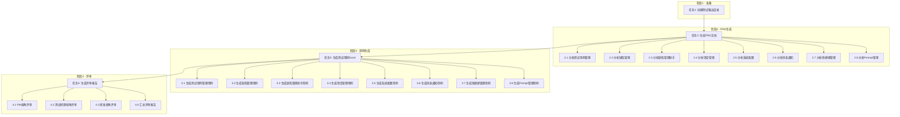

# TASK - AITestCraft 功能测试任务拆分

## 任务依赖图

---

## 原子任务清单

### 任务1: 创建测试输出目录结构

**任务ID**: T001  
**优先级**: P0  
**状态**: ✅ 已完成

**输入契约**:
- 前置依赖: 无
- 输入数据: 项目根目录路径
- 环境依赖: 文件系统写权限

**输出契约**:
- 输出数据: 完整的目录结构
- 交付物: 
  - test-output/docs/
  - test-output/test-cases/
  - test-output/scripts/
- 验收标准: 目录创建成功，可写入文件

**实现约束**:
- 技术栈: PowerShell/Node.js
- 质量要求: 目录结构符合设计规范

---

### 任务2: 生成PRD文档

**任务ID**: T002  
**优先级**: P0  
**状态**: 🔄 进行中

**输入契约**:
- 前置依赖: T001
- 输入数据: 项目源代码
  - frontend/src/pages/*.tsx
  - backend/src/routes/*.ts
  - backend/src/services/*.ts
  - backend/prisma/schema.prisma
- 环境依赖: 文件读取权限

**输出契约**:
- 输出数据: PRD文档内容
- 交付物: test-output/docs/PRD_AITestCraft.md
- 验收标准:
  - 覆盖所有8个功能模块
  - 包含用户故事和业务流程
  - 接口定义完整
  - 符合PRD模板规范

**实现约束**:
- 技术栈: Markdown
- 接口规范: 按照SKILL.md中的PRD模板
- 质量要求: 功能覆盖率≥95%

**子任务**:

#### 2.1 分析测试用例管理模块
- **任务ID**: T002-1
- **输入**: 
  - frontend/src/pages/TestCaseManagementPage.tsx
  - frontend/src/pages/TestCaseAssistantPage.tsx
  - backend/src/routes/testCaseRoutes.ts
  - backend/src/services/testCaseService.ts
- **输出**: 模块功能描述、用户故事、业务流程
- **验收标准**: 覆盖CRUD、导入导出、AI生成等功能

#### 2.2 分析缺陷管理模块
- **任务ID**: T002-2
- **输入**:
  - frontend/src/pages/defect/*.tsx
  - backend/src/routes/defectRoutes.ts
  - backend/src/services/*Service.ts
- **输出**: 缺陷管理功能详细描述
- **验收标准**: 覆盖缺陷全生命周期管理

#### 2.3 分析缺陷管理助手模块
- **任务ID**: T002-3
- **输入**:
  - frontend/src/pages/defect/DefectAssistantPage.tsx
  - backend/src/services/defectAssistant/*.ts
- **输出**: AI助手功能描述
- **验收标准**: 覆盖自然语言交互、意图识别等

#### 2.4-2.8 其他模块分析
- **任务ID**: T002-4 至 T002-8
- 类似结构，分析剩余模块

---

### 任务3: 生成测试用例Excel

**任务ID**: T003  
**优先级**: P0  
**状态**: ⏳ 待开始

**输入契约**:
- 前置依赖: T002
- 输入数据: PRD_AITestCraft.md
- 环境依赖: Node.js, exceljs库

**输出契约**:
- 输出数据: 8个Excel文件
- 交付物: 
  - test-output/test-cases/测试用例_测试用例管理.xlsx
  - test-output/test-cases/测试用例_缺陷管理.xlsx
  - test-output/test-cases/测试用例_缺陷管理助手.xlsx
  - test-output/test-cases/测试用例_项目管理.xlsx
  - test-output/test-cases/测试用例_系统配置.xlsx
  - test-output/test-cases/测试用例_消息通知.xlsx
  - test-output/test-cases/测试用例_快捷键管理.xlsx
  - test-output/test-cases/测试用例_Prompt管理.xlsx
- 验收标准:
  - 每个模块≥20个用例
  - 覆盖正常/异常/边界场景
  - 包含详细测试数据
  - 格式符合模板要求

**实现约束**:
- 技术栈: Node.js + exceljs
- 接口规范: 按照SKILL.md中的Excel模板
- 质量要求: 功能覆盖率≥90%

**子任务**:

#### 3.1-3.8 各模块用例生成
- **任务ID**: T003-1 至 T003-8
- **输入**: PRD中对应模块描述
- **输出**: 模块测试用例Excel
- **验收标准**: 
  - 每个功能点≥3个用例
  - 包含具体测试数据
  - 步骤清晰可执行

---

### 任务4: 生成评审报告

**任务ID**: T004  
**优先级**: P0  
**状态**: ⏳ 待开始

**输入契约**:
- 前置依赖: T002, T003
- 输入数据:
  - PRD_AITestCraft.md
  - 测试用例_*.xlsx (8个文件)
- 环境依赖: 文件读写权限

**输出契约**:
- 输出数据: 评审报告内容
- 交付物: test-output/docs/评审报告.md
- 验收标准:
  - 覆盖所有用例的评审
  - 包含三角色视角
  - 问题分级明确
  - 建议具体可行

**实现约束**:
- 技术栈: Markdown
- 接口规范: 按照SKILL.md中的评审报告模板
- 质量要求: 评审覆盖率100%

**子任务**:

#### 4.1 PM视角评审
- **任务ID**: T004-1
- **输入**: PRD + 用例
- **输出**: PM视角评审意见
- **验收标准**: 需求覆盖度分析

#### 4.2 测试经理视角评审
- **任务ID**: T004-2
- **输入**: PRD + 用例
- **输出**: 测试经理视角评审意见
- **验收标准**: 用例设计质量分析

#### 4.3 研发视角评审
- **任务ID**: T004-3
- **输入**: PRD + 用例
- **输出**: 研发视角评审意见
- **验收标准**: 技术可行性分析

#### 4.4 汇总评审报告
- **任务ID**: T004-4
- **输入**: 三个视角评审结果
- **输出**: 完整评审报告
- **验收标准**: 结构完整，结论明确

---

## 任务执行计划

| 阶段 | 任务 | 预计时间 | 依赖 |
|------|------|----------|------|
| 准备 | T001 | 5分钟 | 无 |
| PRD生成 | T002-1 至 T002-8 | 60分钟 | T001 |
| 用例生成 | T003-1 至 T003-8 | 90分钟 | T002 |
| 评审 | T004-1 至 T004-4 | 45分钟 | T003 |

---

## 风险与应对

| 任务ID | 风险描述 | 应对措施 |
|--------|----------|----------|
| T002 | 项目代码复杂，分析不全 | 模块化分析，逐个击破 |
| T003 | 用例数量庞大 | 按优先级分层，先P0后P1 |
| T004 | 评审标准主观 | 使用标准化检查清单 |

---

**文档版本**: v1.0  
**创建时间**: 2026-02-28
